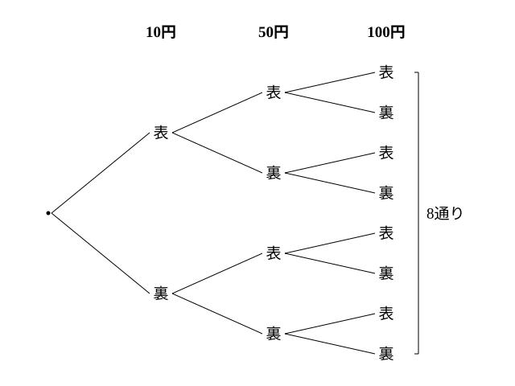
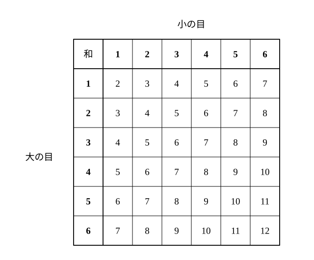

# L01 数え上げの原則——「1通り」を決めて、もれなく重複なく

- unit_id: hs-math-a-counting-and-probability
- 位置づけ: 単元第1レッスン（2時間）。数学A「場合の数と確率」の入口。中2の確率で使った樹形図・二次元の表を高校の用語で言い直し、この単元全体の背骨になる問い——「何を1通りと数えるか」——を最初の例題で体験する。数え上げの3つの原則（分類・整理する／1対1に対応付ける／規則に基づいて数の列を作る）を、公式より前に手で確かめる回。L03（和の法則・積の法則）と L08（同様に確からしい根元事象）で再訪する。
- distribution_status: published_draft
- license: CC-BY-4.0
- verify_required: 例題数値・記述は監修者検証必須。
- 主概念: ①中2の樹形図・二次元の表の回収と「区別する／しない」の二重数え（何を1通りと数えるか） ②数え上げの原則（分類・整理する／分かりやすいものと1対1に対応付ける／規則で数の列を作る）と辞書式の列挙

---

## 1. 中2の道具を用語で言い直す——場合・場合の数・数え上げ

中2の確率では、硬貨を投げたりさいころを振ったりして「起こりうる結果を全部書き出す」ことを、樹形図（じゅけいず）と二次元の表でやった。3枚の硬貨なら樹形図で8通り、2個のさいころなら6×6の表で36通り——手で全部並べられる範囲で確率を求めた。

高校ではまず、この作業に名前を付ける。起こりうる結果の1つ1つを**場合**といい、その総数を**場合の数**という。場合の数を求める作業を**数え上げ**という。数え上げの合言葉は中2と同じで、**もれなく、重複なく**——1つも落とさず、同じものを2度数えない——である。

樹形図は「1枚目→2枚目→3枚目」と段階を追って枝分かれさせる道具、二次元の表は「2つのものの組」を縦横に並べて一望する道具だった。この単元では、この2つの道具を捨てない。公式を学んだあとも、**小さい数で樹形図か表をかいて公式の答えと照合する**——この「全部並べて確かめる」検算を、毎回の習慣にする。

## 2. 「区別する／しない」を両方数えて比べる——何を1通りと数えるか

数え上げで最初につまずくのは、計算ではなく「そもそも何を1通りと数えるか」が決まっていないときだ。同じ問題を2通りに数えて、比べてみよう。

**例題1** 袋の中に赤玉2個と白玉1個が入っている。この袋から玉を2個同時に取り出す。取り出し方は何通りあるか。

数え方（ア）——3個の玉を全部区別する。赤玉に「赤1」「赤2」と番号を付けると、取り出す2個の組は、{ } で組を表す書き方（中の順番は関係ない）で書くと

{赤1, 赤2}、{赤1, 白}、{赤2, 白}

の**3**（通り）。

数え方（イ）——玉は色だけ見て、同じ色の玉は区別しない。取り出した2個の色の組は

{赤, 赤}、{赤, 白}

の**2**（通り）。

どちらが正しいのか。実は、どちらも「何かの個数」としては正しい。（ア）は「どの玉とどの玉を取ったか」の数、（イ）は「取り出した色の組の種類」の数で、**数えているものが違う**。問題文の「取り出し方」が何を指すかを決めなければ、答えは決まらない。

ここで大事なのは、（ア）の3通りは「起こりやすさが同じ」（玉を偏りなく取り出すものとして、どの2個の組も同じように取り出されやすいと考える）だが、（イ）の2通りはそうではない、ということだ。（ア）の3通りのうち {赤, 白} になるのは2つ、{赤, 赤} になるのは1つ——つまり（イ）の「{赤, 白}」は「{赤, 赤}」の2倍起こりやすい。この違いは、L08 で確率を定義するときに決定的になる。**この単元では、特に指定がなければ、同じ色の玉・同じ種類の硬貨も1つずつ区別して数える**。理由は L08 で正式に述べるが、いまは「取り出し方や出方に偏りがなければ、1つずつ区別して数えた場合は起こりやすさがそろう」と覚えておこう。

**例題2** a、a、b の3文字を1列に並べる。並べ方は何通りあるか。

（ア）2つの a を a₁、a₂ と区別して並べると、3つの違うものの並べ方だから、樹形図で

a₁a₂b、a₁ba₂、a₂a₁b、a₂ba₁、ba₁a₂、ba₂a₁

の**6**（通り）。

（イ）a を区別しないと、見た目が違う文字列は

aab、aba、baa

の**3**（通り）。（ア）の6通りは、a₁ と a₂ を入れかえたものどうしが同じ文字列になるので、ちょうど2つずつ組になって（イ）の1つに対応する——6÷2=3 である。

「文字列は何種類できるか」と問われれば（イ）の3が答えだ。しかし「3枚のカード a、a、b をよく混ぜて1列に置いたとき、aab になる起こりやすさ」を考えるなら、区別した（ア）の6通りを土台にする（6通りのうち aab になるのは a₁a₂b と a₂a₁b の2つ）。**問いが数えているものは何か——区別するのか、しないのか——を先に決めてから数える**。これがこの単元の最初の約束である。

:::guide
**見分けがつかないのに、なぜ区別するのか**

同じ色の玉2個は、見ても区別できない。それなのに「赤1」「赤2」と名前を付けて数えるのは、不自然に感じるかもしれない。区別する理由は、見分けたいからではなく、**起こりやすさをそろえたい**からだ。玉を1個ずつ手に取る場面を想像すると、赤1 が手に入る出来事と 赤2 が手に入る出来事は、本人には見分けられなくても、それぞれ別に起こっている。名前を付けるだけで起こりやすさがそろうわけではないが、どの玉も同じように取り出されやすいと考えれば、こうして分けた1通り1通りは同じ起こりやすさになる。色だけで「赤赤」「赤白」の2通りにまとめると、その2通りは同じ起こりやすさではなくなる（例題1）。だから、確率を考える土台としては、いったん全部に名前を付けて「同じ起こりやすさの1通り」まで細かく分け、そのあとで必要なら色でまとめ直す——この順番が安全である。逆に、「文字列が何種類あるか」のように見た目の種類を数えたいときは、区別しないのが正しい。どちらが正しいかは問いが決める。区別するかしないかを決めてから数え始めたか——これが、この教材で最初に確かめる点だ。
:::

## 3. 数え上げの原則——3つの見方

もれなく重複なく数えるには、手あたり次第に書き出すのではなく、何か「原則」を決めて並べる。よく使う見方が3つある。高等学校学習指導要領解説 数学編（平成30年告示）は、数え上げの原則の例として「あるものに着目して分類・整理する」「より分かりやすいものと1対1に対応付ける」「規則に基づき数の列を作る」の3つを挙げている。それぞれ例題で確かめよう。

**例題3（分類・整理する）** 大小2個のさいころを投げるとき、出た目の和が5の倍数になる場合は何通りあるか。

「和が5の倍数」を、和の値で分類する。2個のさいころの目の和は2以上12以下だから、5の倍数になるのは和が5または10のとき。

- 和が5: (大, 小)=(1, 4)、(2, 3)、(3, 2)、(4, 1) の4通り
- 和が10: (4, 6)、(5, 5)、(6, 4) の3通り

和が5と和が10は同時には起こらないから、合わせて 4＋3=**7**（通り）。

検算: 二次元の表で、和が5のますと和が10のますを自分で塗ってみると、確かに7個ある。「和の値で分類する」という原則を1つ決めたことで、(1, 4) と (4, 1) を別の場合として数え落とさずにすんでいる（大小を区別しているから、この2つは別の場合である——§2 の約束）。

**例題4（1対1に対応付ける）** 8チームが参加するトーナメント（勝ち抜き戦・引き分けなし）で、優勝チームが決まるまでに行われる試合の数を求めよ。

トーナメント表をかいて数えれば 4＋2＋1=7試合。しかし、かかずに求める見方がある。1試合が終わるごとに、ちょうど1チームが負けて去る。優勝チーム以外の7チームは、それぞれちょうど1回だけ負ける。したがって「試合」と「負けたチーム」は1対1に対応していて、試合の数は負けるチームの数に等しく、8−1=**7試合**。

この見方だと、参加チームが16でも100でも、試合数はチーム数−1と即答できる。「試合」という数えにくいものを、「負けたチーム」という数えやすいものに対応付けた——これが2つ目の原則である。

**例題5（規則に基づいて数の列を作る）** 1、2、3、4 の数字を1つずつ書いた4枚のカードから3枚を選んで並べ、3桁の整数を作る。
(1) 整数は全部で何個できるか。
(2) できる整数を小さい順に並べたとき、小さい方から10番目の整数を求めよ。

小さい順に、つまり辞書に単語を並べる順——辞書式（じしょしき）——で書き出す。百の位が1のものは、

123、124、132、134、142、143

の6個。百の位が2、3、4のものも同じ規則で6個ずつできる（百の位を決めると、残り3枚から2枚を選んで並べる形は同じだから）。

(1) 6×4=**24**（個）。
(2) 百の位が1の6個（1〜6番目）、百の位が2の6個（7〜12番目）と進むから、10番目は百の位が2のグループの4番目。百の位2のグループは 213、214、231、234、241、243 の順だから、4番目は **234**。

検算: 213 が7番目、214 が8番目、231 が9番目、234 が10番目 ✓。

「小さい順」という規則を決めて数の列を作ったことで、24個を全部書かなくても、何番目に何があるかを読み取れた。3つ目の原則である。

:::guide
**3つの原則は、別々の道具ではなく、同じ問題への別の入口**

例題3の「和が5の倍数」は、表の36ますを全部見て塗る（列挙）でも、和の値で分類する（原則①）でも解ける。例題4のトーナメントは、表をかく（列挙）でも、負けたチームに対応付ける（原則②）でも解ける。どの原則を選んでも、正しく使えば同じ答えになる——だからこそ、**1つの原則で出した答えを、別の原則で数え直して照合できる**。この単元の検算の型は、ここに根がある。次の L03 で学ぶ和の法則・積の法則も、この先の順列・組合せの公式も、全部この3つの原則の「省略形」である。公式を忘れても、原則に戻れば数えられる。逆に、公式が使えるかどうか迷ったら、小さい数で原則どおりに列挙して、公式の答えと合うかを見るとよい。合わなければ、公式の使い方か列挙のどちらかに誤りがあると分かる。
:::

## 4. もれなく重複なくを確かめる——別の道で数え直す

数え上げで「答えが合っているか」を確かめる方法は、代入検算のように1つの値を入れて済むものではない。有効な確かめ方は2つある。

1. **別の原則で数え直す**。分類で数えたら1対1対応で、樹形図で数えたら表で——道が違って答えが同じなら、もれや重複が入りにくい。
2. **小さい数で全部並べる**。数を小さくした同型の問題を作り、全部書き出して数え、同じ方法の答えと照合する。例題2の「a、a、b」は、まさに小さい数での全列挙だった。

この2つを、以後の例題では「検算」の行に書いていく。数え上げの答えは、出したあとに「別の道でも同じか」を1度は問う——それが、もれや重複を自分で見つける手立てになる。答えが合っても正しいと決まるわけではないが、合わなければ、どこかに誤りがあると分かる。

:::guide
**「全部で何通り」より先に、「1通りとは何か」を書く**

数え上げの問題を解くとき、いきなり式を立てるのではなく、最初の1行に「1通り＝〔何〕」を書く習慣を勧める。例題1なら「1通り＝取り出す2個の玉の組（玉は全部区別）」、例題5なら「1通り＝できる3桁の整数」。この1行があると、途中で「(1, 4) と (4, 1) は同じか」「a₁a₂b と a₂a₁b は同じか」と迷ったときに、最初の約束に戻って決められる。逆に、この1行がないまま数えると、途中で数える単位がすり替わり、答えが2倍になったり半分になったりする。この単元でつまずきやすい場面——同じ色の玉、同じ文字、区別のない組——は、どれも「1通りの決め方」を最初に確かめる場面である。
:::

## 5. 練習

**問1** 10円・50円・100円の硬貨を1枚ずつ、合わせて3枚を同時に投げる。
(1) 表裏の出方は全部で何通りあるか。
(2) 表が1枚だけ出る出方は何通りあるか。
(3) 表が出た硬貨の金額の合計（1枚も表が出ないときは合計 0円とし、これも1種類と数える）は、全部で何種類あるか。また、(1) の出方と合計の種類が1対1に対応していることを1〜2文で説明せよ。

**問2** 袋の中に白玉2個と黒玉2個が入っている。この袋から玉を2個同時に取り出す。
(1) 4個の玉を全部区別するとき、取り出す2個の組は何通りあるか。全部書き出して数えよ。
(2) 色だけを見るとき、取り出した2個の色の組は何種類あるか。
(3) (1) で数えた組のうち、色の組が「白と黒」になるものは何通りあるか。

**問3** 大小2個のさいころを投げる。次の場合は何通りあるか。
(1) 目の和が7になる。
(2) 目の積が奇数になる。
(3) 目の和が4以下になる。

**問4** 16チームが参加するトーナメント（勝ち抜き戦・引き分けなし）で、優勝チームが決まるまでに行われる試合の数を求めよ。また、その理由を「1対1に対応付ける」見方で1〜2文で説明せよ。

**問5** 1、2、3、5 の数字を1つずつ書いた4枚のカードから3枚を選んで並べ、3桁の整数を作る。
(1) 整数は全部で何個できるか。
(2) できる整数を小さい順に並べたとき、小さい方から15番目の整数を求めよ。
(3) 500以上の整数は何個できるか。

**問6** ある弁当屋では、主菜3種類・副菜2種類・ごはん2種類から1つずつ選んで組み合わせた「日替わり弁当」を、毎日違う組み合わせで出したいと考えている。
(1) 組み合わせは全部で何通りあるか。樹形図をかいて数えよ。
(2) 「2週間（14日間）、毎日違う組み合わせで出し続けることができる」と言えるか。(1) で求めた値を根拠に、一文で答えよ。

---

:::stretch
**S1** 0、1、2、3 の数字を1つずつ書いた4枚のカードを全部並べて、4桁の整数を作る（千の位に0は置けない）。
(1) 整数は全部で何個できるか。
(2) 2000以上の整数は何個できるか。
(3) できる整数を小さい順に並べたとき、小さい方から8番目の整数を求めよ。
:::

対応解答: answer_key_L01-03.md

<!-- gen_nav:nav:start（自動生成・手編集しない） -->

---

[単元の目次](README.md)｜[解答](answer_key_L01-03.md)｜[次のレッスン →](lesson_02.md)

<!-- gen_nav:nav:end -->
