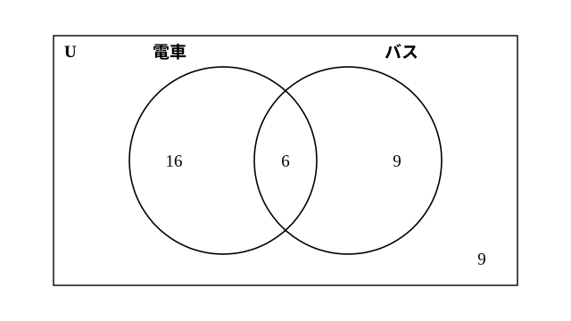

# L02 集合の要素の個数——n(A∪B) とベン図に個数を書く

- unit_id: hs-math-a-counting-and-probability
- 位置づけ: 単元第2レッスン（2時間）。数学Ⅰ「集合と命題」で学んだ集合の記法を短く確かめたうえで、集合の**要素の個数**を数える回。n(A∪B)=n(A)＋n(B)−n(A∩B) を人数や倍数の具体例から見いだし、ベン図（教科書で呼ばれる名）の各部分に個数を書き込んで求める型を身につける。A∩B=∅ のときの n(A∪B)=n(A)＋n(B) は、L03 の和の法則の前触れである。
- distribution_status: published_draft
- license: CC-BY-4.0
- verify_required: 例題数値・記述は監修者検証必須。
- 主概念: ①n(A∪B)=n(A)＋n(B)−n(A∩B)・A∩B=∅ なら n(A∪B)=n(A)＋n(B) ②補集合の個数 n(Aᶜ)=n(U)−n(A)・ベン図に個数を書き込んで求める

---

## 0. 本編の前に——集合の記法を短く確かめる

この単元では、数学Ⅰ「集合と命題」で学んだ集合の言葉を道具として使う。本格的な学び直しはそちらに任せ、ここでは使う記号だけを1つの例で確かめておく。数学Ⅰより先にこの単元を学んでいる人は、この節をゆっくり読めば本編に進める。

1 から 10 までの整数全体を考え、これを**全体集合** U とする。U の中で、3の倍数の集まりを A、偶数の集まりを B とすると、

U={1, 2, 3, 4, 5, 6, 7, 8, 9, 10}、A={3, 6, 9}、B={2, 4, 6, 8, 10}

集合を { } で表すときは、中に同じものを2回書かない（L01 の {赤, 赤} は、取り出した2個の色を並べた「色の組」の書き方で、集合の書き方とは別である）。

| 記号 | 読み方・意味 | この例では |
|---|---|---|
| 6∈A | 6 は A の要素である | 6 は3の倍数 |
| 5∉A | 5 は A の要素でない | 5 は3の倍数でない |
| A∩B | A と B の共通部分（A にも B にも属する要素全部） | {6} |
| A∪B | A と B の和集合（A または B の少なくとも一方に属する要素全部） | {2, 3, 4, 6, 8, 9, 10} |
| Aᶜ | A の補集合（U の要素のうち A に属さないもの全部） | {1, 2, 4, 5, 7, 8, 10} |
| ∅ | 空集合（要素を1つももたない集合） | B と「U の中の奇数の集まり」の共通部分は ∅（偶数でも奇数でもある数はない） |
| A⊂B | A は B の部分集合（A の要素はすべて B の要素） | {3, 6}⊂A、{6}⊂B（{6} は 6 だけを要素とする集合。この例の A と B 自身については A⊂B は成り立たない） |

集合の様子を、長方形（U）の中に円をかいて表した図は、教科書で**ベン図**と呼ばれる。A∩B は2つの円の重なり、A∪B は2つの円を合わせた部分、Aᶜ は A の円の外側にあたる。

:::guide
**なぜ図にするのか**

集合の記号は、慣れないうちは ∩ と ∪ のどちらが「共通部分」か迷いやすい。∩ は「両方にあるもの」だから重なりの部分、∪ は「どちらかにあるもの」だから合わせた部分——と、円の図に置き直すと見分けやすい。この単元で要素の個数を数えるときも、記号を式で追う前に、まず円の図の各部分に数を書き込むと、どの部分を数えたかを目で確かめられる。図は説明の飾りではなく、数え落としと二重数えを防ぐ道具である。
:::

## 1. 要素の個数 n(A)——数えるものに名前を付ける

集合 A の要素の個数を **n(A)** と書く（読み方は「エヌ エー」）。上の例では n(U)=10、n(A)=3、n(B)=5、n(A∩B)=1、n(A∪B)=7、n(Aᶜ)=7、n(∅)=0 である。

L01 で「1通りとは何か」を最初に決めよ、と約束した。集合の言葉で言えば、**何を要素とする集合を考えているのか**を先に決める、ということである。「3の倍数」を数えるなら、要素は「1 から 10 までの整数のうち3で割り切れるもの」——この範囲（全体集合）を決めなければ n(A) は決まらない。

## 2. n(A∪B)=n(A)＋n(B)−n(A∩B) を見いだす

**例題1** あるクラスの40人に通学手段を聞いたところ、電車を使う人が22人、バスを使う人が15人、電車とバスの両方を使う人が6人いた。
(1) 電車またはバスを使う人は何人か。
(2) 電車もバスも使わない人は何人か。

電車を使う人の集合を A、バスを使う人の集合を B とする。n(A)=22、n(B)=15、n(A∩B)=6。

22＋15=37 と足すと、両方使う6人を電車側とバス側で**2回**数えている。1回分を引いて、

(1) n(A∪B)=22＋15−6=**31**（人）

(2) 電車もバスも使わない人は、A∪B の外側にいる。40−31=**9**（人）

ベン図の各部分に個数を書き込むと、電車だけ 22−6=16、両方 6、バスだけ 15−6=9、どちらも使わない 9。合計 16＋6＋9＋9=40 で n(U) に戻る——これが検算である。言葉の読み分けにも注意する。「電車だけ」は16人。「どちらか一方だけ」は電車だけとバスだけを合わせた 16＋9=25人。「少なくとも一方」は両方の6人も入れた 16＋6＋9=31人で、(1) の答えと同じである。

この例から、一般に次が成り立つ。

**n(A∪B)=n(A)＋n(B)−n(A∩B)**

n(A)＋n(B) では A∩B の要素を2回数えているから、1回分の n(A∩B) を引く。特に、A と B に共通の要素がないとき、つまり **A∩B=∅ のときは、n(A∪B)=n(A)＋n(B)** である。

**例題2** 1 から 100 までの整数のうち、4の倍数または6の倍数であるものは何個あるか。

4の倍数の集合を A、6の倍数の集合を B とする。100÷4=25 だから n(A)=25。100÷6=16 余り 4 だから n(B)=16。A∩B は「4の倍数でも6の倍数でもある数」、つまり 4 と 6 の最小公倍数 12 の倍数で、100÷12=8 余り 4 だから n(A∩B)=8。

n(A∪B)=25＋16−8=**33**（個）

検算: 数を小さくして同じ問題を作る。1 から 12 までなら、4の倍数は {4, 8, 12} の3個、6の倍数は {6, 12} の2個、両方は {12} の1個。公式で 3＋2−1=4。直接書き出すと {4, 6, 8, 12} の4個 ✓。小さい数で合えば、公式の使い方（重なりを1回分引く）に誤りは見つからなかったことになる。100 までの答えは、100÷4、100÷6、100÷12 の計算も見直したうえで使う。

:::guide
**「または」を足すだけで済ませない**

「電車を使う人が22人、バスを使う人が15人」と聞くと、「電車またはバス」は 37 人だと感じてしまう。足すだけで正しいのは、2つの集まりに重なりがないとき（A∩B=∅）だけである。重なりがあるかどうかは、問題文の「両方」「〜でもあり〜でもある」という言葉に表れる。この単元では次の L03 で「同時には起こらない場合分けなら足してよい」という和の法則を学ぶが、その法則は、いま見た「A∩B=∅ なら n(A∪B)=n(A)＋n(B)」そのものである。重なりがあるときは、足してから重なりの分を引く——この1手を忘れないために、ベン図に個数を書く習慣を付ける。
:::

## 3. 補集合の個数 n(Aᶜ)=n(U)−n(A)——「〜でない」の数え方

「〜でないもの」の個数は、全体から「〜であるもの」を引けばよい。

**n(Aᶜ)=n(U)−n(A)**

**例題3** 1 から 100 までの整数のうち、7の倍数でないものは何個あるか。

7の倍数の集合を A とすると、100÷7=14 余り 2 だから n(A)=14。よって n(Aᶜ)=100−14=**86**（個）

**例題4** 1 から 100 までの整数のうち、4の倍数でも6の倍数でもないものは何個あるか。

「4の倍数でも6の倍数でもない」は、A∪B（4の倍数または6の倍数）の外側、つまり (A∪B)ᶜ である。例題2で n(A∪B)=33 だったから、

n((A∪B)ᶜ)=100−33=**67**（個）

「〜でない」「〜でも〜でもない」と言われたら、直接数えようとせず、まず「〜である」側を数えて全体から引く。この見方は、あとの確率の学習でも同じ形で使う。

## 4. 手順の型——ベン図に個数を書き込む

2つの集合の要素の個数に関する問題は、次の手順で解く。

1. 全体集合 U を長方形、2つの集合 A・B を重なる2つの円でかく。
2. **共通部分 A∩B の個数を最初に書く**（分かっていれば直接、分からなければ x とおく）。
3. A だけ・B だけの部分を、n(A)−n(A∩B)・n(B)−n(A∩B) で埋める。
4. 円の外側（どちらにも属さない）を埋める。
5. 4つの部分の合計が n(U) に等しいことを確かめる（検算）。

**例題5** 50人にアンケートをとると、犬が好きな人が28人、猫が好きな人が21人、犬も猫も好きでない人が9人いた。犬も猫も好きな人は何人か。

犬が好きな人の集合を A、猫が好きな人の集合を B とする。手順2で A∩B の個数が分からないので x 人とおく。どちらも好きでない人が9人だから、n(A∪B)=50−9=41。公式に入れて

41=28＋21−x、x=**8**（人）

検算: 犬だけ 28−8=20、両方 8、猫だけ 21−8=13、どちらも好きでない 9。合計 20＋8＋13＋9=50 ✓。

:::guide
**共通部分から書く理由**

ベン図を埋めるとき、A の円に n(A) をそのまま書いてしまう誤りが起きやすい。A の円は「A だけ」と「A∩B」の2つの部分に分かれていて、n(A) はその合計である。だから、まず重なりの部分（A∩B）を決め、そこから外へ向かって「A だけ＝n(A)−n(A∩B)」を出す順番にすると、どの部分にも正しい数が入る。分からない部分は x とおいて、最後に合計が n(U) になることで x を決める。この「内側から外側へ」の順番は、L03 以降で2つ以上の条件が重なる場合の数を数えるときにも、そのまま使える。
:::

## 5. 練習

**問1** 1 から 12 までの整数全体を U とし、3の倍数の集合を A、4の倍数の集合を B とする。
(1) A、B、A∩B を、要素を書き並べて表せ。
(2) n(A)、n(B)、n(A∩B) を求め、公式を使って n(A∪B) を求めよ。また、A∪B の要素を書き並べて、個数が一致することを確かめよ。
(3) n(Aᶜ) を求めよ。

**問2** 1 から 200 までの整数のうち、次のものは何個あるか。
(1) 5の倍数
(2) 8の倍数
(3) 5の倍数または8の倍数
(4) 5の倍数でも8の倍数でもないもの

**問3** ある学年の45人に聞いたところ、数学が好きな人が27人、英語が好きな人が19人、両方とも好きな人が11人いた。
(1) 数学または英語が好きな人は何人か。
(2) 数学も英語も好きでない人は何人か。
(3) 数学は好きだが英語は好きでない人は何人か。ベン図の各部分に人数を書き込み、合計が45になることを確かめよ。

**問4** 60人に通学手段を聞くと、電車を使う人が33人、バスを使う人が24人、どちらも使わない人が12人いた。電車とバスの両方を使う人は何人か。

**問5** 1 から 60 までの整数のうち、2の倍数でも3の倍数でもないものは何個あるか。また、1 から 6 までで同じことを数え、答えの関係を確かめよ（60 は 6 の何倍か）。

**問6** あるイベントの参加者80人のうち、A のブースに立ち寄った人が46人、B のブースに立ち寄った人が39人、両方に立ち寄った人が14人だった。主催者は「どちらのブースにも立ち寄らなかった人は10人もいない」と言っている。この発言が正しいかどうか、求めた人数を根拠に一文で答えよ。

---

:::stretch
**S1** 3つの集合 A、B、C について、要素の個数の関係を考える。
(1) 3つの円が重なるベン図をかき、n(A)＋n(B)＋n(C) では、どの部分が何回数えられているかを書き込め。そのうえで、n(A∪B∪C) を n(A)、n(B)、n(C)、n(A∩B)、n(B∩C)、n(C∩A)、n(A∩B∩C) で表す式を作れ。
(2) 1 から 100 までの整数のうち、2の倍数、3の倍数、5の倍数のいずれかであるものは何個あるか。
(3) 1 から 100 までの整数のうち、2 でも 3 でも 5 でも割り切れないものは何個あるか。1 から 30 まででも同じことを数え、2つの答えの関係を確かめよ（100 は 30 の倍数ではないので、91〜100 の分は別に数える）。
:::

対応解答: answer_key_L01-03.md

<!-- gen_nav:nav:start（自動生成・手編集しない） -->

---

[← 前のレッスン](lesson_01.md)｜[単元の目次](README.md)｜[解答](answer_key_L01-03.md)｜[次のレッスン →](lesson_03.md)

<!-- gen_nav:nav:end -->
