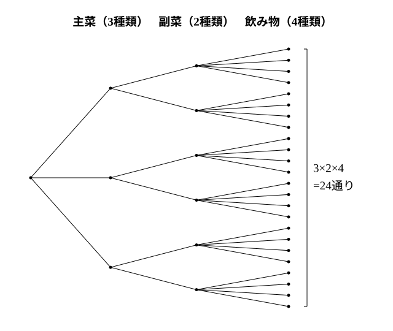

# L03 和の法則・積の法則——「または」か「そして」か

- unit_id: hs-math-a-counting-and-probability
- 位置づけ: 単元第3レッスン（2時間）。L01 の数え上げの原則と L02 の n(A∪B) を、2つの法則にまとめる回。**和の法則**は「同時には起こらない場合分けの和」、**積の法則**は「段階ごとの選び方の積（樹形図の枝の数）」である。どちらを使うかを問題文の「または」「そして」から読み分け、約数の個数・整数を作る問題に適用する。L04 以降の順列・組合せの公式は、すべて積の法則から導かれる。
- distribution_status: published_draft
- license: CC-BY-4.0
- verify_required: 例題数値・記述は監修者検証必須。
- 主概念: ①和の法則（同時には起こらない場合分けの和）と積の法則（段階の積・樹形図の枝の数） ②約数の個数・整数を作る問題への適用と、法則の選択を言葉で言う

---

## 1. 「同時には起こらない」場合分けを足す——和の法則

L01 の例題3で、2個のさいころの目の和が5の倍数になる場合を「和が5」と「和が10」に分けて数え、4＋3=7 とした。「和が5」と「和が10」が**同時には起こらない**からこそ、足してよかった。この見方を法則の形にする。

**例題1** 大小2個のさいころを投げるとき、目の和が4または9になる場合は何通りあるか。

和が4になる (大, 小) は (1, 3)、(2, 2)、(3, 1) の3通り。和が9になるのは (3, 6)、(4, 5)、(5, 4)、(6, 3) の4通り。和が4であることと和が9であることは同時には起こらないから、

3＋4=**7**（通り）

**和の法則**（わのほうそく）: 2つの事柄 A、B が同時には起こらないとき、A の起こり方が m 通り、B の起こり方が n 通りあれば、**A または B が起こる場合は m＋n 通り**である。3つ以上の事柄についても、どの2つも同時には起こらなければ、同じように足せる。

L02 の言葉で言えば、A の場合の集合と B の場合の集合に共通の要素がない（A∩B=∅）ときの n(A∪B)=n(A)＋n(B) が、和の法則そのものである。重なりがあるときは足すだけでは足りず、n(A∪B)=n(A)＋n(B)−n(A∩B) に戻る（stretch の S1 で扱う）。

## 2. 段階ごとの選び方を掛ける——積の法則

**例題2** ある店の弁当は、主菜3種類・副菜2種類・飲み物4種類から1つずつ選んで組み合わせる。組み合わせは全部で何通りあるか。

樹形図をかく。主菜の選び方は3本の枝。その**どの枝についても**、副菜の選び方が2本ずつ枝分かれし、さらにその**どの枝についても**飲み物の選び方が4本ずつ枝分かれする。右端の枝の総数は

3×2×4=**24**（通り）

**積の法則**（せきのほうそく）: 事柄 A の起こり方が m 通りあり、**そのそれぞれに対して**事柄 B の起こり方が n 通りずつあるとき、**A と B がともに起こる（A が起こり、そして B が起こる）場合は m×n 通り**である。3つ以上の段階についても、段階ごとの選び方を掛け合わせる。

積の法則の要は「そのそれぞれに対して n 通りずつ」という条件である。主菜を何にしても副菜の選び方が2通りずつあるから掛けられる。もし「主菜 A を選んだときだけ副菜が1種類に限られる」なら、枝の数がそろわないので、そのまま掛けることはできない（場合分けして和の法則に戻る）。

## 3. 「または」か「そして」か——法則を選ぶ問診（解く前の決まった問い）

同じさいころの問題でも、問い方によって使う法則が変わる。

**例題3** 大小2個のさいころを投げる。
(1) 目の和が5、または目の和が10になる場合は何通りあるか。
(2) 大の目が偶数で、そして小の目が5以上になる場合は何通りあるか。

(1) 「和が5」は (1, 4)、(2, 3)、(3, 2)、(4, 1) の4通り、「和が10」は (4, 6)、(5, 5)、(6, 4) の3通り。同時には起こらないから、和の法則で 4＋3=**7**（通り）

(2) 大の目が偶数になるのは 2、4、6 の3通り。そのそれぞれに対して、小の目が5以上になるのは 5、6 の2通りずつ。積の法則で 3×2=**6**（通り）

検算: (2) を書き出すと (2, 5)、(2, 6)、(4, 5)、(4, 6)、(6, 5)、(6, 6) の6通り ✓。

(1) は「A または B」——場合を**分けて足す**。(2) は「A そして B」——段階を**重ねて掛ける**。問題文の接続の言葉を読み、どちらの形かを最初に決めてから計算する。この「解く前に自分に投げかける決まった問い」を、この単元では問診（もんしん）と呼ぶ。

| 問題文の形 | 数える構造 | 法則 |
|---|---|---|
| 「〜または〜」「〜か〜のどちらか」（同時には起こらない） | 場合分け（横に並ぶ） | 和の法則: 足す |
| 「〜そして〜」「〜のそれぞれについて〜」「〜と〜を1つずつ」（前の選び方がどれでも、次の選び方が同じ数ずつある） | 段階（縦に重なる） | 積の法則: 掛ける |

:::guide
**迷ったら、樹形図の1段目だけかく**

和か積かで迷ったときは、全部の樹形図をかく必要はない。1段目の枝を数本かき、**2段目が「どの枝からも同じ本数」枝分かれするか**を見る。同じ本数なら段階の構造だから積の法則。「和が5のとき」「和が10のとき」のように、1段目の枝が互いに別の場合を表していて、その先に共通の2段目がないなら場合分けの構造だから和の法則。日本語の「または」「そして」は手がかりになるが、「〜と〜」のように両方に使われる言い方もあるので、最後は構造で決める。L01 で、公式より原則、原則より列挙を土台にしたのは、この判断を自分でできるようにするためである。
:::

## 4. 約数の個数——積の法則の読み替え

**例題4** 72 の正の約数は何個あるか。

72 を素因数分解すると 72=2³×3²。72 の正の約数は、2 を0〜3個、3 を0〜2個掛け合わせた数である（2 を1個も使わないときは「1 を掛ける」とみる。これを 2⁰=1、3⁰=1 と書く）。2 の個数の選び方は 0、1、2、3 の4通り、そのそれぞれに対して 3 の個数の選び方は 0、1、2 の3通り。積の法則で

4×3=**12**（個）

検算: 72 の約数を書き出すと 1、2、3、4、6、8、9、12、18、24、36、72 の12個 ✓。

一般に、正の整数 N が N=pᵃ×qᵇ（p、q は異なる素数）と素因数分解されるとき、N の正の約数の個数は **(a＋1)(b＋1)** 個である。素因数が3つ以上でも同じで、各素因数について「指数＋1」を掛け合わせる。

:::guide
**「約数を選ぶ」を「指数を選ぶ」と読み替える**

約数の個数を積の法則で数えられるのは、約数を「2 をいくつ、3 をいくつ使うか」という**段階の選択**に読み替えたからである。72 の約数 12 は 2²×3¹、つまり「2 を2個、3 を1個」という選び方に対応し、この対応は約数と選び方の間で1対1である（L01 の原則②）。数えにくいもの（約数）を数えやすいもの（指数の組）に対応付けている——法則は原則の省略形だ、という L01 の見方がここでも生きている。指数に 0 を含める（1 も約数）ことを落とすと、答えが (a)(b) になって足りなくなる。
:::

## 5. 整数を作る——条件のある桁から決める

**例題5** 1 から 7 までの数字を1つずつ書いた7枚のカードから2枚を選んで並べ、2桁の整数を作る。整数は全部で何個できるか。

（この設定は、高等学校学習指導要領解説 数学編（平成30年告示）が「場合の数と確率」の技能の例として挙げているものである。）

十の位のカードの選び方は7通り。そのそれぞれに対して、一の位のカードは残りの6枚から選ぶので6通り。積の法則で

7×6=**42**（個）

検算: 十の位が1の整数は 12、13、14、15、16、17 の6個。十の位が2〜7でも6個ずつだから 6×7=42 ✓（L01 例題5と同じ、規則で数の列を作る見方）。

学習指導要領解説はこの例のあとに「カードに書かれている数字を変えたり作られる整数の桁数を変えたりして、自ら問題を見いだして解決する」ことを勧めている。練習の問4がその形である。

**例題6** 1、2、3、4、5 の数字を1つずつ書いた5枚のカードから3枚を選んで並べ、3桁の偶数を作る。偶数は全部で何個できるか。

偶数になるかどうかは一の位で決まる。**条件のある一の位から先に決める**。一の位は 2 か 4 の2通り。そのそれぞれに対して、百の位は残り4枚から4通り、十の位はさらに残り3枚から3通り。積の法則で

2×4×3=**24**（個）

もし百の位から決め始めると、一の位に残るカードの中に偶数が何枚あるかが百・十の位の選び方によって変わり、「そのそれぞれに対して同じ本数」という積の法則の条件が崩れる。条件のある桁を最初に決めるのは、枝の本数をそろえるためである。

## 6. 練習

**問1** 次の各場合について、和の法則・積の法則のどちらを使うかを先に答え、そのうえで場合の数を求めよ。
(1) 大小2個のさいころを投げて、目の和が3または11になる。
(2) A町からB町へ行く道が3本、B町からC町へ行く道が2本ある。A町からB町を通ってC町へ行く行き方。
(3) 男子4人・女子3人の中から代表を1人選ぶ。
(4) 男子4人・女子3人の中から男子1人と女子1人を選ぶ。

**問2** 大小2個のさいころを投げる。次の場合は何通りあるか。
(1) 目の和が6の倍数になる。
(2) 目の積が12になる。
(3) 大の目が3以下で、そして小の目が奇数になる。

**問3** 次の整数の正の約数の個数を求めよ。
(1) 200
(2) 360
(3) 200 の正の約数のうち、奇数であるもの

**問4** 1 から 7 までの数字を1つずつ書いた7枚のカードがある。
(1) 3枚を選んで並べ、3桁の整数を作る。整数は全部で何個できるか。
(2) 2枚を選んで並べ、2桁の偶数を作る。偶数は全部で何個できるか。
(3) 2枚を選んで並べて作る2桁の整数のうち、十の位の数字が一の位の数字より大きいものは何個あるか。

**問5** 赤・青・黄・緑の4色から色を選んで、横に並んだ3つの区画 A、B、C（A と B、B と C が隣り合っている）を塗る。隣り合う区画は違う色で塗るものとする。
(1) 3つの区画をすべて違う色で塗る塗り方は何通りあるか。
(2) A と C は同じ色でもよいとすると、塗り方は何通りあるか。

**問6** 文化祭のクラスTシャツを、色5種類・サイズ4種類・ロゴ2種類から1つずつ選んで注文する。
(1) 選び方は全部で何通りあるか。
(2) クラスの38人が、互いに全員違う選び方をすることができるか。(1) の値を根拠に一文で答えよ。

---

:::stretch
**S1** 大小2個のさいころを投げる。
(1) 目の和が3の倍数になる場合は何通りあるか。
(2) 目の積が3の倍数になる場合は何通りあるか。
(3) 目の和が3の倍数、または目の積が3の倍数になる場合は何通りあるか。また、(1) と (2) の答えを単純に足してはいけない理由を、L02 の n(A∪B) の式を使って一文で説明せよ。
:::

対応解答: answer_key_L01-03.md

<!-- gen_nav:nav:start（自動生成・手編集しない） -->

---

[← 前のレッスン](lesson_02.md)｜[単元の目次](README.md)｜[解答](answer_key_L01-03.md)｜[次のレッスン →](lesson_04.md)

<!-- gen_nav:nav:end -->
