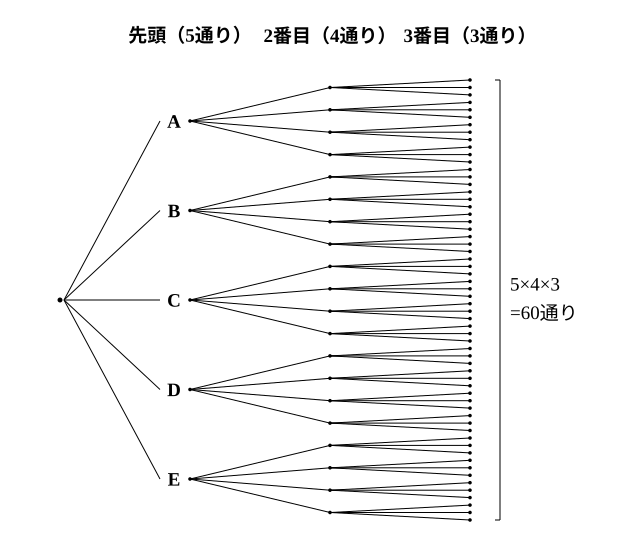

# L04 順列——並べる

- unit_id: hs-math-a-counting-and-probability
- 位置づけ: 単元第4レッスン（2時間）。異なる n 個から r 個を取って1列に並べる**順列**の総数 nPr を、L03 の積の法則（樹形図の枝の数）から導く回。階乗 n! の記号と 0!=1 の約束を導入し、「並べる＝順序が結果に効く」かどうかの判定を独立に扱ったうえで、条件つきの順列（特定のものを先に置く・隣り合うものをまとめる・両端）を処理する。L06 の組合せは、この順列から「順序を消す」ことで得られる。
- distribution_status: published_draft
- license: CC-BY-4.0
- verify_required: 例題数値・記述は監修者検証必須。
- 主概念: ①異なる n 個から r 個を取って並べる順列 nPr=n(n−1)…(n−r＋1)・階乗 n!・積の法則からの導出 ②条件つき順列（特定のものを先に置く・隣り合う・両端）

---

## 1. 積の法則から順列へ

**例題1** A、B、C、D、E の5人から3人を選んで1列に並べる。並べ方は何通りあるか。

先頭から順に決める。先頭は5人のうち誰でもよいので5通り。そのそれぞれに対して、2番目は残り4人から4通り。さらにそのそれぞれに対して、3番目は残り3人から3通り。積の法則で

5×4×3=**60**（通り）

樹形図の枝の数が 5、4、3 と1つずつ減るのは、いちど並べた人は次の段階では選べないからである。

一般に、異なる n 個のものから r 個を取り出して1列に並べたものを、n 個から r 個取る**順列**といい、その総数を **nPr** と書く（P は permutation の頭文字。この教材では 5P3 のように半角の文字を並べて書く。教科書では n と r を P の左右に小さく添える）。積の法則から、

**nPr=n(n−1)(n−2)…(n−r＋1)**（n から始めて1ずつ減らした r 個の数の積）

例題1は 5P3=5×4×3=60 である。「r 個の数の積」であることを忘れないために、5P3 なら「5 から3個」と読んで 5、4、3 と3つ書く。

:::guide
**記号 nPr の書き方と読み方**

nPr は「n の中から r 個並べる」と読めばよい。この教材では 7P2、10P3 のように1行に半角で並べて書き、教科書の「小さい添え字」の形と同じ意味である。値を求めるときは、いきなり公式を思い出そうとせず、**先頭から順に決める樹形図**を頭にかいて、枝の本数 n、n−1、n−2、…を r 個書き出す。7P2 なら 7×6、10P3 なら 10×9×8。この「r 個書く」が守られていれば、公式を丸暗記していなくても順列の総数は出る。逆に「n から r まで掛ける」と誤って覚えると、7P2 を 7×6×5×4×3×2=5040 と計算してしまい、止めどころを間違える（正しくは 7×6=42）。止めどころは「r 個書いたら止める」である。
:::

## 2. 階乗 n!——全部並べる

n 個全部を1列に並べる順列の総数は、nPn=n(n−1)(n−2)…×2×1 である。1 から n までの整数全部の積を **n の階乗**（かいじょう）といい、**n!** と書く（! は感嘆符ではなく、階乗を表す記号）。

3!=3×2×1=6、4!=4×3×2×1=24、5!=5×4×3×2×1=120

階乗を使うと、nPr は次のようにも書ける。

nPr=n!/(n−r)!

たとえば 5P3=5!/2!=120/2=60 で、確かに例題1と一致する。この式で r=n のとき右辺の分母は 0! になるので、**0!=1 と約束する**（そう約束すると nPn=n!/0!=n! となって整合する。同じく nP0=1 とも約束する）。この約束は、教科書でも同じように置かれているものである。

**例題2** 次の値を求めよ。
(1) 7P2  (2) 6P4  (3) 5!  (4) 8!/6!

(1) 7P2=7×6=**42**
(2) 6P4=6×5×4×3=**360**
(3) 5!=5×4×3×2×1=**120**
(4) 8!/6!=(8×7×6×5×4×3×2×1)/(6×5×4×3×2×1)=8×7=**56**（8P2 に等しい）

検算: (2) は 6!/2!=720/2=360 ✓。(4) は共通部分 6! を約分して残った 8×7 ✓。

## 3. 「並べる」かどうかの判定——順序が結果に効くか

順列の公式は、**順序が結果に効く**場合にだけ使える。「A、B」と「B、A」が違う結果として数えられることが、順列で数える条件である。ただし nPr を使う前に、もう1つ確かめる。§1 のとおり「異なる n 個から、同じものを繰り返し使わずに r 個を取り出して並べる」設定かどうかである。同じものが混ざっている場合（L01 の例題2の a、a、b は、3!=6 通りではなく3通り。L07 で扱う）や、同じものを繰り返し使ってよい場合（L05 で扱う）は、順序が効いても nPr のままでは数えられない。

**例題3** 次の (1)〜(3) のうち、順列の総数 nPr で数えてよいものはどれか。理由を添えて答え、数えてよいものはその総数を求めよ。
(1) 8人の部員から、部長1人と副部長1人を選ぶ。
(2) a、b、c、d の4文字を全部使って1列に並べ、文字列を作る。
(3) 6人から掃除当番2人を選ぶ。

(1) 「A が部長で B が副部長」と「B が部長で A が副部長」は違う結果だから、順序が効く。順列で数えてよく、8P2=8×7=**56**（通り）
(2) abcd と abdc は違う文字列だから、順序が効く。4P4=4!=**24**（通り）
(3) 「A と B」と「B と A」は同じ2人が当番になるだけで、結果は同じ。**順序が効かないので、順列では数えない**。6P2=30 は「A、B」と「B、A」を別に数えた値であり、当番の組の数はその半分の 15 である。このように順序を考えない選び方は、L06 で**組合せ**として正式に扱う。

検算: (3) を小さくして、4人から当番2人なら 4P2=12 だが、書き出すと {A, B}、{A, C}、{A, D}、{B, C}、{B, D}、{C, D} の6組で、12 の半分 ✓。

:::guide
**「並べる」の合図は、役割や位置の違い**

問題文に「並べる」と書いてあれば順序が効くと分かるが、そう書いてない問題も多い。判定の目印は、**選んだものに役割や位置の違いが付くか**である。部長と副部長・1番目と2番目・十の位と一の位——選んだものがそれぞれ違う席に座るなら、順序が効くので順列。当番2人・代表2人・取り出した2個の玉——選んだものが同じ扱いなら、順序は効かないので順列ではない。判定を間違えると、答えが r! 倍（当番2人なら2倍）になったり、r! 分の1になったりする。式を立てる前に、L01 の約束どおり「1通り＝〔何〕」を書くとき、「順序を区別する／しない」を必ず添える。
:::

## 4. 条件つき順列——条件のあるところから決める

**例題4** 男子4人・女子2人の合わせて6人を1列に並べる。
(1) 並べ方は全部で何通りあるか。
(2) 両端が男子になる並べ方は何通りあるか。
(3) 女子2人が隣り合う並べ方は何通りあるか。
(4) 女子2人が両端にくる並べ方は何通りあるか。

(1) 6P6=6!=**720**（通り）

(2) **条件のある両端を先に決める**。左端・右端に男子4人から2人を並べる並べ方は 4P2=12 通り。そのそれぞれに対して、残りの4人を中の4席に並べる並べ方は 4!=24 通り。積の法則で 12×24=**288**（通り）

(3) **隣り合う2人をひとまとめにして1つのものとみる**。女子2人を1つの「かたまり」とみると、男子4人とかたまり1つの計5つを並べるので 5!=120 通り。そのそれぞれに対して、かたまりの中で女子2人の左右の入れかえが 2!=2 通り。積の法則で 120×2=**240**（通り）

(4) 両端に女子2人を並べる並べ方は 2!=2 通り。そのそれぞれに対して、中の4席に男子4人を並べる並べ方は 4!=24 通り。2×24=**48**（通り）

検算: (2) の別の道。両端の決め方を「左端4通り、そのそれぞれに右端3通り」とみて 4×3=12、中 24、12×24=288 ✓。(4) の検算: 両端の男女の組は「男男」「女女」「男女1人ずつ」の3つで全体を尽くすから、両端が男子 288＋両端が女子 48＋両端が男女1人ずつ (2×4×2)×24=384（左右どちらの端を男子にするかで2通り、男子の選び方4通り、女子の選び方2通り） の合計は全体 720 に一致するはずである。288＋48＋384=720 ✓。

**例題5** 0、1、2、3、4 の数字を1つずつ書いた5枚のカードから3枚を選んで並べ、3桁の整数を作る。整数は全部で何個できるか。

百の位に 0 は置けない。**条件のある百の位を先に決める**。百の位は 1、2、3、4 の4通り。そのそれぞれに対して、十の位・一の位は残り4枚（0 を含む）から2枚を並べるので 4P2=12 通り。積の法則で

4×12=**48**（個）

検算: 別の道。5枚から3枚を並べる順列 5P3=60 通りのうち、百の位が 0 のもの（残り4枚から2枚を並べる 4P2=12 通り）を除くと 60−12=48 ✓。

:::guide
**「先に決める」「まとめる」「全体から引く」——条件の3つの処理**

条件つき順列の処理は、この3つでほぼ足りる。①**条件のあるものを先に決める**（両端・先頭・特定の桁）——先に決めれば、残りが数えやすくなる。残りは条件なしの順列になることが多いが、条件がまだ残るときは、次にそこを決め、先に決めたものによって通り数が変わるなら場合を分ける（練習の問4(2)）。②**隣り合うものはひとまとめにする**——まとめて並べ、あとで中の並べ方を掛ける。③「〜でない」は**全体から引く**（L02 の補集合の個数の見方。例題5の別解）。どの処理を使っても、正しければ同じ答えになる——だから、1つの処理で出した答えを別の処理で検算できる。「隣り合わない」のような条件は、③で「全体−隣り合う」と処理するのが早い（練習の問3(4)）。処理を選ぶ前に、樹形図の1段目に何を置くか（どの位置・どの人を最初に決めるか）を決めるのが、L03 と同じ入口である。
:::

## 5. 練習

**問1** 次の値を求めよ。
(1) 6P2  (2) 7P3  (3) 4P4  (4) 5!  (5) 7!/5!  (6) 9P1

**問2** 次の (1)〜(3) の総数を求めよ。また (4) に答えよ。
(1) 7人から、部長・副部長・会計を1人ずつ選ぶ。
(2) 5冊の異なる本を本棚に1列に並べる。
(3) 1、2、3、4、5 の数字を1つずつ書いた5枚のカードから2枚を選んで並べ、2桁の整数を作る。
(4) 「10人から代表2人を選ぶ」場合の数は 10P2 で数えてよいか。理由を一文で答えよ。

**問3** 男子3人・女子2人の合わせて5人を1列に並べる。
(1) 並べ方は全部で何通りあるか。
(2) 両端が男子になる並べ方は何通りあるか。
(3) 女子2人が隣り合う並べ方は何通りあるか。
(4) 女子2人が隣り合わない並べ方は何通りあるか。

**問4** 0、1、2、3、4、5 の数字を1つずつ書いた6枚のカードから3枚を選んで並べ、3桁の整数を作る。
(1) 整数は全部で何個できるか。
(2) 偶数は何個できるか（一の位が 0 のときとそうでないときで分けて数える）。
(3) 5の倍数は何個できるか。

**問5** a、b、c、d、e の5文字を全部使って1列に並べる。
(1) 並べ方は全部で何通りあるか。
(2) a が左端にくる並べ方は何通りあるか。
(3) a と b が隣り合う並べ方は何通りあるか。
(4) a が b より左にある並べ方は何通りあるか。「1対1に対応付ける」見方で求め、理由を一文で添えよ。

**問6** 0 から 9 までの10個の数字から、異なる4個を選んで並べた4桁の暗証番号を考える（先頭が 0 でもよい）。
(1) 暗証番号は全部で何通りあるか。
(2) 1つの番号を試すのに1秒かかるとすると、全部の番号を試すのに1時間半（90分）で足りるか。(1) の値を根拠に一文で答えよ。

---

:::stretch
**S1** A、B、C、D、E、F の6人を1列に並べる。
(1) A と B が隣り合わない並べ方は何通りあるか。
(2) A が B より左に、B が C より左にある（A、B、C がこの順に並ぶ）並べ方は何通りあるか。
(3) A、B、C の3人のうち、どの2人も隣り合わない並べ方は何通りあるか（本文の3つの処理をそのまま当てはめても届かない。席に 1〜6 の番号を付けて考えよ）。
:::

対応解答: answer_key_L04-07.md

<!-- gen_nav:nav:start（自動生成・手編集しない） -->

---

[← 前のレッスン](lesson_03.md)｜[単元の目次](README.md)｜[解答](answer_key_L04-07.md)｜[次のレッスン →](lesson_05.md)

<!-- gen_nav:nav:end -->
