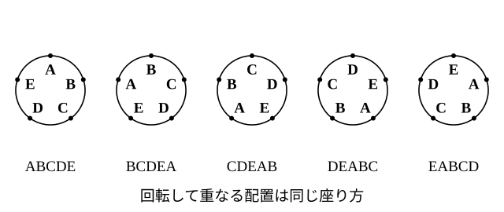

# L05 円順列と重複順列

- unit_id: hs-math-a-counting-and-probability
- 位置づけ: 単元第5レッスン（1.5時間）。L04 の順列を2つの方向に広げる回。**円順列**は「回転して重なる並べ方を同じ1通りとみる」約束のもとで (n−1)! になることを、1つを固定する見方と n!/n の見方の2通りで導く。**重複順列**は「同じものを繰り返し使ってよい」並べ方で、各段階 n 通りの積の法則そのものであり、並べる以外の場面（部分集合の個数・組の割り当て）にも使える。どちらも L03 の積の法則に戻せば導ける。
- distribution_status: published_draft
- license: CC-BY-4.0
- verify_required: 例題数値・記述は監修者検証必須。
- 主概念: ①円順列 (n−1)!（1つを固定して残りを並べる） ②重複順列 nʳ（各段階 n 通り・並べる以外への利用＝部分集合の個数）

---

## 1. 円順列——1つを固定して残りを並べる

**例題1** A、B、C、D、E の5人が円形のテーブルに座る。座り方は何通りあるか。ただし、全員が同じ向きに1つずつ席を移って（回転して）重なる座り方は、同じ座り方とみる。

まず、L01 の約束どおり「1通り」を決める。この問題の1通りは「誰の右隣に誰がいるか」という**相対的な位置関係**であり、テーブルを回して重なるものは同じとみる。

**見方1（1つを固定する）**: 回して重なるものを同じとみるのだから、A の席を決めてしまってよい（どこに座っていても回せば同じ位置に来る）。A を固定すると、残りの4人 B、C、D、E を残りの4席に並べる並べ方だけが問題になる。これは1列に並べる順列と同じで、4!=**24**（通り）

**見方2（回転の数で割る）**: 5人を1列に並べる並べ方は 5!=120 通り。この120通りを円形に置くと、1つの円形の座り方に対して、どこから読み始めるかで 5 通りの列が対応する（ABCDE、BCDEA、CDEAB、DEABC、EABCD はどれも同じ円形の座り方）。したがって円形の座り方の数は 120/5=**24**（通り）

一般に、異なる n 個のものを円形に並べる**円順列**（えんじゅんれつ。回転して重なる並べ方は同じとみる）の総数は、

**(n−1)!**（=n!/n）

検算: 数を小さくして3人 A、B、C なら (3−1)!=2 通り。実際に A を上に固定すると、右回りに ABC か ACB の2通りしかない ✓。

見方1と見方2は同じ答えを出す。見方1は「固定して残りを並べる」という計算の型として、見方2は「なぜ (n−1)! なのか」の意味として、両方持っておく。

**例題2** 男子3人・女子3人の6人が円形に座る。男女が交互になる座り方は何通りあるか。ただし、回転して重なる座り方は同じ座り方とみる。

男子1人を固定する。残りの5席は、固定した男子から順に 女・男・女・男・女 と交互になるから、1つおきの2席が男子の席、間の3席が女子の席になる。残りの男子2人を男子の2席に並べる並べ方は 2!=2 通り、そのそれぞれに対して女子3人を女子の3席に並べる並べ方は 3!=6 通り。積の法則で 2×6=**12**（通り）

:::guide
**「回して同じ」を、問題文が言っているかを確かめる**

円順列の (n−1)! は、「回転して重なる配置は同じ1通り」という約束のもとでの数である。もし席に番号が付いていて「1番の席に誰が座るか」が結果に効くなら、回しても同じとはみないので、ふつうの順列 n! で数える。どちらで数えるかは、L01 の「1通りとは何か」の決め方の問題であって、円形に並んでいるから必ず (n−1)! とは限らない。問題文に「回転して重なるものは同じとみる」とあるか、あるいは「席の区別がない」ことが読み取れるかを、式を立てる前に確かめる。見方1の「1つを固定する」は、この約束があるからこそ使える手である。
:::

## 2. 重複順列——各段階 n 通り

**例題3** 1、2、3 の3種類の数字を、同じ数字を何回使ってもよいものとして4個並べ、4桁の整数を作る。整数は全部で何個できるか。

千の位は3通り。そのそれぞれに対して、百の位も3通り（同じ数字を使ってよいから減らない）。十の位・一の位も3通りずつ。積の法則で

3×3×3×3=3⁴=**81**（個）

L04 の順列では、一度使ったものは次の段階で使えないので枝の数が 1 ずつ減った。ここでは**同じものを繰り返し使ってよい**ので、どの段階も枝の数が n のままである。

一般に、異なる n 種類のものから、同じものを繰り返し使ってよいものとして r 個を取り出して1列に並べる順列を**重複順列**（ちょうふくじゅんれつ）といい、その総数は

**nʳ**（n の r 乗。n を r 個掛ける）

例題3は 3⁴=81 である。

**例題4** ○か×で答える問題が5問ある。答え方は全部で何通りあるか。

各問の答え方は○・×の2通りで、5問あるから 2⁵=**32**（通り）

検算: 2問なら ○○、○×、×○、×× の4通り=2² ✓。

:::guide
**順列と重複順列の分かれ目は「戻すかどうか」**

5枚のカードから3枚を並べる（順列 5P3=60）と、0 を含まない5種類の数字を繰り返し使って3桁を作る（重複順列 5³=125）は、問題文の見た目が似ている。分かれ目は、**一度使ったものを戻して次も使えるか**である。カードは使ったら手元から消えるので戻さない（減っていく）、数字の種類は使っても消えないので戻す（減らない）。この単元で繰り返し使う問診「区別する？ 順番ある？ 戻す？」（L10 で3つそろえて使う）の3つ目がこれである。順列・重複順列のどちらでも、樹形図の1段目・2段目の枝の本数を数えれば、公式を思い出せなくても答えは出る。公式は樹形図の省略形にすぎない。
:::

## 3. 並べる以外への利用——部分集合の個数・組の割り当て

重複順列の考え方は、「並べる」場面でなくても、**それぞれのものについて n 通りの選択がある**場面ならそのまま使える。

**例題5** 集合 {a, b, c, d} の部分集合は全部で何個あるか。空集合 ∅ と {a, b, c, d} 自身も部分集合に含める。

部分集合を1つ決めることは、a、b、c、d のそれぞれについて「入れる」か「入れない」かを決めることと同じである（a、b、c、d の順に ○＝入れる・×＝入れない を並べた列と1対1に対応する——○と×の2種類から4個を並べる重複順列と同じ形）。各要素について2通り、4個の要素があるから、2⁴=**16**（個）

検算: {a, b} の部分集合は ∅、{a}、{b}、{a, b} の4個=2² ✓。

**例題6** 6人を、A・B の2つの部屋に分ける。
(1) 誰も入らない部屋があってもよいとすると、分け方は何通りあるか。
(2) どちらの部屋にも少なくとも1人は入るものとすると、分け方は何通りあるか。

(1) 6人のそれぞれについて、A に入るか B に入るかの2通り。2⁶=**64**（通り）
(2) (1) のうち「全員が A」「全員が B」の2通りは、空の部屋ができる。それを除いて 64−2=**62**（通り）

(2) は「〜でない」を全体から引く L02 の見方である。部屋に A・B の名前（区別）があることに注意しよう。部屋に名前がないときの分け方は、L07 の組分けで扱う。

## 4. 練習

**問1** 次の問いに答えよ。回転して重なる並べ方は同じ並べ方とみる。
(1) 6人が円形のテーブルに座る座り方は何通りあるか。
(2) 異なる7個の玉を円形に並べる並べ方は何通りあるか。
(3) A、B、C、D の4人が円形のテーブルに座るとき、A と B が隣り合う座り方は何通りあるか。

**問2** 大人2人・子ども2人の合わせて4人が円形のテーブルに座る。回転して重なる座り方は同じとみる。
(1) 座り方は全部で何通りあるか。
(2) 大人2人が向かい合う座り方は何通りあるか。
(3) 大人2人が隣り合う座り方は何通りあるか。また、(2) と (3) の答えの和が (1) の答えに等しくなる理由を一文で説明せよ。

**問3** 次の整数や記号の列は全部で何個できるか。
(1) 0、1、2 の3種類の数字を、同じ数字を繰り返し使ってよいものとして3個並べて作る3桁の整数（百の位に 0 は置けない）。
(2) 1、2、3、4 の4種類の数字を、同じ数字を繰り返し使ってよいものとして3個並べて作る3桁の整数。
(3) ○、×、△ の3種類の記号を、繰り返し使ってよいものとして5個並べた列。

**問4** 集合 {a, b, c, d, e} について答えよ。
(1) 部分集合は全部で何個あるか（∅ と全体を含める）。
(2) そのうち、a を要素として含む部分集合は何個あるか。
(3) 要素を少なくとも1つ含む（∅ でない）部分集合は何個あるか。

**問5** 次の問いに答えよ。
(1) 5人を X・Y の2つのグループに分ける。誰も入らないグループがあってもよいとすると何通りあるか。また、どちらのグループにも少なくとも1人は入るとすると何通りあるか。
(2) 5人を P・Q・R の3つの部屋に入れる。誰も入らない部屋があってもよいとすると何通りあるか。

**問6** 4色の旗を使い、旗を横に3本並べて合図を送る。同じ色の旗を繰り返し使ってもよい。
(1) 合図は全部で何種類作れるか。
(2) 50種類の合図を送りたい。旗3本の並びで足りるか。また、旗2本の並びでは足りるか。それぞれ求めた値を根拠に一文で答えよ。

---

:::stretch
**S1** 異なる5個の玉を糸でつないで首飾り（くびかざり）を作る。首飾りは回転させて重なるものだけでなく、**裏返して重なるものも同じ**とみる。
(1) 5個の玉を円形に並べる並べ方（回転して重なるものは同じ・裏返しは別）は何通りあるか。
(2) 首飾りとして数えると何通りになるか。(1) の並べ方が裏返しによってどのように対になるかを一文で説明し、そのうえで答えよ。
(3) 異なる3個の玉で作る首飾りは何通りあるか。円形の並べ方を全部書き出して確かめよ。
:::

対応解答: answer_key_L04-07.md

<!-- gen_nav:nav:start（自動生成・手編集しない） -->

---

[← 前のレッスン](lesson_04.md)｜[単元の目次](README.md)｜[解答](answer_key_L04-07.md)｜[次のレッスン →](lesson_06.md)

<!-- gen_nav:nav:end -->
