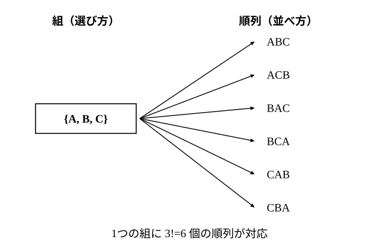

# L06 組合せ——選ぶ

- unit_id: hs-math-a-counting-and-probability
- 位置づけ: 単元第6レッスン（2時間）。L04 の順列から**順序を消す**ことで、異なる n 個から r 個を選ぶ**組合せ**の総数 nCr=nPr/r! を導く回。1つの選び方に r! 通りの並べ方が対応することを図で確かめ、nCr=nCn−r を「選ぶ＝残す」の1対1対応から見いだす。同じ状況で順列と組合せを対にして出題し、「順序が効くか」で使い分ける。条件つき組合せ（特定のものを含む／含まない）と図形の個数へ適用する。L07 の組分け・同じものを含む順列は、この組合せの応用である。
- distribution_status: published_draft
- license: CC-BY-4.0
- verify_required: 例題数値・記述は監修者検証必須。
- 主概念: ①組合せ nCr=nPr/r!（順序を消す）・nCr=nCn−r の意味（選ぶ＝残す） ②条件つき組合せ（特定のものを含む／含まない・図形の個数）

---

## 1. 「選んでから並べる」——nCr=nPr/r!

L04 の例題3(3) で、「6人から掃除当番2人を選ぶ」は順序が効かないので順列では数えない、と述べた。ここでその数え方を作る。

**例題1** A、B、C、D、E の5人から3人を選ぶ。選び方は何通りあるか。

順序を区別して3人を1列に並べる並べ方は、L04 で 5P3=60 通りだった。しかし「A、B、C」「A、C、B」「B、A、C」「B、C、A」「C、A、B」「C、B、A」の6通りは、選ばれた3人としては同じ組 {A, B, C} である。つまり、**1つの選び方（組）に、3!=6 通りの並べ方が対応する**。

60通りの並べ方は、6通りずつ束になって1つの組に対応するから、組の数は

60/6=**10**（通り）

言い換えると、5人から3人を並べる操作を「3人を選ぶ」「選んだ3人を並べる」の2段階に分けたとき、（選び方の数）×3!=5P3 という積の法則が成り立ち、そこから選び方の数=5P3/3! と逆算している。

一般に、異なる n 個のものから r 個を取り出して1組にしたものを、n 個から r 個取る**組合せ**（くみあわせ）といい、その総数を **nCr** と書く。nCr は「n の中から r 個選ぶ」と読めばよい（C は combination の頭文字。この教材では 5C3 のように半角の文字を並べて書く。教科書では n と r を C の左右に小さく添える）。

**nCr=nPr/r!=n(n−1)…(n−r＋1)/(r(r−1)…×2×1)**

分子は n から始めて r 個、分母は r から始めて r 個——**上下とも r 個ずつ**書く。例題1は 5C3=(5×4×3)/(3×2×1)=60/6=10。階乗で書けば nCr=n!/(r!(n−r)!) である。

検算: 5人から3人の組を全部書き出す。ABC、ABD、ABE、ACD、ACE、ADE、BCD、BCE、BDE、CDE の10組 ✓。

**例題2** 次の値を求めよ。
(1) 7C3  (2) 8C2  (3) 6C6  (4) 4C0

(1) 7C3=(7×6×5)/(3×2×1)=210/6=**35**
(2) 8C2=(8×7)/(2×1)=**28**
(3) 6C6=6!/(6!×0!)=**1**（6個全部を選ぶ選び方は1通り）
(4) 4C0=**1**（1つも選ばない選び方を1通りと数える。0!=1 の約束と同じく、nC0=1 と約束する）

:::guide
**なぜ r! で割るのか——1つの組に r! 個の順列**

nCr=nPr/r! の「割る」を、暗記ではなく対応で理解しておく。順列 nPr は「選んだ r 個を並べた列」を数えている。1つの組（選び方）を決めると、その r 個を並べる並べ方は r! 通りあるから、順列の総数は（組の数）×r! になっている（積の法則）。組の数を知りたいなら、r! で割り戻せばよい。図の矢印がその対応である。この理屈は「区別を消す」操作の原型で、L07 の組分け（同じ人数の組 k 個の名前を消す÷k!）・同じものを含む順列（同じ文字の区別を消す÷p!）でも、まったく同じ形で現れる。「何が何通りずつ束になっているか」を言えるようになれば、割る数を間違えない。
:::

## 2. nCr=nCn−r——選ぶことは残すこと

**例題3** 10人から7人を選ぶ選び方は何通りあるか。

7人を選ぶことは、選ばれない3人を決めることと同じである。「選ぶ7人の組」と「残す3人の組」は1対1に対応する（L01 の原則②）から、

10C7=10C3=(10×9×8)/(3×2×1)=**120**（通り）

直接計算しても 10C7=(10×9×8×7×6×5×4)/(7×6×5×4×3×2×1)=120 で一致するが、10C3 のほうが計算が軽い。

一般に、**nCr=nCn−r** が成り立つ（右辺の C の右にある n−r はひとまとまりで、「n 個から n−r 個選ぶ」の意味）。r が n の半分より大きいときは、n−r 個の「残す側」を数えるとよい。

:::guide
**nCr=nCn−r を「選ばない側を数えている」と読む**

この等式は、式の形（n!/(r!(n−r)!) は r と n−r を入れかえても同じ式になる）からも確かめられるが、意味で覚えたほうが忘れない。10人から7人を選ぶとき、実際にやっているのは「外す3人を決める」ことである。選ぶ側と残す側はいつも1対1に対応するから、どちらを数えても同じ数になる。数えにくいものを数えやすいものに対応付ける——L01 の原則②が、公式の形で現れている。練習で 12C11 のような値が出てきたら、12C1=12 と読み替える。
:::

## 3. 順列か組合せか——同じ状況で対にして見る

**例題4** 8人の部員がいる。
(1) 部長と副部長を1人ずつ選ぶ選び方は何通りあるか。
(2) 代表2人を選ぶ選び方は何通りあるか。

(1) 「A が部長・B が副部長」と「B が部長・A が副部長」は違う。順序が効くので順列で 8P2=8×7=**56**（通り）
(2) 「A と B」と「B と A」は同じ代表の組。順序が効かないので組合せで 8C2=(8×7)/(2×1)=**28**（通り）

同じ「8人から2人」でも、選んだ2人に役割の違いが付くなら順列、同じ扱いなら組合せ。(1) は (2) のそれぞれの組に対して、部長・副部長の割り当て 2!=2 通りがあるので、56=28×2 という関係になっている。

## 4. 条件つき組合せ

**例題5** 男子5人・女子4人の合わせて9人から4人を選ぶ。
(1) 選び方は全部で何通りあるか。
(2) 男子2人・女子2人を選ぶ選び方は何通りあるか。
(3) 特定の1人 A を必ず含む選び方は何通りあるか。
(4) 女子を少なくとも1人含む選び方は何通りあるか。

(1) 9C4=(9×8×7×6)/(4×3×2×1)=3024/24=**126**（通り）

(2) 男子5人から2人を選ぶ選び方 5C2=10 通り、そのそれぞれに対して女子4人から2人を選ぶ選び方 4C2=6 通り。積の法則で 10×6=**60**（通り）

(3) A を先に選んでしまう。残りの3人を、A 以外の8人から選ぶので 8C3=**56**（通り）

(4) 「少なくとも1人が女子」の反対は「女子が1人もいない」、つまり4人全員が男子。男子5人から4人を選ぶ選び方は 5C4=5C1=5 通り。全体から引いて 126−5=**121**（通り）

検算: (4) を直接数える。女子1人: 4C1×5C3=4×10=40、女子2人: 60（(2) の値）、女子3人: 4C3×5C1=4×5=20、女子4人: 4C4=1。合計 40＋60＋20＋1=121 ✓。場合分けして和の法則で足しても同じ値になる。

## 5. 図形の個数

**例題6** 正六角形の6つの頂点について答えよ。
(1) 6つの頂点のうち3つを選んで結んでできる三角形は何個あるか。
(2) 正六角形の対角線は何本あるか。

(1) どの3頂点も一直線上にないので、3頂点を選べば必ず三角形が1つできる。6C3=(6×5×4)/(3×2×1)=**20**（個）

(2) 2頂点を結ぶ線分は 6C2=15 本。このうち隣り合う2頂点を結ぶものは正六角形の辺で、6本。対角線は 15−6=**9**（本）

検算: 1つの頂点からは、自分自身と両隣の2つを除いた3つの頂点へ対角線が引ける。6つの頂点から3本ずつで 6×3=18 だが、1本の対角線は両端の頂点から1回ずつ、計2回数えられているので 18/2=9 ✓。

:::guide
**「選んだら、それで決まるか」を確かめて図形を数える**

図形の個数を組合せで数えるときの前提は、「点を選べば図形がちょうど1つ決まり、違う選び方には違う図形が対応する」ことである。三角形なら、3点が一直線上に並ぶと三角形ができないので、その3点の選び方は除かなければならない（正多角形の頂点なら起きない）。対角線なら、2点を選んで結んだ線分のうち「辺」になるものを除く。この確認は、L01 の原則②「1対1に対応付ける」が成り立っているかの確認そのものである。対応が1対1でないところ（一直線上の3点・辺になる2点）を先に見つけて処理すれば、あとは組合せの計算だけになる。
:::

## 6. 練習

**問1** 次の値を求めよ。
(1) 6C2  (2) 9C3  (3) 7C5  (4) 10C8  (5) 5C0  (6) 12C11

**問2** 次の総数を求めよ。また、(1) と (2) の値の関係を式で説明せよ。
(1) 10人から、議長1人と書記1人を選ぶ。
(2) 10人から、委員2人を選ぶ。
(3) 6種類の果物から3種類を選ぶ。
(4) 6種類の果物から3種類を選び、皿に左から1列に並べて盛りつける。

**問3** 男子6人・女子3人の合わせて9人から5人を選ぶ。
(1) 選び方は全部で何通りあるか。
(2) 男子3人・女子2人を選ぶ選び方は何通りあるか。
(3) 特定の男子 A と特定の女子 B をともに含む選び方は何通りあるか。
(4) 女子が1人も入らない選び方は何通りあるか。また、女子を少なくとも1人含む選び方は何通りあるか。

**問4** 次の個数を求めよ。
(1) 正八角形の8つの頂点のうち3つを選んで結んでできる三角形の個数。
(2) 正八角形の対角線の本数。
(3) 平面上に7つの点があり、どの3点も一直線上にない。このうち2点を結んでできる直線の本数。

**問5** 6人から2人を選ぶとき、6P2=30 を 2 で割ると 6C2 の値になる。なぜ 2 で割るのかを、具体的な2人の組を1つ挙げて1〜2文で説明せよ。

**問6** あるピザ屋では、12種類のトッピングから3種類を選んでのせることができる。
(1) トッピングの選び方は全部で何通りあるか。
(2) 1年間（365日）、毎日違う選び方を続けることができるか。(1) の値を根拠に一文で答えよ。
(3) 4種類を選べるとしたら何通りあるか。また、そのとき (2) の答えは変わるか、一文で答えよ。

---

:::stretch
**S1** 縦の平行線4本と横の平行線5本が交わっている。隣り合う平行線の間隔はすべて等しいものとする。
(1) これらの直線で囲まれる長方形（正方形を含む）は全部で何個あるか。
(2) 交点は全部で何個あるか。
(3) (1) の長方形のうち、正方形は何個あるか。また、正方形でない長方形は何個あるか。
:::

対応解答: answer_key_L04-07.md

<!-- gen_nav:nav:start（自動生成・手編集しない） -->

---

[← 前のレッスン](lesson_05.md)｜[単元の目次](README.md)｜[解答](answer_key_L04-07.md)｜[次のレッスン →](lesson_07.md)

<!-- gen_nav:nav:end -->
