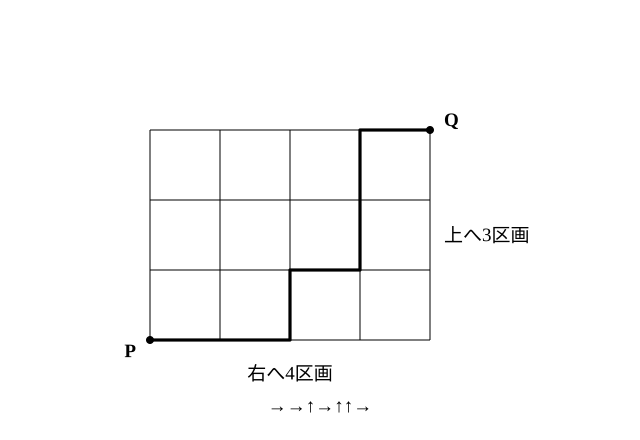

# L07 組分けと同じものを含む順列——区別を消して数える

- unit_id: hs-math-a-counting-and-probability
- 位置づけ: 単元第7レッスン（2時間）。順列・組合せのブロックを締める回。L06 の「r! で割る」（1つの組に r! 個の順列が束になる）と同じ操作を、2つの場面に広げる。**組分け**では「組に名前（区別）があるか」を問診し、同じ人数で名前のない組が k 個あれば、その組の並べ方 k! で割る理由を、小さい数の全列挙で確かめる。**同じものを含む順列**は「同じ文字の位置を組合せで選ぶ」見方で n!/(p!q!…) を導き、格子の最短経路に応用する。L08 からは確率に入る。
- distribution_status: published_draft
- license: CC-BY-4.0
- verify_required: 例題数値・記述は監修者検証必須。
- 主概念: ①組分け（組に区別がある／ない→同数の組が k 個なら k! で割る） ②同じものを含む順列 n!/(p!q!…) を組合せで導く・格子の最短経路

---

## 1. 組分け——組に名前があるか

何人かを、全員がどれか1つの組にちょうど1回ずつ入るように、いくつかの組に分けることを**組分け**という。何を「1通り」と数えるかは、組に名前（区別）があるかどうかで変わる。名前があれば「誰がどの組に入るか」が1通り、名前がなければ「誰と誰が同じ組になるか」が1通りである。

**例題1** A、B、C、D、E、F の6人を分ける。
(1) 2人の A組と4人の B組に分ける分け方は何通りあるか。
(2) 2人ずつの3つの組 X組・Y組・Z組に分ける分け方は何通りあるか。
(3) 2人ずつの3つの組に分ける分け方は何通りあるか（組に名前はない）。

(1) A組の2人を選べば、残り4人が自動的に B組になる。6C2=**15**（通り）

(2) X組の2人を6人から選ぶ選び方 6C2=15 通り。そのそれぞれに対して Y組の2人を残り4人から選ぶ選び方 4C2=6 通り。残り2人が Z組（2C2=1 通り）。積の法則で 15×6×1=**90**（通り）

(3) (2) との違いは、**組に名前がない**ことだけである。(2) の90通りの中で、たとえば

X組 {A, B}・Y組 {C, D}・Z組 {E, F}　と　X組 {C, D}・Y組 {A, B}・Z組 {E, F}

は、名前を外せばどちらも「{A, B}、{C, D}、{E, F} の3組」で、同じ分け方である。1つの名前なしの分け方に対して、3つの組に X・Y・Z の名前を割り当てる割り当て方は 3!=6 通り。つまり (2) の90通りは、6通りずつ束になって1つの名前なしの分け方に対応する。したがって

90/3!=90/6=**15**（通り）

L06 の nCr=nPr/r! と同じ構造である——「名前つきの分け方＝名前なしの分け方×（名前の割り当て方 3!）」という積の法則から、割り戻している。

**小さい数で全部書き出して確かめる**: 4人 A、B、C、D を2人ずつ2組に分ける。組に X・Y の名前があれば、X組の選び方 4C2=6 通り: X{A, B}Y{C, D}、X{A, C}Y{B, D}、X{A, D}Y{B, C}、X{B, C}Y{A, D}、X{B, D}Y{A, C}、X{C, D}Y{A, B}。名前を外すと、1番目と6番目・2番目と5番目・3番目と4番目がそれぞれ同じ分け方になり、{A, B}と{C, D}、{A, C}と{B, D}、{A, D}と{B, C} の3通り。6/2!=3 ✓。「同じ人数の組が2つ→2! で割る」の意味が、この対応そのものである。

**例題2** 次の分け方は何通りあるか。
(1) 6人を、3人・2人・1人の3つの組に分ける分け方は何通りあるか。
(2) 8人を、4人・2人・2人の3つの組に分ける分け方は何通りあるか（組に名前はない）。

(1) 3人の組 6C3=20 通り、そのそれぞれに対して2人の組 3C2=3 通り、残り1人が1人の組。20×3×1=**60**（通り）。人数が違う組は、名前がなくても人数で区別できるので、割る必要はない。

(2) 4人の組 8C4=70 通り、そのそれぞれに対して2人の組 4C2=6 通り、残り2人がもう1つの2人の組。名前つきなら 70×6=420 通り。**同じ人数の組は2人の組2つだけ**だから、この2組の入れかえ 2! で割る。4人の組は人数で区別できるので割らない。420/2!=**210**（通り）

:::guide
**割るのは「同じ人数で名前のない組」の数の階乗だけ**

組分けで迷いやすいのは「何で割るか」である。基準は1つ——**人数が同じで、しかも名前がない組が k 個あれば k! で割る**。人数が違う組は、名前がなくても「3人の組」「2人の組」と呼び分けられる。例題2(1) のように「3人の組→2人の組→1人の組」と選ぶ順が人数で決まっていて、同じ分け方を重ねて数えていないから、割らない。例題2(2) の 4人・2人・2人では、2人の組2つだけが入れかえで重なるから 2! で割り、4人の組は数えない。割る理由を「同じ分け方が k! 通りずつ束になっているから」と言えるなら、公式を覚えていなくても正しく割れる。逆に、理由を言えないまま「組分けは割る」と覚えると、名前のある組まで割ってしまう。
:::

:::zatsudan
順列・組合せの単元の中身は、今も昔も同じだったわけではない。数学教育の歴史を調べた研究（2020年）によると、以前の課程の高校の教科書5社には、樹形図・和の法則・積の法則・順列・円順列・重複順列・組合せ・組分け・同じものを含む順列・格子の最短経路が共通して載っており、重複を許して選ぶ組合せ（この教材では扱わない）は発展扱いだった。同じ研究は、組分けの問題が戦前の日本ではあまり重視されなかったことも指摘している。この教材が組分けに紙面を割いて、小さい数で全部書き出してまで確かめているのは、そうした背景を知ったうえでの選択である。
:::
<!-- zatsudan話題源: 雑談枠許可リスト Z1（小藤俊幸2020「順列・組合せの数学教育史」数学教育史研究20・注(22)と組分けの記述の確認範囲。平成21年告示課程の教科書実測である旨は本文で「以前の課程」と表現）。出典の確認範囲内の事実のみ使用 -->

## 2. 同じものを含む順列——同じ文字の位置を選ぶ

**例題3** a、a、a、b、b の5文字を1列に並べる。並べ方は何通りあるか。

5文字がすべて違えば 5!=120 通りだが、同じ文字が入っているので、見た目が同じ並びが重なる。

**見方1（位置を選ぶ）**: 5つの位置のうち、a を置く3つの位置を選べば、残りの2つの位置は自動的に b になる。5C3=**10**（通り）

**見方2（区別を消す）**: 3つの a を a₁、a₂、a₃、2つの b を b₁、b₂ と区別すると 5!=120 通り。区別を外すと、a₁、a₂、a₃ の入れかえ 3!=6 通りと b₁、b₂ の入れかえ 2!=2 通り、合わせて 6×2=12 通りずつが同じ並びに束になる。120/(3!×2!)=120/12=**10**（通り）

一般に、n 個のもののうち、同じものが p 個、q 個、r 個、…あるとき（p＋q＋r＋…=n）、これらを1列に並べる**同じものを含む順列**の総数は、

**n!/(p!q!r!…)**

検算: L01 の例題2「a、a、b」は 3!/(2!1!)=3 通り ✓（aab、aba、baa）。

**例題4** a、a、a、b、b、c の6文字を1列に並べる。
(1) 並べ方は全部で何通りあるか。
(2) 両端が a になる並べ方は何通りあるか。
(3) c が左端にくる並べ方は何通りあるか。

(1) 6!/(3!2!1!)=720/(6×2×1)=**60**（通り）
(2) 両端に a を置くと、中の4か所に a、b、b、c を並べる。4!/(1!2!1!)=24/2=**12**（通り）
(3) 左端に c を置くと、残り5か所に a、a、a、b、b を並べる。5!/(3!2!)=**10**（通り）（例題3と同じ）

:::guide
**「並べる」を「場所を選ぶ」と読み替える**

同じものを含む順列を、見方1の「a を置く場所を選ぶ」で解くと、順列の問題が組合せの問題に変わる。3種類以上の文字でも同じで、a、a、a、b、b、c なら、まず6か所から a の3か所を選び（6C3）、そのそれぞれに対して残り3か所から b の2か所を選び（3C2）、残った1か所が c、と段階的に選べる。6C3×3C2×1C1=20×3×1=60 で、公式 6!/(3!2!1!) と一致する。公式の分母の p!q!… は、見方2の「区別を消すために割る数」であると同時に、見方1で場所を選ぶときに組合せの分母として現れる数でもある。2つの見方が同じ式に着地することを確かめると、「なぜ割るのか」が2方向から支えられる。
:::

## 3. 格子の最短経路——→と↑の並べ方

**例題5** 次の図のような道路の格子で、地点 P から右へ4区画・上へ3区画進んだ地点 Q へ、最短の道順で行く。道順は何通りあるか。

最短で行くには、右へ1区画進む（→）を4回、上へ1区画進む（↑）を3回、合計7回の移動を、どの順で行うかを決めればよい。たとえば →→↑→↑↑→ は1つの道順である。つまり、**道順と「→4個と↑3個を1列に並べた列」は1対1に対応する**（L01 の原則②）。

同じものを含む順列で、7!/(4!3!)=5040/(24×6)=**35**（通り）

検算: 小さくして、右へ2・上へ1なら 3!/(2!1!)=3 通り。書き出すと →→↑、→↑→、↑→→ の3通り ✓。

**例題6** 例題5の格子で、P から Q へ行く最短の道順のうち、右へ2区画・上へ1区画の位置にある地点 R を通るものは何通りあるか。

P から R までは →2個・↑1個の並べ方で 3!/(2!1!)=3 通り。そのそれぞれに対して、R から Q までは →2個・↑2個の並べ方で 4!/(2!2!)=6 通り。積の法則で 3×6=**18**（通り）

「ある地点を通る」道順は、その地点で前半と後半に分けて、積の法則でつなぐ。「ある地点を通らない」道順は、全体から「通る」道順を引く（L02 の補集合の見方。練習の問4）。

:::guide
**道順を文字列に対応付けるとき、「最短」が効いている**

道順を →と↑の列に対応付けられるのは、「最短の道順」に限っているからである。最短でなければ、左や下に戻る移動が入り、対応が崩れる。同じように、格子の途中に通れない道があるときも、対応の前に「どこが通れないか」を確かめる必要がある。数えにくいもの（道順）を数えやすいもの（文字列）に対応付ける手は強力だが、対応が本当に1対1かを毎回確認する——L06 の図形の個数で「3点が一直線上にないか」を確かめたのと同じ姿勢である。
:::

## 4. 練習

**問1** 8人を次のように分ける分け方は、それぞれ何通りあるか。
(1) 3人の A組と5人の B組に分ける。
(2) 4人ずつの A組と B組に分ける。
(3) 4人ずつの2つの組に分ける（組に名前はない）。
(4) 3人・3人・2人の3つの組に分ける（組に名前はない）。

**問2** 9人を3人ずつの3つの組に分ける。
(1) 3つの組に A・B・C の名前があるとき、分け方は何通りあるか。
(2) 組に名前がないとき、分け方は何通りあるか。
(3) (1) の答えを (2) の答えで割った値が 3! になる理由を一文で説明せよ。

**問3** 次の並べ方は何通りあるか。
(1) a、a、b、b、b の5文字を1列に並べる。
(2) 1、1、2、2、3、3 の数字を書いた6枚のカードを1列に並べる。同じ数字のカードは区別しない。
(3) a、a、a、a、b、c の6文字を1列に並べる。
(4) a、a、b、b、b の5文字を、両端が b になるように1列に並べる。

**問4** 右へ5区画・上へ3区画の格子で、左下の地点 P から右上の地点 Q へ最短の道順で行く。
(1) 道順は全部で何通りあるか。
(2) 右へ2区画・上へ1区画の位置にある地点 R を通る道順は何通りあるか。
(3) R を通らない道順は何通りあるか。

**問5** 1、1、1、2、2 の数字を書いた5枚のカードを全部並べて5桁の整数を作る。
(1) 整数は全部で何個できるか。
(2) 偶数は何個できるか。
(3) 20000 より大きい整数は何個できるか。

**問6** 6人のグループが、3人対3人の2チームに分かれて試合をする。チームに名前はなく、同じ2チームの分け方は同じとみる。
(1) チームの分け方は何通りあるか。
(2) このグループが「毎回違うチームの分け方で試合をすると、10回目でちょうど全部の分け方を一度ずつ試し終える」と言えるか。(1) の値を根拠に一文で答えよ。

---

:::stretch
**S1** 右へ4区画・上へ3区画の格子で、左下の地点 P から右上の地点 Q へ最短の道順で行く。地点 R は右へ1区画・上へ1区画の位置、地点 S は右へ3区画・上へ2区画の位置にある。
(1) 道順は全部で何通りあるか。
(2) 地点 S にある交差点が工事中で通れないとき、道順は何通りあるか。
(3) R と S の両方を通る道順は何通りあるか。
:::

対応解答: answer_key_L04-07.md

<!-- gen_nav:nav:start（自動生成・手編集しない） -->

---

[← 前のレッスン](lesson_06.md)｜[単元の目次](README.md)｜[解答](answer_key_L04-07.md)｜[次のレッスン →](lesson_08.md)

<!-- gen_nav:nav:end -->
