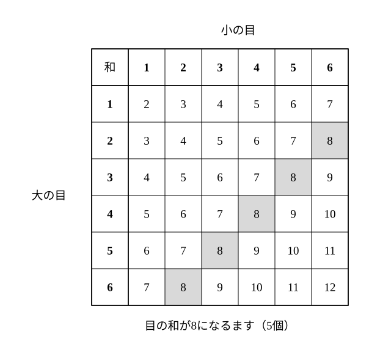
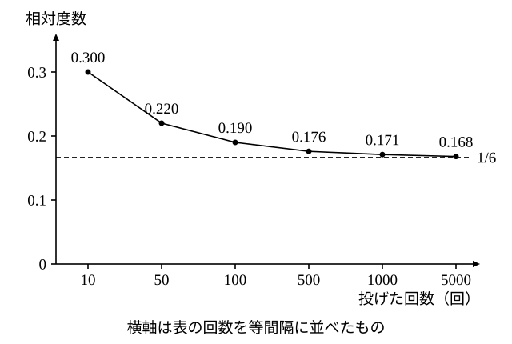

# L08 事象と確率——同様に確からしい根元事象

- unit_id: hs-math-a-counting-and-probability
- 位置づけ: 単元第8レッスン（2時間）。ここから確率に入る。中2で「同様に確からしい」ことを土台に求めた確率を、試行・事象・根元事象という集合の言葉で言い直し、L01 の問い「何を1通りと数えるか」に「同様に確からしくなるまで区別する」という答えを与える。中1の相対度数による確率にも「頻度確率」という名前を与え、論理的な確率との関係を確かめる。L09（基本性質）・L10（順列・組合せを使う確率）へ続き、L12・L13 で「1通り」の決め方を再訪する。
- distribution_status: published_draft
- license: CC-BY-4.0
- verify_required: 例題数値・記述は監修者検証必須。
- 主概念: ①試行・事象・全事象・根元事象・空事象を集合で表し、「同様に確からしくなるまで区別する」→論理的な確率 P(A)=n(A)/n(U) ②頻度確率（相対度数の安定する値・大数の法則）と論理的な確率の関係

---

## 1. 中2の確率を集合の言葉で言い直す——試行・事象・全事象

中2の確率では、「さいころを1回投げる」「2枚の硬貨を同時に投げる」のように、同じ条件で何度でも繰り返せて、結果が偶然に左右される実験や観察を考えた。高校では、まずこの一連のものに名前を付け、集合の記号（∈・⊂・∩・∪・∅・Aᶜ）で書けるようにする。集合の記号は L02 §0 で確かめたもの（数学Ⅰ「集合と命題」の記法）をそのまま使い、L02 で確かめた「要素の個数 n(A)」の書き方もそのまま使う。

- 同じ条件のもとで繰り返すことができ、その結果が偶然によって決まる実験や観察を**試行**という。
- 試行の結果として起こる事柄を**事象**という。
- ある試行で起こりうる結果の全体を集合で表したものを**全事象**といい、U で表す。1つ1つの事象は U の部分集合として表せる。
- U の要素1個だけからなる事象を**根元事象**（こんげんじしょう）という（これ以上分けられない事象）。
- 決して起こらない事象を**空事象**といい、∅ で表す。

たとえば「1個のさいころを1回投げる」試行では、

U={1, 2, 3, 4, 5, 6}

で、「偶数の目が出る」事象 A は A={2, 4, 6}、根元事象は {1}、{2}、…、{6} の6個、「7の目が出る」事象は ∅ である。A⊂U であり、n(U)=6、n(A)=3 と数えられる。中2で樹形図や二次元の表に書き出していた「起こりうる場合の全部」が U、「求めたい場合」が A にあたる。

## 2. 「同様に確からしい」根元事象を作る——定義の前の約束

確率の定義に入る前に、この単元の背骨の問い——何を1通りと数えるか（L01 §2）——に、確率としての答えを与えておく。中2で「2枚の硬貨は3通りか4通りか」と考えた場面を、用語で言い直してみよう。

**例題1** 100円硬貨と10円硬貨を1枚ずつ、同時に投げる。この試行の根元事象を書き出せ。また、「表の枚数」で結果を分けた「0枚・1枚・2枚」の3つを根元事象として使うことはできるか。

2枚の硬貨を区別し、（100円の結果, 10円の結果）の順に書くと、起こりうる結果は

(表, 表)、(表, 裏)、(裏, 表)、(裏, 裏)

の4つで、それぞれの結果1個だけからなる事象 {(表, 表)} などが根元事象である（以下、根元事象は中の結果だけを書いて (表, 表) のように表す）。硬貨に細工がなければ、この4つはどれも同じ程度に起こると期待できる。

一方、「表の枚数」で分けた「0枚・1枚・2枚」の3つは、同じ程度には起こらない。「1枚」は (表, 裏) と (裏, 表) の2つの結果を含むので、「0枚」や「2枚」の2倍起こりやすい。だから、この3つを根元事象として使うと、あとで確率を求めるときに分母がゆがむ。**確率の分母に使う根元事象としては使えない**。

どの根元事象も同じ程度に起こると期待できるとき、それらは**同様に確からしい**という（中2で学んだ言葉である）。ここでの約束を1文で言うと、

**根元事象は、同様に確からしくなるまで区別して作る**。

見分けのつかない2枚の硬貨も、同じ色の玉も、1つ1つ区別する。L01 §2 で「特に指定がなければ、同じ色の玉・同じ種類の硬貨も1つずつ区別して数える」と約束した理由がここにある——偏りなく投げたり取り出したりするものとして、1つ1つ区別して数えておけば、起こりやすさがそろうのである。

**例題2** 袋の中に赤玉2個と白玉1個が入っている。この袋から玉を1個取り出す試行の根元事象はいくつあるか。

赤玉に「赤1」「赤2」と名前を付けて区別すると、根元事象は「赤1が出る」「赤2が出る」「白が出る」の**3**（個）で、これらは同様に確からしい。色だけで「赤が出る」「白が出る」の2つに分けると、「赤が出る」が2つの根元事象を含むので同様に確からしくならず、確率の分母に使う根元事象としては使えない。

:::guide
**「根元事象はいくつか」と聞かれたら、「区別した上で」を条件に添える**

同じ袋の玉を「3個」とも「2種類」とも数えられるのだから、「根元事象はいくつか」という問いは、区別の仕方を決めない限り答えが決まらない。だからこの単元では、「根元事象を数える」と言ったら、必ず「同様に確からしくなるまで区別した上で」という条件が付いているものとする。もう1つ、「同様に確からしい」は観察された事実ではなく、私たちが置く仮定であることも意識しておきたい。さいころの6つの目が同様に確からしいのは、さいころにゆがみがないと仮定したときの話である。中2で学んだ「同様に確からしい」という条件を、高校では自分で仮定として明示して置き、必要ならあとで（§4 の頻度で）確かめる、という順番になる。
:::

## 3. 論理的な確率——P(A)=n(A)/n(U)

全事象 U の根元事象がすべて同様に確からしいとき、事象 A の起こる**確率** P(A) を、次のように定める（P は probability の頭文字。順列の nPr の P とは別の記号）。

P(A) = n(A)/n(U) （A に含まれる根元事象の個数を、全部の根元事象の個数で割った値）

このように、同様に確からしい根元事象の個数の比として定めた確率を**論理的な確率**という。中2で求めていた確率はこれである（名前は高校で初めて付ける）。分母 n(U) と分子 n(A) は、どちらも L01〜L07 で学んだ数え上げで求める——確率の計算は、場合の数の計算の上に立っている。

**例題3** 大小2個のさいころを同時に投げるとき、目の和が8になる確率を求めよ。

大小を区別すると、根元事象は（大の目, 小の目）の36通りで、さいころにゆがみがなければ同様に確からしい。n(U)=36。目の和が8になるのは

(2, 6)、(3, 5)、(4, 4)、(5, 3)、(6, 2)

の5通りだから n(A)=5。よって P(A)=**5/36**。

検算: 二次元の表で、和が8になるますを塗ると、右上から左下へ斜めに並ぶ5個である ✓。ここで「2個のさいころを区別せず、{2, 6}、{3, 5}、{4, 4} の3通り」と数えてはいけない。区別しない数え方では、{2, 6} は2つの根元事象を含むのに {4, 4} は1つしか含まず、分母の「場合」が同様に確からしくなくなる（§2 の約束）。

**例題4** 袋の中に赤玉3個と白玉2個が入っている。この袋から玉を1個取り出すとき、それが赤玉である確率を求めよ。

5個の玉を全部区別すると、根元事象は5個で同様に確からしい。n(U)=5、赤玉が出る根元事象は3個だから、P(赤)=**3/5**。

「赤か白かの2通りだから 1/2」は誤りである。「赤が出る」と「白が出る」は同様に確からしくない（赤のほうが起こりやすい）ので、この2つを分母の「2通り」として使うことはできない。

**例題5** 10円・50円・100円の硬貨を1枚ずつ、合わせて3枚を同時に投げるとき、表がちょうど2枚出る確率を求めよ。

3枚を区別すると、根元事象は L01 の樹形図の8本の枝で、同様に確からしい。n(U)=8。表がちょうど2枚出るのは（10円, 50円, 100円）の順に

(表, 表, 裏)、(表, 裏, 表)、(裏, 表, 表)

の3通りだから、P=**3/8**。

検算: 表の枚数で8通りを分けると、0枚1通り・1枚3通り・2枚3通り・3枚1通りで、合計 1＋3＋3＋1=8 ✓。表2枚は3通りで合っている。

:::guide
**分母と分子は、同じ「1通り」で数える**

L01 §4 の「最初の1行に『1通り＝〔何〕』を書く」習慣は、確率でいっそう効く。例題4で分母を「玉を全部区別した5個」と決めたら、分子も「区別した玉のうち赤である3個」と数える。分母は区別して、分子は色でまとめて（あるいはその逆に）数えると、比が意味を失う。確率の問題で答えが 1 を超えたり、同じ問題で人によって答えが違ったりするときは、まず分母と分子の「1通り」がそろっているかを疑う。求め終わったら、「分母の1通りと分子の1通りは同じ決め方か」を一度問い直す——これを確率の検算の第一歩にする。
:::

## 4. 頻度確率——相対度数の安定する値（中1の振り返り）

中1では、確率をもう1つの道で求めた。同じ試行を多数回繰り返し、ある事象が起こった回数の割合（**相対度数**＝起こった回数／試行の回数）を調べると、回数を増やすにつれてその値が一定の値に近づき、安定する。その安定した値をその事象の確率とみなす、という道である。このように多数回の試行の相対度数から定める確率を**頻度確率**という。また、試行の回数を増やすと相対度数がある一定の値に近づいて安定する、という傾向を**大数の法則**（たいすう）という。

たとえば、1個のさいころを繰り返し投げて1の目が出た回数を記録したところ、次のような結果が得られたとしよう（説明のために用意した架空の記録である）。

| 投げた回数 | 1の目が出た回数 | 相対度数（小数第3位まで） |
|---|---|---|
| 10 | 3 | 0.300 |
| 50 | 11 | 0.220 |
| 100 | 19 | 0.190 |
| 500 | 88 | 0.176 |
| 1000 | 171 | 0.171 |
| 5000 | 838 | 0.168 |

回数が少ないうちは相対度数が大きく揺れるが、回数が増えるにつれて 0.17 前後で落ち着いていく。論理的な確率 1/6=0.1666… と見比べると、相対度数がこの値に近づいていると読める。

2つの確率の関係を整理しておく。

- **論理的な確率**は、「根元事象が同様に確からしい」という仮定を置き、個数の比として計算で求める。実験はしない。
- **頻度確率**は、実際に多数回試行し、相対度数の安定する値として測る。「同様に確からしい」という仮定は置かないが、同じ条件で繰り返すことは要り、回数を増やさないと値が安定しない。
- さいころにゆがみがなければ、相対度数は論理的な確率 1/6 に近づき、頻度確率は論理的な確率と一致すると期待できる（大数の法則）。逆に、実際のさいころの目が本当に同様に確からしいかどうかは、頻度で確かめることになる。
- 画びょうを投げて「針が上を向く」ことのように、**同様に確からしい根元事象が見つからない**試行では、論理的な確率の定義をそのまま使うことはできず、頻度確率で考える。

多数回の試行の相対度数からものごとを判断する考え方は、数学Ⅰ「データの分析」で相対度数を読むのと同じ側にある。この単元では以後おもに論理的な確率を計算するが、その値が「多数回繰り返したときの割合」として意味をもつことは、頻度確率が支えている。

:::guide
**確率にはいくつかの捉え方がある——頻度と論理**

同じ「さいころの1の目が出る確率は 1/6」という文でも、中1では「たくさん投げたら6回に1回くらいの割合で出る」という頻度の意味で、中2では「6つの目が同様に確からしいから 1/6」という論理の意味で学んだ。高校ではこの2つに名前を付けて区別し、しかも両方を使う。教科書によっては、頻度確率を「統計的確率」、論理的な確率を「数学的確率」と呼ぶ。名前が違っても中身は同じである。なお、コンピュータで試行を何千回も繰り返して相対度数の動きを見る「シミュレーション」は、情報Ⅰの「モデル化とシミュレーション」と関連が深い。§4 の表のような記録を自分で作ってみると、大数の法則が「傾向」であって「必ず 1/6 になる保証」ではないことも実感できる——6000回投げても、相対度数がちょうど 1/6 になることはめったにない。
:::

:::zatsudan
「大数の法則」という名前は、実は中学校の学習指導要領解説にも登場している。中2の確率の説明の中で、多数回の試行によって得られる確率が、試行回数を増やすにつれて場合の数を基にして得られる確率に近づくことを述べた箇所に、この名前が添えられている。つまり、現象そのものには中1・中2で出会っていて、高校ではその名前を確かめ直している、という順番になる。名前を覚えることより、「回数を増やすと相対度数が安定する」という現象を、表や折れ線で自分の目で見たことがあるかどうかが、この先の確率の意味を支える。
:::
<!-- zatsudan話題源: 雑談枠許可リストZ4（中学校学習指導要領解説 数学編（平成29年告示）の中2「確率」の項に「（大数の法則）」の名称がある・高等学校学習指導要領解説 数学編（平成30年告示）が中1の学習を「大数の法則」を基にした理解と記す）。出典の確認範囲内の事実のみ使用 -->

## 5. 練習

**問1** 1個のさいころを1回投げる試行を考える。
(1) 全事象 U を集合で表せ。
(2) 「3の倍数の目が出る」事象を A、「4以下の目が出る」事象を B とする。A と B を集合で表し、n(A) と n(B) を求めよ。
(3) この試行の根元事象はいくつあるか。
(4) この試行で決して起こらない事象の例を1つ挙げ、それを表す記号を書け。

**問2** 50円硬貨と500円硬貨を1枚ずつ、同時に投げる。
(1) 同様に確からしい根元事象をすべて書き出せ。
(2) 表が1枚だけ出る確率を求めよ。
(3) 「表の出方は0枚・1枚・2枚の3通りだから、表が1枚だけ出る確率は 1/3」という考えの誤りを、1〜2文で説明せよ。

**問3** 大小2個のさいころを同時に投げる。次の確率を求めよ。
(1) 目の和が6になる。
(2) 目の積が12になる。
(3) 大のさいころの目が、小のさいころの目より大きい。

**問4** 袋の中に赤玉4個、白玉2個、青玉1個が入っている。この袋から玉を1個取り出す。
(1) 同様に確からしい根元事象はいくつあるか。
(2) 赤玉が出る確率を求めよ。
(3) 白玉または青玉が出る確率を求めよ。

**問5** 10円・50円・100円の硬貨を1枚ずつ、合わせて3枚を同時に投げる。次の確率を求めよ。
(1) 3枚とも表が出る。
(2) 表がちょうど1枚出る。
(3) 表と裏が両方出る。

**問6** 画びょうを机の上に落とし、針が上を向くかどうかを記録した。100回落としたところ62回、500回で318回、1000回で641回、2000回で1276回、針が上を向いた。
(1) それぞれの回数について、針が上を向いた相対度数を小数第3位まで求めよ。
(2) 「画びょうの針が上を向く確率」は、どのくらいの値と考えられるか。
(3) 「針が上を向くか向かないかの2通りだから、針が上を向く確率は 1/2 である」という考えは妥当か。(1) の値を根拠に、一文で答えよ。

---

:::stretch
**S1** 同じ大きさ・同じ色の2個のさいころを同時に投げる。見た目では2個を区別できない。
(1) 2個の目を「区別しない組」{a, b}（a と b の順序は問わない）で書き表すと、目の組は何通りあるか。
(2) (1) の組は同様に確からしいか。理由を1〜2文で説明せよ。
(3) 目の和が7になる確率を、（ア）(1) の組を同様に確からしい根元事象とみなして計算した値と、（イ）2個を区別して計算した正しい値の両方で求め、値が違う理由を1〜2文で説明せよ。
:::

対応解答: answer_key_L08-10.md

<!-- gen_nav:nav:start（自動生成・手編集しない） -->

---

[← 前のレッスン](lesson_07.md)｜[単元の目次](README.md)｜[解答](answer_key_L08-10.md)｜[次のレッスン →](lesson_09.md)

<!-- gen_nav:nav:end -->
