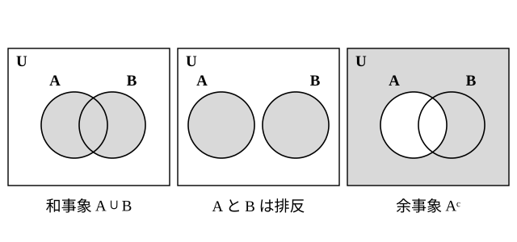

# L09 確率の基本性質——和事象・排反・余事象

- unit_id: hs-math-a-counting-and-probability
- 位置づけ: 単元第9レッスン（2時間）。L08 で定めた確率 P(A)=n(A)/n(U) から、確率の基本性質を集合の要素の個数（L02）を使って導く回。「または」の確率・同時には起こらない2つの事象（排反）・「〜でない」の確率（余事象）を集合の言葉でそろえ、中2で用語なしに使っていた「〜でない確率＝1−p」を余事象として言い直す。「少なくとも1つ」の問題への入口でもある。L10 で順列・組合せと組み合わせ、L11 以降の独立な試行・条件付き確率でも、ここで整えた性質を使い続ける。
- distribution_status: published_draft
- license: CC-BY-4.0
- verify_required: 例題数値・記述は監修者検証必須。
- 主概念: ①0≦P(A)≦1・P(∅)=0・P(U)=1・排反なら P(A∪B)=P(A)＋P(B)・一般に P(A∪B)=P(A)＋P(B)−P(A∩B) ②余事象 P(Aᶜ)=1−P(A)（「少なくとも1つ」の合図）

---

## 1. 「または」「かつ」「でない」を集合で書く

L08 で事象を全事象 U の部分集合として表した。すると、事象どうしの「または」「かつ」「でない」は、そのまま集合の記号で書ける。事象 A、B に対して、

- 「A または B が起こる」事象は A∪B である。教科書では A と B の和事象と呼ばれる。
- 「A と B がともに起こる」事象は A∩B である。教科書では A と B の積事象と呼ばれる。
- 「A が起こらない」事象は Aᶜ である（L02 §0 で確かめた補集合の記号をそのまま使う）。これを A の**余事象**という。
- A∩B=∅ のとき、つまり A と B が同時には起こらないとき、A と B は互いに**排反**（はいはん）であるという。

「1個のさいころを1回投げる」試行で、A を「偶数の目が出る」、B を「3の倍数の目が出る」、C を「1または3の目が出る」とすると、

A={2, 4, 6}、B={3, 6}、C={1, 3}

だから、A∪B={2, 3, 4, 6}、A∩B={6}、Aᶜ={1, 3, 5} である。A∩C=∅ なので A と C は排反だが、A∩B={6}≠∅ なので A と B は排反ではない。「排反かどうか」は、同時に起こる目が1つでもあるかを見れば決まる。

## 2. 性質①②——確率は 0 以上 1 以下

どんな事象 A についても ∅⊂A⊂U（空集合はどんな集合の部分集合でもある、と約束する）だから、要素の個数は 0≦n(A)≦n(U) を満たす。両側を n(U) で割ると、

**0≦P(A)≦1**

が得られる。また、P(∅)=0/n(U)=0、P(U)=n(U)/n(U)=1 である。決して起こらない事象の確率は 0、必ず起こる事象の確率は 1——中2で確かめたことが、定義からそのまま出てくる。

この性質は検算の道具になる。確率を計算して 1 を超えたり負になったりしたら、分母と分子の数え方（L08 §3 の guide）がそろっていないか、計算を誤っている。

## 3. 性質③——排反な事象の和、そして一般の和事象

L02 で、集合の要素の個数について

n(A∪B)=n(A)＋n(B)−n(A∩B)、特に A∩B=∅ なら n(A∪B)=n(A)＋n(B)

を確かめた。両辺を n(U) で割れば、そのまま確率の性質になる。

- A と B が互いに排反であるとき　P(A∪B)=P(A)＋P(B)
- 一般に　P(A∪B)=P(A)＋P(B)−P(A∩B)

排反なときの式は、教科書では確率の「加法定理」と呼ばれる。「または」の確率は、同時に起こらない場合分けなら足すだけでよく、同時に起こる場合があるなら重なりの分を引く——L03 の和の法則と、L02 のベン図に個数を書き込む作業を、確率の言葉で言い直したものである。

**例題1** 1個のさいころを1回投げるとき、4以下の目または6の目が出る確率を求めよ。

A「4以下の目」={1, 2, 3, 4}、B「6の目」={6} で、A∩B=∅ だから排反。P(A∪B)=P(A)＋P(B)=4/6＋1/6=**5/6**。

検算: A∪B={1, 2, 3, 4, 6} を直接数えて 5個 → 5/6 ✓。

**例題2** 大小2個のさいころを同時に投げるとき、目の和が5または10になる確率を求めよ。

L01 の例題3で数えたように、和が5になるのは4通り、和が10になるのは3通りで、この2つは同時には起こらない（排反）。P=4/36＋3/36=**7/36**。

**例題3** 1から20までの整数を1つずつ書いた20枚のカードから1枚を引くとき、3の倍数または5の倍数のカードを引く確率を求めよ。

A「3の倍数」={3, 6, 9, 12, 15, 18}、B「5の倍数」={5, 10, 15, 20} で、A∩B={15}≠∅ だから排反ではない。単純に足すと 15 を2回数えてしまうので、一般の式を使う。

P(A∪B)=P(A)＋P(B)−P(A∩B)=6/20＋4/20−1/20=**9/20**

検算: 3の倍数または5の倍数を直接書き出すと 3, 5, 6, 9, 10, 12, 15, 18, 20 の9枚 → 9/20 ✓。「6/20＋4/20=10/20」は誤りである（15 を重複して数えている）。

:::guide
**「または」を見たら、足す前に「同時に起こるか」を問診する**

和事象の確率で気をつけたい誤りは、排反でない2つの事象の確率をそのまま足すことだ。例題3の 3の倍数と5の倍数は「別のもの」に見えるが、15 は両方に属している。足してよいかどうかは、事象の名前の印象ではなく、A∩B を実際に書き出して決める——1つでも共通の要素があれば排反ではなく、重なりの分を引く。迷ったら、L02 のベン図に個数を書き込んでから確率に直すのが確実である。逆に、例題1の「4以下の目」と「6の目」や例題2の「和が5」と「和が10」は絶対に同時に起こらないから、安心して足せる。この判定を毎回1行書く（「A∩B=∅ だから排反」）習慣にすると、一般の式と排反の式の取り違えを防ぐ助けになる。
:::

## 4. 性質④——余事象と「少なくとも1つ」

A と Aᶜ は同時には起こらず（A∩Aᶜ=∅）、どちらかは必ず起こる（A∪Aᶜ=U）。だから排反な和の式と P(U)=1 から、

P(A)＋P(Aᶜ)=1、すなわち　P(Aᶜ)=1−P(A)

これが**余事象の確率**である。中2で「〜でない確率は 1−（〜である確率）」として使っていたものに、余事象という名前と記号が付いた。

余事象が役立つのは、A を直接数えるより Aᶜ のほうが数えやすいときである。問題文の「〜でない」「〜以上」「少なくとも1つ」は、余事象を考える合図になることが多い。

**例題4** 大小2個のさいころを同時に投げるとき、目の和が4以上になる確率を求めよ。

「和が4以上」を直接数えると場合が多い。余事象「和が3以下」を数えると、(1, 1)、(1, 2)、(2, 1) の3通りだから、P(Aᶜ)=3/36。よって

P(A)=1−3/36=33/36=**11/12**

検算: 36通りのうち和が3以下の3通りを除くと 33通りで、33/36 ✓。

**例題5** 10円・50円・100円の硬貨を1枚ずつ、合わせて3枚を同時に投げるとき、少なくとも1枚は表が出る確率を求めよ。

「少なくとも1枚は表」の余事象は「1枚も表が出ない」＝「3枚とも裏」で、これは (裏, 裏, 裏) の1通り。P(Aᶜ)=1/8 だから

P(A)=1−1/8=**7/8**

検算（小規模の全列挙）: L01 の樹形図の8本の枝のうち、(裏, 裏, 裏) 以外の7本には少なくとも1つ「表」が含まれる → 7/8 ✓。このように、余事象で求めた答えは、場合の数が小さいうちは**直接数えて照合**する。硬貨が10枚になれば直接数えるのは大変だが、余事象の計算は 1−1/1024 で変わらず一手で済む——それが余事象の強みである。

:::guide
**「少なくとも1つ」は、余事象の合図——ただし読み間違えに注意**

「少なくとも1枚は表」は、表が1枚・2枚・3枚のどの場合も含む。これを「表が1枚」と読み違えると、答えが 3/8 になってしまう。「少なくとも1つ」の反対は「1つもない」であり、この対応を自分で言えることが余事象を使う前提になる。もう1つ大切なのは、余事象が「使える」ことと「使うべき」ことは別だということ。例題5の3枚なら直接数えてもすぐ終わる。余事象を選ぶ理由は「Aᶜ のほうが数えやすいから」であって、「少なくとも」という言葉が出たからではない。どちらで数えるか決めたら、小さい数のうちにもう一方の道でも数えて、同じ値になることを確かめておく。
:::

:::guide
**全部の場合の確率を足して 1 になるか——排反な分割は検算の道具**

全事象 U をいくつかの排反な事象に分けたとき、それらの確率の合計は必ず 1 になる（分けた事象を全部合わせると U になるから）。例題2の「目の和」で言えば、和が 2 から 12 までの各確率 1/36、2/36、3/36、4/36、5/36、6/36、5/36、4/36、3/36、2/36、1/36 を全部足すと 36/36=1 である。表の枚数、玉の色の組み合わせ、勝ち負けの回数——場合分けをしたら「合計が 1 か」を一度確かめる。この習慣は、1つの場合を数え落としたり二重に数えたりしたときに、その場で気づかせてくれる。L15 の期待値では、この「確率の合計＝1」の確認を計算の必須の手順にする。
:::

## 5. 練習

**問1** 1個のさいころを1回投げる試行で、A を「素数の目が出る」、B を「4以上の目が出る」とする。
(1) A∪B、A∩B、Aᶜ をそれぞれ集合で表せ。
(2) P(A∪B) を、（ア）A∪B の要素を直接数える方法と、（イ）P(A)＋P(B)−P(A∩B) の式を使う方法の2通りで求め、一致することを確かめよ。
(3) A と B は互いに排反か。理由を添えて答えよ。

**問2** 大小2個のさいころを同時に投げる。次の確率を求めよ。
(1) 目の和が3または11になる。
(2) 目の和が4の倍数になる。
(3) 目の積が偶数になる（余事象を使って求めよ）。

**問3** 1から30までの整数を1つずつ書いた30枚のカードから1枚を引く。
(1) 4の倍数または6の倍数のカードを引く確率を求めよ。
(2) 4の倍数でも6の倍数でもないカードを引く確率を求めよ。

**問4** 袋の中に赤玉3個と白玉2個が入っている。この袋から玉を2個同時に取り出す。
(1) 5個の玉を全部区別するとき、取り出す2個の組をすべて書き出し、その総数を求めよ。
(2) 2個とも赤玉である確率を求めよ。
(3) 少なくとも1個は白玉である確率を、余事象を使って求めよ。また、(1) の書き出しから直接数えて照合せよ。

**問5** 4枚の硬貨（10円・50円・100円・500円）を同時に投げる。
(1) 4枚とも裏が出る確率を求めよ。
(2) 少なくとも1枚は表が出る確率を求めよ。
(3) 「少なくとも1枚は表が出る」確率と「表がちょうど1枚出る」確率を比べ、違いを1〜2文で説明せよ。

**問6** あるくじは全部で100本あり、1等が1本、2等が4本、3等が15本で、残りははずれである。このくじを1本引く。
(1) 3等以上（1等・2等・3等のどれか）が当たる確率を、互いに排反な事象の和として求めよ。
(2) はずれを引く確率を、余事象を使って求めよ。
(3) 「このくじを1本引くとき、当たるほうがはずれるより起こりやすい」と言えるか。(1)(2) の値を根拠に、一文で答えよ。

---

:::stretch
**S1** 1から60までの整数を1つずつ書いた60枚のカードから1枚を引く。A を「2の倍数」、B を「3の倍数」、C を「5の倍数」とする。
(1) P(A∪B) を求めよ。
(2) 3つの集合の要素の個数の関係 n(A∪B∪C)=n(A)＋n(B)＋n(C)−n(A∩B)−n(B∩C)−n(C∩A)＋n(A∩B∩C)（L02 の stretch）を使って、P(A∪B∪C) を求めよ。
(3) 2でも3でも5でも割り切れないカードを引く確率を、(2) の余事象として求めよ。また、そのようなカードを直接書き出して照合せよ。
:::

対応解答: answer_key_L08-10.md

<!-- gen_nav:nav:start（自動生成・手編集しない） -->

---

[← 前のレッスン](lesson_08.md)｜[単元の目次](README.md)｜[解答](answer_key_L08-10.md)｜[次のレッスン →](lesson_10.md)

<!-- gen_nav:nav:end -->
