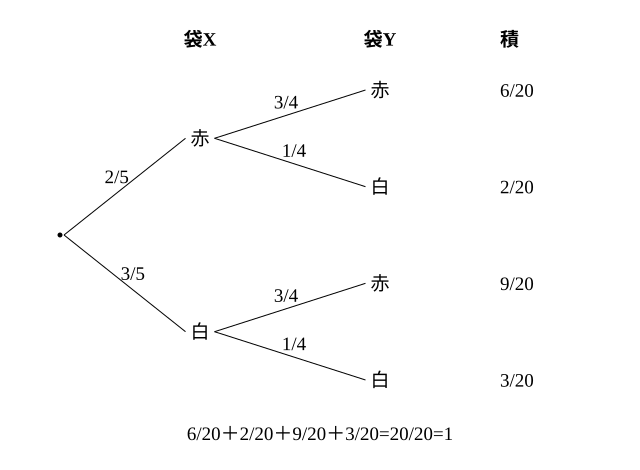

# L11 独立な試行の確率——乗法定理 P(A∩B)=P(A)P(B)

- unit_id: hs-math-a-counting-and-probability
- 位置づけ: 単元第11レッスン（2時間）。L11〜L15 のまとまり「いろいろな確率と期待値」の入口。L08〜L10 では1つの試行の中の事象を数えて確率を求めた。ここからは、2つ以上の試行を続けて行う場面を扱う。結果が互いに影響しない試行（独立な試行）では確率を掛けてよいことを、L03 の積の法則から導き、3つ以上の試行・「少なくとも1つ」（L09 の余事象）・勝率が 1/2 でない試合の場面へ広げる。L12（同じ試行の繰り返し）と L14（影響し合う場合の乗法定理）へ続く。
- distribution_status: published_draft
- license: CC-BY-4.0
- verify_required: 例題数値・記述は監修者検証必須。
- 主概念: ①独立な試行の意味（結果が互いに影響しない）と乗法定理 P(A∩B)=P(A)P(B)・3つ以上の独立な試行 ②独立と排反の違い・「勝率 p の試合」型（勝ち負けを「2通りで 1/2」としない）

---

## 1. 2つの試行を続けて行う——表で数えてみる

L08 で、確率は「同様に確からしい根元事象の個数の比」P(A)=n(A)/n(U) と定めた。L09 でその性質を整え、L10 では順列・組合せを分母・分子に使った。いずれも**1つの試行**の話だった。ここからは、さいころを投げてから硬貨を投げる、袋Xから1個取ってから袋Yから1個取る、というように、**2つの試行を続けて行う**場面を考える。

**例題1** 1個のさいころを投げ、続けて1枚の硬貨を投げる。さいころの目が偶数で、かつ硬貨が表になる確率を求めよ。

数え始める前の問診はこれまでと同じである。区別するか（さいころの目6つと硬貨の裏表2つを全部区別する）、順番があるか（さいころ→硬貨の順に結果を組にする）。全事象は (目, 裏表) の組で、積の法則（L03）から n(U)=6×2=12 通り。この12通りは同様に確からしい。

| 目＼硬貨 | 表 | 裏 |
|---|---|---|
| 1 | (1, 表) | (1, 裏) |
| 2 | (2, 表) | (2, 裏) |
| 3 | (3, 表) | (3, 裏) |
| 4 | (4, 表) | (4, 裏) |
| 5 | (5, 表) | (5, 裏) |
| 6 | (6, 表) | (6, 裏) |

「目が偶数で、かつ表」は (2, 表)、(4, 表)、(6, 表) の3通り。P=3/12=**1/4**。

ここで、さいころだけを見た確率 P(偶数)=3/6=1/2 と、硬貨だけを見た確率 P(表)=1/2 を掛けると (1/2)×(1/2)=1/4——同じ値になる。偶然ではない。分子の3通りは「偶数の目3通り」と「表1通り」の組で 3×1、分母の12通りは「目6通り」と「裏表2通り」の組で 6×2 だから、

(3×1)/(6×2)=(3/6)×(1/2)

と、分子・分母の積の法則が、そのまま確率の積になっている。

## 2. 独立な試行と乗法定理

さいころの目が何であっても、硬貨が表になる確率は 1/2 のままである。逆に、硬貨の結果がさいころの目の出方を変えることもない。このように、2つの試行の結果が互いに影響を及ぼさないとき、この2つの試行は**独立**であるという（**独立な試行**）。この教材では、さいころ・硬貨・別々の袋からの取り出しのように、互いの結果に影響しない試行は独立として扱う（さいころの目を同様に確からしいとみなすのと同じく、問題文に断りがなくても置く仮定である）。

独立な試行 S と T を行い、S では事象 A が起こり、T では事象 B が起こるという事象を A∩B と書く。§1 の計算を一般に書くと、S の全事象が s 通り、T の全事象が t 通りで、どちらも根元事象が同様に確からしいとき、続けて行う試行の全事象は s×t 通り、A∩B の根元事象は n(A)×n(B) 通りだから、

P(A∩B)=n(A)n(B)/(st)=(n(A)/s)×(n(B)/t)=P(A)P(B)

**独立な試行 S、T で、S で A が起こり T で B が起こる確率は、P(A∩B)=P(A)P(B) で求められる**

これを、独立な試行の確率の**乗法定理**という。「かつ」は掛ける——ただし、独立なときに限る（影響し合う場合の掛け方は L14 で扱う）。上の導出は根元事象が同様に確からしい試行についてのものだが、§4 のように勝ち負けの確率が与えられた試行でも、独立なら同じ式で計算する（L14 §1 で「A が起こっても B の確率が変わらない」ことと同じ意味だと確かめ直す）。

**例題2** 袋Xには赤玉2個と白玉3個、袋Yには赤玉3個と白玉1個が入っている。X、Y それぞれの袋から玉を1個ずつ取り出すとき、次の確率を求めよ。
(1) 2個とも赤玉である。
(2) 2個の玉の色が同じである。
(3) 2個の玉の色が異なる。

X から取り出す試行と Y から取り出す試行は、互いの結果に影響しないから独立である。

(1) X で赤 2/5、Y で赤 3/4。乗法定理で (2/5)×(3/4)=6/20=**3/10**。
(2) 「同じ色」は「両方赤」または「両方白」で、この2つは同時には起こらない（排反）。L09 の性質で足す。両方白は (3/5)×(1/4)=3/20。よって 6/20＋3/20=9/20。P=**9/20**。
(3) 「色が異なる」は (2) の余事象だから 1−9/20=**11/20**。

検算（全列挙）: 玉を全部区別すると、全事象は 5×4=20 通り。赤赤 2×3=6、白白 3×1=3、赤白 2×1=2、白赤 3×3=9 で、6＋3＋2＋9=20 ✓。色が異なるのは 2＋9=11 通りで 11/20 ✓。(3) を直接、乗法定理と排反な和で書いても (2/5)(1/4)＋(3/5)(3/4)=2/20＋9/20=11/20 ✓。

樹形図に**枝ごとの確率**を書き込むと、1本の枝の確率は枝に書いた確率の積、いくつかの枝をまとめた事象の確率はそれらの和、という2つの操作が見える。4本の枝の確率を全部足すと 6/20＋2/20＋9/20＋3/20=20/20=1——確率の合計が 1 になることは、枝の書き忘れ・重複の検算になる。

:::guide
**掛ける「かつ」と足す「または」——ただし条件を確かめてから**

例題2(2) は、掛けてから足した。掛けたのは「X で赤、かつ Y で赤」のように別々の試行の結果が両方起こる場面で、足したのは「両方赤、または両方白」のように同時には起こらない事象を合わせる場面である。この2つの操作には、それぞれ使える条件がある。掛けてよいのは試行が**独立**なとき、足してよいのは事象が**排反**なとき（L09 性質③）。「かつ」を見たら反射的に掛けるのではなく、「一方の結果が他方の確率を変えないか」を一度確かめる。袋Xの玉を袋Yに移してから引く、のような場面では独立でなくなり、この掛け算はそのままでは使えない（L14 で扱う）。
:::

## 3. 3つ以上の独立な試行

3つ以上の試行が互いに影響しないときも、確率は同じように掛けられる。

**例題3** 1枚の硬貨、1個のさいころ、赤玉1個と白玉4個が入った袋を用意し、硬貨を投げ、さいころを投げ、袋から玉を1個取り出す。
(1) 硬貨が表、さいころの目が3の倍数、玉が赤である確率を求めよ。
(2) 硬貨が表、さいころの目が3の倍数、玉が赤、の3つのうち少なくとも1つが起こる確率を求めよ。

(1) 3つの試行は独立で、それぞれ 1/2、2/6=1/3、1/5。乗法定理で (1/2)×(1/3)×(1/5)=**1/30**。

(2) 「少なくとも1つ」は余事象の合図（L09 §4）。余事象は「3つのどれも起こらない」で、硬貨が裏 1/2、目が3の倍数でない 4/6=2/3、玉が白 4/5 だから、(1/2)×(2/3)×(4/5)=8/30=4/15。よって 1−4/15=**11/15**。

検算（全列挙）: 全事象は 2×6×5=60 通り。どれも起こらないのは 1×4×4=16 通りで 16/60=4/15 ✓。少なくとも1つは 60−16=44 通りで 44/60=11/15 ✓。

:::guide
**独立と排反は、どこが違うのか**

似た響きの2語だが、指しているものが違う。**排反**は、**1つの試行の中の2つの事象**が同時には起こらないこと（さいころ1回で「1の目」と「2の目」）。**独立**は、**別々の試行**の結果が互いの確率を変えないこと（さいころの目と硬貨の裏表）。排反なら和の式 P(A∪B)=P(A)＋P(B)、独立なら積の式 P(A∩B)=P(A)P(B) が使える。混同を招きうる言い方の一例が、どちらも「関係がない」とまとめてしまうことである。「同時に起こらない」（排反）と「影響しない」（独立）は別のことで、たとえば排反な2つの事象（どちらも起こりうるもの）は、一方が起こると他方は起こらない——つまり強く影響し合っている。問診の言葉を分けておくと迷わない。排反かどうかは「同じ試行の中で、同時に起こる結果があるか」、独立かどうかは「一方の結果が他方の確率を変えるか」（別々の試行であること自体は決め手ではない。同じ試行の中の2つの事象でも、一方が分かって他方の確率が変わらない例を L13 例題2 で見る）。
:::

## 4. 勝率が 1/2 でない試合——「2通りだから 1/2」としない

**例題4** A と B が試合をする。1試合で A が勝つ確率は 2/3 で、引き分けはなく、各試合の結果は互いに影響しないものとする。2試合行うとき、次の確率を求めよ。
(1) A が2連勝する。
(2) A と B が1勝1敗になる。
(3) B が2連勝する。

1試合の結果は「A の勝ち」「B の勝ち」の2通りだが、この2通りは**同様に確からしくない**（2/3 と 1/3）。だから L08 の定義 n(A)/n(U) で「2試合の結果は4通りだから、1勝1敗は 2/4」とはできない。代わりに、各試合を独立な試行とみて乗法定理を使う。

(1) A 勝ち→A 勝ちで (2/3)×(2/3)=**4/9**。
(2) 「A 勝ち→B 勝ち」と「B 勝ち→A 勝ち」の2本の枝があり、どちらも (2/3)×(1/3)=2/9。排反だから足して 2/9＋2/9=**4/9**。
(3) (1/3)×(1/3)=**1/9**。

検算: (1)＋(2)＋(3)=4/9＋4/9＋1/9=9/9=1 ✓。3つの結果で全事象を尽くしている。

(2) で、1勝1敗を「1本の枝」と見て 2/9 としないこと。「A が先に勝つ」と「B が先に勝つ」は別の根元事象で、樹形図をかけば枝が2本あることが見える。順番が結果に効くかどうかを問診で確かめる習慣が、ここでも効いている。

:::guide
**勝ちと負けの2通りに見えても、1/2 とは限らない**

さいころ1個の6つの目や硬貨の裏表は、L08 で「同様に確からしい」とみなしてよい根元事象だった。試合の勝ち負けや、雨が降る・降らないは、結果が2通りに見えても、同様に確からしいとは限らない。問題文に「A が勝つ確率は 2/3」のように確率が与えられているときは、その値がその試行の「1通りの重さ」であり、勝ち負けの「通り数」を数えて分母にすることはできない。この場面で使えるのが、独立な試行の乗法定理である——各試合の確率を枝に書き、枝の積と和で全体を組み立てる。L12 では、同じ試行を何回も繰り返すときにこの組み立てを式にまとめる。
:::

## 5. 練習

**問1** 1個のさいころを投げ、続けて1枚の硬貨を投げる。
(1) さいころの目が5以上で、かつ硬貨が表になる確率を求めよ。
(2) さいころの目が5以上になるか、または硬貨が表になる（少なくとも一方が起こる）確率を求めよ。

**問2** 袋Pには赤玉3個と白玉2個、袋Qには赤玉1個と白玉3個が入っている。P、Q それぞれの袋から玉を1個ずつ取り出すとき、次の確率を求めよ。
(1) 2個とも白玉である。
(2) 少なくとも1個は赤玉である。
(3) 赤玉がちょうど1個である。

**問3** X、Y、Z の3人が、それぞれ1回ずつ的を射る。的に当たる確率は X が 1/2、Y が 2/3、Z が 3/4 で、3人の結果は互いに影響しないものとする。
(1) 3人とも当たる確率を求めよ。
(2) 3人とも当たらない確率を求めよ。
(3) 少なくとも1人が当たる確率を求めよ。
(4) ちょうど1人だけが当たる確率を求めよ。

**問4** A と B が試合をする。1試合で A が勝つ確率は 3/5 で、引き分けはなく、各試合の結果は互いに影響しないものとする。
(1) 2試合行うとき、A が2連勝する確率を求めよ。
(2) 2試合行うとき、1勝1敗になる確率を求めよ。
(3) 3試合行うとき、B が少なくとも1勝する確率を求めよ。

**問5** 装置1は部品 a を1個使い、a が壊れていなければ動く。装置2は部品 b と部品 c を1個ずつ使い、b と c の両方が壊れていないときだけ動く。a が壊れている確率は 1/10、b が壊れている確率は 1/20、c が壊れている確率は 1/20 で、部品が壊れているかどうかは互いに影響しないものとする。装置1と装置2のどちらが動く確率が高いか。それぞれの確率を求め、値を根拠に一文で答えよ。

---

:::stretch
**S1** A と B が試合をする。1試合で A が勝つ確率を p（0<p<1）とし、引き分けはなく、各試合の結果は互いに影響しないものとする。2試合行う。
(1) 1勝1敗になる確率を p の式で表せ。
(2) (1) の確率が最大になる p の値と、そのときの確率を求めよ（式を展開して (p−a)² の形を作り、平方が 0 以上であることを使う。数学Ⅰ「二次関数」を学んでいれば、その最大値の考え方と同じ）。
(3) 「1勝1敗になる確率」と「A が2連勝する確率」が等しくなる p の値を求め、その値が §4 の例題4の結果と合っていることを確かめよ。
:::

対応解答: answer_key_L11-15.md

<!-- gen_nav:nav:start（自動生成・手編集しない） -->

---

[← 前のレッスン](lesson_10.md)｜[単元の目次](README.md)｜[解答](answer_key_L11-15.md)｜[次のレッスン →](lesson_12.md)

<!-- gen_nav:nav:end -->
