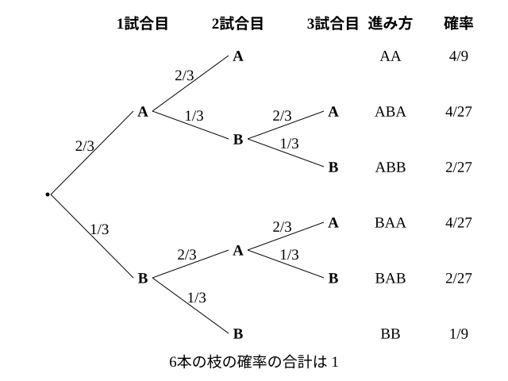

# L12 反復試行の確率——同じ試行を繰り返す

- unit_id: hs-math-a-counting-and-probability
- 位置づけ: 単元第12レッスン（2時間）。L11 の独立な試行のうち、**同じ試行を同じ条件で n 回繰り返す**場面を扱う。「n 回のうちちょうど r 回起こる」確率が、どの回に起こるかの組合せ（L06 の nCr）と1本の枝の確率（L11 の積）の掛け算で書けることを導く。後半では、先に2勝した側の優勝が決まる試合のように**途中で決着する**場面を樹形図で数え、枝の長さが違うときに「何を1通りと数えるか」（L01・L08）がどう変わるかを確かめる。
- distribution_status: published_draft
- license: CC-BY-4.0
- verify_required: 例題数値・記述は監修者検証必須。
- 主概念: ①n 回中ちょうど r 回起こる確率 nCr pʳ(1−p)ⁿ⁻ʳ（どの回に起こるかの組合せ×1本の枝の確率） ②途中で決着する試行（枝の長さが違う樹形図に、枝ごとの確率を書く）

---

## 1. 同じ試行を繰り返す——L11 例題4の続き

L11 例題4で、A が勝つ確率 2/3 の試合を2回行い、1勝1敗になる確率を求めた。「A 勝ち→B 勝ち」と「B 勝ち→A 勝ち」の2本の枝がそれぞれ (2/3)×(1/3) で、足して 4/9 だった。ここで枝の本数の 2 は「2試合のうち、A がどの1試合に勝つか」の選び方 2C1 であり、1本の枝の確率はどの枝も同じ (2/3)¹(1/3)¹ だった。この見方を、回数を増やして一般化するのがこのレッスンである。

さいころを4回投げる、硬貨を5回投げる、同じ試合を3回行う——同じ条件の試行を独立に繰り返すことは、教科書では反復試行と呼ばれる（学習指導要領の指定用語ではなく、教科書で使われる名前である）。各回の結果は互いに影響しないから、1本の枝の確率は L11 の乗法定理で掛けて求められる。

:::guide
**この単元での反復試行の扱い**

反復試行の確率は、L11 の独立な試行の確率の延長として扱う。「n 回のうち r 回起こる確率」を、組合せと積で求めるところまでがこの単元の範囲である。同じ試行を繰り返したときに起こる回数の全体を1つの分布として整理すること（二項分布としての整理）は、数学B「統計的な推測」で学ぶ。ここでは、1本1本の枝の確率を自分で書き、それを足し合わせて答えにたどりつく感覚を確かにしておく。
:::

## 2. n 回中ちょうど r 回——組合せと積で書く

**例題1** 1個のさいころを4回投げるとき、1の目がちょうど2回出る確率を求めよ。

1回の試行で「1の目が出る」確率は 1/6、「出ない」確率は 5/6。4回のうち1の目が出る回を○、出ない回を×で表すと、たとえば ○○××（1回目と2回目に出る）という1本の枝の確率は、独立な試行の乗法定理で

(1/6)×(1/6)×(5/6)×(5/6)=(1/6)²(5/6)²=25/1296

である。○が2個、×が2個の並びは、4回のうち○になる2回を選ぶ組合せの数だけあるから 4C2=6 本（○○××、○×○×、○××○、×○○×、×○×○、××○○）。**どの枝の確率も同じ** (1/6)²(5/6)² で、6本の枝は互いに排反だから、足して

6×(1/6)²(5/6)²=6×25/1296=150/1296=**25/216**

「どの2回に出るか」を数える部分が組合せ、「その1本の枝が起こる」確率が積——この2段に分けるのが要点である。

一般に、1回の試行で事象 A が起こる確率を p とする。この試行を n 回繰り返すとき、A が**ちょうど r 回**起こる確率は

**nCr pʳ(1−p)ⁿ⁻ʳ**

（nCr は A が起こる r 回の選び方の数、pʳ は A が起こる r 回の確率の積、(1−p)ⁿ⁻ʳ は A が起こらない n−r 回の確率の積）

**例題2** 1枚の硬貨を5回投げるとき、表がちょうど3回出る確率を求めよ。

p=1/2、n=5、r=3 で、5C3 (1/2)³(1/2)²=10×(1/2)⁵=10/32=**5/16**。

検算（全列挙との照合）: 硬貨5回の結果は全部で 2⁵=32 通りで、同様に確からしい（L08）。表が3回の並びは 5C3=10 通りだから 10/32 ✓。硬貨のように p=1/2 のときは、L08 の定義でも同じ答えが出る——公式は、「起こる」「起こらない」の2通りが同様に確からしくない場合（p≠1/2）にも使える一般化である。

**例題3** 1個のさいころを4回投げるとき、次の確率を求めよ。
(1) 3の倍数の目がちょうど1回出る。
(2) 3の倍数の目が少なくとも1回出る。
(3) 3の倍数の目が2回以上出る。

1回の試行で3の倍数（3、6）が出る確率は p=2/6=1/3、出ない確率は 2/3。

(1) 4C1 (1/3)¹(2/3)³=4×(1/3)×(8/27)=**32/81**。
(2) 余事象「1回も出ない」は r=0 で 4C0 (2/3)⁴=16/81。よって 1−16/81=**65/81**。
(3) 「2回以上」は「0回」「1回」の余事象。1−(16/81＋32/81)=1−48/81=33/81=**11/27**。

検算: r=0、1、2、3、4 の確率を全部書くと、16/81、32/81、4C2 (1/3)²(2/3)²=6×4/81=24/81、4C3 (1/3)³(2/3)=4×2/81=8/81、(1/3)⁴=1/81。合計 16＋32＋24＋8＋1=81 で 81/81=1 ✓。(3) は 24/81＋8/81＋1/81=33/81 ✓。

:::guide
**少なくとも1回・2回以上は、r の値を並べてから決める**

反復試行の問題では、「ちょうど r 回」の確率を r=0 から n まで並べると、全体が見える。合計は必ず 1 になり（すべての結果を尽くしている）、「少なくとも1回」は r=0 の余事象、「2回以上」は r=0、1 の余事象、「3回以下」は r=0〜3 の和、と読み替えられる。どの向きで数えるのが短いかは問題ごとに違うが、迷ったら「r の表」を書く——例題3の検算で書いた5つの値がそれである。「少なくとも1回」を「1回」（r=1 だけ）と読んでしまう誤りも、表を書けば「2回・3回・4回も含まれるはず」と気づける。
:::

## 3. 途中で決着する試行——枝の長さが違う樹形図

同じ試合を繰り返しても、「先に2勝したほうが優勝」のように、途中で終わる場合がある。このときは、回数が固定された公式をそのまま当てられない。樹形図に戻って、枝ごとに確率を書く。

**例題4** A と B が試合を繰り返し、先に2勝したほうが優勝とする。1試合で A が勝つ確率は 2/3 で、引き分けはなく、各試合の結果は互いに影響しないものとする。
(1) 優勝が決まるまでの試合の進み方を樹形図に表し、それぞれの確率を求めよ。
(2) A が3試合目で優勝する確率を求めよ。
(3) A が優勝する確率を求めよ。

(1) 1試合目・2試合目の勝者を順に書く。2試合とも同じ側が勝てば2試合で決着し、1勝1敗なら3試合目で決まる。

| 進み方 | 決着 | 確率 |
|---|---|---|
| A 勝ち→A 勝ち | 2試合で A 優勝 | (2/3)(2/3)=4/9 |
| A 勝ち→B 勝ち→A 勝ち | 3試合で A 優勝 | (2/3)(1/3)(2/3)=4/27 |
| A 勝ち→B 勝ち→B 勝ち | 3試合で B 優勝 | (2/3)(1/3)(1/3)=2/27 |
| B 勝ち→A 勝ち→A 勝ち | 3試合で A 優勝 | (1/3)(2/3)(2/3)=4/27 |
| B 勝ち→A 勝ち→B 勝ち | 3試合で B 優勝 | (1/3)(2/3)(1/3)=2/27 |
| B 勝ち→B 勝ち | 2試合で B 優勝 | (1/3)(1/3)=1/9 |

検算: 6本の枝の確率の合計は 12/27＋4/27＋2/27＋4/27＋2/27＋3/27=27/27=1 ✓。

(2) 3試合目で A が優勝するのは「A→B→A」と「B→A→A」の2本で、4/27＋4/27=**8/27**。
(3) A が優勝するのは「A→A」「A→B→A」「B→A→A」の3本で、4/9＋4/27＋4/27=12/27＋8/27=**20/27**。

B が優勝する確率は 2/27＋2/27＋1/9=7/27 で、20/27＋7/27=1 ✓。

:::guide
**枝の数は6本——でも「A 優勝は 3/6」ではない**

例題4の樹形図には枝が6本あり、そのうち A が優勝する枝は3本ある。だからといって A が優勝する確率を 3/6 とはできない。理由は2つ重なっている。第一に、各試合の勝ち負けが同様に確からしくない（2/3 と 1/3）ことは L11 §4 で見た。第二に、**枝の長さが違う**。2試合で終わる枝と3試合まで続く枝は、たとえ勝率が 1/2 でも同じ重さにならない（1/4 と 1/8）。L08 の定義 n(A)/n(U) が使えるのは、分母の1通り1通りが同じ起こりやすさのときだけだった。枝の長さが違う樹形図では、枝を数えるのではなく、**枝ごとに確率を書いて足す**。自問の形にしておくと、「この樹形図の枝は、末端まで全部同じ重さか？」——「いいえ」なら、枝の本数で割ってはいけない。枝の長さが違うときは重さも違うことが多いので、長さの違いは「重さを確かめよ」の合図である。
:::

**別の数え方**（等長にそろえる）: 2試合で決着した場合にも「架空の3試合目」を付け足して、すべての枝を3試合の長さにそろえることもできる。すると「A が優勝する」は「3試合のうち A が2勝以上する」と同じになり（A が先に2勝した枝は、架空の3試合目の結果がどちらでも「2勝以上」のままなので、付け足しても確率は変わらない）、§2 の公式で 3C2 (2/3)²(1/3)＋3C3 (2/3)³=12/27＋8/27=20/27 ✓ と、例題4(3) の答えが再現される。途中で止まる樹形図と、等長にそろえた反復試行の式が同じ値を出すことを確かめておくと、どちらの道でも検算ができる。

## 4. 手順の型

1. 1回の試行で「起こる」確率 p を確かめる（問題文に与えられているか、L08 の定義で求める）。同様に確からしくない2通り（勝ち・負け）を「2通りで 1/2」としない。
2. 回数が固定されているか（n 回投げる）、途中で止まるか（先に2勝）を読み分ける。
3. 回数が固定され、各回の試行が独立で p が毎回同じなら nCr pʳ(1−p)ⁿ⁻ʳ（戻さずに引くと p が回ごとに変わるので使えない）。「少なくとも」「〜回以上」は r の表を書いて余事象か和を選ぶ。
4. 途中で止まるなら、樹形図に枝ごとの確率を書き、該当する枝を足す。等長にそろえて公式で検算してもよい。
5. r の表、または全部の枝の確率の合計が 1 になることを確かめる。

## 5. 練習

**問1** 1枚の硬貨を6回投げるとき、次の確率を求めよ。
(1) 表がちょうど2回出る。
(2) 表がちょうど4回出る。
(3) 表が5回以上出る。

**問2** 1個のさいころを4回投げるとき、次の確率を求めよ。
(1) 1の目がちょうど1回出る。
(2) 1の目が1回も出ない。
(3) 1の目が少なくとも1回出る。

**問3** 的に当たる確率が 1/4 の人が、的を5回射る。各回の結果は互いに影響しないものとする。
(1) ちょうど2回当たる確率を求めよ。
(2) 少なくとも1回当たる確率を求めよ。
(3) 4回以上当たる確率を求めよ。

**問4** A と B が試合を繰り返し、先に2勝したほうが優勝とする。1試合で A が勝つ確率は 3/5 で、引き分けはなく、各試合の結果は互いに影響しないものとする。
(1) 2試合で優勝が決まる確率を求めよ。
(2) A が3試合目で優勝する確率を求めよ。
(3) A が優勝する確率を求めよ。
(4) B が優勝する確率を求め、(3) との合計が 1 になることを確かめよ。

**問5** 2つのゲームがある。ゲーム1は、1枚の硬貨を3回投げて表がちょうど2回出れば勝ち。ゲーム2は、1個のさいころを2回投げて6の目が少なくとも1回出れば勝ち。どちらのゲームのほうが勝ちやすいか。それぞれの確率を求め、値を根拠に一文で答えよ。

---

:::stretch
**S1** A と B が試合を繰り返し、先に2勝したほうが優勝とする。1試合で A が勝つ確率を p（0<p<1）とし、引き分けはなく、各試合の結果は互いに影響しないものとする。
(1) A が優勝する確率を p の式で表せ。
(2) p=1/2 のとき (1) の値を求め、その値が 1/2 になる理由を一文で説明せよ。
(3) p=2/3 のとき (1) の値を求め、§3 の例題4(3) と一致することを確かめよ。
(4) p=2/3 のとき、「1試合だけで勝敗を決める」場合と「先に2勝で優勝を決める」場合とでは、A にとってどちらが有利か。2つの確率を比べ、一文で答えよ。
:::

対応解答: answer_key_L11-15.md

<!-- gen_nav:nav:start（自動生成・手編集しない） -->

---

[← 前のレッスン](lesson_11.md)｜[単元の目次](README.md)｜[解答](answer_key_L11-15.md)｜[次のレッスン →](lesson_13.md)

<!-- gen_nav:nav:end -->
