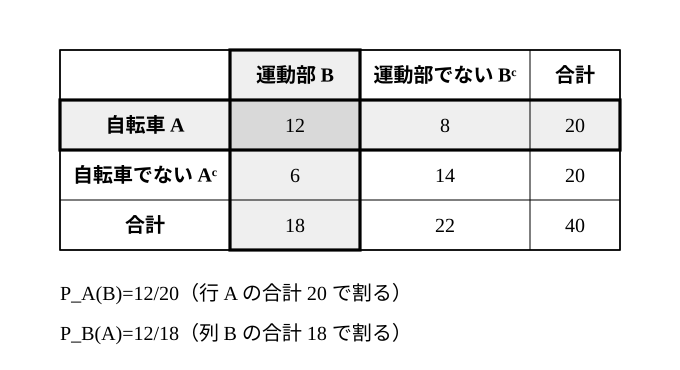
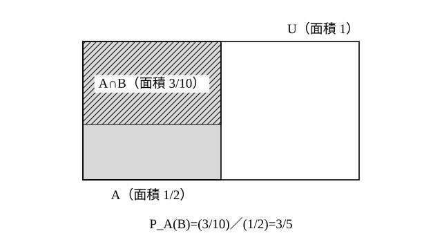

# L13 条件付き確率——情報で確率が変わる

- unit_id: hs-math-a-counting-and-probability
- 位置づけ: 単元第13レッスン（2時間）。「ある事象が起こったと分かったとき」の確率を扱う。情報が増えると、数える範囲（分母＝全事象）が縮む——L01・L08 で繰り返してきた「何を1通りと数えるか」の問いが、ここでは「どの範囲を全体とみるか」の形で現れる。定義 P_A(B)=n(A∩B)/n(A)=P(A∩B)/P(A) を数え上げに帰着させ、2×2の表と面積図で P_A(B) と P_B(A) が別の値になることを確かめる。L14（乗法定理・2段の樹形図）の土台。
- distribution_status: published_draft
- license: CC-BY-4.0
- verify_required: 例題数値・記述は監修者検証必須。
- 主概念: ①後で得た情報が前の事象の確率を変える体験→定義 P_A(B)=P(A∩B)/P(A)=n(A∩B)/n(A)（数え上げに帰着） ②2×2の表で P_A(B) と P_B(A) を同じ表から求めて違いを見る・面積図

---

## 1. 後で分かったことが、前の確率を変える

**例題1** 箱の中に赤玉2個と青玉3個が入っている。箱から玉を1個取り出し、色を見ないで伏せておく。続けてもう1個取り出したところ、青玉だった。このとき、伏せてある1個目の玉が赤玉である確率を求めよ。

「1個目はもう取り出してしまったのだから、2個目の色が何であっても、1個目が赤である確率は 2/5 のままだ」と感じるかもしれない。確かめよう。

5個の玉を全部区別し、(1個目, 2個目) の順に取り出す全事象を数えると、5×4=20 通りで、同様に確からしい（L10 の順列による数え方）。このうち「2個目が青」であるものは、1個目が赤で2個目が青 2×3=6 通り、1個目が青で2個目が青 3×2=6 通りの、合わせて12通り。

「2個目が青だった」と分かった今、起こりえたのはこの12通りだけである。その12通りの中で「1個目が赤」は6通りだから、求める確率は 6/12=**1/2**。

何も分からないときの P(1個目が赤)=2/5 に対し、「2個目が青」という情報を得た後は 1/2 に変わった。情報が増えたことで、**数える範囲（分母）が 20 通りから 12 通りに縮み**、その中での割合が変わったのである。1個目の玉そのものは変わらないが、私たちがそれについて知っていることが変わった——確率は、事象そのものに貼りついた数ではなく、手元の情報に対して決まる数である。

:::guide
**もう起きたことの確率は変わらない、という感覚との折り合い**

例題1で「2個目の色が1個目に影響するはずがない」と感じるのは自然である。物理的にはそのとおりで、2個目を引いたことで1個目の玉の色が変化したわけではない。変わったのは、**私たちが1個目について持っている情報**だ。青玉が1個減ったと分かった以上、「伏せてある1個目」が赤である可能性は、最初の 2/5 より高く見積もるのが筋である。逆向きに考えると分かりやすい。もし2個目が赤だったなら、1個目が赤である確率は 2/5 より低くなる（赤はもう1個しか残っていない）。同じ玉について、後から分かったことで確率の値が変わる——この感覚が、条件付き確率の入口である。
:::

## 2. 条件付き確率の定義——分母を「A の中」にする

例題1の考え方を言葉にする。全事象 U の中で、事象 A が起こったと分かったとき、事象 B が起こる確率は、「A の根元事象の中で B も起こっているもの」の割合である。

**事象 A が起こったときの事象 B の条件付き確率**を P_A(B) と書き、根元事象が同様に確からしいとき

**P_A(B)=n(A∩B)/n(A)**

と定める（ただし A は起こりうる事象、つまり P(A)≠0 とする。A を P の右下に小さく書く（これを下付きという）。この教材では P_A(B) のように、_ の右に下付きの文字を書いて表す。読み方は「A が起こったときの B の条件付き確率」）。分子・分母を n(U) で割れば

**P_A(B)=P(A∩B)/P(A)**

とも書ける（根元事象が同様に確からしくない場面——L11 §4 の試合や L14 の2段の試行——では、こちらの形を使う。P(A)≠0 の条件は同じ）。分母は P(U)=1 ではなく P(A)——「A の中」を新しい全体とみて、その中での A∩B の割合を求めている。根元事象が同様に確からしいとき、条件付き確率は**場合の数の数え上げに帰着する**。例題1では A＝「2個目が青」、B＝「1個目が赤」で、P_A(B)=n(A∩B)/n(A)=6/12=1/2 と、そのまま定義の形になっている。

**例題2** 1個のさいころを投げる。A を「偶数の目が出る」、B を「3以上の目が出る」とする。
(1) P_A(B) を求めよ。
(2) P_B(A) を求めよ。

A={2, 4, 6}、B={3, 4, 5, 6}、A∩B={4, 6}。

(1) 偶数と分かったとき、3以上である確率。P_A(B)=n(A∩B)/n(A)=**2/3**。
(2) 3以上と分かったとき、偶数である確率。P_B(A)=n(A∩B)/n(B)=2/4=**1/2**。

分子はどちらも n(A∩B)=2 で同じだが、**分母が違う**（n(A)=3 と n(B)=4）。どちらの事象が「分かった」側かで、数える範囲が変わる。(1) は 2/3、(2) は 1/2 で、別の値である。

検算: 条件なしの P(B)=4/6=2/3 と (1) の P_A(B)=2/3 はたまたま等しい。このとき、逆向きの (2) の P_B(A)=1/2 も条件なしの P(A)=1/2 と等しくなる（どちらの等式も P(A∩B)=P(A)P(B)、つまり 1/3=(1/2)×(2/3) と同じことを言っているので、一方が成り立てば他方も成り立つ）。情報を得ても確率が変わらない場合があること（L14 で「独立」とつながる）を、ここで一度見ておく。例題1では変わり、例題2では変わらなかった——変わるかどうかは、事象の組ごとに確かめる。

:::guide
**記号 P_A(B) の読み方と、もう1つの書き方**

P_A(B) は「A が起こったときの B の条件付き確率」で、下付きの A が「分かっている側」（分母になる側）、括弧の中の B が「確率を求めたい側」（分子に入る側）である。P_B(A) は逆で、B が分かっている側。同じ確率を、縦棒を使って P(B|A) と書く流儀もある（縦棒の右が分かっている側。読み方は同じ）。どちらの書き方でも、**分かっている側が分母**、という対応を先に確かめる。記号を見て「どちらが分母か」を即答できれば、次の節の表で迷わない。
:::

## 3. 2×2の表——P_A(B) と P_B(A) を同じ表から読む

条件付き確率の問題は、2つの事象で全体を4つに分けた表（2×2の分割表）に整理すると見通しがよい。

**例題3** ある高校の1年生 40人について、通学に自転車を使うかどうか（使う＝A）と、運動部に入っているかどうか（入っている＝B）を調べたところ、次のようになった。

| | 運動部 B | 運動部でない Bᶜ | 合計 |
|---|---|---|---|
| 自転車 A | 12 | 8 | 20 |
| 自転車でない Aᶜ | 6 | 14 | 20 |
| 合計 | 18 | 22 | 40 |

この40人から1人を選ぶ。
(1) 選ばれた生徒が自転車で通学していると分かったとき、その生徒が運動部である確率 P_A(B) を求めよ。
(2) 選ばれた生徒が運動部だと分かったとき、その生徒が自転車で通学している確率 P_B(A) を求めよ。

(1) 自転車の行（20人）の中で、運動部は12人。P_A(B)=12/20=**3/5**。
(2) 運動部の列（18人）の中で、自転車は12人。P_B(A)=12/18=**2/3**。

分子は同じ「自転車で、かつ運動部」の12人だが、(1) は**行の合計**で割り、(2) は**列の合計**で割る。「自転車通学の生徒のうち運動部の割合」と「運動部の生徒のうち自転車通学の割合」は、日常の言葉でも別のことを言っている——数でも別の値になる。

検算: 定義のもう1つの形で確かめる。P(A∩B)=12/40=3/10、P(A)=20/40=1/2、P(B)=18/40=9/20。P_A(B)=(3/10)/(1/2)=3/5 ✓、P_B(A)=(3/10)/(9/20)=(3/10)×(20/9)=2/3 ✓。

:::guide
**A のとき B と、B のとき A——取り違えないために**

条件付き確率で気をつけたい誤りの1つが、P_A(B) を求めるべきところで P_B(A) を出してしまう取り違えである。文章題では「〜の人のうち」「〜だと分かったとき」「〜である場合に」が分母（分かっている側）の合図になる。表を使うなら、手順を固定する。①分かっている側の事象を行か列で見つけ、その**合計**を分母に書く。②その行（列）の中で、求めたい側の事象に当たるますを分子に書く。分子はどちらの向きでも同じます（A∩B）なので、間違うのは分母だけ——だから「分母は何の合計か」を口に出して確かめる。もう1つ、P_A(B) と P(A∩B) の混同も起こる。P(A∩B) は全体40人の中での割合（12/40）、P_A(B) は A の20人の中での割合（12/20）で、分母が違う。
:::

## 4. 面積図——確率を長方形の面積比で見る

条件付き確率を図で見る方法として、面積図がある。全事象 U を面積 1 の長方形で表し、事象 A をその中の一部（面積 P(A)）、A∩B を A の中のさらに一部（面積 P(A∩B)）としてかく。

このとき P_A(B)=P(A∩B)/P(A) は、**A の長方形の面積を 1 とみたときの、A∩B の部分の面積**である。例題3の値なら、A の面積 1/2 の中に A∩B の面積 3/10 が入っていて、その比 (3/10)/(1/2)=3/5 が P_A(B) になる。P_B(A) は同じ A∩B の部分を、B の部分（面積 9/20。図にはかき入れていない）と比べた値 2/3 で、比べる相手が違う。分母が「全体」から「分かった側の事象」に置き換わることが、図では「基準にする長方形が変わる」ことに見える。

## 5. 練習

**問1** 1個のさいころを投げる。A を「奇数の目が出る」、B を「4以下の目が出る」とする。
(1) P_A(B) を求めよ。
(2) P_B(A) を求めよ。
(3) (1) と (2) の分子・分母がそれぞれ何を表しているかを、一文ずつで説明せよ。

**問2** ある製品 50個を検査した。50個のうち工場Xで作られたもの（A）が30個、工場Yで作られたもの（Aᶜ）が20個で、不良品（B）は工場X製のうち6個、工場Y製のうち2個であった。
(1) 2×2の表（行を A・Aᶜ、列を B・Bᶜ、合計つき）を自分で作れ。
(2) 50個から1個を選ぶ。それが工場X製と分かったとき、不良品である確率 P_A(B) を求めよ。
(3) 選んだ1個が不良品と分かったとき、それが工場X製である確率 P_B(A) を求めよ。
(4) (2) と (3) の値が表していることの違いを、それぞれ一文で説明せよ。

**問3** 8本のくじの中に当たりが3本入っている。X、Y の2人がこの順に1本ずつ引く（引いたくじは戻さない）。Y のくじが当たりだったとき、X のくじも当たりであった確率を求めよ。

**問4** 3枚の硬貨を同時に投げる（3枚を1枚目・2枚目・3枚目と区別しておく）。
(1) 少なくとも1枚は表だったと分かったとき、3枚とも表である確率を求めよ。
(2) 1枚目が表だったと分かったとき、3枚とも表である確率を求めよ。
(3) (1) と (2) の値が異なる理由を、分母（数える範囲）の違いに着目して一文で説明せよ。

**問5** 大小2個のさいころを同時に投げる。次の2つの条件付き確率を求め、どちらが大きいかを値を根拠に一文で答えよ。
(1) 目の和が8以上だったと分かったとき、少なくとも一方の目が6である確率。
(2) 大の目が6だったと分かったとき、目の和が8以上である確率。

---

:::stretch
**S1** 3枚の硬貨を同時に投げる（3枚を1枚目・2枚目・3枚目と区別しておく）。A を「1枚目が表」、B を「表がちょうど2枚」、C を「2枚目と3枚目が同じ面」とする。
(1) P(B) と P_A(B) を求め、A の情報によって B の確率が変わったかどうかを答えよ。
(2) P_B(A) を求めよ。
(3) P(C) と P_A(C) を求め、A の情報によって C の確率が変わったかどうかを答えよ。
(4) (1) と (3) の違いから、「情報を得ると確率は必ず変わる」と言えるかどうかを一文で述べよ。
:::

対応解答: answer_key_L11-15.md

<!-- gen_nav:nav:start（自動生成・手編集しない） -->

---

[← 前のレッスン](lesson_12.md)｜[単元の目次](README.md)｜[解答](answer_key_L11-15.md)｜[次のレッスン →](lesson_14.md)

<!-- gen_nav:nav:end -->
