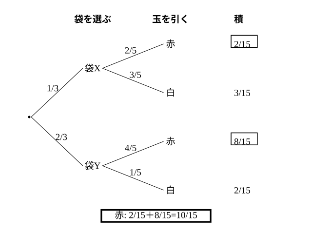

# L14 確率の乗法定理——続けて引く・2段の樹形図

- unit_id: hs-math-a-counting-and-probability
- 位置づけ: 単元第14レッスン（2時間）。L13 の定義 P_A(B)=P(A∩B)/P(A) の分母を払った形 P(A∩B)=P(A)P_A(B) を、「戻さずに続けて引く」くじ・玉の場面で使えるようにする回。中2で学んだ「くじ引きは順番に関係なく公平」を、この式で言い直す。後半では「袋を選んでから玉を引く」ような2段の試行を樹形図にかき、枝の積を枝の和で束ねる。試行が独立なときは P_A(B)=P(B) となって L11 の式に戻ることを確かめ、L11〜L14 の掛け算を1本につなぐ。
- distribution_status: published_draft
- license: CC-BY-4.0
- verify_required: 例題数値・記述は監修者検証必須。
- 主概念: ①乗法定理 P(A∩B)=P(A)P_A(B)（戻さずに続けて引くくじ・玉） ②2段の樹形図（袋を選んで玉を引く）で枝の積→枝の和・独立なときは L11 の式に戻る

---

## 1. 続けて引く——中2の「くじ引きの公平」を用語で言い直す

中2では、くじを2人が順に引くとき、先に引いても後に引いても当たる確率が同じであることを、樹形図や表で全部数えて確かめた。ここでは同じことを、L13 の条件付き確率を使って言い直す。

**例題1** 5本のくじの中に当たりが2本入っている。X、Y の2人がこの順に1本ずつ引く（引いたくじは戻さない）。
(1) X も Y も当たる確率を求めよ。
(2) Y が当たる確率を求めよ。

(1) X が当たる事象を A、Y が当たる事象を B とする。P(A)=2/5。X が当たった後、残りは4本で当たりは1本だから、A が起こったときの B の条件付き確率は P_A(B)=1/4。L13 の定義 P_A(B)=P(A∩B)/P(A) の分母を払うと P(A∩B)=P(A)P_A(B) だから、

P(A∩B)=(2/5)×(1/4)=2/20=**1/10**

検算（全列挙）: くじを全部区別し、(X のくじ, Y のくじ) の順列で数えると全事象は 5×4=20 通り。両方当たりは 2×1=2 通りで 2/20=1/10 ✓。

(2) Y が当たるのは「X 当たり→Y 当たり」または「X はずれ→Y 当たり」。X がはずれたとき（確率 3/5）、残り4本に当たりは2本だから、Aᶜ が起こったときの B の条件付き確率は P_Aᶜ(B)=2/4。2本の枝は排反だから足して、

P(B)=(2/5)×(1/4)＋(3/5)×(2/4)=2/20＋6/20=8/20=**2/5**

X が当たる確率 2/5 と等しい。先に引いても後に引いても同じ——中2で数えて確かめたことが、条件付き確率の式で再現された。

一般に、P(A)≠0 である2つの事象 A、B について

**P(A∩B)=P(A)P_A(B)**

が成り立つ。これを確率の**乗法定理**という。「A が起こり、続いて B が起こる」確率は、A の確率に「A が起こったときの B の確率」を掛ける。L11 の独立な試行の式 P(A∩B)=P(A)P(B) は、P_A(B)=P(B)——A が起こっても B の確率が変わらない——という特別な場合にあたる。

:::guide
**戻すかどうかの問診が、掛ける数を決める**

例題1で Y の当たりに 1/4 を掛けたのは、X が当たりを1本持って行ったからだ。もし X が引いたくじを戻してから Y が引くなら、Y の状況は最初と同じ5本中2本で、掛けるのは 2/5 になる（試行が独立で、L11 の式）。「区別する？ 順番ある？」に続く3つ目の問診「戻す？」は、まさにここで効く。戻す（そして2回目も最初と同じ条件で偏りなく引く）なら P_A(B)=P(B)、戻さないなら P_A(B) を「A が起こった後の状況」で新しく求める。式の形はどちらも「P(A)×（次の確率）」で同じ——違うのは「次の確率」を最初の状況で読むか、A が起こった後の状況で読むかだけである。
:::

**例題2** 袋の中に赤玉4個と白玉2個が入っている。この袋から玉を1個ずつ2回続けて取り出す（取り出した玉は戻さない）。
(1) 2個とも赤玉である確率を求めよ。
(2) 1個目が白玉で、2個目が赤玉である確率を求めよ。

(1) 1個目が赤 4/6、その後の残り5個（赤3・白2）から赤 3/5。乗法定理で (4/6)×(3/5)=12/30=**2/5**。
(2) 1個目が白 2/6、その後の残り5個（赤4・白1）から赤 4/5。(2/6)×(4/5)=8/30=**4/15**。

検算: (1) を「2個同時に取り出す」とみて組合せで数えると（L10）、4C2/6C2=6/15=2/5 ✓。順に取り出しても同時に取り出しても、「2個とも赤」の確率は同じになる。

## 2. 2段の樹形図——袋を選んで、玉を引く

**例題3** 袋Xには赤玉2個と白玉3個、袋Yには赤玉4個と白玉1個が入っている。1個のさいころを投げ、3の倍数の目が出たら袋Xから、それ以外の目が出たら袋Yから、玉を1個取り出す。取り出した玉が赤玉である確率を求めよ。

「どの袋を選ぶか」が1段目、「その袋から何色を引くか」が2段目の、2段の試行である。1段目で袋Xを選ぶ確率は 2/6=1/3、袋Yを選ぶ確率は 4/6=2/3。2段目の確率は、選んだ袋によって変わる（X なら赤 2/5、Y なら赤 4/5）——これは1段目の結果を条件とした条件付き確率である。

赤玉が出るのは「X を選び、X から赤」と「Y を選び、Y から赤」の2本の枝で、それぞれ乗法定理で

X→赤: (1/3)×(2/5)=2/15、　Y→赤: (2/3)×(4/5)=8/15

2本は排反だから足して 2/15＋8/15=10/15=**2/3**。

検算: 白玉が出る確率を同じ手順で求めると (1/3)×(3/5)＋(2/3)×(1/5)=3/15＋2/15=5/15=1/3。赤と白で 2/3＋1/3=1 ✓。4本の枝の確率の合計が 1 になることを、毎回確かめる。

:::guide
**2/5 と 4/5 で止まらない——もう一方の袋の分はどこへ行ったか**

例題3で、「X なら赤は 2/5、Y なら赤は 4/5」と2つの値を並べたところで手が止まることがある。あるいは「2/5×4/5」と2つを掛けてしまうこともある。前者は、袋を選ぶ段（1段目）の確率をまだ使っていない。後者は、「X から赤、かつ Y から赤」という、実際には起こらない（袋は1つしか選ばない）事象を計算している。自分に問いかける言葉を1つ持っておくとよい——「もう一方の袋の分はどこへ行った？」。答えは「足す」。赤玉が出る道筋は2本あり、どちらの道筋も「袋を選ぶ確率×その袋で赤を引く確率」で、2本を足したものが答えになる。樹形図に4本の枝を全部かき、枝ごとに積を書き、該当する枝を足す——この3手順を省かないことが、2段の問題の型である。
:::

## 3. 独立なときは L11 の式に戻る

**例題4** 袋の中に赤玉4個と白玉2個が入っている。この袋から玉を1個取り出して色を確かめ、**袋に戻してから**、もう1個取り出す。2個とも赤玉である確率を求めよ。また、例題2(1)（戻さない場合）と比べ、どちらが「2個とも赤」になりやすいか、値を根拠に一文で答えよ。

戻すので、2回目の袋の中身は1回目と同じ（赤4・白2）。1回目に赤が出ても出なくても、2回目に赤が出る確率は 4/6 のままだから、A＝「1回目が赤」、B＝「2回目が赤」について P_A(B)=P(B)=4/6。乗法定理の式は

P(A∩B)=P(A)P_A(B)=(4/6)×(4/6)=16/36=**4/9**

となり、L11 の独立な試行の式 P(A)P(B) と同じ計算になる。

比較: 戻す場合は 4/9=20/45、戻さない場合（例題2(1)）は 2/5=18/45。20/45>18/45 だから、**戻す場合のほうが2個とも赤になりやすい**。戻さない場合は、1個目に赤を取ると赤が減るので、2個目の赤が出にくくなる。

## 4. 手順の型

1. 問診「戻す？」——戻す（または別の袋・別のさいころ）なら、各回同じ条件で偏りなく取り出し、選び方が前の結果に左右されないかぎり試行は独立で P(A∩B)=P(A)P(B)（L11）。戻さないなら P(A∩B)=P(A)P_A(B) で、P_A(B) は「A が起こった後の状況」で求める。
2. 段が分かれるとき（袋を選んでから引く・硬貨の結果で袋を決める）は、2段の樹形図をかく。1段目の各枝に確率、2段目の各枝にその段での条件付き確率を書く。
3. 1本の枝の確率は枝に書いた確率の積、求める事象の確率は該当する枝の和。
4. 全部の枝の確率の合計が 1 になることを確かめる（段が3つになってもよい。起こらない枝は確率 0 と書いておくと、枝の漏れを見つけやすい）。

## 5. 練習

**問1** 10本のくじの中に当たりが3本入っている。X、Y の2人がこの順に1本ずつ引く（引いたくじは戻さない）。
(1) X も Y も当たる確率を求めよ。
(2) X がはずれ、Y が当たる確率を求めよ。
(3) Y が当たる確率を求め、X が当たる確率と比べよ。

**問2** 袋の中に赤玉3個と白玉5個が入っている。この袋から玉を1個ずつ3回続けて取り出す（取り出した玉は戻さない）。
(1) 3個とも白玉である確率を求めよ。
(2) 赤、赤、白の順に出る確率を求めよ。
(3) 3個目に初めて赤玉が出る確率を求めよ。

**問3** 箱X、箱Y、箱Zがあり、箱Xには当たり1本とはずれ3本、箱Yには当たり2本とはずれ2本、箱Zには当たり3本とはずれ1本のくじが入っている。3つの箱から1つを同じ確からしさで選び、その箱からくじを1本引く。
(1) 箱Xを選び、かつ当たりを引く確率を求めよ。
(2) 当たりを引く確率を求めよ。
(3) はずれを引く確率を求め、(2) との合計が 1 になることを確かめよ。

**問4** 1枚の硬貨を投げ、表が出たら袋P（赤玉3個・白玉1個）から、裏が出たら袋Q（赤玉1個・白玉3個）から、玉を1個ずつ2回続けて取り出す（取り出した玉は戻さない）。
(1) 表が出て、2個とも赤玉である確率を求めよ。
(2) 2個とも赤玉である確率を求めよ。
(3) 2個とも白玉である確率を求めよ。
(4) 2個の玉の色が異なる確率を求めよ。

**問5** 6本のくじの中に当たりが2本入っている。案1は、1本引いて戻し、もう1本引く。案2は、2本を続けて引く（戻さない）。「少なくとも1本は当たり」となる確率は、案1と案2のどちらが高いか。それぞれの確率を求め、値を根拠に一文で答えよ。

---

:::stretch
**S1** §2 の例題3と同じ設定（袋X: 赤2・白3、袋Y: 赤4・白1。さいころで3の倍数なら X、それ以外なら Y から1個取り出す）で考える。
(1) 取り出した玉が赤玉だったと分かったとき、その玉が袋Xから取り出されたものである確率を、L13 の定義 P_A(B)=P(A∩B)/P(A) に戻って求めよ。
(2) 取り出した玉が白玉だったと分かったとき、その玉が袋Xから取り出されたものである確率を求めよ。
(3) 何も分からないときに袋Xが選ばれる確率 1/3 と、(1)(2) の値を比べ、玉の色の情報が「どの袋から取り出したか」の確率をどう変えたかを一文で述べよ。
:::

対応解答: answer_key_L11-15.md

<!-- gen_nav:nav:start（自動生成・手編集しない） -->

---

[← 前のレッスン](lesson_13.md)｜[単元の目次](README.md)｜[解答](answer_key_L11-15.md)｜[次のレッスン →](lesson_15.md)

<!-- gen_nav:nav:end -->
