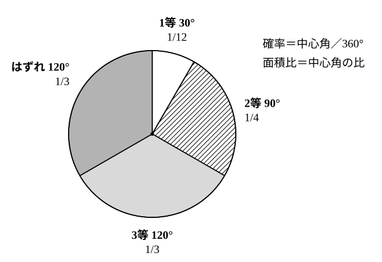
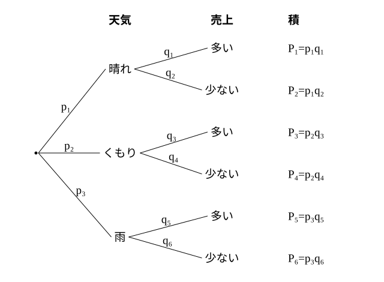

# L15 期待値——確率で「見込み」を計算し、意思決定に使う

- unit_id: hs-math-a-counting-and-probability
- 位置づけ: 単元第15レッスン（2時間）。L11〜L15 のまとまりの締めであり、単元の確率部分の到達点。結果ごとに値（賞金・個数・売上）が決まっているとき、「値×確率」を全部足した**期待値**で見込みを1つの数にまとめる。L09 の「確率の合計は 1」を検算に使い、L10 で始めた「値を根拠に一文で判断する」型を、2つの案の期待値を比べて選ぶ意思決定へ広げる。確率を面積比で決める場面（ルーレット）、データの相対度数を確率とみなす場面（L08 の頻度確率）、自分で確率を仮定する場面（L14 の2段の樹形図）を材料にする。L16 のまとめへ続く。
- distribution_status: published_draft
- license: CC-BY-4.0
- verify_required: 例題数値・記述は監修者検証必須。
- 主概念: ①期待値の定義（値×確率の合計）と計算（確率の合計＝1 の検算）・面積比で考える確率 ②意思決定への活用: 2案の期待値を比べて一文で判断する／相対度数を確率とみなす／自ら確率を仮定して確率木で求める

---

## 1. 1本引くと、平均していくらもらえるか

**例題1** 10本のくじがあり、1等（賞金 500円）が1本、2等（賞金 100円）が3本、はずれ（0円）が6本である。このくじを1本引くとき、もらえる賞金の見込みはいくらか。

もらえる金額は 500円・100円・0円のどれかで、それぞれの確率は 1/10・3/10・6/10。確率の合計は 1/10＋3/10＋6/10=1 で、すべての場合を尽くしている。

10本全部を1本ずつ引き切ると、賞金の合計は 500×1＋100×3＋0×6=800円で、1本あたり 800/10=80円。これを「値×確率」の形に書き直すと、

500×(1/10)＋100×(3/10)＋0×(6/10)=50＋30＋0=**80**（円）

「1本引くとき、平均して80円もらえる見込み」——この値が、このくじの賞金の期待値である。

一般に、ある試行の結果によって値 x₁、x₂、…、xₙ（右下の小さい数字は「何番目の値か」を表す番号で、L12 の右上の r〈r 乗〉とは別）のどれか1つが決まり、それぞれの値をとる確率が p₁、p₂、…、pₙ（p₁＋p₂＋…＋pₙ=1）であるとき、

**x₁p₁＋x₂p₂＋…＋xₙpₙ**

を、この値の**期待値**という。「値×確率」を全部足したもの、と読む。値と確率を表に並べてから計算するのが型で、確率の行の合計が 1 になることを必ず確かめる（L09 の性質。1 にならなければ、結果の書き落としか確率の計算ミスがある）。

| 賞金（円） | 500 | 100 | 0 | 合計 |
|---|---|---|---|---|
| 確率 | 1/10 | 3/10 | 6/10 | 1 |

**例題2** 1個のさいころを投げるとき、出る目の期待値を求めよ。

| 目 | 1 | 2 | 3 | 4 | 5 | 6 | 合計 |
|---|---|---|---|---|---|---|---|
| 確率 | 1/6 | 1/6 | 1/6 | 1/6 | 1/6 | 1/6 | 1 |

1×(1/6)＋2×(1/6)＋…＋6×(1/6)=(1＋2＋3＋4＋5＋6)/6=21/6=**7/2**

期待値 3.5 は、さいころのどの目とも一致しない。期待値は「1回で出る値」ではなく、「何回も繰り返したときに1回あたり平均していくらになる見込みか」を表す数である。

:::guide
**この単元での期待値の扱い**

期待値は数学Aの本文である。学習指導要領では、確率の意味や法則を理解して「事象の確率や期待値を求める」こと、そして「期待値を意思決定に活用する」こと（意思決定〈いしけってい〉＝どの案を選ぶかを決めること。§3 で扱う）が、この単元の指導事項として挙げられている。一方、結果に対応する値を1つの変数（確率変数）とみて、その平均・分散・標準偏差を扱うことは数学B「統計的な推測」で学ぶ。ここでは「値×確率の合計」としての期待値を確実に求め、それを根拠に判断を書けるところまでを目標にする。
:::

## 2. 面積比で考える確率——ルーレット

同様に確からしい根元事象が数え上げにくい場面でも、面積の比で確率を決められることがある。高等学校学習指導要領解説 数学編（平成30年告示）は、ルーレットで各賞の出る確率を面積比で考え、賞金を決めれば期待値も計算できることを例として挙げている。ここでも同じ型で考える。

**例題3** 円板を中心角で4つの扇形（おうぎがた）に分け、針の止まった扇形で賞が決まるルーレットがある。中心角は、1等が 30°、2等が 90°、3等が 120°、はずれが 120° で、賞金は1等 1200円、2等 400円、3等 120円、はずれ 0円である。針はどの向きにも同じように止まるとする。
(1) 各賞の出る確率を求めよ。
(2) 1回回すときの賞金の期待値を求めよ。
(3) 1回の参加料が 250円のとき、参加する側から見てこのルーレットは得か損か。期待値を根拠に一文で答えよ。

(1) 扇形の面積は中心角に比例するから、確率は中心角の 360° に対する比で決まる。1等 30/360=1/12、2等 90/360=1/4、3等 120/360=1/3、はずれ 120/360=1/3。合計 1/12＋3/12＋4/12＋4/12=12/12=1 ✓。

(2) 1200×(1/12)＋400×(1/4)＋120×(1/3)＋0×(1/3)=100＋100＋40＋0=**240**（円）

(3) 賞金の期待値 240円は参加料 250円より小さいから、**何度も参加すると1回あたり平均して 10円損をする見込みで、参加する側には損である**。

## 3. 2つの案を期待値で比べる——意思決定

期待値の使いどころは、選択肢が2つ以上あるときに、どちらを選ぶかの根拠にすることである。L10 で「確率が p と q で p>q だから X のほうが起こりやすい」と書いた型を、「期待値が a と b で a>b だから案1のほうが見込みが大きい」の形に広げる。

**例題4** 次の2つの案から1つを選んで、1回だけ行う。
案1: 1個のさいころを投げ、出た目×100円をもらう。
案2: 2枚の硬貨を投げ、2枚とも表なら 1000円、それ以外なら 200円をもらう。
もらえる金額の期待値が大きいのはどちらか。一文で判断せよ。

案1: 出た目の期待値は例題2より 7/2 だから、金額の期待値は 100×(7/2)=350円。表にして直接計算しても、(100＋200＋300＋400＋500＋600)/6=2100/6=350 で同じ。

案2: 2枚とも表の確率は 1/4、それ以外は 3/4。1000×(1/4)＋200×(3/4)=250＋150=400円。確率の合計 1/4＋3/4=1 ✓。

判断: 案1の期待値は 350円、案2の期待値は 400円で、400>350 だから、**もらえる金額の見込みが大きいのは案2である**。

:::guide
**期待値が大きい案を選ぶ、とはどういう判断か**

期待値は「繰り返したときの1回あたりの平均の見込み」である。だから「期待値の大きい案を選ぶ」は、「何度も同じ選択を繰り返すなら、合計で多くを得る見込みがある案を選ぶ」という判断になる。1回だけ行うとき、案2で 200円しかもらえないことは十分にありうる（確率 3/4）し、案1で 600円が出ることもある。期待値はそれらを保証しない。それでも期待値を根拠にするのは、「起こりうる結果のすべてを、その起こりやすさの重みで1つの数にまとめた」値だからで、印象や一部の結果だけで決めるより筋が通る。ただし、判断の基準は期待値だけとは限らない。「最低でもいくらは確保したい」という基準なら、最低額 200円の案2と 100円の案1では、別の見方も出てくる。何を基準に選ぶかを先に決め、その基準の値を求めて比べ、一文で結論を書く——これが意思決定の型である。
:::

## 4. データの相対度数を確率とみなす

日常の場面では、同様に確からしい根元事象が見つからないことが多い。そのときは、過去のデータの相対度数を確率とみなして期待値を求める。中1で相対度数を確率とみなして考えたの（教科書によっては、貸し靴をサイズごとに何足そろえるかを過去の記録から決める例で学ぶ）と同じ考え方で、L08 の頻度確率の使い方である。

**例題5** ある弁当店で、過去200日間に1日に売れた弁当の個数を調べると、20個の日が40日、30個の日が100日、40個の日が60日であった。この記録の相対度数を、明日それぞれの個数が売れる確率とみなす（売れる個数は「十分に仕入れてあれば売れる個数」のことで、過去200日間にも売り切れの日はなかったとする）。
(1) 1日に売れる個数の期待値を求めよ。
(2) 弁当1個の仕入れ値は 300円、売値は 500円で、売れ残った弁当は捨てる（仕入れ値の分が損になる）。明日の仕入れ個数を 30個にする案と 40個にする案とでは、利益の期待値が大きいのはどちらか。売れる個数ごとの利益を表にして求め、一文で判断せよ。

(1) 相対度数は 40/200=1/5、100/200=1/2、60/200=3/10（合計 1 ✓）。これを確率とみなして、

20×(1/5)＋30×(1/2)＋40×(3/10)=4＋15＋12=**31**（個）

(2) 利益は「売れた個数×200円」から「売れ残った個数×300円」を引いた額である（売れた1個につき 500−300=200円の利益、売れ残り1個につき 300円の損）。売れる個数が仕入れ個数を超えるときは、仕入れた分しか売れない。

| 売れる個数 | 20 | 30 | 40 |
|---|---|---|---|
| 確率 | 1/5 | 1/2 | 3/10 |
| 30個仕入れたときの利益（円） | 20×200−10×300=1000 | 30×200=6000 | 30×200=6000 |
| 40個仕入れたときの利益（円） | 20×200−20×300=−2000 | 30×200−10×300=3000 | 40×200=8000 |

30個の案: 1000×(1/5)＋6000×(1/2)＋6000×(3/10)=200＋3000＋1800=**5000**（円）
40個の案: (−2000)×(1/5)＋3000×(1/2)＋8000×(3/10)=−400＋1500＋2400=**3500**（円）

判断: 利益の期待値は 30個の案が 5000円、40個の案が 3500円で、5000>3500 だから、**利益の見込みが大きいのは 30個仕入れる案である**。40個の案は、40個売れる日には 8000円と最も大きいが、20個しか売れない日の損が大きく、期待値では下回る。

:::guide
**期待値は「1回の最大」ではなく「重みつきの平均」で比べる**

例題5(2) で、「40個売れれば 8000円で一番大きいから 40個の案」と決めたくなるかもしれない。しかしそれは、起こりやすさの重みを無視して、結果の1つだけを見た判断である。期待値は、結果のすべてを確率の重みで足し合わせる。40個の案は、いちばん起こりやすい「30個売れる日」（確率 1/2）に 3000円しか残らず、20個の日には損が出る——その分が重みとして効いて、30個の案に負けている。表を作って各案の利益を全部書き出す手間は、この「重み」を見落とさないための手間である。仕入れる数を 20個にする案も同じ表で計算できる（売れ残りが出ないので毎日 4000円、期待値 4000円）。3案の中でも 30個の案が最も大きい。
:::

## 5. 自ら確率を仮定する——確率木

データがないときは、確率を自分で仮定して見込みを計算することもできる。高等学校学習指導要領解説 数学編（平成30年告示）は、イベントに向けてアイスクリームをどのくらい仕入れるかを、確率を仮定した図（確率木〈かくりつぎ〉。枝に確率を書き込んだ樹形図の別名）をかいて考える場面を例に挙げている。ここでは同じ型を、屋外の売店の売上で考える。

**例題6** 明日、屋外で1日だけ売店を出す。明日の天気を、晴れ・くもり・雨の確率がそれぞれ 1/2、1/3、1/6 と仮定する。売上は「多い」（8万円）か「少ない」（3万円）のどちらかとし、売上が「多い」となる確率を、晴れのとき 4/5、くもりのとき 1/2、雨のとき 1/5 と仮定する。
(1) 売上が「多い」となる確率を求めよ。
(2) 売上の期待値を求めよ。

これは L14 の2段の樹形図と同じ形である。1段目に天気（3本）、2段目に売上（各2本）で、枝は全部で6本。枝ごとの確率は積で求める。図の記号は、p₁=1/2（晴れ）、p₂=1/3（くもり）、p₃=1/6（雨）、q₁=4/5・q₂=1/5（晴れ→多い・少ない）、q₃=q₄=1/2（くもり）、q₅=1/5・q₆=4/5（雨→多い・少ない）にあたる。

| 天気→売上 | 確率 | 売上（万円） |
|---|---|---|
| 晴れ→多い | (1/2)(4/5)=2/5=12/30 | 8 |
| 晴れ→少ない | (1/2)(1/5)=1/10=3/30 | 3 |
| くもり→多い | (1/3)(1/2)=1/6=5/30 | 8 |
| くもり→少ない | (1/3)(1/2)=1/6=5/30 | 3 |
| 雨→多い | (1/6)(1/5)=1/30 | 8 |
| 雨→少ない | (1/6)(4/5)=4/30 | 3 |

確率の合計: 12/30＋3/30＋5/30＋5/30＋1/30＋4/30=30/30=1 ✓。

(1) 「多い」の3本の枝を足して、12/30＋5/30＋1/30=18/30=**3/5**。
(2) 売上は 8万円（確率 3/5）か 3万円（確率 2/5）だから、8×(3/5)＋3×(2/5)=24/5＋6/5=30/5=**6**（万円）。

仮定した確率を変えると、この値は変わる。たとえば晴れやくもりの確率を減らし、その分だけ雨の確率を高く見積もれば期待値は下がる（stretch で確かめる）。「どの仮定を変えると結果が大きく動くか」を調べることも、確率を仮定して見込みを立てるときの大切な作業である。

## 6. 手順の型

1. 起こりうる結果と、それぞれの値（金額・個数）を表に並べる。2段の試行なら樹形図（確率木）で枝を全部かく。
2. 各結果の確率を求める。数え上げ（L08〜L10）、面積比、相対度数、仮定のどれで決めたかを書く。
3. 確率の合計が 1 になることを確かめる。
4. 「値×確率」を全部足して期待値を求める。
5. 2案以上を比べるときは、各案の期待値を並べ、大小を根拠に一文で判断を書く。期待値以外の基準（最低額など）を使うなら、それを先に宣言する。

## 7. 練習

**問1** 20本のくじがあり、1等（1000円）が1本、2等（300円）が4本、3等（40円）が5本、はずれ（0円）が10本である。このくじを1本引くときの賞金の期待値を求めよ。

**問2** 大小2個のさいころを同時に投げるとき、出る目の和の期待値を求めよ（和ごとの確率の表を自分で作ってから計算せよ）。

**問3** 円板を中心角 45°、135°、180° の3つの扇形に分けたルーレットがあり、それぞれ1等（800円）、2等（160円）、はずれ（0円）とする。針はどの向きにも同じように止まるとする。
(1) 1回回すときの賞金の期待値を求めよ。
(2) 1回の参加料が 200円のとき、参加する側から見て得か損かを、期待値を根拠に一文で答えよ。

**問4** 次の2つの案から1つを選んで1回だけ行う。もらえる金額の期待値が大きいのはどちらか。それぞれの期待値を求め、一文で判断せよ。
案1: 3枚の硬貨を投げ、表の枚数×200円をもらう。
案2: 1個のさいころを投げ、3の倍数の目が出たら 750円、それ以外の目なら 120円をもらう。

**問5** あるパン店で、過去100日間に1日に売れたパンの個数を調べると、10個の日が30日、20個の日が50日、30個の日が20日であった。この相対度数を確率とみなす（例題5 と同じく、売れる個数は十分に仕入れてあれば売れる個数で、過去にも売り切れの日はなかったとする）。パン1個の仕入れ値は 100円、売値は 150円で、売れ残りは捨てる。
(1) 1日に売れる個数の期待値を求めよ。
(2) 明日の仕入れ個数を 20個にする案と 30個にする案について、売れる個数ごとの利益を表にし、それぞれの利益の期待値を求めよ。
(3) 利益の見込みが大きいのはどちらの案か。値を根拠に一文で判断せよ。

---

:::stretch
**S1** §5 の例題6の設定で、天気の確率の仮定だけを「晴れ 1/3、くもり 1/3、雨 1/3」に変える（売上が「多い」となる確率の仮定は変えない）。
(1) 売上が「多い」となる確率を求めよ。
(2) 売上の期待値を求め、例題6(2) の値と比べよ。
(3) 天気の仮定の変え方と期待値の変わり方の関係を、一文で述べよ。
:::

対応解答: answer_key_L11-15.md

<!-- gen_nav:nav:start（自動生成・手編集しない） -->

---

[← 前のレッスン](lesson_14.md)｜[単元の目次](README.md)｜[解答](answer_key_L11-15.md)｜[次のレッスン →](lesson_16.md)

<!-- gen_nav:nav:end -->
