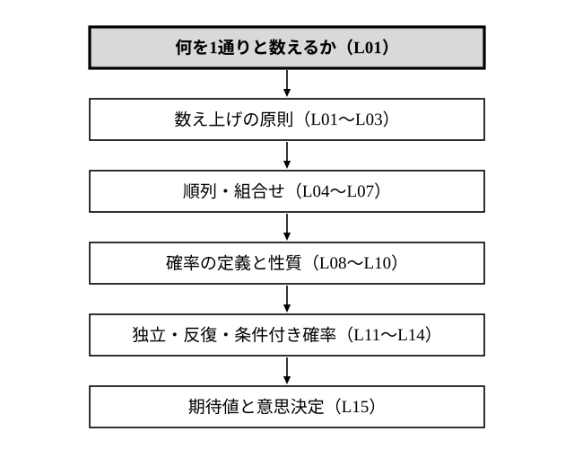

# L16 単元のまとめ——「何を1通りと数えるか」から期待値まで

- unit_id: hs-math-a-counting-and-probability
- 位置づけ: 単元第16レッスン（1時間）。L01〜L15 の総括回。**新しい概念・新しい用語は立てない**。単元全体を1枚の地図にまとめ、この単元で繰り返してきた問診——区別する？ 順番ある？ 戻す？ 同様に確からしいか？ 同時に起こるか？ 一方が他方の確率を変えるか？——を1本の手順にそろえる。各まとまりから1問ずつの総合演習で確かめ、末尾で数学Ⅱ・数学Bへの接続を予告する（先取りはしない）。
- distribution_status: published_draft
- license: CC-BY-4.0
- verify_required: 例題数値・記述は監修者検証必須。
- 主概念: ①数え上げの原則→順列・組合せ→確率の定義・性質→独立・反復・条件付き→期待値の1枚地図と、各まとまり1問の総合演習 ②数学Ⅱ「二項定理」・数学B「統計的な推測」への予告

---

## 1. 単元の1枚地図

この単元は、1つの問いから始まった。**何を1通りと数えるか**（L01）。その問いに答えを与えながら、道具を1つずつ増やしてきた。

- **数え上げの原則と集合の要素の個数**（L01〜L03）: もれなく重複なく数える3つの原則（分類・整理する／1対1に対応付ける／規則で数の列を作る）。n(A∪B)=n(A)＋n(B)−n(A∩B) と、「または」（同時には起こらない場合分け）なら和の法則・「そして」なら積の法則。小さい数で全部並べて照合する検算の型もここで決めた。
- **順列・組合せ**（L04〜L07）: 並べる nPr と選ぶ nCr。円順列・組分け・同じものを含む順列は、いずれも「区別を消す」「順序を消す」操作を、割る理由を言いながら使うものだった（重複順列だけは「戻す」ので、掛けるだけで割らない）。
- **確率の定義と性質**（L08〜L10）: 根元事象は同様に確からしくなるまで区別して作り、P(A)=n(A)/n(U)。同様に確からしい根元事象が見つからない試行では、相対度数の安定する値を確率とみなす（頻度確率）。「または」は排反なら足す、一般には重なりを引く。「〜でない」「少なくとも1つ」は余事象。順列・組合せは分母と分子を同じ決め方でそろえて使い、求めた値を根拠に一文で判断する。
- **いろいろな確率と期待値**（L11〜L15）: 独立な試行では確率を掛ける。反復試行は「どの回に起こるか」の組合せと1本の枝の確率の積。条件付き確率は情報が増えて分母（全事象）が変わったときの確率で、乗法定理 P(A∩B)=P(A)P_A(B) と2段の樹形図がその道具。期待値は「値×確率」の合計で、確率の合計が 1 になることを検算してから、意思決定の根拠にする。

地図の背骨は最初の問いのままである。確率では「同様に確からしくなるまで区別する」（勝率・相対度数・仮定した確率のように、確率が値で与えられる場面では、その値を「1通りの重さ」とみる）、条件付き確率では「分母が何に変わったか」、期待値では「値と確率の対応がもれなくそろっているか」——どれも、「1通り」の決め方を確かめる作業だった。

## 2. 問診を1本の手順にする

この単元で場面ごとに使ってきた問いを、1つの表にまとめる。問題を読んだら上から順に問診し、当てはまった行の道具を取り出す。

| 場面 | 問診 | 使う道具 | 学んだ回 |
|---|---|---|---|
| 数える | 区別する？ 順番ある？ 戻す？ | 順列 nPr／組合せ nCr／重複順列 nʳ／円順列／同じものを含む順列 | L04〜L07 |
| 「または」 | 同時に起こる？（排反か） | 和の法則／P(A∪B)=P(A)＋P(B)−P(A∩B) | L03・L09 |
| 「〜でない」「少なくとも」 | 余事象のほうが数えやすい？ | P(Aᶜ)=1−P(A) | L09 |
| 確率を求める | 根元事象は同様に確からしい？ | P(A)=n(A)/n(U)（分母と分子を同じ決め方で） | L08・L10 |
| 続けて起こる | 一方が他方の確率を変える？（独立か） | P(A∩B)=P(A)P(B)／P(A∩B)=P(A)P_A(B) | L11・L14 |
| 繰り返す | 途中で止まる？ 何回目に起こる？ | 反復試行の確率（どの回に起こるかの組合せ×1本の枝の確率）／枝ごとに確率を書く | L12 |
| 情報が増えた | 分母（全事象）はどう変わった？ | 条件付き確率 P_A(B)=n(A∩B)/n(A)（根元事象が同様に確からしいとき）／P_A(B)=P(A∩B)/P(A) | L13 |
| 決める | 値×確率の合計は？ 確率の合計は 1？ | 期待値・一文判断 | L10・L15 |

解き終わったあとの検算も、単元を通して同じ2つだった。**別の道で数え直す**（分類で数えたら1対1対応で、余事象で求めたら直接数えて、順列で数えたら組合せで）と、**小さい数で全部並べる**。この2つは、公式を忘れたときにも使える道具である。

:::guide
**公式を忘れたときに戻る場所——原則と定義**

この単元の公式はどれも、数え上げの原則と確率の定義から作り直せる。nPr は積の法則を r 回使っただけ、nCr は nPr を r! で割っただけ、余事象は P(A)＋P(Aᶜ)=1 を移項しただけ、乗法定理は条件付き確率の定義の分母を払っただけである。公式の一覧を見直すときは、暗記できたかではなく、「この公式はどの原則の省略形か」を1行で言えるかを確かめる——公式の出どころと使いどころを理解しているかを確かめる作業である。§2 の表の「使う道具」の列を隠して、「問診」の列だけから自分で道具を書き出してみると、どの回の理解が薄いかがすぐ分かる。
:::

## 3. この先へ——数学Ⅱ・数学Bへの予告

この単元の道具は、あとの科目で次のように使われる（ここでは名前を挙げるだけにとどめ、中身には入らない）。

- 数学Ⅱ「いろいろな式」では、(a＋b) を n 個掛けた式を展開する二項定理で、この単元の nCr が展開の係数として使われる。
- 数学B「統計的な推測」では、反復試行を確率変数の分布（二項分布）として整理する。この単元で扱った期待値も、確率変数の平均として扱い直され、さらに分散などを学ぶ。

この単元では、反復試行の確率は独立な試行の確率の延長として扱い、期待値は確率の値から直接計算した。数学Bはその先を引き受ける。

:::guide
**総括回の使い方——「できた問題」より「どの問診で止まったか」を記録する**

§4 の総合演習は、各まとまりから1問ずつ選んである。解けたかどうかだけでなく、§2 の表のどの行で手が止まったかを記録すると、復習の場所が定まる。区別するかどうかで迷えば L01・L08、排反かどうかで迷えば L03・L09、独立かどうかで迷えば L11・L14、分母が変わることに気づかなければ L13、といった具合である。この単元では答えの数値より、「1通りの決め方」を口に出せることが力になる。解答を見るときも、数値の一致だけでなく、自分の問診の1行目が解答と同じだったかを見比べてほしい。
:::

## 4. 練習——各まとまりから1問ずつ

**問1** 袋の中に赤玉2個と白玉3個が入っている。この袋から玉を2個同時に取り出す。
(1) 5個の玉をすべて区別するとき、取り出す2個の組をすべて書き出し、その総数を求めよ。
(2) 同じ色の玉を区別せず、取り出した2個の色の組だけを見るとき、色の組は何通りあるか。
(3) 確率を求めるとき、分母には (1) と (2) のどちらの数を使うべきか。理由を一文で説明せよ。

**問2** 1から5までの数字を1つずつ書いた5枚のカードから3枚を選んで1列に並べ、3桁の整数を作る。
(1) 整数は全部で何個できるか。
(2) 偶数は何個できるか。
(3) 偶数または5の倍数は何個できるか。使った法則（和の法則・積の法則）とその理由を一文添えよ。

**問3** 問1の袋（赤玉2個・白玉3個）から玉を2個同時に取り出すとき、少なくとも1個は白玉である確率を、余事象を使って求めよ。また、問1(1) の書き出しから直接数えて照合せよ。

**問4** 硬貨を1枚投げ、表が出たら袋X（赤玉2個・白玉2個）から、裏が出たら袋Y（赤玉1個・白玉4個）から、玉を1個取り出すゲームがある。
(1) 2段の樹形図をかき、取り出した玉が赤玉である確率を求めよ。
(2) 赤玉が出たら400円、白玉が出たら0円がもらえるとき、もらえる金額の期待値を求めよ（確率の合計が 1 になることを確かめてから計算せよ）。
(3) このゲームの参加料が150円のとき、参加するほうが有利と言えるか。(2) の値を根拠に、一文で答えよ。

---

:::stretch
**S1** 1から9までの数字を1つずつ書いた9枚のカードから2枚を同時に取り出す。A を「2枚の数の和が偶数である」、B を「2枚とも奇数である」とする。
(1) P(A) を求めよ。
(2) 2枚の数の和が偶数であったとき、2枚とも奇数である条件付き確率 P_A(B) を求めよ。
(3) A の情報によって B の確率は変わるか。P(B) と P_A(B) の値を根拠に、一文で答えよ。
:::

対応解答: answer_key_L16.md

<!-- gen_nav:nav:start（自動生成・手編集しない） -->

---

[← 前のレッスン](lesson_15.md)｜[単元の目次](README.md)｜[解答](answer_key_L16.md)

<!-- gen_nav:nav:end -->
