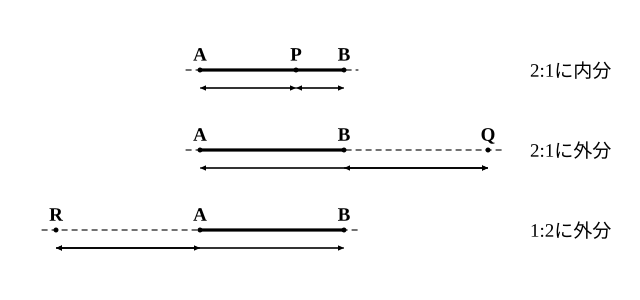
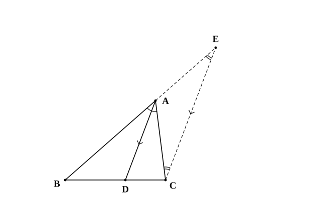
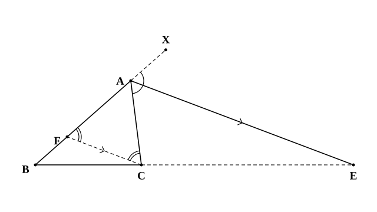

# L01 線分の比と角の二等分線——「比を移す」道具をそろえる

- unit_id: hs-math-a-geometry-properties
- 位置づけ: 単元第1レッスン（2時間）。数学A「図形の性質」の入口。中3「平行線と線分の比」を回収し、線分を比で分ける言い方（内分・外分）をそろえたうえで、角の二等分線が向かい合う辺を「2辺の比」に分けることを証明する。ここでそろえる「比を移す」道具は、L03（重心）・L04（チェバの定理・メネラウスの定理）・L10（作図）で繰り返し使う。
- distribution_status: published_draft
- license: CC-BY-4.0
- verify_required: 例題数値・記述は監修者検証必須。
- 主概念: ①内分・外分の定義（m:n と外分の向き）と平行線と線分の比（中3の回収） ②角の二等分線と辺の比（内角から外角へ拡張・証明の道具は平行線と比）

---

**使う中学の結果**: 平行線と線分の比（中3）——三角形の1辺に平行な直線は、他の2辺（またはその延長）を同じ比に分ける。逆に、他の2辺を同じ比に分ける直線は、残りの辺に平行である。平行線の同位角・錯角は等しく、逆に同位角または錯角が等しい2直線は平行である（中2）。二等辺三角形の2つの底角は等しく、逆に2つの角が等しい三角形は二等辺三角形である（中2）。三角形の外角は、それと隣り合わない2つの内角の和に等しい（中2・stretch で使う）。比の性質——a:b=c:d ならば (a＋b):b=(c＋d):d（中1）。

## 1. 数学Aの入口——中学の図形を「定理の言葉」で言い直す

中学の図形では、合同・相似・円周角・三平方の定理を学び、それを使って角や長さを求めてきた。数学Aの「図形の性質」は、その延長にある。新しい形が出てくるのではなく、すでに見たことのある形——三角形と円——の中に隠れていた性質に、名前と証明を与えていく単元だ。先に全体の地図を渡しておこう。

- L01〜L05 は三角形。線分の比・角の二等分線・3つの「心」・チェバの定理とメネラウスの定理・成り立つ条件。
- L06〜L09 は円。内接する四角形・接線・方べきの定理・2つの円。
- L10 は作図。定理を根拠にして、手順を組み立てる。
- L11〜L13 は空間。直線と平面の位置関係・多面体。
- L14 は総合演習。

このレッスンでは、単元全体で何度も使う「比を移す」道具をそろえる。まず中3の結果を確かめ直す。

△ABC の辺 AB、AC 上（またはその延長上）に点 D、E があって DE∥BC のとき、次が成り立つ。

AD:DB=AE:EC、　AD:AB=AE:AC=DE:BC

点 D、E が頂点 A をはさんで辺の反対側の延長上にあるときも、同じ比の関係が成り立つ（D、E が A を越えた側にあり、頂点 A の両側で相似な2つの三角形が砂時計のように向き合う形——中3で見た「ちょうちょ型」）。逆に、D、E がともに辺上にあるとき（ともに A を越えた延長上にあるとき・ともに B、C を越えた延長上にあるときも同じ）、AD:DB=AE:EC ならば DE∥BC である。D が辺上で E が延長上のように配置がそろっていないときは、比が等しくても平行とは限らない。

たとえば AB=9、AC=6 で、辺 AB 上の点 D と辺 AC 上の点 E が AD=6、DE∥BC を満たすなら、AD:DB=6:3=2:1 だから AE:EC=2:1、AE=4、EC=2。この「1本の平行線が、2本の直線上の比を運ぶ」働きを、これから何度も使う。

## 2. 内分と外分——「m:n に分ける」の言い方をそろえる

以下、m、n は正の数とする。線分 AB 上の点 P（両端 A、B は除く）が AP:PB=m:n を満たすとき、P は線分 AB を m:n に**内分**するという。中学で「AB を 2:1 に分ける点」と言ってきたものと同じだ。

線分 AB の**延長上**の点 Q が AQ:QB=m:n（m≠n。延長上には AQ=QB となる点がないため）を満たすとき、Q は線分 AB を m:n に**外分**するという。外分は高校で新しく使う言い方なので、定義文をそのまま覚えておこう——「AQ:QB=m:n となる延長上の点 Q」である。比は「A から Q まで」と「Q から B まで」の順で読む。この読み順は内分と同じで、いつも変えない。

外分点がどちら側の延長上にあるかは、比の大小で決まる。

- m>n のとき、AQ>QB だから、Q は B の側の延長上にある（Q が B を越えた先にあれば AQ=AB＋BQ>QB）。
- m<n のとき、AQ<QB だから、Q は A の側の延長上にある。

**例題1** AB=6 とする。線分 AB を 2:1 に内分する点 P、2:1 に外分する点 Q、1:2 に外分する点 R について、AP と PB、AQ と QB、AR と RB の長さを求めよ。

P は辺上の点で AP:PB=2:1。AP＋PB=6 を 2:1 に分けて、AP=**4**、PB=**2**。

Q は AQ:QB=2:1 で、m>n だから B の側の延長上にある。すると AQ−QB=AB=6。AQ=2k、QB=k とおくと 2k−k=6、k=6。よって QB=**6**、AQ=**12**。

R は AR:RB=1:2 で、m<n だから A の側の延長上にある。RB−AR=AB=6。AR=k、RB=2k とおくと k=6。よって AR=**6**、RB=**12**。

検算: 12:6=2:1 ✓、6:12=1:2 ✓。内分は「和が AB」、外分は「差が AB」——ここが計算の分かれ目だ。

:::guide
**外分の向きで迷ったら、定義文に戻る**

「2:1 に外分」と言われて、点が A の側か B の側か迷うのは自然だ。決め手は、比を「A から測って、次に B まで測る」と読む約束にある。AQ:QB=2:1 なら AQ のほうが長い。A から遠い点ほど AQ は長くなるので、Q は B を越えた先にいる。逆に 1:2 なら AQ のほうが短く、Q は A のすぐ外側にいる。図で確かめるときは、A→Q、Q→B の2本の長さを実際に測って比の順序と合っているかを見る。比の順序と図の向きが食い違ったまま計算に入ると、「和で分ける」べきところを「差で分ける」ような取り違えが起きる。定義文を1行書いてから計算に入る、を習慣にしよう。
:::

## 3. 内角の二等分線と辺の比——平行線が比を運ぶ

三角形の角を二等分する直線は、向かい合う辺をどんな比に分けるだろうか。結論は「その角をつくる2辺の比」である。

**定理1 角の二等分線と辺の比** △ABC の ∠A の二等分線と辺 BC の交点を D とすると、

BD:DC=AB:AC

証明の書き方は中2と同じだ——仮定（わかっていること）→根拠（使う性質）→結論、の順に書く。使う道具は §1 の平行線と比である。次の証明の空らん（ア）〜（オ）を埋めながら読もう。

**証明** 点 C を通り DA に平行な直線をひき、辺 BA を A の側に延長した直線との交点を E とする。

AD∥EC だから、（ア）が等しいので ∠BAD=∠AEC、（イ）が等しいので ∠DAC=∠ACE。

仮定より ∠BAD=∠DAC。したがって ∠AEC=∠ACE となり、△ACE は（ウ）の角が等しいので、AE=（エ）。

△BEC で AD∥EC だから、平行線と比より BD:DC=BA:AE。AE=（エ）を代入して、BD:DC=（オ）。（証明終）

空らんの答え: （ア）同位角 （イ）錯角 （ウ）2つ （エ）AC （オ）AB:AC

証明の要は、補助線 CE によって「A から出る2辺の比 AB:AC」が「BC 上の比 BD:DC」へ運ばれたことにある。二等分線の条件は、AE=AC という「長さのすり替え」を可能にするために使われた。

**逆は成り立つか**。辺 BC 上の点 D が BD:DC=AB:AC を満たすなら、AD は ∠A の二等分線だろうか。成り立つ。∠A の二等分線と BC の交点を D′ とすると、定理1より BD′:D′C=AB:AC。辺 BC 上でこの比に内分する点は1つしかないから、D′=D であり、AD は二等分線である。「1つしかないものが2つあるなら同じもの」という言い方は、L03・L04・L06 でも使う。

**例題2** △ABC で AB=6、AC=4、BC=5 とする。∠A の二等分線と辺 BC の交点を D とするとき、BD と DC の長さを求めよ。

定理1より BD:DC=AB:AC=6:4=3:2。BC=5 を 3:2 に内分するので、BD=5×3/5=**3**、DC=5×2/5=**2**。

検算: BD＋DC=3＋2=5=BC ✓、BD:DC=3:2=6:4 ✓。

:::guide
**どの線分比かを取り違えないために——2本ずつ、同じ順で**

定理1の式は BD:DC=AB:AC。左は D をはさむ2本、右は A から出る2本である。起こりやすい取り違えは、右辺の順序を AC:AB と逆に書いてしまうことだ。防ぎ方は、両辺を「B 側から C 側へ」の同じ順で読むことだ。左辺は B→D→C の順に BD、DC。右辺も B 側の辺 AB、C 側の辺 AC の順に書く。頂点 B に近い量どうし、頂点 C に近い量どうしが対応している——この対応さえ守れば、二等分する角が ∠B や ∠C に変わっても迷わない。∠B の二等分線が辺 CA と交わる点を E とすれば、CE:EA=BC:BA である（C 側どうし、A 側どうし）。
:::

## 4. 外角の二等分線と辺の比——条件を見直して定理を広げる

定理1は内角についての結果だった。では、∠A の**外角**の二等分線はどうだろう。辺 BA を A の側に延長した半直線上に点 X をとると、∠CAX が ∠A の外角である。

**定理2 外角の二等分線と辺の比** AB≠AC である △ABC で、∠A の外角の二等分線と直線 BC の交点を E とすると、

BE:EC=AB:AC

すなわち、E は辺 BC を AB:AC に**外分**する。

証明の道具は定理1とまったく同じ——平行線と比である。空らん（ア）〜（オ）を埋めながら読もう。外角の二等分線は ∠A の外側を通るので、E は辺 BC の上にはなく、B の側か C の側の延長上にある。以下では E が C の側の延長上にある場合を、証明の下にある図の配置（F は辺 AB 上）のとおりとして証明する。E が B の側にあるときは、B と C の役割を入れ替えれば同じ議論になる。AB>AC のとき E が C の側に来ることは、証明のあとで確かめる。

**証明** 点 C を通り AE に平行な直線をひき、辺 AB との交点を F とする。

AE∥FC だから、（ア）が等しいので ∠AFC=∠XAE、（イ）が等しいので ∠ACF=∠CAE。

仮定より ∠XAE=∠CAE。したがって ∠AFC=∠ACF となり、AF=（ウ）。

△BEA で FC∥AE だから、平行線と比より BF:FA=BC:CE。比の性質（BF/FA=BC/CE の両辺に 1 を加える）から (BF＋FA):FA=(BC＋CE):CE、すなわち BA:FA=（エ）:CE。

AF=（ウ）を代入して、BE:EC=（オ）。（証明終）

空らんの答え: （ア）同位角 （イ）錯角 （ウ）AC （エ）BE （オ）AB:AC

定理1と定理2を並べると、「角の二等分線は、向かい合う辺を（内角なら内分・外角なら外分して）2辺の比に分ける」と1文で言える。条件を「内角」から「外角」へ見直したら、結論の形は同じで、分け方だけが内分から外分に変わった——これが「条件を見直して定理を拡張する」ということだ。

E がどちら側の延長上に来るかは、定理2の式から決まる。E が C の側にあれば BE>EC だから AB>AC、B の側にあれば BE<EC だから AB<AC。E は B の側か C の側のどちらかにあるから、AB>AC なら E は C の側の延長上（図の配置）にあり、AB<AC なら B の側の延長上にある。

なお、AB=AC のときは外角の二等分線が辺 BC と交わらない（stretch で確かめる）。定理2に AB≠AC の条件が付いているのはそのためである。

**逆は成り立つか**。AB≠AC のとき、辺 BC の延長上の点 E が BE:EC=AB:AC を満たすなら、AE は ∠A の外角の二等分線だろうか。成り立つ。外角の二等分線と直線 BC の交点を E′ とすると、定理2より BE′:E′C=AB:AC。辺 BC をこの比に外分する点は1つしかない（§2 のとおり、側は比の大小で決まり、長さは差が BC で決まる）から、E′=E であり、AE は外角の二等分線である。

**例題3** 例題2と同じ △ABC（AB=6、AC=4、BC=5）で、∠A の外角の二等分線と直線 BC の交点を E とする。BE と EC の長さを求めよ。また、例題2の D を使って DE の長さを求めよ。

定理2より BE:EC=AB:AC=6:4=3:2。E は辺 BC を 3:2 に外分する点で、m>n だから C の側の延長上にある。すると BE−EC=BC=5。BE=3k、EC=2k とおくと k=5。よって BE=**15**、EC=**10**。

D は B から 3 の位置、E は C の外側 10 の位置にあるから、DE=DC＋CE=2＋10=**12**。

検算: BE−EC=15−10=5=BC ✓、BE:EC=15:10=3:2 ✓。

:::guide
**外角の二等分線が「外分」になるのはなぜか**

内角の二等分線は角の内側を通るので、必ず辺 BC を横切る——だから内分。外角の二等分線は角の外側を通るので、辺 BC そのものとは交わらず、AB≠AC なら延長上で交わる——だから外分（AB=AC なら直線 BC と交わらず、外分点はない）。結論の式が同じ AB:AC なのに、片方が「和で分ける」計算、もう片方が「差で分ける」計算になる理由はここにある。例題3で BE−EC=BC と立てたのは、E が C の外側にいるからだ。もし AB<AC なら、E は B の側の外側に来て、EC−BE=BC となる。式を立てる前に「E はどちら側か」を比の大小（§2）で確かめる一手を省かないこと。
:::

## 5. 手順の型——比を移す3ステップ

角の二等分線の問題は、次の3手で片づく。

1. **どの角の二等分線か**を確かめ、その角をつくる2辺（∠A なら AB と AC）を書き出す。
2. 向かい合う辺の上の比を、その2辺の比で書く。内角なら内分（和が辺の長さ）、外角なら外分（差が辺の長さ。角をつくる2辺の長さが等しいときは交点がなく、外分点もない）。
3. 全体の長さを比で割り振り、和または差で検算する。

## 6. 練習

**問1** AB=12 とする。次の点について、A と B のどちらの側にあるか（辺上・A の側の延長上・B の側の延長上）を答え、A からの長さと B からの長さを求めよ。
(1) 線分 AB を 3:1 に内分する点 P
(2) 線分 AB を 3:1 に外分する点 Q
(3) 線分 AB を 1:3 に外分する点 R

**問2** 点 P は線分 AB を 3:2 に内分する点で、AP=6 である。
(1) PB と AB の長さを求めよ。
(2) 点 Q が線分 AB を 3:2 に外分するとき、AQ と QB の長さを求めよ。

**問3** △ABC で AB=8、AC=6、BC=7 とする。∠A の二等分線と辺 BC の交点を D とするとき、BD と DC の長さを求めよ。

**問4** △ABC で AB=9、BC=6、CA=5 とする。∠B の二等分線と辺 CA の交点を E とするとき、AE と EC の長さを求めよ。

**問5** 問3と同じ △ABC（AB=8、AC=6、BC=7）で、∠A の外角の二等分線と直線 BC の交点を E とする。
(1) E は B、C のどちらの側の延長上にあるか。理由を1文で書け。
(2) BE と EC の長さを求めよ。
(3) 問3の D を使って、DE の長さを求めよ。

---

:::stretch
**S1** △ABC で AB=8、AC=6、BC=7 とし、∠A の内角の二等分線と直線 BC の交点を D、外角の二等分線と直線 BC の交点を E とする（問3・問5の点）。
(1) BD:DC と BE:EC をそれぞれ求め、2つの比を比べよ。
(2) (1) の結果は、AB、AC、BC がどんな長さでも（AB≠AC なら）成り立つ。その理由を定理1・定理2の式を使って1〜2文で説明せよ。
(3) AB=AC のとき、∠A の外角の二等分線と直線 BC はどんな位置関係になるか。∠B=∠C であることと、外角が ∠B＋∠C に等しいこと（中2）を使って説明せよ。
:::

対応解答: answer_key_L01-05.md

<!-- gen_nav:nav:start（自動生成・手編集しない） -->

---

[単元の目次](README.md)｜[解答](answer_key_L01-05.md)｜[次のレッスン →](lesson_02.md)

<!-- gen_nav:nav:end -->
