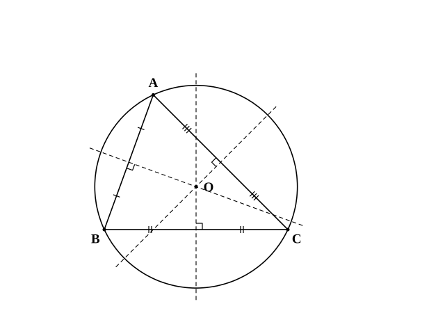
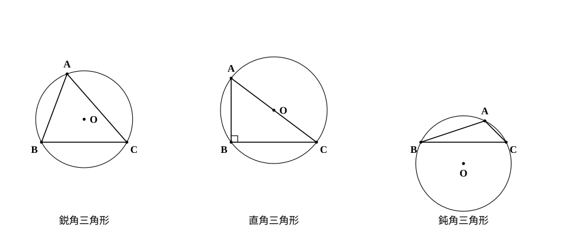
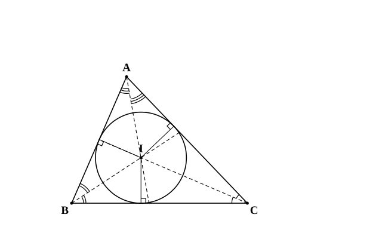

# L02 三角形の外心・内心——名前のなかった円に名前をつける

- unit_id: hs-math-a-geometry-properties
- 位置づけ: 単元第2レッスン（2時間）。中1で「3つの頂点を通る円」「3つの辺に接する円」を作図したとき、その中心には名前がなかった。この回で、その2つの点に**外心**・**内心**という名前を与え、「3本の直線が1点で交わる」ことを定理として証明する。証明の道具は中1の「等距離の点の集まり」。L03（重心）と合わせて3つの心を区別し、L04（チェバの定理の逆）・L12（正四面体の垂線の足）で再訪する。
- distribution_status: published_draft
- license: CC-BY-4.0
- verify_required: 例題数値・記述は監修者検証必須。
- 主概念: ①外心（3辺の垂直二等分線が1点で交わる・3頂点から等距離）と外心の位置（鋭角・直角・鈍角の3状態） ②内心（3つの内角の二等分線が1点で交わる・3辺から等距離）

---

**使う中学の結果**: 2点から等しい距離にある点の集まりは、その2点を結ぶ線分の垂直二等分線である（中1）。角の内部で、その角の2辺から等しい距離にある点の集まりは、その角の二等分線である（中1）。二等辺三角形の2つの底角は等しい（中2）。三角形の内角の和は 180° である（中2）。円周角の定理（1つの弧に対する円周角は、その弧に対する中心角の半分）と、その逆（中3。stretch では「∠ACB=90° ならば点 C は線分 AB を直径とする円の周上にある」の形で使う）。

## 1. 名前のなかった2つの円

中1の作図で、「3点 A、B、C を通る円をかけ」「△ABC の3辺すべてに接する円をかけ」という問題に取り組んだはずだ。前者は2辺の垂直二等分線の交点を中心に、後者は2つの角の二等分線の交点を中心にしてかいた。

どちらも、2本の直線の交点を中心にした。3本目の直線は、かかなくても円はかけた。では、3本目の直線はその交点を通っているのだろうか。中1では「かいてみると通っている」で済ませていた。この回では、それを証明し、中心に名前をつける。

## 2. 外心——3辺の垂直二等分線は1点で交わる

**定理3** 三角形の3辺の垂直二等分線は1点で交わる。

証明の型は中2と同じ（仮定→根拠→結論）。空らん（ア）〜（エ）を埋めながら読もう。

**証明** △ABC で、辺 AB の垂直二等分線と辺 AC の垂直二等分線の交点を O とする。

O は辺 AB の垂直二等分線上にあるから、（ア）=OB。O は辺 AC の垂直二等分線上にあるから、OA=（イ）。

したがって OB=（ウ）。2点 B、C から等しい距離にある点は、辺（エ）の垂直二等分線上にある。

よって O は辺 BC の垂直二等分線上にもあり、3本の垂直二等分線は点 O で交わる。（証明終）

空らんの答え: （ア）OA （イ）OC （ウ）OC （エ）BC

この点 O を △ABC の**外心**という。証明の途中で OA=OB=OC が出た——外心は3つの頂点から等しい距離にある点である。だから、O を中心とし OA を半径とする円は3頂点 A、B、C をすべて通る。この円は三角形の**外接円**と呼ばれる。

:::guide
**2本の交点があるのに、なぜ3本目のことを証明するのか**

2本の直線は（平行でなければ）必ず1点で交わる。だから「AB と AC の垂直二等分線が交わる」ことに証明は要らない。証明が要るのは、その交点が「BC の垂直二等分線の上にもある」ことだ。3本の直線がたまたま1点を通ることは、一般にはめずらしい。ノートに適当に3本の直線をかいてみれば、たいてい小さな三角形ができる。だから「3本が1点で交わる」は主張であって、確かめずに使えることではない。証明の作り方は、2本で決めた点が3本目の条件（B と C から等距離）を満たすことを示す、という一本道である。この作り方は内心（§4）でも重心（L03）でもまったく同じになる。
:::

鋭角三角形の外心を使う角度の計算では、OA=OB=OC から生まれる**3つの二等辺三角形**（△OAB、△OBC、△OCA）を見る（直角三角形では O が斜辺の中点に来て、斜辺の両端と O が一直線上に並ぶので、二等辺三角形は2つしかできない——§3・S1）。

**例題1** 点 O は鋭角三角形 ABC の外心で、∠OBC=25°、∠OCA=35° である。∠A の大きさを求めよ。

OB=OC より △OBC は二等辺三角形で、∠OCB=∠OBC=25°。OC=OA より △OCA も二等辺三角形で、∠OAC=∠OCA=35°。

OA=OB より ∠OAB=∠OBA。この大きさを x とおくと、△ABC の内角の和から

(x＋35°)＋(x＋25°)＋(25°＋35°)=180°、　2x=60°、　x=30°

よって ∠A=∠OAB＋∠OAC=30°＋35°=**65°**。

検算: ∠B=25°＋30°=55°、∠C=25°＋35°=60° で、65°＋55°＋60°=180° ✓。もう1つの確かめ方——∠BOC=180°−25°×2=130° は、辺 BC に対する中心角なので、円周角 ∠A の2倍（中3の円周角の定理）になっているはずである。2×65°=130° ✓。

## 3. 外心はどこにあるか——鋭角・直角・鈍角の3状態

外心は、三角形の内部にあるとは限らない。頂点を動かして観察すると、3つの状態が現れる。

- すべての角が鋭角（鋭角三角形）のとき、外心は三角形の内部にある。
- 1つの角が直角（直角三角形）のとき、外心は**斜辺の中点**にある。
- 1つの角が鈍角（鈍角三角形）のとき、外心は三角形の外部にある（鈍角 ∠A の向かいの辺 BC に対する中心角は 2∠A>180° になるので、中心 O は BC について A と反対側に出る——中3の円周角の定理）。

直角三角形の場合がなぜそうなるかは、中3の「円周角の定理の逆」で説明できる（stretch）。ここでは、「外心の位置は角の種類で判定できる」ことを押さえておこう。

:::guide
**外心が外にあるとき、何が起こっているか**

鈍角三角形をかいて、3辺の垂直二等分線をていねいにかくと、交点は鈍角の頂点の向かい側、辺の外に出る。作図をしていて「線が三角形の外へ出ていくのはおかしい」と手が止まることがあるが、それは正しい。外心の定義は「3辺の垂直二等分線の交点」であって、「三角形の中の点」ではない。定義に「中にある」という条件が含まれていないものは、外に出ることがある。同じことは、L04 のチェバの定理の点（三角形の外部にある場合）や、L07 の円の外側からひく接線でも起こる。図形の性質を学ぶときは、「見た目で自然な位置」ではなく「定義が要求している条件」で場所を決める、と切り替えておくと迷わない。
:::

## 4. 内心——3つの内角の二等分線は1点で交わる

**定理4** 三角形の3つの内角の二等分線は1点で交わる。

証明の作り方は定理3と同じ——2本の交点が3本目の条件を満たすことを示す。空らん（ア）〜（エ）を埋めながら読もう。

**証明** △ABC で、∠B の二等分線と ∠C の二等分線の交点を I とする。∠B の二等分線は辺 CA と、∠C の二等分線は辺 AB と、それぞれ三角形の内側で交わる（L01 定理1の交点）ので、この2本は三角形の内部で交わる。よって I は三角形の内部にあり、∠A、∠B、∠C のどの内部にもある。

I は ∠B の二等分線上にあるから、I から辺 BA までの距離と辺（ア）までの距離は等しい。I は ∠C の二等分線上にあるから、I から辺 CB までの距離と辺（イ）までの距離は等しい。

したがって、I から辺 AB までの距離と辺（ウ）までの距離は等しい。∠A の内部にあって2辺 AB、AC から等しい距離にある点は、∠A の（エ）の上にある。

よって I は ∠A の二等分線上にもあり、3本の二等分線は点 I で交わる。（証明終）

空らんの答え: （ア）BC （イ）CA （ウ）AC （エ）二等分線

この点 I を △ABC の**内心**という。内心は3つの辺から等しい距離にある点である。だから、I を中心とし、I から辺までの距離を半径とする円は、3辺すべてに接する。この円は三角形の**内接円**と呼ばれる。

内心を使う角度の計算では、「内心と2頂点を結ぶと、その2頂点の角が半分になる」ことを使う。

**例題2** 点 I は △ABC の内心で、∠A=70° である。∠BIC の大きさを求めよ。

I は ∠B、∠C の二等分線上にあるから、∠IBC=∠B/2、∠ICB=∠C/2。△IBC の内角の和から

∠BIC=180°−(∠B＋∠C)/2=180°−(180°−70°)/2=180°−55°=**125°**

一般に、∠BIC=180°−(180°−∠A)/2=90°＋∠A/2 である。検算: 90°＋35°=125° ✓。

**例題3** 次の問いに、直線・線分の名前で答えよ。
(1) 点 I が △ABC の内心のとき、直線 AI はどんな直線か。
(2) 点 O が △ABC の外心のとき、O を通り辺 BC に垂直な直線はどんな直線か。
(3) 点 O が △ABC の外心のとき、3つの線分 OA、OB、OC の長さにはどんな関係があるか。

(1) **∠A の二等分線**。(2) **辺 BC の垂直二等分線**（外心は BC の垂直二等分線上にあり、その直線は BC に垂直だから、O を通って BC に垂直な直線はそれに一致する）。(3) **OA=OB=OC**（外接円の半径）。

## 5. 2つの心を区別する——何から等しい距離か

| 名前 | 何の交点か | 何から等しい距離か | かける円 | 位置 |
|---|---|---|---|---|
| 外心 O | 3辺の垂直二等分線 | 3つの**頂点** | 3頂点を通る円（外接円） | 鋭角なら内部・直角なら斜辺の中点・鈍角なら外部 |
| 内心 I | 3つの内角の二等分線 | 3つの**辺** | 3辺に接する円（内接円） | つねに内部 |

どちらも「等しい距離にある点の集まり」（中1）から出てきた。外心は「点から等距離」、内心は「辺（直線）から等距離」。L03 ではこれに、距離ではなく「線分を分ける比」で決まる第3の点（重心）が加わる。

:::guide
**外心と内心を混同したら、「何から等距離か」に戻る**

「内心は角の二等分線だったか、垂直二等分線だったか」と迷うのは、名前と作り方だけを覚えようとしたときに起こる。手がかりは、どちらも「等距離の点の集まり」だということ。頂点から等距離なら「点から等距離」なので垂直二等分線（中1）が出てきて、その交点が外心。辺から等距離なら「直線から等距離」なので角の二等分線（中1）が出てきて、その交点が内心（中1の結果と同じく「角の内部で」の断りつき——三角形の外にも3辺の直線から等距離の点はあるので、内心は「三角形の内部にあって3辺から等距離の点」と言う）。かける円のほうから考えてもよい——頂点を通る円の中心は頂点から等距離でなければならず、辺に接する円の中心は辺から等距離でなければならない。「等距離」の相手が点か直線か、と1回問い直せば、作り方は自動的に決まる。
:::

## 6. 練習

**問1**
(1) 次のア〜エのうち、外心の説明になっているものと、内心の説明になっているものを、それぞれすべて選べ。
　ア 3辺の垂直二等分線の交点　　イ 3つの内角の二等分線の交点
　ウ 3つの頂点から等しい距離にある点　　エ 三角形の内部にあって、3つの辺から等しい距離にある点
(2) 点 I が △ABC の内心のとき、直線 BI はどんな直線か。点 O が △ABC の外心のとき、O を通り辺 CA に垂直な直線はどんな直線か。

**問2** 点 O は鋭角三角形 ABC の外心で、∠OAB=20°、∠OAC=40° である。∠B と ∠C の大きさを求めよ。

**問3** 点 I は △ABC の内心で、∠B=50°、∠C=70° である。∠BIC と ∠AIB の大きさを求めよ。

**問4** 点 I は △ABC の内心で、∠BIC=115° である。∠A の大きさを求めよ。

**問5** 次の各三角形について、外心が三角形の内部・辺上・外部のどこにあるかを答えよ。辺上にあるときは、どの辺のどこにあるかも答えよ。
(1) ∠A=50°、∠B=60° の △ABC
(2) ∠A=35°、∠B=55° の △ABC
(3) ∠A=30°、∠B=40° の △ABC

---

:::stretch
**S1** ∠C=90° の直角三角形 ABC で、斜辺 AB の中点を M とする。
(1) 中3の「円周角の定理の逆」から、∠ACB=90° ならば点 C は線分 AB を直径とする円の周上にある。このことを使って、MA=MB=MC であることを説明せよ。
(2) (1) を使って、直角三角形の外心が斜辺の中点 M であることを説明せよ。
(3) AB=10 のとき、△ABC の外接円の半径を求めよ。
:::

対応解答: answer_key_L01-05.md

<!-- gen_nav:nav:start（自動生成・手編集しない） -->

---

[← 前のレッスン](lesson_01.md)｜[単元の目次](README.md)｜[解答](answer_key_L01-05.md)｜[次のレッスン →](lesson_03.md)

<!-- gen_nav:nav:end -->
