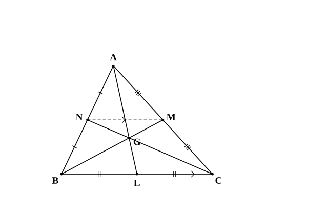
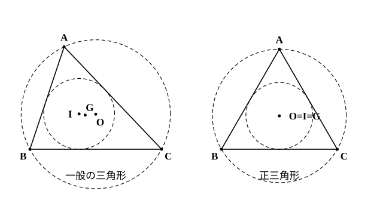

# L03 三角形の重心——中線は2:1に分かれる

- unit_id: hs-math-a-geometry-properties
- 位置づけ: 単元第3レッスン（1.5時間）。L02 の外心・内心に、3つ目の「心」である**重心**を加える回。3本の中線が1点で交わることと、その点が各中線を 2:1 に分けることを、中3の中点連結定理を中心に証明する。3つの心を「何の交点か」で区別して表にまとめ、正三角形では一致することを確かめる。重心は L04（チェバの定理の最初の例、3本の中線）と L12（正四面体の垂線の足）で再訪する。
- distribution_status: published_draft
- license: CC-BY-4.0
- verify_required: 例題数値・記述は監修者検証必須。
- 主概念: ①重心の存在と 2:1（証明の道具は中点連結定理・平行線と比） ②3つの心のまとめ（正三角形では一致・一般には別の点）

---

**使う中学の結果**: 中点連結定理（中3）——三角形の2辺の中点を結ぶ線分は、残りの辺に平行で、長さはその半分である。高さが等しい2つの三角形の面積の比は、底辺の比に等しい（中学）。底辺が等しい2つの三角形の面積の比は、高さの比に等しい（中学）。平行線の錯角は等しい（中2）。三角形の相似条件「2組の角がそれぞれ等しい」と、相似な三角形の対応する辺の比は等しいこと（中3）。平行四辺形になるための条件「2組の対辺がそれぞれ平行」と、平行四辺形の対角線はそれぞれの中点で交わること（中2・stretch で使う）。比の記法と「1つしかないものが2つあるなら同じもの」の言い方は L01 で使ったもの。

## 1. 中線——頂点と向かい合う辺の中点を結ぶ

三角形の1つの頂点と、それに向かい合う辺の中点とを結ぶ線分を**中線**という。三角形には頂点が3つあるので、中線も3本ある。

L02 では、3辺の垂直二等分線と3つの角の二等分線が、それぞれ1点で交わることを証明した。3本の中線はどうだろう。かいてみると1点で交わって見える。しかもその点は、どの中線も「頂点側が長く、辺側が短く」分けているように見える。これを証明する。

## 2. 3本の中線は1点で交わり、2:1 に分ける

**定理5** 三角形の3本の中線は1点で交わる。その点は、各中線を頂点の側から 2:1 に内分する。

証明の作り方は L02 と同じ——2本の中線の交点を決め、3本目の中線もそこを通ることを示す。中心となる道具は中点連結定理で、そこから錯角と相似（中3）で比を読む。空らん（ア）〜（オ）を埋めながら読もう。

**証明** △ABC の辺 BC、CA、AB の中点をそれぞれ L、M、N とし、中線 BM と CN の交点を G とする。

N、M はそれぞれ辺 AB、AC の中点だから、（ア）より NM∥BC、NM=(1/2)BC。

NM∥BC だから、（イ）が等しいので ∠GNM=∠GCB、∠GMN=∠GBC。2組の角がそれぞれ等しいので △GNM∽△GCB で、相似比は NM:CB=（ウ）。

したがって GM:GB=1:2、GN:GC=1:2。すなわち BG:GM=（エ）、CG:GN=2:1。

次に、中線 AL と中線 BM の交点を G′ とする。上とまったく同じ議論を中線 AL、BM について行うと、BG′:G′M=2:1 が得られる。線分 BM を 2:1 に内分する点は（オ）しかないから、G′=G。

よって中線 AL も点 G を通り、3本の中線は G で交わる。このとき AG:GL=2:1 も成り立っている。（証明終）

空らんの答え: （ア）中点連結定理 （イ）錯角 （ウ）1:2 （エ）2:1 （オ）1つ

この点 G を △ABC の**重心**という。

証明の要は、中点を結んでできた小さな三角形 GNM が、大きな三角形 GCB と「向き合う形」で相似になり、その相似比が中点連結定理の 1/2 で決まることにある。2:1 という数は、この 1/2 の裏返しだ。

**例題1** △ABC の重心を G とし、辺 BC の中点を L とする。中線 AL の長さが 9 のとき、AG と GL の長さを求めよ。

定理5より AG:GL=2:1。AL=9 を 2:1 に内分して、AG=9×2/3=**6**、GL=9×1/3=**3**。

検算: AG＋GL=6＋3=9=AL ✓、AG:GL=6:3=2:1 ✓。

**例題2** △ABC の重心を G とし、辺 CA の中点を M とする。GM=2 のとき、BG と中線 BM の長さを求めよ。

BG:GM=2:1 だから BG=2×GM=**4**。BM=BG＋GM=4＋2=**6**。

検算: BG:GM=4:2=2:1 ✓。

:::guide
**2:1 の「2」はどちら側か——中点連結定理の 1/2 から読む**

「重心は中線を 2:1 に分ける」と覚えても、頂点側と辺側のどちらが 2 かで手が止まることがある。数を暗記するより、証明の中身から読むほうが確実だ。中点を結んだ線分 NM は、底辺 BC の半分の長さしかない（中点連結定理）。G をはさんで向き合う2つの三角形 GNM と GCB は相似で、小さいほうの辺が半分——だから G から中点 M までの長さは、G から頂点 B までの長さの半分。つまり「中点側が 1、頂点側が 2」である。図をかくときも、辺の中点の近くに G を置くのが正しい。頂点の近くに置いてしまうと、面積の計算（§3）で結果がずれるので、そこでも気づける。
:::

## 3. 重心と面積——中線は面積を2等分する

重心は長さの比だけでなく、面積の比も決める。以下、△ABC のように三角形の名前でその面積も表す（ノートに書くときは「△ABC の面積」と書いてよい）。

まず、中線 AL は △ABC の面積を2等分する。△ABL と △ALC は、底辺 BL=LC が等しく、頂点 A からの高さが共通だからである。

次に、重心 G と辺 BC の中点 L でできる △GBL を考える。△ABL と △GBL は底辺 BL が共通で、高さの比は AL:GL=3:1 である（A、G、L は一直線上にあるので、A と G から BC に下ろした垂線の長さの比は AL:GL に等しい）。したがって

△GBL=(1/3)△ABL=(1/3)×(1/2)△ABC=(1/6)△ABC

同じ理由で、3本の中線が三角形を切り分けてできる6つの小さな三角形の面積はすべて等しく、それぞれもとの三角形の 1/6 である。2つずつ合わせると、

△GBC=△GCA=△GAB=(1/3)△ABC

**例題3** △ABC の面積が 36 のとき、△GBL（G は重心、L は辺 BC の中点）と △GBC の面積を求めよ。

△GBL=36×1/6=**6**、△GBC=36×1/3=**12**。

検算: △GBC=△GBL＋△GLC=6＋6=12 ✓。

:::guide
**面積の比を線分の比に読み替える、2つの型**

§3 では、面積の比を2通りの方法で線分の比に置き換えた。1つは「高さが同じなら、面積の比は底辺の比」（△ABL と △ALC——底辺 BL と LC）。もう1つは「底辺が同じなら、面積の比は高さの比」（△ABL と △GBL——高さの比は AL:GL）。どちらも中学で使った考え方だが、高校では「面積の比を経由して、離れた場所の線分の比をつなぐ」使い方が増える。次の L04 のチェバの定理は、この読み替えだけで証明できる。面積の問題を見たら、まず「共通の底辺はどれか、共通の高さはどれか」を書き出す——この習慣が、次のレッスンでそのまま道具になる。
:::

## 4. 3つの心をまとめる——正三角形では1点に重なる

L02・L03 で、三角形に3つの点を定めた。並べて区別しておこう。

| 名前 | 何の交点か | 性質 | 位置 |
|---|---|---|---|
| 外心 O | 3辺の垂直二等分線 | 3頂点から等距離（外接円の中心） | 鋭角なら内部・直角なら斜辺の中点・鈍角なら外部 |
| 内心 I | 3つの内角の二等分線 | 3辺から等距離（内接円の中心） | つねに内部 |
| 重心 G | 3本の中線 | 各中線を 2:1 に内分・面積を6等分 | つねに内部 |

一般の三角形では、3つの心は別々の点である。ところが**正三角形**では、3点が1つに重なる。正三角形は各頂点を通る対称軸を3本もち、その1本1本が「辺の垂直二等分線」でもあり、「頂角の二等分線」でもあり、「中線」を含む直線でもあるからだ。3本の直線が同じなら、交点も同じになる。

正三角形でない二等辺三角形では、3つの心は1点には重ならないが、すべて対称軸（頂角の二等分線）の上に並ぶ。ノートに形の違う二等辺三角形を2〜3個かいて3点をかき入れると、3点が近づいたり離れたりしながら対称軸の上に並ぶことが確かめられる（上の図には二等辺の場合を示していない）。

:::guide
**定理は使えるのに証明が言えない、を防ぐ——道具を1本に絞って覚える**

外心・内心・重心の性質は、計算問題で使えるようになると、証明のほうを忘れがちだ。忘れないコツは、証明を文章として覚えるのではなく、「使った道具」を1つだけ覚えることにある。外心は「2点から等距離の点の集まりは垂直二等分線」、内心は「角の内部で2辺から等距離の点の集まりは角の二等分線」、重心は「中点連結定理」。道具が1つ決まれば、証明の流れ（2本の交点を決めて、3本目の条件を満たすことを示す）は3つとも同じなので、あとは復元できる。問われたときに「何を使ったか」を先に言えれば、証明は半分できている。
:::

## 5. 練習

**問1** △ABC の重心を G とする。
(1) 中線 AD の長さが 12 のとき、AG と GD の長さを求めよ。
(2) 中線 BE について GE=3 のとき、BG と BE の長さを求めよ。

**問2** △ABC で BC=10 とし、辺 CA、AB の中点をそれぞれ M、N とする。中線 BM と CN の交点を G とする。
(1) MN の長さを求めよ。
(2) BG:GM を求めよ。
(3) BM=12 のとき、GM と BG の長さを求めよ。

**問3**
(1) 次の表の (a)〜(c) に、外心・内心・重心のいずれかを入れよ。

| 名前 | 何の交点か | 性質 |
|---|---|---|
| (a) | 3辺の垂直二等分線 | 3頂点から等しい距離にある |
| (b) | 3つの内角の二等分線 | 3辺から等しい距離にある |
| (c) | 3本の中線 | 各中線を頂点の側から 2:1 に内分する |

(2) 外心・内心・重心が1点に重なるのは、どんな三角形か。その三角形で3点が重なる理由を1文で書け。

**問4** △ABC の面積は 48 で、重心を G、辺 BC の中点を L、辺 AB の中点を N、辺 CA の中点を M とする。
(1) △GBC の面積を求めよ。
(2) △GBL の面積を求めよ。
(3) 四角形 ANGM の面積を求めよ。

---

:::stretch
**S1** 定理5の別証明。△ABC の辺 AB、CA の中点をそれぞれ N、M とし、中線 BM と CN の交点を G とする。半直線 AG 上に、G を越えた先に AG=GK となる点 K をとる。
(1) △ABK で中点連結定理を使い、NG∥BK、すなわち GC∥BK であることを説明せよ。
(2) 同じように △ACK を考え、GB∥CK であることを説明せよ。
(3) (1)(2) から四角形 GBKC が平行四辺形であることを言い、平行四辺形の対角線の性質（対角線はそれぞれの中点で交わる）を使って、直線 AG と辺 BC の交点 L が BC の中点であること、および AG:GL=2:1 であることを説明せよ。
:::

対応解答: answer_key_L01-05.md

<!-- gen_nav:nav:start（自動生成・手編集しない） -->

---

[← 前のレッスン](lesson_02.md)｜[単元の目次](README.md)｜[解答](answer_key_L01-05.md)｜[次のレッスン →](lesson_04.md)

<!-- gen_nav:nav:end -->
