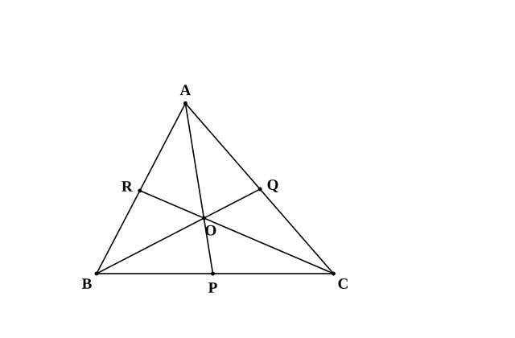
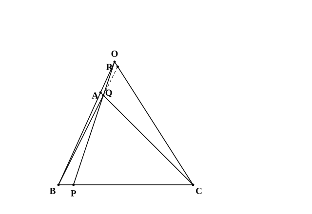
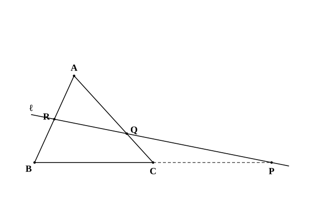
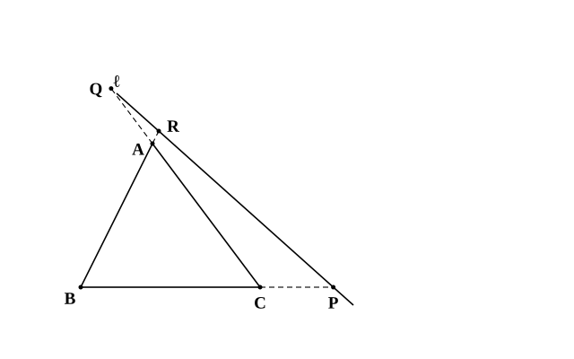

# L04 チェバの定理・メネラウスの定理——1本の式で線分比をつなぐ

- unit_id: hs-math-a-geometry-properties
- 位置づけ: 単元第4レッスン（2時間）。三角形の3辺（またはその延長）の上にある3点の比を、1本の積の式でつなぐ2つの定理を学ぶ。3直線が1点で交わるときが**チェバの定理**、3点が1直線上にあるときが**メネラウスの定理**。証明の道具は中3の面積比と平行線と比（L01 §1）。点が辺の延長上にある場合へも同じ式で広がることを確かめ、stretch で逆を扱う。L03 の重心は、チェバの定理の最初の例（3本の中線）として再訪する。
- distribution_status: published_draft
- license: CC-BY-4.0
- verify_required: 例題数値・記述は監修者検証必須。
- 主概念: ①チェバの定理（証明は面積比と線分比）と点が延長上にある場合 ②メネラウスの定理（証明は平行線と比）と「どこから回るか」の型

---

**使う中学の結果**: 高さが等しい2つの三角形の面積の比は、底辺の比に等しい（中学）。平行線と線分の比（中3・L01 §1）。比の性質——a:b=c:d ならば (a−c):(b−d)=a:b（a≠c のとき）、また (a＋b):b=(c＋d):d。

## 1. 面積の比が線分の比を運ぶ——中3の回収

L03 §3 で使った読み替えを、もう一歩進める。

△ABC の辺 BC 上（両端 B、C を除く）に点 P があるとき、△ABP と △APC は頂点 A からの高さが共通だから、

△ABP:△APC=BP:PC

線分 AP 上（両端 A、P を除く）に点 O をとると、△OBP と △OPC も O からの高さが共通で、△OBP:△OPC=BP:PC。2つの比が同じだから、差をとった比も同じである（a:b=c:d ならば (a−c):(b−d)=a:b）。△ABP−△OBP=△ABO、△APC−△OPC=△ACO なので、

△ABO:△ACO=BP:PC

つまり、「辺 BC 上の比 BP:PC」は、「頂点 A と点 O をはさむ2つの三角形の面積の比」に置き換えられる。この置き換えが、次の定理の証明の全部である。

## 2. チェバの定理——3直線が1点で交わるとき

**定理6 チェバの定理**（チェバは数学者の名前） △ABC の内部の点 O と各頂点を結ぶ直線 AO、BO、CO が、それぞれ向かい合う辺 BC、CA、AB と交わる点を P、Q、R とすると、

(BP/PC)×(CQ/QA)×(AR/RB)=1

式の中の BP/PC は分数（BP を PC で割った値）である。横書きでスラッシュを使って書いた分数は、ノートでは分子を上・分母を下にした縦の分数に書き直してよい。

証明は §1 の置き換えを3回行うだけだ。空らん（ア）〜（エ）を埋めながら読もう。

**証明** §1 より、辺 BC 上の比は BP/PC=△ABO/△ACO。

同じことを頂点 B、C から見ると、辺 CA 上の比は CQ/QA=（ア）、辺 AB 上の比は AR/RB=（イ）。

3つをかけると、

(BP/PC)×(CQ/QA)×(AR/RB)=(△ABO/△ACO)×（ア）×（イ）

右辺の分母と分子には、△ABO、△BCO、△CAO がそれぞれ1回ずつ現れ（△ACO と △CAO は同じ三角形）、すべて（ウ）されて、右辺は（エ）になる。（証明終）

空らんの答え: （ア）△BCO/△BAO （イ）△CAO/△CBO （ウ）約分 （エ）1

式の左辺は、頂点 B から出発して B→P→C→Q→A→R→B と三角形を**一周**している。頂点、分点、頂点、分点、頂点、分点、そして出発した頂点へ戻る。この「一周の型」を覚えておけば、どの比を分子にしてどの比を分母にするかで迷わない。分点は辺の延長上にあってもよい（例題2・例題4）。

**例題1** △ABC の内部の点 O について、直線 AO、BO、CO と辺 BC、CA、AB の交点を P、Q、R とする。BP:PC=2:1、CQ:QA=3:2 のとき、AR:RB を求めよ。

チェバの定理より (2/1)×(3/2)×(AR/RB)=1。(2/1)×(3/2)=3 だから AR/RB=1/3、すなわち **AR:RB=1:3**。

検算: (2/1)×(3/2)×(1/3)=1 ✓。

**3本の中線はチェバの定理の最初の例である**。P、Q、R が各辺の中点なら BP/PC=CQ/QA=AR/RB=1 で、積は確かに 1。L03 で「3本の中線は1点で交わる」ことを証明したが、チェバの定理はその事実と矛盾しない。ただし注意——チェバの定理は「1点で交わるならば積が 1」であって、「積が 1 ならば1点で交わる」は逆の主張である。逆が成り立つかどうかは stretch で確かめる。

:::guide
**どの比を書けばよいか——一周の型で決める**

チェバの定理とメネラウスの定理で起こりやすいつまずきは、3つの比のうち1つを逆向きに書いてしまうことだ。防ぎ方は、式を「3つの分数」ではなく「三角形を一周する道順」として書くこと。どこかの頂点（たとえば B）から出発し、辺の上の点（P）を通って次の頂点（C）へ、また辺の上の点（Q）を通って次の頂点（A）へ、最後の辺の上の点（R）を通って出発点（B）へ戻る。通った順に「頂点→点／点→頂点」を分数の「分子／分母」に置いていくと、(BP/PC)(CQ/QA)(AR/RB) が自動的にできる。出発点はどの頂点でもよく、逆向きに回っても積は 1 のまま（すべての分数がひっくり返るだけ）。「B から回る」と決めて毎回同じ順で書く、を習慣にしよう。
:::

## 3. 点が延長上にあるとき——条件を見直しても同じ式

点 O が三角形の**外部**にあるときはどうなるか。ただし、O は3辺を含む直線上にはなく、3直線 AO、BO、CO はそれぞれ直線 BC、CA、AB と交わるとする（O が辺を含む直線上にあると交点が頂点と重なって比が作れず、AO∥BC のように平行だと交点 P がない）。このとき、交点 P、Q、R のうち、2点が辺の延長上に来る。

このときも、線分の長さを正の数として同じ式が成り立つ。

(BP/PC)×(CQ/QA)×(AR/RB)=1

証明は §1 と同じ面積比の置き換えでできるが、O の位置によって「差の比」が「和の比」に変わる場面がある。ここでは証明を省き、式が同じ形になることを認めて使う（上の図で点の配置だけ確かめておこう）。

**例題2** △ABC の辺 AB 上に AR:RB=1:2 となる点 R をとり、辺 CA を A の側に延長した直線上に CQ:QA=3:1 となる点 Q をとる。直線 BQ と直線 CR の交点を O とし、直線 AO と直線 BC の交点を P とすると、P は辺 BC の延長上にある。BP:PC を求め、P が B、C のどちらの側にあるかを答えよ。

チェバの定理より (BP/PC)×(3/1)×(1/2)=1。(3/1)×(1/2)=3/2 だから BP/PC=2/3、すなわち **BP:PC=2:3**。

P は延長上の点で BP<PC だから、B に近い側——**B の側**の延長上にある（L01 §2 の外分の向きと同じ判断）。

検算: (2/3)×(3/1)×(1/2)=1 ✓。

:::guide
**延長上の点でも式は変わらない——ただし「どちら側か」は自分で決める**

点が辺の延長上にあっても、チェバの定理の式はそのままだ。安心してよいのはここまでで、1つだけ増える仕事がある。求めた比から、点が辺のどちら側の延長上にあるかを決めることだ。判断の仕方は L01 の外分と同じ——BP:PC=2:3 で P が延長上なら、B からの距離のほうが短いので P は B の側にいる。逆に BP:PC=3:2 なら C の側。この一手を省くと、次の計算（たとえば PC の長さを BC から求めるとき、P が B の側なら PC=BC＋BP、C の側なら PC=BP−BC）で符号がずれる。「比を求める」と「側を決める」を、別々の2ステップとして書く習慣をつけておこう。
:::

## 4. メネラウスの定理——3点が1直線上にあるとき

チェバの定理では「3本の直線が1点で交わる」ことが条件だった。次は「3つの点が1本の直線上にある」ことを条件にする。

**定理7 メネラウスの定理**（メネラウスは数学者の名前） △ABC の頂点を通らない直線 ℓ が、直線 BC、CA、AB とそれぞれ点 P、Q、R で交わるとき、

(BP/PC)×(CQ/QA)×(AR/RB)=1

直線 ℓ が三角形を横切るときは、P、Q、R のうち2点が辺上・1点が辺の延長上にある。式の形はチェバの定理とまったく同じで、一周の型で書ける。

証明の道具は平行線と比（L01 §1）。空らん（ア）〜（エ）を埋めながら読もう。以下では、Q、R が辺上、P が辺 BC を C の側に延長した直線上にあるとする。

**証明** 点 C を通り直線 ℓ に平行な直線をひき、辺 AB との交点を D とする。

△BRP で CD∥PR だから、（ア）より BC:CP=BD:DR。比の性質から (BC＋CP):CP=(BD＋DR):DR、すなわち BP:PC=（イ）。

△ARQ で CD∥QR だから、（ア）より AQ:QC=AR:RD、すなわち CQ:QA=（ウ）。

したがって、

(BP/PC)×(CQ/QA)×(AR/RB)=(BR/RD)×(RD/RA)×(AR/RB)=（エ）

（証明終）

空らんの答え: （ア）平行線と比 （イ）BR:RD （ウ）RD:RA （エ）1

補助線 CD が、辺 BC 上の比と辺 CA 上の比を、どちらも辺 AB 上の比（R と D で分けた比）に運んだ——だから3つの比の積で AB 上の量がすべて約分される。L01 の角の二等分線の証明と、同じ働きをする補助線である。

**例題3** △ABC の辺 CA 上に CQ:QA=1:2 となる点 Q、辺 AB の中点 R をとる。直線 QR と辺 BC の延長との交点を P とするとき、BP:PC を求め、P が B、C のどちらの側にあるかを答えよ。

メネラウスの定理より (BP/PC)×(1/2)×(1/1)=1。よって BP/PC=2、**BP:PC=2:1**。P は延長上の点で BP>PC だから、**C の側**の延長上にある。

検算: (2/1)×(1/2)×(1/1)=1 ✓。

メネラウスの定理の逆はどうか。積 (BP/PC)×(CQ/QA)×(AR/RB)=1 だけでは足りない——3辺の中点は積が 1 だが1直線上にはない（これはチェバの定理の場合）。3点 P、Q、R（どれも頂点ではない）のうち辺の延長上にあるものが1個または3個で、かつ積が 1 ならば、3点は1直線上にある。この逆の証明は stretch S1（チェバの定理の逆）と同じ型でできるので、ここでは省く。

直線 ℓ が三角形を横切らないとき（P、Q、R の3点がすべて辺の延長上にあるとき）も、同じ式が成り立つ。上の証明は、直線 ℓ が三角形を横切る配置（Q、R が辺上・P が延長上）だけを扱った。3点とも延長上の配置でも同じ補助線で証明できるが、点の配置によって「和の比」が「差の比」に変わる場面がある。§3 と同じく、ここでは証明を省き、式が同じ形になることを認めて使う。

## 5. 2つの定理の使い分けと、複合問題の型

| 定理 | 条件 | 結論の式 | 証明の道具 |
|---|---|---|---|
| チェバの定理 | 3直線 AP、BQ、CR が**1点で交わる** | (BP/PC)(CQ/QA)(AR/RB)=1 | 面積比と線分比 |
| メネラウスの定理 | 3点 P、Q、R が**1直線上にある** | 同じ | 平行線と比 |

式が同じなので、使い分けの決め手は条件のほうにある。図の中で「3本の線が1点に集まっている」ならチェバ、「1本の直線が三角形の3辺（の延長）を切っている」ならメネラウスである。

複合問題では、「どの三角形に、どの直線を当てるか」を自分で選ぶ。

**例題4** △ABC の辺 BC 上に BD:DC=1:2 となる点 D、辺 CA の中点 E をとり、線分 AD と BE の交点を O とする。AO:OD を求めよ。

求めたいのは線分 AD 上の比だから、AD を1辺にもつ三角形として △ADC を選ぶ。この三角形の辺 AD、DC、CA（またはその延長）を、直線 BE が O、B、E で切っている——B は辺 DC を D の側に延長した直線上にある。△ADC と直線 BE にメネラウスの定理を使う。A から一周して A→O→D→B→C→E→A、

(AO/OD)×(DB/BC)×(CE/EA)=1

BD:DC=1:2 だから DB/BC=1/3、E は中点だから CE/EA=1。よって (AO/OD)×(1/3)×1=1、AO/OD=3、**AO:OD=3:1**。

検算: (3/1)×(1/3)×(1/1)=1 ✓。

:::guide
**複合問題で「どの三角形か」を選ぶ手がかり**

例題4で難しいのは計算ではなく、△ADC を選ぶところだ。手がかりは2つある。1つ目は、「求めたい比がのっている線分（AD）を辺にもつ三角形」を候補にすること。AD を辺にもつ三角形は △ABD と △ADC の2つで、この段階ではどちらも候補である。2つ目は、「もう1つの直線（BE）が、その三角形の頂点を通らずに、3辺すべて（の延長）を切っているか」を確かめること（定理7の「頂点を通らない直線」という条件）。△ABD は、直線 BE が頂点 B を通るので使えない。△ADC なら、直線 BE は AD を O で、DC の延長を B で、CA を E で切る——3点そろっているのでメネラウスの定理が使える。慣れないうちは、選んだ三角形の3頂点と3つの交点を書き出してから一周の型を当てる。この「三角形を選ぶ」段が、次の L14（空間図形の中に平面を切り出す）で「平面を選ぶ」段に育っていく。
:::

## 6. 練習

**問1** △ABC の内部の点 O について、直線 AO、BO、CO と辺 BC、CA、AB の交点をそれぞれ P、Q、R とする。BP:PC=3:2、CQ:QA=1:3 のとき、AR:RB を求めよ。

**問2** △ABC の辺 AB 上に AR:RB=2:1 となる点 R をとり、辺 CA を A の側に延長した直線上に CQ:QA=5:2 となる点 Q をとる。直線 BQ と直線 CR の交点を O、直線 AO と直線 BC の交点を P とすると、P は辺 BC の延長上にある。BP:PC を求め、P が B、C のどちらの側にあるかを答えよ。

**問3** △ABC の辺 AB 上に AR:RB=2:3 となる点 R、辺 CA 上に CQ:QA=1:2 となる点 Q をとる。直線 RQ と辺 BC の延長との交点を P とするとき、BP:PC を求め、P が B、C のどちらの側にあるかを答えよ。

**問4** チェバの定理の証明の空らん（ア）〜（オ）を埋めよ（△ABC の内部の点 O と、直線 AO、BO、CO と辺 BC、CA、AB の交点 P、Q、R について）。

　△ABP と △APC は頂点 A からの高さが等しいから、面積の比は（ア）の比に等しく、△ABP:△APC=BP:PC。同じように △OBP:△OPC=BP:PC。2つの比が等しいので差の比も等しく、△ABO:△ACO=（イ）。
　同じようにして、CQ:QA=（ウ）、AR:RB=（エ）。
　3つの比をかけると、右辺はすべて約分されて (BP/PC)×(CQ/QA)×(AR/RB)=（オ）。

**問5** △ABC の辺 BC 上に BD:DC=2:1 となる点 D、辺 CA の中点 E をとり、線分 AD と BE の交点を O とする。
(1) △ADC と直線 BE にメネラウスの定理を使って、AO:OD を求めよ。
(2) △BCE と直線 AD にメネラウスの定理を使って、BO:OE を求めよ。

---

:::stretch
**S1** チェバの定理の逆。
(1) △ABC の辺 BC、CA、AB 上（辺の内部）にそれぞれ点 P、Q、R があり、(BP/PC)×(CQ/QA)×(AR/RB)=1 が成り立つとする。このとき3直線 AP、BQ、CR が1点で交わることを、次の順で説明せよ。①直線 BQ と CR の交点を O とし、直線 AO と辺 BC の交点を P′ とする。②△ABC と点 O にチェバの定理を使って、BP′/P′C を BP/PC と比べる。③L01 で使った「辺 BC 上でこの比に内分する点は1つしかない」を使う。
(2) (1) を使って、三角形の3つの内角の二等分線が1点で交わること（L02 の定理4）の別証明を書け。∠A、∠B、∠C の二等分線と向かい合う辺の交点を P、Q、R とし、L01 の定理1（角の二等分線と辺の比）で BP/PC、CQ/QA、AR/RB を辺の長さで表してから、積を計算せよ。
:::

対応解答: answer_key_L01-05.md

<!-- gen_nav:nav:start（自動生成・手編集しない） -->

---

[← 前のレッスン](lesson_03.md)｜[単元の目次](README.md)｜[解答](answer_key_L01-05.md)｜[次のレッスン →](lesson_05.md)

<!-- gen_nav:nav:end -->
