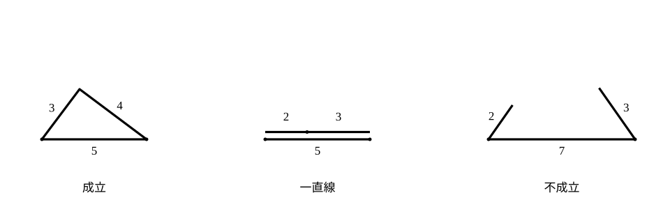
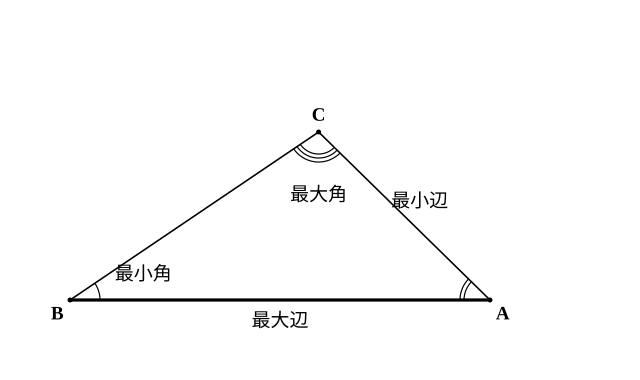

# L05 三角形の辺と角——成り立つ条件と大小の対応

- unit_id: hs-math-a-geometry-properties
- 位置づけ: 単元第5レッスン（1.5時間）。三角形の節（L01〜L05）の締め。「3つの長さを与えられたら、三角形はいつでも描けるのか」という問いから、**三角形が成立するための条件**を確かめ、辺の大小と向かい合う角の大小が対応することを使えるようにする。後者の証明は stretch に置く。L06 からは円の性質に移る。
- distribution_status: published_draft
- license: CC-BY-4.0
- verify_required: 例題数値・記述は監修者検証必須。
- 主概念: ①三角形が成立するための条件（2辺の和と差）と「3辺を与えられたら描けるか」の判定 ②辺の大小と対角の大小（結果は本文・証明は stretch）

---

**使う中学の結果**: 三角形の外角は、それと隣り合わない2つの内角の和に等しい（中2）。二等辺三角形の2つの底角は等しく、逆に2つの角が等しい三角形は二等辺三角形である（中2）。3辺の長さが決まれば、三角形の形と大きさは1つに決まる（中2・合同条件）。三角形の内角の和は 180° である（中2）。絶対値 |b−c| は、b と c の差（大きいほうから小さいほうを引いた値）を表す（中1）。

## 1. 3本の棒で三角形は組めるか

長さ 3、4、5 の3本の棒があれば、三角形が組める。では長さ 2、3、7 の3本ではどうか。短い2本（2 と 3）を端でつないでどう広げても、合わせた長さは 5 で、7 の棒の両端に届かない。三角形は組めない。

中2では「3辺の長さが決まれば三角形は1つに決まる」と学んだ。それは「三角形が存在するなら」の話であって、どんな3つの長さでも三角形になるわけではない。3つの長さのどれか1つが長すぎると、残りの2本が届かない。

## 2. 三角形が成立するための条件

**定理8 三角形が成立するための条件** 3つの正の数 a、b、c を3辺の長さとする三角形が存在するのは、次の3つがすべて成り立つときであり、そのときに限る。

a<b＋c、　b<c＋a、　c<a＋b

言い方を変えると、「どの辺も、他の2辺の和より短い」。

3つの不等式を全部調べる必要はない。**最も長い辺**についての不等式だけ調べればよい。最長の辺を a とすると、b≦a<a＋c、c≦a<a＋b は自動的に成り立つからだ。つまり、

**判定の手順**: 最も長い辺が、他の2辺の和より短いか——これだけを見る。

さらに、b と c を固定して a の範囲として書くと、上の3つの不等式は次の1つにまとまる。

|b−c|<a<b＋c

「残りの辺は、2辺の差より長く、2辺の和より短い」（|b−c| は b と c の差——大きいほうから小さいほうを引いた値。中1の絶対値）。「差より長い」は、a が最長でない場合の条件である（たとえば b が最長なら b<a＋c、a について書き直すと b−c<a）。

なぜこの条件が必要かは、「2点を結ぶ最短の道は線分」という感覚で納得できる——B から C へ行くとき、A に寄り道する道 BA＋AC は、まっすぐ行く BC より長い。厳密な証明は §3 の定理を使って stretch で行う。逆に、3つの不等式が成り立てば必ず三角形が作れること（定理8の「そのときに限る」のもう半分）は、最も長い辺を線分 AB としてかき、B を中心とする半径 a の円と A を中心とする半径 b の円をかくと見当がつく——a＋b>AB なら2つの円は交わり、その交点 C をとれば BC=a、CA=b の三角形ができる。2つの円が交わる条件は L09 で確かめるので、ここでは証明せず認めて使う。

**例題1** 次の3つの長さを3辺とする三角形は存在するか。
(1) 3、5、7　(2) 2、3、5　(3) 1、4、6

(1) 最長の辺は 7。他の2辺の和は 3＋5=8 で、7<8 だから**存在する**。
(2) 最長の辺は 5。他の2辺の和は 2＋3=5 で、5<5 は成り立たない（等しい）。**存在しない**——2本の棒を一直線に並べると、ちょうど5の棒と重なってしまい、三角形にならない。
(3) 最長の辺は 6。他の2辺の和は 1＋4=5 で、6<5 は成り立たない。**存在しない**。

**例題2** 2辺の長さが 5 と 8 の三角形で、残りの辺の長さ x の範囲を求めよ。

|8−5|<x<8＋5 より **3<x<13**。

検算: x=3 なら 3＋5=8 で最長の辺 8 と等しくなり（一直線につぶれる）、x=13 なら 5＋8=13 で同じくつぶれる。その内側だけが三角形になる ✓。

:::guide
**3つの不等式のうち、なぜ1つだけ調べればよいのか**

定理8は3つの不等式で書かれているのに、判定は「最長の辺」1つでよい、と言った。他の2つが自動的に成り立つ理由を確かめておこう。a が最長なら b≦a である。右辺の c＋a は a より大きい（c は正の数）ので、b≦a<c＋a、つまり b<c＋a は必ず成り立つ。c<a＋b も同じ理由だ。だから「壊れる可能性があるのは、最長の辺についての不等式だけ」となる。逆に言えば、3つの長さが与えられたら、まず最長の辺を見つけるのが第一手だ。長さがそろっていない順に並んでいるときほど、この第一手を飛ばして手近な2辺から足し始めてしまいやすい。
:::

:::guide
**等号のとき——「つぶれた三角形」は三角形に数えない**

例題1(2) のように、最長の辺が他の2辺の和とちょうど等しいとき、3本の棒は一直線に並んでしまう。3点が同じ直線上にある形を、ここでは三角形とは呼ばない（面積が 0 で、角も 0° と 180° になり、三角形の性質が使えない）。だから定理8の不等号は「<」であって「≦」ではない。例題2で範囲の端 x=3、x=13 を含めなかったのも同じ理由だ。範囲を答えるときは、端が含まれるかどうかを、この「一直線に並ぶかどうか」で毎回確かめる。
:::

## 3. 辺の大小と角の大小——向かい合うものどうしが対応する

三角形では、長い辺の向かい側に大きい角がある。この感覚を定理として確かめる。

**定理9 辺の大小と対角の大小** △ABC で、

AB>AC ならば ∠C>∠B、　逆に ∠C>∠B ならば AB>AC

すなわち、2辺の大小と、それぞれに向かい合う角の大小は、同じ向きに対応する。「向かい合う」とは、辺 AB に向かい合うのは頂点 C の角 ∠C、辺 AC に向かい合うのは ∠B、ということである。

上の図は AB が最も長く CA が最も短い三角形の例で、例題3の三角形とは別のものである。この定理は当たり前に見えるかもしれない。だが「なぜ成り立つか」を言うには、二等辺三角形と三角形の外角（中2）を組み合わせた証明が要る。証明は stretch に置き、本文では結果を使えるようにする。

**例題3** △ABC で AB=7、BC=5、CA=6 のとき、3つの角を小さいものから順に並べよ。

辺と向かい合う角を書き出す。AB=7 に向かい合うのは ∠C、BC=5 に向かい合うのは ∠A、CA=6 に向かい合うのは ∠B。辺の大小は BC<CA<AB だから、向かい合う角も同じ順で **∠A<∠B<∠C**。

**例題4** △ABC で ∠A=50°、∠B=60°、∠C=70° のとき、3つの辺を短いものから順に並べよ。

角の大小は ∠A<∠B<∠C。向かい合う辺は ∠A に BC、∠B に CA、∠C に AB だから、**BC<CA<AB**。

この定理から、すぐに次のことも言える——直角三角形では、直角が最も大きい角だから、その向かい側の**斜辺が最も長い辺**である。中3の三平方の定理で「斜辺の2乗は他の2辺の2乗の和」だったことと合っている。

:::guide
**向かい合う、をペアの表にしてから比べる**

辺と角の大小を並べる問題で起こりやすい取り違えは、「辺 AB が最長だから ∠A が最大」と、辺の名前に含まれる頂点の角を選んでしまうことだ。辺 AB に向かい合うのは、AB に含まれない残りの頂点 C の角である。防ぎ方は単純で、比べる前に「辺→向かい合う角」のペアを3行の表に書くこと。AB→∠C、BC→∠A、CA→∠B。表ができてから大小の順に並べれば、対応の取り違えを防ぎやすい。手を動かす分だけ遅く見えるが、頭の中で対応させようとして逆に書き、あとで直すことを思えば、むだな手間ではない。
:::

## 4. 練習

**問1** 次の3つの長さを3辺とする三角形が存在するかどうかを、理由をつけて答えよ。
(1) 4、6、9　(2) 3、4、8　(3) 5、5、10

**問2** 3辺の長さがすべて整数で、周の長さ（3辺の和）が 12 である三角形をすべて求めよ。ただし、辺の長さの組は順序を区別しない（たとえば 4、5、3 と 3、4、5 は同じ組とみる）。

**問3** 2辺の長さが 6 と 10 の三角形がある。
(1) 残りの辺の長さ x の範囲を求めよ。
(2) さらに、x が他のどの辺よりも長いとき、x の範囲を求めよ。

**問4**
(1) △ABC で AB=8、BC=6、CA=7 のとき、3つの角を小さいものから順に並べよ。
(2) △ABC で ∠A=40°、∠B=75° のとき、3つの辺を短いものから順に並べよ。

---

:::stretch
**S1** 定理9の証明と、定理8の必要性の証明。
(1) △ABC で AB>AC とする。辺 AB 上に AD=AC となる点 D をとる。△ADC が二等辺三角形であることと、∠ADC が △DBC の頂点 D における外角であることを使って、∠C>∠B を示せ（∠C=∠ACB は ∠ACD より大きいことに注意）。
(2) △ABC で ∠C>∠B とする。AB と AC の大小は「AB=AC」「AB<AC」「AB>AC」の3通りしかない。前の2つがそれぞれ ∠C>∠B と両立しないことを（二等辺三角形の底角と (1) を使って）示し、AB>AC を導け。
(3) △ABC で BA＋AC>BC を示せ。辺 BA を A の側に延長した直線上に AD=AC となる点 D をとり、△ACD が二等辺三角形であることと、∠BCD>∠BDC であることから、(2) を △BCD に使え。
:::

対応解答: answer_key_L01-05.md

<!-- gen_nav:nav:start（自動生成・手編集しない） -->

---

[← 前のレッスン](lesson_04.md)｜[単元の目次](README.md)｜[解答](answer_key_L01-05.md)｜[次のレッスン →](lesson_06.md)

<!-- gen_nav:nav:end -->
