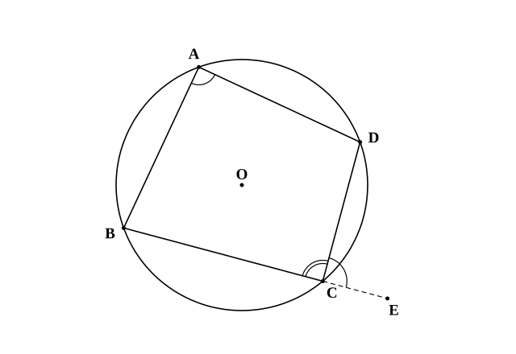
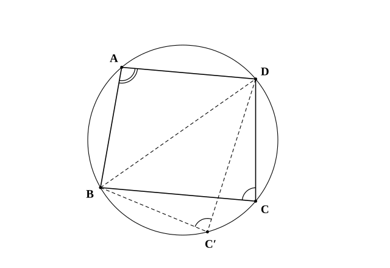
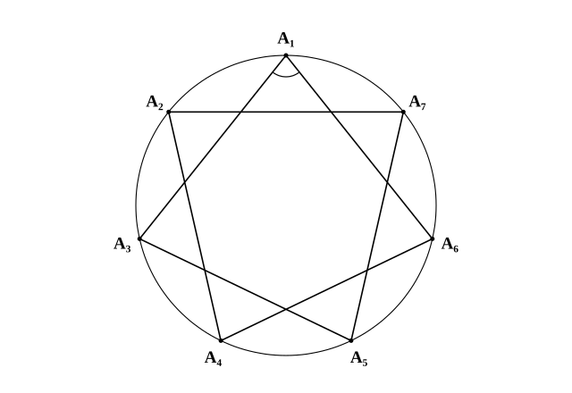

# L06 円に内接する四角形——性質と、円に内接する条件

- unit_id: hs-math-a-geometry-properties
- 位置づけ: 単元第6レッスン（2時間）。ここから「円の性質」の節（L06〜L09）に入る。中3で学んだ円周角の定理とその逆を回収し、4つの頂点が1つの円周上にある四角形の性質（対角の和が 180°・外角は内対角に等しい）を証明する。後半では「逆が成り立つか」を問い、四角形が円に内接する条件と、4点が同一円周上にあることの判定法をそろえる。L08（方べきの定理の逆）と L14（空間の中で平面の定理を使う）で再訪する。
- distribution_status: published_draft
- license: CC-BY-4.0
- verify_required: 例題数値・記述は監修者検証必須。
- 主概念: ①円に内接する四角形の性質（対角の和は 180°・外角は内対角に等しい）を円周角の定理で証明する ②四角形が円に内接する条件（逆）と、4点が同一円周上にあることの判定

---

**使う中学の結果**: 円周角の定理（1つの弧に対する円周角は等しく、その弧に対する中心角の半分）と、その逆（中3）。二等辺三角形の2つの底角は等しい（中2・問3 で使う）。三角形の内角の和は 180°、四角形の内角の和は 360°（中2・検算と例題5 で使う）。三角形の外角は、それと隣り合わない2つの内角の和に等しい（中2・stretch で使う）。

## 1. 円周角の定理とその逆——中3の回収

まず言葉を1つそろえる。四角形の4つの頂点がすべて1つの円周上にあるとき、その四角形は円に**内接する**（ないせつする）という。三角形の3頂点を通る円を L02 で「外接円」と呼んだのと同じく、この円は四角形の外接円と呼ばれる。三角形にはいつでも外接円があるが（3辺の垂直二等分線は必ず1点で交わる——L02）、四角形はそうではない。長方形は円に内接するが、細長いひし形は4頂点を通る円をもたない。「どんな四角形なら円に内接するのか」——これがこのレッスンの問いである。なお、このレッスンで四角形というときは、へこみのない四角形（4つの内角がどれも 180° より小さい四角形）を指す。へこみのない四角形では、どの辺を延ばした直線についても、残りの2つの頂点はその直線の同じ側にある。

道具は中3の円周角の定理だ。弧 AB に対する円周角は、円周上のどこにとっても等しく、中心角 ∠AOB の半分である。逆も成り立つ。

**円周角の定理の逆**: 2点 C、D が直線 AB について**同じ側**にあり、∠ACB=∠ADB ならば、4点 A、B、C、D は同一円周上にある。

「同じ側」の条件を落とさないこと。C と D が直線 AB の反対側にあるときは、∠ACB=∠ADB でも4点が同一円周上にあるとは限らない（たとえば長方形でない平行四辺形 ACBD では、対角線 AB の両側にある C と D について ∠ACB=∠ADB だが、4点は同一円周上にない）。この「同じ側」は §3 でもう一度効いてくる。

このレッスンでは証明を何度か書く。中2で学んだ証明の型を1度だけ確かめておく——**仮定**（わかっていること）から出発し、**根拠**（使う定理・定義）を1つずつ示して、**結論**（示したいこと）に至る。「なぜそう言えるか」の根拠が書けていれば、それが証明である。

## 2. 円に内接する四角形の性質——対角の和は 180°

円に内接する四角形 ABCD を考える。向かい合う角（∠A と ∠C、∠B と ∠D）を**対角**（たいかく）という。

**円に内接する四角形の性質**
(1) 対角の和は 180° である。つまり ∠A＋∠C=180°、∠B＋∠D=180°。
(2) 1つの外角は、それと隣り合う内角の対角に等しい。この角を**内対角**（ないたいかく）という。

**証明（穴埋め）** 円の中心を O とする。∠A は弧 BCD（B から C を通って D に至る弧。通る点を間に書いて2つの弧を区別する。A を含まない側）に対する円周角、∠C は弧 BAD（C を含まない側）に対する円周角である。円周角の定理から、

∠A=（弧 BCD に対する中心角）×1/2、∠C=（弧 （ア） に対する中心角）×1/2

2つの弧 BCD と BAD を合わせると円周全体になるから、2つの中心角の和は （イ）° である（一方の中心角が 180° を超えることがあるが、円周角の定理はその場合も成り立つ——中3）。よって

∠A＋∠C=（（イ）°）×1/2=（ウ）°

同じように ∠B＋∠D=180° も示せる。

空らんの答え: （ア）BAD （イ）360 （ウ）180（弧 BAD は弧 DAB と書いても同じ弧を表す。角や線分の記号も、∠BCD と ∠DCB、OB と BO のように文字を逆の順に書いたものは同じものを表す。以下の穴埋めでも同じ）

(2) は (1) からすぐに出る。辺 BC を C の側に延長した点を E とすると、∠DCE は ∠BCD の外角だから ∠DCE=180°−∠BCD。一方 (1) から ∠A=180°−∠BCD。よって ∠DCE=∠A、つまり外角は内対角に等しい。

**例題1** 円に内接する四角形 ABCD で、∠A=75°、∠B=110° のとき、∠C と ∠D を求めよ。

対角の和が 180° だから、∠C=180°−75°=**105°**、∠D=180°−110°=**70°**。

検算: 四角形の内角の和は 360° だから、75＋110＋105＋70=360 ✓。

**例題2** 円に内接する四角形 ABCD で、辺 BC を C の側に延長した点を E とする。∠DCE=64°、∠ABC=98° のとき、∠BAD と ∠ADC を求めよ。

外角は内対角に等しいから ∠BAD=∠DCE=**64°**。∠ADC は ∠ABC の対角だから ∠ADC=180°−98°=**82°**。

検算: ∠BCD=180°−64°=116°、64＋98＋116＋82=360 ✓。

:::guide
**なぜ「対角」でなければならないのか**

「円に内接する四角形は角の和が 180°」と大づかみに覚えると、隣り合う角 ∠A と ∠B に当てはめてしまう。隣り合う2つの角の和が 180° になるのは、AD∥BC のような平行線の場面（平行線の同じ側にある内角）であって、円とは別の話だ。円周角の定理が教えてくれるのは「向かい合う2つの頂点が、同じ弦の反対側から円周全体を分け合っている」ことである。∠A が見ている弧と ∠C が見ている弧を合わせるとちょうど1周——だから 180° になる。証明の中の「2つの弧を合わせると円周全体」の1文が、この性質の心臓部だ。図を見るとき、「この2つの角は同じ弦の両側にあるか」を確かめる習慣をつけると、隣り合う角に誤って使うことがなくなる。
:::

## 3. 四角形が円に内接する条件——逆は成り立つか

§2 の性質は「円に内接するならば、対角の和は 180°」だった。逆に、「対角の和が 180° ならば、円に内接する」と言えるだろうか。

**四角形が円に内接する条件**
四角形 ABCD について、次のどちらかが成り立てば、ABCD は円に内接する。
(1) 1組の対角の和が 180° である（∠A＋∠C=180° または ∠B＋∠D=180°）。
(2) 1つの外角が、その内対角に等しい。

**証明（穴埋め）** (1) を示す。∠A＋∠C=180° と仮定する。3点 A、B、D を通る円をかく（3点を通る円は必ず1つある——L02 の外接円）。この円周上で、直線 BD について点 C と同じ側に点 C′ をとる。四角形 ABC′D は円に内接するから、§2 の性質より

∠A＋∠BC′D=（ア）°

仮定 ∠A＋∠BCD=180° と比べると、∠BC′D=（イ）。ここで C と C′ は直線 BD について同じ側にあり、∠BC′D=∠BCD だから、円周角の定理の**逆**によって4点 B、C、C′、D は同一円周上にある。3点 B、C′、D を通る円は1つしかないので、その円は初めにかいた円である。よって C はこの円周上にあり、四角形 ABCD は円に内接する。

空らんの答え: （ア）180 （イ）∠BCD

(2) は、外角が内対角に等しければ「外角＋隣の内角=180°」から対角の和が 180° になるので、(1) に帰着する。

**例題3** 四角形 ABCD で ∠ABC=95°、∠ADC=85° のとき、この四角形は円に内接するか。

∠B と ∠D は対角で、95°＋85°=180°。よって条件 (1) から、四角形 ABCD は**円に内接する**。

**例題4** 四角形 ABCD で、対角線 AC、BD を引く。∠BAC=∠BDC=40° のとき、4点 A、B、C、D が同一円周上にあることを示し、∠ABD=∠ACD であることを説明せよ。

∠BAC と ∠BDC はどちらも辺 BC を見る角で、A と D は直線 BC について同じ側にある（§1 で約束したへこみのない四角形では、辺 BC を延ばした直線の同じ側に A と D がある）。∠BAC=∠BDC だから、円周角の定理の逆より4点 A、B、C、D は同一円周上にある。すると ∠ABD と ∠ACD はどちらも弧 AD に対する円周角だから、∠ABD=∠ACD である。

:::guide
**「同じ側」と「反対側」——2つの判定法の使い分け**

4点が同一円周上にあるかを調べる判定法は2つ出てきた。円周角の定理の逆は、1本の弦（例題4では BC）を**同じ側**から見る2つの角が等しいことを使う。円に内接する条件 (1) は、1本の対角線（例題3では AC）を**反対側**から見る2つの角の和が 180° であることを使う。図の中で「等しい2つの角を見つけた」とき、その2つの角が弦の同じ側にあるなら「等しい」で判定、反対側にあるなら「和が 180°」で判定——この振り分けを先にするのがこつだ。反対側にある角が等しいだけでは（例: 長方形でない平行四辺形）円に内接するとは限らないことは §1 で見た。
:::

## 4. 4点が同一円周上にあることを示す——3つの入口

この節の道具をまとめる。4点 A、B、C、D が同一円周上にあることを示すには、次のどれか1つを確かめればよい。

| 入口 | 確かめること | 出どころ |
|---|---|---|
| ① 同じ側に等しい角 | 直線 BC について同じ側にある A、D で ∠BAC=∠BDC | 円周角の定理の逆（中3） |
| ② 対角の和 | 四角形 ABCD で ∠A＋∠C=180°（または ∠B＋∠D=180°） | §3 の条件 (1) |
| ③ 外角と内対角 | 四角形 ABCD の1つの外角が内対角に等しい | §3 の条件 (2) |

**例題5** 鋭角三角形 ABC で、頂点 B から辺 AC に下ろした垂線の足（垂線と辺との交点）を D、頂点 C から辺 AB に下ろした垂線の足を E とする。4点 B、C、D、E が同一円周上にあることを示し、∠AED=∠ACB であることを説明せよ。

∠BEC=90°、∠BDC=90° で、E と D はどちらも直線 BC について A と同じ側にある。辺 BC を見る2つの角が等しいから、入口①（円周角の定理の逆）により4点 B、C、D、E は同一円周上にある。

次に、四角形 EBCD は円に内接するので、∠AED は頂点 E における外角（E は辺 AB 上にあるから、∠AED＋∠BED=180°）であり、その内対角は ∠BCD=∠ACB である。よって ∠AED=∠ACB。

検算: 具体的な三角形で確かめる。∠A=60°、∠B=70°、∠C=50° の三角形なら、4点 B、C、D、E は同一円周上にあるから、弧 EB に対する円周角で ∠EDB=∠ECB=90°−70°=20°。よって ∠ADE=90°−20°=70°、△AED の内角の和から ∠AED=180°−60°−70°=50°=∠C ✓。

:::guide
**証明を書き始められないときの手の動かし方**

「4点が同一円周上にあることを示せ」と言われて手が止まるのは、多くの場合、どの入口から入るかを決めていないからだ。まず図の中で「同じ弦を見る角」を探す。直角が2つあるなら（例題5）、その2つの直角が同じ線分を見ていないかを調べる——直角は「90° で等しい」という、いちばん見つけやすい等角だ。角の大きさが数値で与えられているなら、向かい合う2つを足して 180° になるかを調べる。入口を1つ選んだら、その入口の条件（同じ側か・対角か）を1行で書く。書けたら、あとは §1 の型（仮定→根拠→結論）どおりに進めばよい。「どの定理を使うか」を選ぶ段と、「選んだ定理の条件を確かめる」段を分けるのが、証明を書き始める最初の一歩である。
:::

## 5. 練習

**問1** 円に内接する四角形 ABCD で、∠A=82°、∠B=105° のとき、∠C と ∠D を求めよ。

**問2** 円に内接する四角形 ABCD で、辺 BC を C の側に延長した点を E とする。∠DCE=58°、∠ABC=101° のとき、∠BAD と ∠ADC を求めよ。

**問3** 円に内接する四角形 ABCD で、AB=AD、∠BCD=110° のとき、∠ABD を求めよ。

**問4** 次の四角形 ABCD が円に内接するかどうかを判定し、理由を答えよ。判定できない場合は、なぜ判定できないかを説明せよ。
(1) ∠DAB=112°、∠BCD=68°
(2) ∠DAB=100°、∠ABC=80°（他の角は不明）

**問5** △ABC で、辺 AB 上に点 D、辺 AC 上に点 E をとると、∠ADE=∠ACB であった。4点 D、B、C、E が同一円周上にあることを、次の穴埋めで示せ。

「D は辺 AB 上にあるから ∠BDE=180°−∠ADE。仮定 ∠ADE=∠ACB より ∠BDE=180°−（ア）。四角形 DBCE で ∠BDE と ∠（イ） は対角であり、その和は ∠BDE＋∠BCE=（180°−∠ACB）＋∠ACB=（ウ）°。よって四角形 DBCE は円に内接し、4点 D、B、C、E は同一円周上にある。」

---

円周上に7つの点をとり、1つおきに結ぶと星形七角形ができる。7つの先端の角は、どれも「その角の内側にある弧」に対する円周角である。この見方だけで、先端の角の和が求まる。

:::stretch
**S1** 円周上に7つの点 A₁、A₂、…、A₇ をこの順にとる（等間隔でなくてよい）。
(1) 1つおきに結んで（A₁→A₃→A₅→A₇→A₂→A₄→A₆→A₁）星形七角形をつくる。先端の角 ∠A₁（辺 A₁A₃ と辺 A₆A₁ のなす角）は、円周角の定理により「ある弧」に対する円周角である。その弧はどれか。また、7つの先端の角の和を求めよ。
(2) 2つおきに結んで（A₁→A₄→A₇→A₃→A₆→A₂→A₅→A₁）星形七角形をつくると、7つの先端の角の和はいくらか。
(3) 円周上の5点を1つおきに結んだ星形五角形の先端の角の和を、同じ方法で求めよ。中2の「三角形の外角」の考え方で求められる星形五角形の先端の角の和（180°）と一致することを確かめよ。
:::
<!-- 題材について: 星形七角形の先端の角の和は、高等学校学習指導要領（平成30年告示）解説 数学編が数学A「図形の性質」の発展的考察の例として挙げる題材。点の配置・結び方・設問文は自作 -->

対応解答: answer_key_L06-10.md

<!-- gen_nav:nav:start（自動生成・手編集しない） -->

---

[← 前のレッスン](lesson_05.md)｜[単元の目次](README.md)｜[解答](answer_key_L06-10.md)｜[次のレッスン →](lesson_07.md)

<!-- gen_nav:nav:end -->
