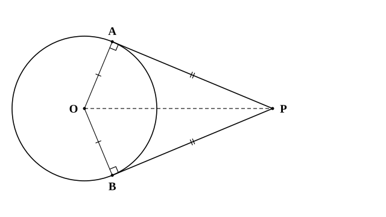
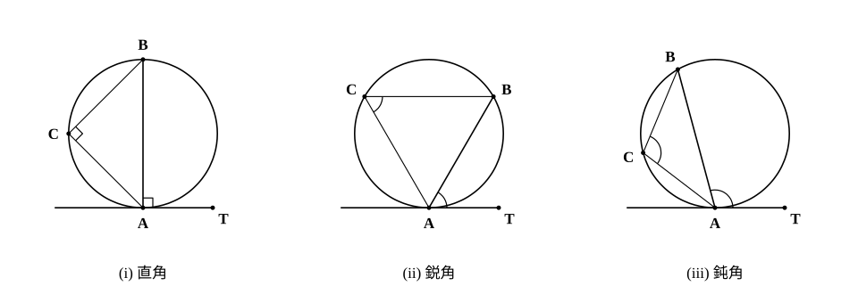

# L07 円の接線——接線の長さと、接線と弦のなす角

- unit_id: hs-math-a-geometry-properties
- 位置づけ: 単元第7レッスン（1.5時間）。中1で学んだ「接線は接点を通る半径に垂直」を出発点に、円外の1点から引いた2本の接線の長さが等しいことを合同で証明し、L02 の内接円と組み合わせて長さを求める。後半では、接線と弦のなす角が円周角に等しいことを、角が直角・鋭角・鈍角の3つの場合に分けて確かめる。L08（方べきの定理の接線型）と L09（共通接線の長さ）で使う。
- distribution_status: published_draft
- license: CC-BY-4.0
- verify_required: 例題数値・記述は監修者検証必須。
- 主概念: ①円外の1点から引いた2本の接線の長さは等しい（接線⊥半径と直角三角形の合同で証明） ②接線と弦のなす角は、その角の内側にある弧の円周角に等しい（直角・鋭角・鈍角の場合分け）

---

**使う中学の結果**: 円の接線は接点を通る半径に垂直（中1）／直角三角形の合同条件「斜辺と他の1辺」（中2）／三平方の定理（中3）／直径に対する円周角は 90°（中3）／円周角の定理（中3・鋭角の場合の証明で使う）／二等辺三角形の2つの底角は等しい（中2・例題4 で使う）／三角形の内角の和は 180°（中2）／円に内接する四角形の対角の和は 180°（L06）。

## 1. 接線は半径に垂直——中1の回収

円と直線が1点だけを共有するとき、その直線を円の**接線**、共有点を**接点**という（中1）。接線は、接点を通る半径に垂直である。この1つの事実から、このレッスンの2つの性質が出てくる。

## 2. 接線の長さ——2本の接線は同じ長さ

円 O の外側に点 P をとる。P から円 O に接線は2本引ける（中3 では、OP を直径とする円をかいて2つの接点を求めた——L10 で再訪する）。2つの接点を A、B とするとき、線分 PA、PB の長さを、P から円 O に引いた**接線の長さ**という。

**接線の長さの性質** 円外の1点から円に引いた2本の接線の長さは等しい。すなわち PA=PB。

**証明（穴埋め）** △OAP と △OBP について考える。接線は接点を通る半径に垂直だから、∠OAP=∠OBP=（ア）°。OA、OB はどちらも円 O の半径だから OA=（イ）。OP は共通。直角三角形で斜辺と他の1辺がそれぞれ等しいから、△OAP≡△（ウ）。対応する辺は等しいので PA=PB。

空らんの答え: （ア）90 （イ）OB （ウ）OBP

この合同から、おまけの事実も2つ出る。∠APO=∠BPO だから、**直線 PO は ∠APB を二等分する**。また、PA=PB、OA=OB なので、直線 PO は線分 AB の垂直二等分線でもある（2点から等距離の点の集まり——中1）。

**例題1** 円 O の半径が 5 で、円外の点 P について OP=13 のとき、P から円 O に引いた接線の長さを求めよ。

接点を A とすると ∠OAP=90° だから、直角三角形 OAP に三平方の定理を使って PA²=OP²−OA²=169−25=144。PA>0 より PA=**12**。もう1本の接線 PB の長さも 12 である。

検算: 5²＋12²=25＋144=169=13² ✓。

**例題2** △ABC の3辺すべてに接する円（L02 で「内接円」と呼んだ円）が、辺 BC、CA、AB とそれぞれ点 D、E、F で接している。AB=9、BC=10、CA=7 のとき、AF、BD、CE の長さを求めよ。

頂点 A から内接円に引いた2本の接線の長さは等しいから AF=AE。同じように BD=BF、CD=CE。AF=AE=x、BD=BF=y、CD=CE=z とおくと、

x＋y=AB=9、y＋z=BC=10、z＋x=CA=7

3つの式を辺々加えると 2(x＋y＋z)=26 だから x＋y＋z=13。ここから z=13−9=4、x=13−10=3、y=13−7=6。すなわち AF=**3**、BD=**6**、CE=**4**。

検算: AF＋BF=3＋6=9=AB ✓、BD＋CD=6＋4=10=BC ✓、CE＋AE=4＋3=7=CA ✓。

:::guide
**「対称だから等しい」で済ませない理由**

図をかくと、2本の接線が直線 PO について鏡のように対称に見える。だから「対称だから PA=PB」と言いたくなる。結論は正しいが、それでは「なぜ対称なのか」を言っていない。対称に見える根拠は、接線⊥半径という1つの事実と、2つの直角三角形の合同である。証明とは、見えていることを「どの定理からそう言えるか」の言葉に置き換える作業だ。この置き換えができると、例題2のように接点が3組ある図でも、「同じ頂点から出た2本の接線」という組を機械的に見つけて x、y、z の式を立てられる。見た目の対称性に頼ると、3組のうち1組を落としやすい。
:::

## 3. 接線と弦のなす角——円周角に等しい

円周上の点 A における接線を AT とし、A を一方の端とする弦 AB を引く。接線と弦のなす角 ∠TAB は、その角の**内側にある弧 AB**（弧 AB は2つある。角の中に入っているほう——鋭角なら短い方、鈍角なら長い方）に対する円周角に等しい。ここでいう「接線と弦のなす角」は、半直線 AT と弦 AB がつくる角 ∠TAB そのものを指し、鈍角のこともある（L11 で決める「2直線のなす角」のように 90° 以下にそろえる約束ではない）。

**接線と弦のなす角の性質** 円の接線 AT と、接点 A を通る弦 AB のなす角 ∠TAB は、その角の内側にある弧 AB に対する円周角 ∠ACB（円周角はその弧を反対側から見る角なので、C は角の内側の弧の上ではなく、その反対側の円周上の点）に等しい。この性質は「接弦定理」と呼ばれる。

∠TAB が直角のとき・鋭角のとき・鈍角のときで、証明の手順が少し違う。3つの場合に分けて確かめる。

**(i) ∠TAB=90° のとき** 接線⊥半径だから、AB は A を通る半径の延長、つまり直径である。直径に対する円周角は 90°（中3）なので ∠ACB=90°=∠TAB。

**(ii) ∠TAB が鋭角のとき** A を通る直径 AD を引く。∠TAD=90° だから ∠TAB=90°−∠BAD。一方、AD は直径だから ∠ABD=90° で、直角三角形 ABD において ∠ADB=90°−∠BAD。よって ∠TAB=∠ADB。∠ADB は弧 AB に対する円周角だから、円周角の定理により ∠ADB=∠ACB。したがって ∠TAB=∠ACB。

**(iii) ∠TAB が鈍角のとき** A を通る直径 AD を引く。このとき ∠TAB=∠TAD＋∠DAB=90°＋∠DAB。∠TAD=90°<∠TAB だから、D は角 ∠TAB の内側——つまり AB の長い方の弧の上にある。C はその長い方の弧に対する円周角の頂点なので、反対側の短い方の弧の上にある。よって C は D と弦 AB の反対側にあり、4点 A、C、B、D はこの順に円周上に並ぶ。四角形 ACBD は円に内接するので、L06 の性質より ∠ACB＋∠ADB=180°。直角三角形 ABD で ∠ADB=90°−∠DAB だから、∠ACB=180°−(90°−∠DAB)=90°＋∠DAB=∠TAB。

3つの場合のどれでも、**接線と弦のなす角は、その角の内側にある弧の円周角に等しい**。

**例題3** 円周上の点 A における接線を AT、弦を AB とし、∠TAB=65° とする。弧 AB のうち ∠TAB の内側にある弧の反対側の円周上に点 C をとる。∠ACB を求めよ。また、∠BAC=40° のとき ∠ABC を求めよ。

接線と弦のなす角は円周角に等しいから ∠ACB=∠TAB=**65°**。△ABC で ∠ABC=180°−65°−40°=**75°**。

検算: 直線 AT 上で T の反対側に点 T′ をとると、∠CAT′=180°−65°−40°=75°。これは接線 AT′ と弦 AC のなす角で、その内側の弧 AC に対する円周角は ∠ABC=75° ✓（接線の T′ の側でも同じ性質が成り立っている）。

**例題4** 円 O の外の点 P から引いた2本の接線の接点を A、B とし、∠APB=50° とする。円周上で、弦 AB について P と反対側に点 C をとるとき、∠ACB を求めよ。

§2 より PA=PB だから △PAB は二等辺三角形で、∠PAB=∠PBA=(180°−50°)/2=65°。∠PAB は接線 PA と弦 AB のなす角であり、その内側にある弧 AB（P に近い方の弧）に対する円周角は、弧の反対側の点 C から見た ∠ACB である。よって ∠ACB=∠PAB=**65°**。

検算: 四角形 OAPB で ∠OAP=∠OBP=90° だから ∠AOB=360°−90°−90°−50°=130°。弧 AB（P に近い方）に対する中心角が 130° なので、円周角はその半分の 65° ✓。

:::guide
**「どの弧の円周角か」を間違えないために**

接線と弦のなす角には、弦 AB をはさんで2つある（直線 AT 上で T の反対側に点 T′ をとると、∠TAB と ∠T′AB。和は 180° で、どちらも直線 AT について円と同じ側にある）。それぞれが等しい円周角は、「その角の内側にある弧」に対するものだ。鋭角 ∠TAB の内側には短い方の弧 AB があり、その円周角は長い弧の側の点から見た角。鈍角 ∠T′AB の内側には長い方の弧があり、その円周角は短い弧の側の点から見た角になる。例題3の検算では、T′ の側の角を弦 AC について確かめた（∠CAT′=∠ABC）。同じ弦 AB で T′ の側を見るなら、∠T′AB=180°−65°=115° で、その内側にある長い方の弧 AB の円周角（短い方の弧の上の点から見た角）は、L06 の対角の和から 180°−65°=115°——やはり等しい。どちらの側で見ても性質は成り立つ。迷ったら、「角の内側に入っている弧はどれか」を指でなぞってから、その弧を見る円周角を探す。円周角の定理そのものにも、「どの弧に対する角か」を毎回言う習慣が効いていた——同じ習慣をここでも使えばよい。
:::

## 4. 練習

**問1** 円 O の半径が 6 で、円外の点 P について OP=10 とする。P から円 O に引いた2本の接線の接点を A、B とする。
(1) 接線の長さ PA を求めよ。
(2) 四角形 OAPB の面積を求めよ。

**問2** △ABC の3辺すべてに接する円が、辺 BC、CA、AB とそれぞれ点 D、E、F で接している。AB=8、BC=11、CA=9 のとき、BD と CD の長さを求めよ。

**問3** 円周上の点 A における接線を AT、弦を AB とし、∠TAB=48° とする。∠TAB の内側の弧 AB の反対側の円周上に点 C をとり、∠ABC=70° とする。
(1) ∠ACB を求めよ。
(2) ∠BAC を求めよ。
(3) 直線 AT 上で T と反対側に点 T′ をとる。∠CAT′ を求め、∠ACB、∠BAC、∠ABC のどれと等しいかを答えよ。

**問4** 円 O の外の点 P から引いた2本の接線の接点を A、B とし、∠APB=44° とする。
(1) ∠PAB を求めよ。
(2) 弦 AB について P と反対側の円周上に点 C をとるとき、∠ACB を求めよ。
(3) 弦 AB について P と同じ側の円周上（弧 AB の上）に点 D をとるとき、∠ADB を求めよ。

**問5** ∠C=90° の直角三角形 ABC で、AC=6、BC=8、AB=10 とする。3辺すべてに接する円の中心を O、半径を r とし、辺 BC、CA、AB との接点をそれぞれ D、E、F とする。
(1) 四角形 OECD が正方形であることを説明し、CD=CE=r であることを確かめよ。
(2) AE、BD を r で表し、AB=10 から r を求めよ。

---

:::stretch
**S1** §3 の性質の逆を考える。円周上の点 A を通る直線 ℓ と、A を一方の端とする弦 AB をとる。ℓ 上に A 以外の点 X をとり、直線 AB について X と反対側の円周上に点 C をとって、∠XAB が弧 AB に対する円周角 ∠ACB に等しいとする。このとき ℓ は点 A における円の接線であることを、次の手順で説明せよ。
(1) 点 A における接線 AT を、T が X と直線 AB について同じ側にくるように引く。§3 の性質から ∠TAB は何に等しいか。
(2) (1) と仮定から、半直線 AX と半直線 AT はどちらも「A から出て、直線 AB について C と反対側にあり、AB との間に大きさ ∠ACB の角をつくる半直線」である。このような半直線が1本しかないことから、何が言えるか。
:::

対応解答: answer_key_L06-10.md

<!-- gen_nav:nav:start（自動生成・手編集しない） -->

---

[← 前のレッスン](lesson_06.md)｜[単元の目次](README.md)｜[解答](answer_key_L06-10.md)｜[次のレッスン →](lesson_08.md)

<!-- gen_nav:nav:end -->
