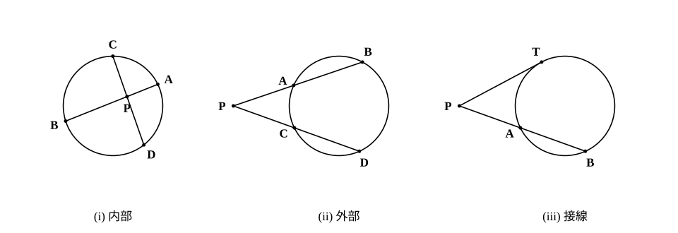
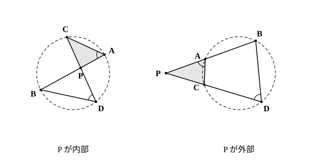

# L08 方べきの定理——3つの形と、その逆

- unit_id: hs-math-a-geometry-properties
- 位置づけ: 単元第8レッスン（2時間）。中3の円周角の学習で「2つの弦の交点でできる三角形は相似である」ことを発展問題として証明したとき、その先にあった「線分の積が等しい」という関係に名前を与える回。1点を通る2直線が円と交わる（または接する）ときに成り立つ PA×PB=PC×PD（=PT²）を、交点が円の内部にある場合・外部にある場合・一方が接線の場合の3つの形で1本の式にまとめ、相似で証明する。後半では逆を扱い、4点が同一円周上にあること・直線が接線であることの判定に使う。L06（内接四角形）・L07（接線）を前提にし、L10（√a の作図）と L14（空間の中で使う）で再訪する。
- distribution_status: published_draft
- license: CC-BY-4.0
- verify_required: 例題数値・記述は監修者検証必須。
- 主概念: ①方べきの定理の3つの形（内部・外部・接線）を1つの式 PA×PB=PC×PD で言い、相似で証明する ②方べきの定理の逆——4点が同一円周上にあること・直線が接線であることの判定

---

**使う中学の結果**: 三角形の相似条件「2組の角がそれぞれ等しい」「2組の辺の比とその間の角がそれぞれ等しい」（中3）／円周角の定理とその逆（中3）／対頂角は等しい（中2）／円の中心から弦に下ろした垂線は弦を二等分する——直径に垂直な弦は直径で二等分される（中3）／三平方の定理と接線⊥半径（中3・中1——例題3・例題4 の検算で使う）／直径に対する円周角は 90°（中3・問6 で使う）／交わる2直線は1つの平面を定める（中1・stretch で使う）／円に内接する四角形の性質と条件（L06）／接線と弦のなす角（L07）。

## 1. 弦の交点でできる相似——中3の回収

中3の円周角の学習では、円の2つの弦 AB、CD が円の内部の点 P で交わるとき、△PAC と △PDB が相似であることを発展問題として証明した（対頂角と、同じ弧に対する円周角の2組の角。見ていなくても、§2 で改めて証明する）。相似なら対応する辺の比が等しい——PA:PD=PC:PB。この比の式を積の形に書き直すと PA×PB=PC×PD になる。中3ではこの積の関係に名前を付けなかった。このレッスンで名前を与え、点 P が円の外にある場合にまで広げる。

## 2. 方べきの定理——3つの形を1本の式で

**方べきの定理** 点 P を通る2直線が、円とそれぞれ2点 A、B および C、D で交わるとき、

PA×PB=PC×PD

が成り立つ。P が円の内部にあっても外部にあってもよい（円と2点で交わる直線は「割線」と呼ばれる）。また、一方の直線が点 T で円に接するときは（C と D が T に重なったとみて）、

PA×PB=PT²

が成り立つ。

**(i) P が円の内部にあるとき——証明（穴埋め）** △PAC と △PDB で、∠APC=∠DPB（（ア））。∠PAC と ∠PDB はどちらも弧 （イ） に対する円周角だから等しい。2組の角がそれぞれ等しいので △PAC∽△PDB。対応する辺の比から PA:PD=PC:（ウ）、すなわち PA×PB=PC×PD。

空らんの答え: （ア）対頂角 （イ）BC（A、D を含まない側の弧。弧 CB と書いても同じ） （ウ）PB

**(ii) P が円の外部にあるとき** 2直線が円と P—A—B、P—C—D の順に交わるとする（A、C が P に近い側）。△PAC と △PDB で、∠P は共通。∠PAC は円に内接する四角形 ABDC（円周上に A、B、D、C の順に並ぶので、この順に名づける）の頂点 A における外角だから、その内対角 ∠BDC に等しい（L06）。∠BDC=∠PDB なので、2組の角がそれぞれ等しく △PAC∽△PDB。よって PA:PD=PC:PB、すなわち PA×PB=PC×PD。

**(iii) 一方が接線のとき** 直線 PT が点 T で円に接し、もう一方の直線が P—A—B の順に円と交わるとする。△PAT と △PTB で、∠P は共通。∠PTA は接線 TP と弦 TA のなす角だから、その内側の弧 TA に対する円周角 ∠TBA に等しい（L07）。∠TBA=∠PBT なので △PAT∽△PTB。対応する辺の比から PA:PT=PT:PB、すなわち PT²=PA×PB。

3つの形はどれも「P から測った長さの積」という同じ式である。

**例題1** 円の2つの弦 AB、CD が円の内部の点 P で交わり、PA=4、PB=6、PC=3 のとき、PD を求めよ。

方べきの定理から PA×PB=PC×PD。4×6=3×PD より PD=**8**。

検算: 3×8=24=4×6 ✓。

**例題2** 円の外部の点 P を通る2直線が、円と P—A—B、P—C—D の順に交わる。PA=4、AB=5、PC=3 のとき、PD と CD を求めよ。

P から測ると PB=PA＋AB=4＋5=9。PA×PB=PC×PD より 4×9=3×PD、PD=**12**。CD=PD−PC=12−3=**9**。

検算: 3×12=36=4×9 ✓。

**例題3** 円の外部の点 P から円に接線を引き、接点を T とする。P を通る別の直線が円と P—A—B の順に交わり、PA=4、AB=5 のとき、PT を求めよ。

PB=9。PT²=PA×PB=4×9=36 だから PT=**6**。

検算: 6²=36=4×9 ✓。L07 の見方でも確かめる。PT は接線の長さなので、円の中心 O について PT²=OP²−r²（三平方）。P と O を通る直線と円の交点を A′、B′ とすれば PA′=OP−r、PB′=OP＋r で PA′×PB′=OP²−r²——方べきの定理の接線型は、この「接線の長さの2乗」を弦の側から言い直したものになっている。

**例題4** 円の直径 AB の長さが 10、直径上の点 P について PA=2 とする。P を通り AB に垂直な弦を CD とするとき、CD を求めよ。

PB=AB−PA=10−2=8。CD⊥AB で、直径に垂直な弦は直径によって二等分されるから PC=PD。方べきの定理から PC×PD=PA×PB=2×8=16、PC²=16、PC=4。よって CD=**8**。

検算: 円の中心 O は AB の中点だから OP=5−2=3。直角三角形 OPC で PC²=OC²−OP²=25−9=16、PC=4 ✓。この「直径に垂直な弦の半分の長さ」は、L10 で √a の長さを作図する根拠になる。

:::guide
**「どの長さをかけるのか」——P から測る、が全部**

方べきの定理で迷いやすいのは、AB や CD という「弦そのものの長さ」をかけてしまうことだ。定理の式に出てくるのは、点 P から2つの交点までの長さ PA と PB であって、弦 AB の長さではない。P が円の内部にあるときは AB=PA＋PB なので PA も PB も AB より短く、P が外部にあるときは PB=PA＋AB なので PB の方が AB より長い。例題2のように AB の長さが与えられたら、まず PB=PA＋AB を作ってから積をとる。手順として「①点 P を決める ②P を通る直線を1本選び、円との2つの交点までの長さを P から測る ③もう1本でも同じことをする ④2つの積を等しいとおく」の4手に固定しておくと、図が複雑になっても迷わない。
:::

## 3. 方べきの定理の逆——4点が同一円周上にある判定

§2 の定理は「同一円周上にあれば積が等しい」だった。逆に、積が等しければ同一円周上にあると言えるだろうか。

**方べきの定理の逆** 2直線 AB、CD が点 P で交わり、P が線分 AB、CD の**両方の内部**にあるか、または**両方の外部**にあるとする。このとき

PA×PB=PC×PD ならば、4点 A、B、C、D は同一円周上にある。

また、直線 AB 上に P—A—B の順に3点があり、直線 AB 上にない点 T について

PA×PB=PT² ならば、直線 PT は3点 A、B、T を通る円の接線である。

**証明（P が両線分の内部にあるとき）** PA×PB=PC×PD から PA:PD=PC:PB。∠APC=∠DPB（対頂角）だから、2組の辺の比とその間の角がそれぞれ等しく △PAC∽△PDB。よって ∠PAC=∠PDB、すなわち ∠CAB=∠CDB。A と D は直線 BC について同じ側にある（P は線分 AB の内部の点で、直線 AB が直線 BC と出会うのは B だけ、その B は P より先にあるから、線分 AP は直線 BC を横切らず、A と P は直線 BC の同じ側にある。同じく D と P も同じ側。よって A と D も同じ側）から、円周角の定理の逆（L06 §1）により4点 A、B、C、D は同一円周上にある。

**証明（P が両線分の外部にあるとき）** A と B を入れかえても、C と D を入れかえても条件の式 PA×PB=PC×PD は変わらないから、§2 (ii) と同じく P—A—B、P—C—D の順（A、C が P に近い側）としてよい。PA:PD=PC:PB と共通の ∠P から △PAC∽△PDB。よって ∠PAC=∠PDB=∠BDC。∠PAC は四角形 ABDC の頂点 A における外角で、それが内対角 ∠BDC に等しいから、L06 §3 の条件 (2) により四角形 ABDC は円に内接する。

接線の場合も同様で、PA:PT=PT:PB と共通の ∠P から △PAT∽△PTB、よって ∠PTA=∠PBT。3点 A、B、T を通る円で、半直線 TP と弦 TA がつくる角 ∠PTA は、弧 TA（B を含まない方）に対する円周角 ∠TBA に等しい。一方、この円の点 T における接線も、弦 TA との間に円周角 ∠TBA に等しい角を（P と同じ側に）つくる（L07 §3）。T を通り、弦 TA との間に同じ側で同じ大きさの角をつくる直線は1本しかないから、直線 PT はその接線と一致する——すなわち PT はこの円の接線である。

**例題5** 直線上に P—A—B の順に3点があり PA=3、PB=12。別の直線上に P—C—D の順に3点があり PC=4、PD=9。4点 A、B、C、D は同一円周上にあるか。

P は線分 AB、CD の両方の外部にある。PA×PB=3×12=36、PC×PD=4×9=36 で等しい。よって方べきの定理の逆から、4点 A、B、C、D は**同一円周上にある**。

**例題6** 直線上に P—A—B の順に3点があり PA=4、PB=9。直線 AB 上にない点 T について PT=6 のとき、直線 PT は3点 A、B、T を通る円の接線か。

PA×PB=4×9=36、PT²=36 で等しい。よって直線 PT は3点 A、B、T を通る円の**接線である**。

:::guide
**逆を使うときの「位置の条件」を落とさない**

方べきの定理の逆には、「P が両方の線分の内部にある」か「両方の外部にある」かという位置の条件が付いている。片方の線分の内部にあり、もう片方の外部にある点 P では、積が等しくても4点は同一円周上にない——円周上の2点を結ぶ弦の内部の点は円の内部にあり、円の内部の点が別の弦の外側（延長上）にくることはないからだ。L06 の円周角の定理の逆に「同じ側」の条件が付いていたのと同じで、逆を使うときは「等しい」だけでなく「どこにあるか」も確かめる。証明の中でどこにこの条件が使われたかを見ると、内部の場合は「A と D が直線 BC の同じ側」を言う所、外部の場合は「∠PAC が外角である」を言う所である。条件が証明のどこで働くかを知っていれば、条件を落としにくくなる。
:::

## 4. 手順の型——方べきの定理を使うとき

1. 2直線の交点 P を見つける（円の内部か外部か、一方が接線かを確かめる）。
2. P を通る直線を1本とり、円との2つの交点（接点なら1つ）までの長さを **P から**測る。
3. もう1本の直線でも同じことをする。
4. 2つの積を等号で結び、未知の長さを求める。
5. 検算: 求めた長さを戻して積が一致するか確かめる。P が内部なら PA、PB はどちらも AB より短く、外部なら、P から遠い方の交点を B として PB>AB になっているかを見る。

## 5. 練習

**問1** 円の2つの弦 AB、CD が円の内部の点 P で交わり、PA=6、PB=4、PC=3 のとき、PD を求めよ。

**問2** 円の外部の点 P を通る2直線が、円と P—A—B、P—C—D の順に交わる。PA=5、AB=7、PC=6 のとき、PD と CD を求めよ。

**問3** 円の外部の点 P から円に接線を引き、接点を T とする。P を通る別の直線が円と P—A—B の順に交わる。PT=8、PA=4 のとき、PB と AB を求めよ。

**問4** 次の4点 A、B、C、D が同一円周上にあるかどうかを判定し、理由を答えよ。いずれも、直線 AB と直線 CD は点 P で交わり、P は線分 AB、CD の両方の外部（P—A—B、P—C—D の順）にある。
(1) PA=2、PB=18、PC=4、PD=9
(2) PA=3、PB=8、PC=4、PD=7

**問5** 直線上に P—A—B の順に3点があり PA=3、AB=9。直線 AB 上にない点 T について PT=6 のとき、直線 PT は3点 A、B、T を通る円の接線であるかどうかを判定せよ。

**問6** 円の直径 AB 上に点 P をとり、P を通り AB に垂直な弦を CD とする。PC²=PA×PB が成り立つことを、次の2通りで示せ。
(1) 方べきの定理を使う（穴埋め）。「CD⊥AB で AB は直径だから PC=（ア）。方べきの定理より PA×PB=PC×PD=PC×PC=（イ）。」
(2) 相似を使う（穴埋め）。「AB は直径だから ∠ACB=（ウ）°。△APC と △CPB で、∠APC=∠CPB=90°、∠PAC=90°−∠PCA=∠（エ）。よって △APC∽△CPB、PA:PC=PC:（オ）、すなわち PC²=PA×PB。」

---

:::stretch
**S1** 球を平面で切ると、切り口は円になる（このことは認めてよい）。球の外部の点 P を通る2直線が、球とそれぞれ P—A—B、P—C—D の順に交わるとする。
(1) 2直線を含む平面で球を切ると、その切り口の円は4点 A、B、C、D を通る。その理由を説明せよ。
(2) (1) を使って、PA×PB=PC×PD が成り立つことを説明せよ。
(3) PA=3、PB=8、PC=4 のとき PD を求めよ。
（方べきの定理を球に対して使うこの考え方は、L12・L14 で空間図形の中に平面を切り出すときに再び登場する。）
:::

対応解答: answer_key_L06-10.md

<!-- gen_nav:nav:start（自動生成・手編集しない） -->

---

[← 前のレッスン](lesson_07.md)｜[単元の目次](README.md)｜[解答](answer_key_L06-10.md)｜[次のレッスン →](lesson_09.md)

<!-- gen_nav:nav:end -->
