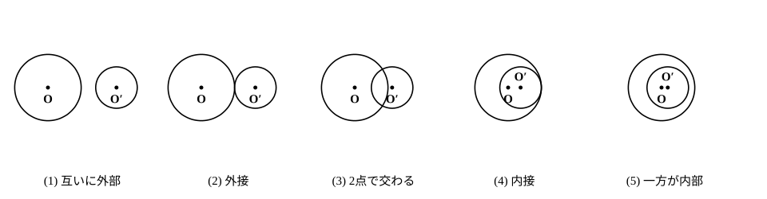
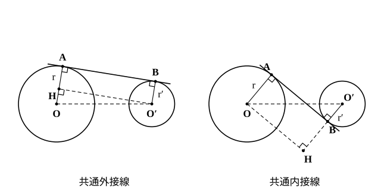

# L09 2つの円——位置関係と共通接線

- unit_id: hs-math-a-geometry-properties
- 位置づけ: 単元第9レッスン（1.5時間）。「円の性質」の節（L06〜L09）の最終回。2つの円の位置関係を、中心間の距離と2つの半径の和・差の大小で5つに分類し、一方の円を動かしたときに分類がどう移り変わるかを図で追う。後半では、2つの円の両方に接する直線（共通接線）の接点間の距離を、L07 の接線⊥半径と三平方の定理で求める。L10（作図）の検証②（2つの円の共有点の個数）と L14 の定理カードで再訪する。
- distribution_status: published_draft
- license: CC-BY-4.0
- verify_required: 例題数値・記述は監修者検証必須。
- 主概念: ①2つの円の位置関係を中心間の距離 d と半径 r、r′ の和・差で5つに分類する（動かして観察） ②共通接線の長さ（接点間の距離）を直角三角形で求める・接する2円の接点は2つの中心を結ぶ直線上にある

---

**使う中学の結果**: 三平方の定理（中3）／円の接線は接点を通る半径に垂直（中1）／同じ直線に垂直な2直線は平行で、3つの角が直角の四角形は長方形（中2・§3 で使う）／同位角が等しい2直線は平行（中2）・直径に対する円周角は 90°・平行線と線分の比（中3）——stretch で使う／線分の垂直二等分線上の点は、その線分の両端から等しい距離にある（中1・L02 でも使った・§2 で使う）／接線の長さの性質と接線と弦のなす角（L07）。

## 1. 円と直線から、円と円へ——中1の回収

1つの円と直線の位置関係は、中1で「交わる（共有点2）・接する（共有点1）・離れている（共有点0）」の3つに分けた。決め手は、中心から直線までの距離と半径の大小だった。このレッスンでは、円と円の位置関係を同じ考え方で分類する。決め手になるのは、中心と中心の距離である。

## 2. 2つの円の位置関係——d と r＋r′、r−r′ を比べる

半径 r の円 O と半径 r′ の円 O′（r>r′ とする）について、中心間の距離 OO′ を d とおく。小さい円 O′ を、遠くから円 O に向かって近づけていくと、位置関係は次の順に変わる。

| | 位置関係 | d の条件 | 共有点の個数 |
|---|---|---|---|
| (1) | 互いに外部にある | d>r＋r′ | 0 |
| (2) | 外接する（外側で接する） | d=r＋r′ | 1 |
| (3) | 2点で交わる | r−r′<d<r＋r′ | 2 |
| (4) | 内接する（内側で接する） | d=r−r′ | 1 |
| (5) | 一方が他方の内部にある | d<r−r′ | 0 |

境目になる値は2つ、r＋r′（和）と r−r′（差）である。「2点で交わる」のは、d が和より小さく差より大きい、その間にあるときだ。L05 §2 で三角形を作るときに「L09 で確かめる」として認めて使った、2つの円が交わる条件がこの (3) である（そこでは d が最も長い辺なので、r−r′<d は自動的に成り立つ）。(5) の特別な場合として d=0、つまり中心が一致する2円があり、これは同心円（どうしんえん）と呼ばれる。半径が等しい（r=r′）2円では差が 0 なので (4)(5) は起こらず、d=0 なら2円は一致する（L05 §2 の2円は半径が等しいこともあるが、交わる条件 (3) はそのまま使える）。

**接する2円の接点** 2つの円が点 T で接するとき（外接でも内接でも）、接点 T は2つの中心を結ぶ直線 OO′ 上にある。理由: もし T が直線 OO′ 上になければ、T から直線 OO′ に垂線を下ろし、その足の向こう側へ同じ長さだけ延ばした点を T′ とする。直線 OO′ は線分 TT′ の垂直二等分線だから OT′=OT=r、O′T′=O′T=r′ で、T′ も2つの円の両方の上にある。これでは共有点が2個になり、接する（共有点1個）に反する。だから O、T、O′ は同じ直線上にある。このとき、円 O の T における接線は OT に垂直、円 O′ の T における接線は O′T に垂直で、OT と O′T は同じ直線 OO′ 上にあるから、2つの接線は「T を通り OO′ に垂直な直線」という同じ1本である——接する2円は接点で1本の接線を共有する（§3 の本数・問4・S1 で使う）。外接なら T は線分 OO′ 上にあり OO′=OT＋TO′=r＋r′、内接なら T は線分 OO′ の O′ 側の延長上にあり OO′=OT−O′T=r−r′——表の (2)(4) の条件は、この事実そのものである。

**例題1** 半径 5 の円 O と半径 3 の円 O′ について、中心間の距離 d が次の値のとき、2円の位置関係を答えよ。
(1) d=9  (2) d=8  (3) d=4  (4) d=2  (5) d=1

r＋r′=8、r−r′=2 を境目にして比べる。
(1) 9>8 だから**互いに外部**。 (2) 8=8 だから**外接**。 (3) 2<4<8 だから**2点で交わる**。 (4) 2=2 だから**内接**。 (5) 1<2 だから**一方が他方の内部**。

検算: d を 9→8→4→2→1 と小さくしていくと、表の (1)→(2)→(3)→(4)→(5) の順に並んでいる ✓。

**例題2** 半径 7 の円と半径 4 の円が2点で交わるとき、中心間の距離 d のとりうる値の範囲を求めよ。

r−r′<d<r＋r′ に r=7、r′=4 を入れて、**3<d<11**。

検算: 端の値で確かめる。d=11 なら外接（共有点1）、d=3 なら内接（共有点1）で、どちらも「2点で交わる」には入らない ✓。

:::guide
**「差」の側の境目を忘れないために**

2円の位置関係で起こりやすいのは、「d=r＋r′ で接する」だけを覚えて、内接（d=r−r′）と「一方が内部」を落とすことだ。d を数直線に置いて考えると整理できる。0 から r−r′ までは内部、r−r′ でちょうど内接、r−r′ から r＋r′ までは2点で交わる、r＋r′ でちょうど外接、それより大きければ外部——数直線の上に2つの境目 r−r′ と r＋r′ を打ち、d がどの区間に落ちるかを見る。「交わる」条件が不等式 r−r′<d<r＋r′ という両側からの挟み込みになるのは、境目が2つあるからだ。例題2で答えを 3<d<11 と書いたあと、両端の 3 と 11 が何の値か（差と和）を言えれば、この分類は身についている。
:::

## 3. 共通接線——2つの円の両方に接する直線

2つの円の両方に接する直線を、2円の**共通接線**（きょうつうせっせん）という。2円が共通接線の同じ側にあるものは共通外接線（きょうつうがいせっせん）、2円が共通接線について反対側にあるものは共通内接線（きょうつうないせっせん）と呼ばれる。共通接線の本数は位置関係で決まる——互いに外部なら4本（外接線2・内接線2）、外接なら3本、2点で交わるなら2本（外接線のみ）、内接なら1本、一方が内部なら0本（外接の3本目・内接の1本は、接点で2円が共有する接線。2点で交わると内接線は引けない）。

共通接線が2円に接する2つの接点 A、B の間の距離 AB を、この共通接線の長さと呼ぶ。以下の公式では A と B は異なる点とする（接点で2円が共有する接線では A と B は接点 T に重なり、長さは 0）。

**共通外接線の長さ** 円 O（半径 r）と円 O′（半径 r′、r>r′）の共通外接線が、円 O と点 A、円 O′ と点 B で接するとする。OA⊥AB、O′B⊥AB だから OA∥O′B。O′ から OA に垂線 O′H を下ろすと、四角形 HABO′ は長方形で O′H=AB、HA=O′B=r′。よって OH=OA−HA=r−r′。直角三角形 OO′H に三平方の定理を使って

AB²=O′H²=OO′²−OH²=d²−(r−r′)²

**共通内接線の長さ** 共通内接線では、2つの半径 OA と O′B が直線 AB の反対側に出る。O′B を B の側に延長し、O から垂線 OH を下ろして長方形 OABH をつくると、O′H=O′B＋BH=r′＋r。よって

AB²=d²−(r＋r′)²

**例題3** 半径 8 の円 O と半径 3 の円 O′ の中心間の距離が 13 のとき、共通外接線の長さと共通内接線の長さを求めよ。

まず位置関係を確かめる。r＋r′=11<13 なので2円は互いに外部にあり、共通接線は4本ある。

共通外接線: AB²=13²−(8−3)²=169−25=144、AB=**12**。
共通内接線: AB²=13²−(8＋3)²=169−121=48、AB=√48=**4√3**。

検算: 外接線は「短い辺 5・長い辺 12・斜辺 13」の直角三角形で 25＋144=169 ✓。内接線は 121＋48=169 ✓。内接線の方が短くなる（引く量が大きい）ことも図と合っている。

:::guide
**「長方形をつくる」の一手が全部を決める**

共通接線の長さの公式を丸暗記すると、r−r′ と r＋r′ のどちらを使うかで迷う。公式ではなく、図の中で直角三角形をつくる一手を覚えるほうが確実だ。2本の半径 OA と O′B はどちらも共通接線に垂直だから平行で、一方の中心から他方の半径（またはその延長）に垂線を下ろせば長方形ができ、直角三角形の斜辺は中心間の距離 d、一方の辺は共通接線の長さ AB そのもの、残りの辺は「2つの半径の差または和」になる。外接線では2つの半径が同じ側に出るから引き算、内接線では反対側に出るから足し算——図を1度自分の手でかけば、この違いは見える。あとは三平方の定理だけである。d²−(r＋r′)² が負になったら、その2円には共通内接線が存在しない（交わっているか内側にある）ことを示している。
:::

## 4. 練習

**問1** 半径 6 の円と半径 2 の円について、中心間の距離 d が次の値のとき、2円の位置関係と共通接線の本数を答えよ。
(1) d=10  (2) d=8  (3) d=5  (4) d=4  (5) d=3

**問2** 半径 9 の円と半径 4 の円がある。
(1) 2円が2点で交わるとき、中心間の距離 d のとりうる値の範囲を求めよ。
(2) 2円が外接するときと内接するときの d をそれぞれ求めよ。

**問3** 半径 7 の円と半径 1 の円の中心間の距離が 10 のとき、共通外接線の長さと共通内接線の長さをそれぞれ求めよ。

**問4** 半径 9 の円 O と半径 4 の円 O′ が点 T で外接している。共通外接線の1本が円 O と点 A、円 O′ と点 B で接し、T における共通接線と線分 AB の交点を M とする。
(1) 共通外接線の長さ AB を求めよ。
(2) MA=MT=MB であることを、L07 の接線の長さの性質を使って説明し、MA の長さを求めよ。

---

:::stretch
**S1** 大きい円 O（半径 r）と小さい円 O′（半径 r′）が点 T で内接している。T を通る大きい円の2つの弦 TA、TB を引き、それらが小さい円と交わる点（T 以外）をそれぞれ A′、B′ とする。
(1) T における2円の共通接線 ℓ を引く。接線と弦のなす角の性質（L07）を大きい円と小さい円のそれぞれに使って、∠TAB=∠TA′B′ であることを示せ。
(2) (1) から、A′B′∥AB であることを説明せよ。
(3) T を通る2円の直径をそれぞれ TD′（小さい円）、TD（大きい円）とすると、D′、D はどちらも直線 TO′O 上にある（§2）。TA′:TA=r′:r であることを説明せよ。
:::

対応解答: answer_key_L06-10.md

<!-- gen_nav:nav:start（自動生成・手編集しない） -->

---

[← 前のレッスン](lesson_08.md)｜[単元の目次](README.md)｜[解答](answer_key_L06-10.md)｜[次のレッスン →](lesson_10.md)

<!-- gen_nav:nav:end -->
