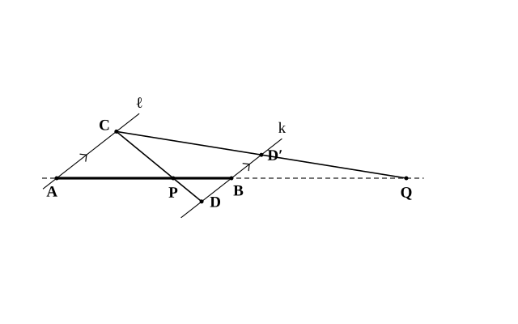
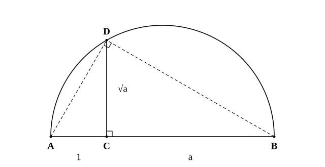
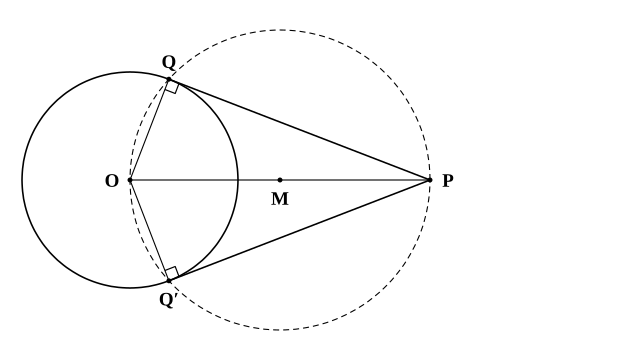

# L10 作図——方針を立て、根拠を言い、確かめる

- unit_id: hs-math-a-geometry-properties
- 位置づけ: 単元第10レッスン（2.5時間）。平面図形の節（L01〜L09）で証明した定理を、今度は「かく」ために使う回。定規とコンパスだけで、線分を m:n に内分・外分する点（L01 の回収）や、長さ ab・b/a・√a の線分をかき、なぜその手順で条件を満たす図がかけるのかを、平行線と線分の比・相似・方べきの定理（L08）で根拠づける。後半では、中3で学んだ「円外の点からの接線の作図」を再訪し、作図の後に「かいた点は全て条件に適するか」「他に無いか」の2つの観点で確かめる練習をする。L11 から空間図形に入る。
- distribution_status: published_draft
- license: CC-BY-4.0
- verify_required: 例題数値・記述は監修者検証必須。
- 主概念: ①内分点・外分点と長さ √a・ab・b/a の作図を、平行線と線分の比・相似・方べきの定理で根拠づける ②作図の検証の2観点——かいた点は全て条件に適するか／他に無いか

---

**使う中学の結果**: 垂直二等分線・角の二等分線・垂線の作図と、円周上の点における接線の作図（中1）／円外の点から円に引く接線の作図（中3）／平行線と線分の比・三角形の相似（中3）／直径に対する円周角は 90° とその逆（中3）／円の接線は接点を通る半径に垂直（中1・§4 で使う）／平行線の錯角・同位角と対頂角（中2・§2 の根拠で使う）／直径に垂直な弦は直径で二等分される（中3・§3 の根拠で使う）／円周角の定理・三平方の定理・二次方程式の解の公式（中3）と2つの角が等しい三角形は二等辺三角形（中2）——stretch で使う／4つの辺が等しい四角形はひし形で、ひし形の対辺は平行（中2・§2 の平行線の作図で使う）／内分・外分（L01）と方べきの定理（L08）。

## 1. 作図の4段——方針・作図・根拠・検証

**作図**とは、目盛りのない定規（2点を通る直線を引く）とコンパス（中心と半径を決めて円をかく）だけを使って図をかくことである。この約束は中1から変わらない。高校で新しいのは、作図そのものの手つきより、作図を「方針→作図→根拠→検証」の4段で扱うことだ。

1. **方針**: 条件を満たす点を、どの定理を使えばかけるかを考える。
2. **作図**: 手順を実行する。
3. **根拠**: かいた点が条件を満たす理由を、定理の名前で言う。
4. **検証**: 「かいた点は**全て**条件に適するか」「条件に適する点は**他に無いか**」の2つを確かめる。

4段目の2つの観点は、このレッスンの主題である。作図はできても、「これで全部か」と問われて答えられないことは多い。§4 で正面から扱う。

## 2. 内分点・外分点の作図——平行線をかいて相似をつくる

L01 で学んだ言葉を確かめる。線分 AB 上の点 P が AP:PB=m:n を満たすとき、P は線分 AB を **m:n に内分する**という。線分 AB の延長上の点 Q が AQ:QB=m:n（m≠n）を満たすとき、Q は線分 AB を **m:n に外分する**という（m<n なら Q は A の側、m>n なら Q は B の側の延長上にある）。

これらの点を作図する方針は「平行線をかいて、相似な三角形をつくる」である。

**内分点の作図（AB を m:n に内分する点 P）**
1. 適当な長さを単位の長さとして決める。
2. A を通り、直線 AB と異なる直線 ℓ を引く。ℓ 上に AC=（単位の長さ）×m となる点 C をとる。
3. B を通り ℓ に平行な直線 k を引く（平行線の作図は中1の垂線の作図を2回使ってもよいし、ひし形をつくる方法——ℓ 上に点 C′ をとり、C′ を中心に半径 BC′ の円をかいて ℓ との交点を E とし、E と B を中心に同じ半径の円をかき、2つの交点のうち C′ でないほうを F とすれば、四角形 BC′EF はひし形で BF∥ℓ——でもよい）。k 上に、直線 AB について C と**反対側**に BD=（単位の長さ）×n となる点 D をとる。
4. 直線 CD と線分 AB の交点が P である。

**根拠**: AC∥BD だから、∠PAC=∠PBD（錯角）、∠APC=∠BPD（対頂角）で △PAC∽△PBD。対応する辺の比から AP:PB=AC:BD=m:n。

**外分点の作図（AB を m:n に外分する点 Q、m≠n）** 手順 3 で D を直線 AB について C と**同じ側**にとる（上の図では、内分のときの D と区別して、同じ側にとったこの点を D′ と書いている）。直線 CD と直線 AB の交点が Q である（m=n では AC=BD、AC∥BD だから CD∥AB となり、交点がない）。

**根拠**: AC∥BD だから、∠QAC=∠QBD（同位角）、∠Q は共通で △QAC∽△QBD。よって QA:QB=AC:BD=m:n。

**例題1** 線分 AB を 2:1 に内分する点 P と、2:1 に外分する点 Q の作図手順を、上の手順に当てはめて書け。また、Q は A と B のどちらの側にあるか。

内分点 P: AC=（単位）×2、BD=（単位）×1 で、D を C と反対側にとる。直線 CD と AB の交点が P で、AP:PB=2:1。
外分点 Q: BD を C と同じ側にとり、直線 CD と直線 AB の交点が Q。QA:QB=2:1 で、m=2>n=1 だから Q は **B の側**の延長上にある。

検算: Q が B の側にあるとき QA=QB＋AB だから、QA:QB=2:1 は (QB＋AB):QB=2:1、つまり QB=AB。B から AB と同じ長さだけ先に進んだ点が Q になっている。作図した図でも QB と AB が同じ長さに見えるかを確かめる。

:::guide
**外分点はどちら側か——比の向きを図と一致させる**

「AB を 2:1 に外分する」と「AB を 1:2 に外分する」は別の点で、前者は B の側、後者は A の側にある。比の順序は「A からの距離 : B からの距離」の順で、L01 で決めた定義そのままだ。作図の手順の中では、AC の長さが「A からの距離」の担当、BD の長さが「B からの距離」の担当になっている。C と D を同じ側にとって直線 CD を引くと、直線は長さの短い方の側で AB と交わる——AC<BD なら A の側、AC>BD なら B の側。だから、作図した図を見て「Q はどちら側に出たか」と、比の順序から予想した側とが一致しているかを確かめれば、比の向きの取り違えはその場で見つかる。これが4段目の「検証」の、いちばん軽い形である。
:::

## 3. 長さの作図——ab・b/a・√a

単位の長さ 1 と、長さ a、b の線分が与えられたとき、長さ ab、b/a、√a の線分を作図する。方針はやはり「平行線で比を移す」と、√ については「直径に垂直な弦（L08 例題4）」である。ab と b/a の作図では a≠1 とする（a=1 なら ab=b、b/a=b で、長さ b の線分がそのまま答えになる）。

**ab の作図** 点 O から、同じ直線上にない2本の半直線 OX、OY を引く。OX 上に OP=1、OQ=a となる点 P、Q をとり、OY 上に OR=b となる点 R をとる。Q を通り PR に平行な直線を引き、OY との交点を S とすると、平行線と線分の比から OP:OQ=OR:OS、すなわち 1:a=b:OS。よって OS=ab。

**b/a の作図** OX 上に OP=a、OQ=1、OY 上に OR=b をとり、Q を通り PR に平行な直線と OY の交点を S とする。a:1=b:OS だから OS=b/a。

**√a の作図** 1本の直線上に AC=1、CB=a となる3点 A、C、B をこの順にとる（AB=1＋a）。AB を直径とする半円をかき、C を通り AB に垂直な直線と半円の交点を D とする。このとき CD=√a。

**根拠**: 作図でかくのは半円で足りるが、根拠では円全体を考える。直径に垂直な弦は直径によって二等分されるから、D と直線 AB について反対側の弦の端を D′ とすると CD=CD′。方べきの定理（L08）より CD×CD′=CA×CB、すなわち CD²=1×a=a。CD>0 だから CD=√a。

相似で言い直すこともできる。AB は直径だから ∠ADB=90° で、△ACD∽△DCB（L08 問6 と同じ）。CA:CD=CD:CB から CD²=CA×CB。

**例題2** 単位の長さ 1 が与えられているとき、長さ √3 の線分を作図する手順を書け。

直線上に AC=1、CB=3（単位の長さを3つ並べる）となる点 A、C、B をとり、AB（長さ 4）を直径とする半円をかく。C を通り AB に垂直な直線と半円の交点を D とすると、CD=**√3**。

検算: CD²=AC×CB=1×3=3 ✓。

**例題3** 長さ 2 と 3 の線分が与えられているとき、AC=2、CB=3 として同じ作図をすると、CD はいくらになるか。

CD²=AC×CB=2×3=6 だから CD=**√6**。単位の長さ 1 を使わなくても、AC×CB の値の平方根が作図できる——√a の作図は、より一般に **√(ab) の作図**である。

検算: √6≒2.45 は 2 と 3 の間の値である。図でも CD は AC=2 より長く CB=3 より短く見えるはずである ✓。

:::guide
**なぜ半円なのか——直角を用意すると相似が生まれる**

√a の作図で半円をかくのは、「直径に対する円周角は 90°」を使って、点 D に直角を無料で用意するためだ。∠ADB=90° があると、△ACD と △DCB という2つの直角三角形が相似になり、CD が2つの線分 CA と CB の「比の橋渡し」（CA:CD=CD:CB）をする。この関係を積の形に直すと CD²=CA×CB——L08 で学んだ方べきの定理の、直径に垂直な弦の場合そのものである。つまり √ の作図は、方べきの定理を「長さを求める」向きではなく「その長さをもつ線分をかく」向きに使ったものだ。同じ定理でも、使う向きを変えると作図の道具になる——このレッスンで最も見てほしい景色である。
:::

## 4. 検証の2観点——円外の点からの接線を例に

中3で、円 O の外の点 P から円 O に接線を引く作図を学んだ。手順を思い出す。

1. 線分 OP の中点 M をとり（OP の垂直二等分線をかく）、M を中心に半径 MO の円をかく（OP を直径とする円）。
2. この円と円 O の交点を Q、Q′ とする。
3. 直線 PQ、PQ′ が求める接線である。

**根拠**: OP は直径だから ∠OQP=90°（直径に対する円周角）。Q は円 O の周上の点で OQ⊥PQ、つまり PQ は接点 Q を通る半径に垂直である。接点を通り半径に垂直な直線は接線だから、PQ は円 O の接線である。Q′ についても同じ。

ここまでが「根拠」。この先が高校で身につける「検証」である。

**検証① かいた点は全て条件に適するか** Q と Q′ の2点について、どちらも ∠OQP=∠OQ′P=90° が成り立つ。片方だけ確かめて済ませないこと。

**検証② 他に無いか** P から円 O に引ける接線は、この2本で全部だろうか。もし別の接線があってその接点を R とすると、接線⊥半径から ∠ORP=90°。直角をはさむ ∠ORP=90° の点 R は、OP を直径とする円の周上にある（直径に対する円周角の逆——中3）。すると R は「OP を直径とする円」と「円 O」の両方の周上にあるから、2円の共有点、つまり Q か Q′ のどちらかである。よって、接線は PQ、PQ′ の**2本で全部**である。

「他に無いか」を言うために、「条件を満たす点は必ずこの円の上にある」という向きの主張（逆）が要った。作図の根拠は「この点なら条件を満たす」の向き、検証②は「条件を満たすならこの点」の向き——2つの向きがそろって、はじめて作図が完成する。

**例題4** §2 の内分点の作図で、「AB を 2:1 に内分する点は P の他に無いか」を検証せよ。

AP:PB=2:1 を満たす線分 AB 上の点は、AP=(2/3)AB を満たす点だから、A から測って1つしかない。よって P の他に無い。（§2 の作図は「条件を満たす点をかいた」だけでなく「条件を満たす唯一の点をかいた」ことになる。）

:::guide
**「他に無いか」を言うための考え方——点の集まりの交わりを数える**

検証②の考え方は、「条件を満たす点の集まり」を2つ用意して、その交わりを数えることだ。接線の作図では、「接点である点の集まり」は円 O の周上（第1の集まり）で、かつ「P から見て直角にある点の集まり」は OP を直径とする円周上（第2の集まり）——2つの円の交点は2つだから、答えは2つで全部。中1で垂直二等分線を「2点から等距離の点の集まり」、角の二等分線を「角の内部で2辺から等距離の点の集まり」と言い直したのは、まさにこの数え方のためだった。作図で「他に無いか」と聞かれたら、条件を「点の集まり」の言葉に直し、それが直線か円かを言い、交点の個数を数える。この手順に乗せれば、条件が直線や円で言い表せる作図では検証②が書ける（交点が2つ以上出るときは「どちら側か」の条件で1つに絞る一手が加わる——stretch の正五角形がその例である）。

同じ「点の集まり」の言葉で、三角形の中の3つの線を区別しておこう。練習の問5 のように三角形を折ったときの折り目を問う問題で、中線や垂直二等分線を答えてしまう考え方がある。3つを「何の点の集まりか」で区別すると混同しない。

| 線 | 何の点の集まりか | L02・L03 での役 |
|---|---|---|
| 辺 BC の垂直二等分線 | 2点 B、C から等距離の点の集まり | 3本の交点が外心 |
| ∠A の二等分線 | ∠A の内部で2辺 AB、AC から等距離の点の集まり | 3本の交点が内心 |
| 頂点 A からの中線 | A と辺 BC の中点を結ぶ線分（「等距離」の集まりではない） | 3本の交点が重心 |
:::

## 5. 練習

作図の問題は、手順を言葉と記号で書き、根拠となる定理の名前を添えて答えよ。

**問1** 線分 AB を 3:2 に内分する点 P を作図する手順を書き、AP:PB=3:2 となる根拠を説明せよ。

**問2** 線分 AB を 1:3 に外分する点 Q を作図する手順を書け。Q は A と B のどちらの側にあるか。また、AQ の長さは AB の何倍になるかを求め、作図した図で確かめる方法を書け。

**問3** 単位の長さ 1 が与えられている。
(1) 長さ √5 の線分を作図する手順を書き、根拠を説明せよ。
(2) 長さ 2 と長さ 3 の線分から、単位の長さを使わずに長さ √6 の線分を作図する手順を書け。

**問4** 円 O の外の点 P から円 O に引いた接線の作図（§4）について、「接線は2本で全部である」と言える理由を、2〜3文で説明せよ。

**問5** AB≠AC の △ABC について、次の (ア)〜(ウ) はそれぞれ何と呼ばれる線か。また、(1)(2) の折り目はどれか。
(ア) 2点 B、C から等距離にある点の集まり
(イ) 2辺 AB、AC から等距離にある点の集まり（△ABC の内部で）
(ウ) 頂点 A と辺 BC の中点を結ぶ線分
(1) △ABC を、頂点 B が頂点 C にぴったり重なるように折ったときの折り目
(2) △ABC を、辺 AB が辺 AC に重なるように折ったときの折り目

---

:::stretch
**S1** 正五角形を作図する。正五角形 ABCDE の1辺の長さを s、対角線の長さを d とする。
(1) 正五角形の5つの頂点は1つの円周上にある（各頂点は正五角形の中心から等距離）。1辺に対する円周角が 36° であることを使い、対角線 AC と BD の交点を F として、△ABF が AF=AB の二等辺三角形であること、および △ABC∽△BFC であることを示せ。
(2) (1) から d:s=s:(d−s) を導き、s=2 のとき d=1＋√5 であることを示せ。
(3) 長さ 2 の線分 AB が与えられたとき、次の手順で長さ 1＋√5 の線分が得られる理由を説明せよ。「AB の中点 M をとる。B を通り AB に垂直な直線上に BN=AB となる点 N をとる。M を中心に半径 MN の円をかき、直線 AB との交点のうち B の側にあるものを G とする。」
(4) (3) の AG を対角線の長さとして、AB を1辺とする正五角形 ABCDE を作図する手順を書け（ヒント: 頂点 D は A、B から距離 AG にある。C は B、D から距離 AB にある。E は A、D から距離 AB にある）。かいた図で、5つの辺と5本の対角線がそれぞれ等しいことを確かめよ。
:::
<!-- 題材について: 正五角形の作図は、高等学校学習指導要領（平成30年告示）解説 数学編が数学A「図形の性質」の作図の題材として挙げるもの。手順・設問文は自作 -->

対応解答: answer_key_L06-10.md

<!-- gen_nav:nav:start（自動生成・手編集しない） -->

---

[← 前のレッスン](lesson_09.md)｜[単元の目次](README.md)｜[解答](answer_key_L06-10.md)｜[次のレッスン →](lesson_11.md)

<!-- gen_nav:nav:end -->
