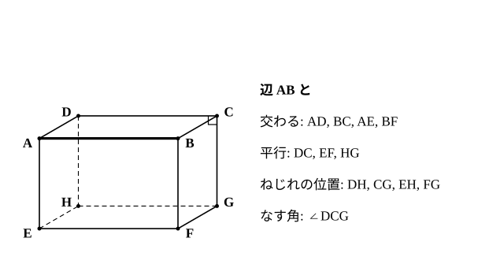
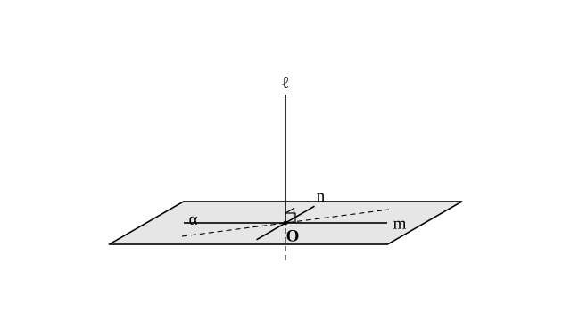
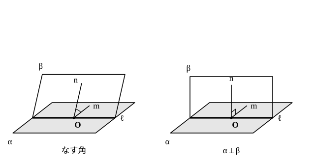

# L11 空間の直線と平面——位置関係を定義から言い直す

- unit_id: hs-math-a-geometry-properties
- 位置づけ: 単元第11レッスン（2時間）。空間図形の節（L11〜L13）の第1回。中1で「知る」ところまで学んだ空間の2直線・直線と平面・2平面の位置関係を、定義から言い直し、「なぜそう言えるか」を答えられる形にする回。平面図形では当たり前だった「垂直な2直線は交わる」「1つの直線に垂直な2直線は平行」が空間では崩れることを直方体の中で確かめ、直線と平面の垂直・2平面の垂直の定義を固定する。L12（正四面体・直方体の切断）でこの定義を使って論証し、L14 の総合演習で再訪する。
- distribution_status: published_draft
- license: CC-BY-4.0
- verify_required: 例題数値・記述は監修者検証必須。
- 主概念: ①空間の2直線の位置関係（交わる・平行・ねじれの位置）となす角——平行の定義に「同一平面上」が要ること、ねじれの位置でも垂直がありうること ②直線と平面の垂直（平面上の交わる2直線に垂直）・2平面のなす角と垂直の定義

---

**使う中学の結果**: 空間の2直線の位置関係は「交わる・平行・ねじれの位置」の3つ、直線と平面は「直線が平面上にある・交わる・平行」の3つ、2平面は「交わる・平行」の2つ（中1）／平面は、同一直線上にない3点で1つに決まる（中1）／2直線が交わってできる角と垂直の記号 ⊥、平行の記号 ∥（中1）／命題の仮定と結論・逆・反例（中2）。

## 1. 中1で「知った」位置関係を、もう一度

中1では、直方体の辺や面を見ながら「この2辺はねじれの位置にある」「この辺とこの面は平行」と**分類できる**ことが目標だった。高校では、同じ分類を**定義から言い直し**、「なぜその位置関係だと言えるのか」「この命題は本当に成り立つのか」を答えられるようにする。空間図形の論証は数学Ⅰ（図形と計量）でも出てくるが、その土台になる言葉の約束をそろえるのがこのレッスンの仕事である。

このレッスンを通して使う立体を1つ決めておく。**直方体 ABCD-EFGH** とは、面 ABCD を上面とし、A の真下に E、B の真下に F、C の真下に G、D の真下に H がある直方体のことである（以下、断りなくこの記号を使う）。

## 2. 空間の2直線——「同一平面上にあるか」で分ける

空間にある異なる2直線 ℓ、m の位置関係は、次の3つのどれか1つである。

1. **交わる**——1点を共有する。交わる2直線は、その2直線を含む平面がちょうど1つある。
2. **平行**（ℓ∥m）——**同一平面上にあって**、交わらない。
3. **ねじれの位置**にある——**同一平面上にない**。したがって交わらないし、平行でもない。

中1で学んだ言葉と同じだが、2の定義に「同一平面上にあって」が入っていることに注意する。平面図形では「交わらない2直線」は平行しかなかったので、この条件は要らなかった。空間では、交わらない2直線に「平行」と「ねじれの位置」の2種類があり、それを分けているのが「同一平面上にあるかどうか」である。「交わらないから平行」と言ってしまう考え方は、空間では反例がある——直方体の辺 AB と辺 CG は交わらないが、同じ平面の上にはなく、ねじれの位置にある。

**2直線のなす角**。交わる2直線のなす角は、交点にできる角のうち 90° 以下のもの（0° 以上 90° 以下）で測る。ねじれの位置にある2直線 ℓ、m のなす角は、次のように決める。空間の1点 O を通り、ℓ、m にそれぞれ平行な直線 ℓ′、m′ を引き、ℓ′ と m′ のなす角を ℓ と m のなす角とする。O の位置をどこに選んでも同じ角になる（このことは証明せず認めて使う）ので、この決め方でよい（O を ℓ 上の点にとれば、ℓ′ は ℓ 自身でよい）。平行な2直線のなす角は 0° とする。なす角が 90° のとき、2直線は**垂直**であるといい、ℓ⊥m と書く。ねじれの位置にある2直線でも、なす角が 90° なら垂直である——つまり、**空間では、交わらない2直線が垂直であることがある**。なお、L07 の「接線と弦のなす角」は点の名前で決まる角 ∠TAB そのもの（鈍角のこともある）で、ここで決める「2直線のなす角」とは別の約束である。

**例題1** 直方体 ABCD-EFGH について、次の問いに答えよ。
(1) 辺 AB と、ねじれの位置にある辺を全て答えよ。
(2) 直線 AB と直線 CG のなす角を求めよ。
(3) 直線 AB と直線 CG は垂直といえるか。

(1) 辺 AB と交わる辺は AD、BC、AE、BF の4本、平行な辺は DC、EF、HG の3本。残りの **DH、CG、EH、FG** の4本が、AB とねじれの位置にある辺である。
検算: 直方体の辺は12本。AB 自身1本＋交わる4本＋平行3本＋ねじれ4本=12 ✓。
(2) AB∥DC だから、AB と CG のなす角は DC と CG のなす角に等しい。DC と CG は点 C で交わり、面 DCGH は長方形だから ∠DCG=90°。よってなす角は **90°**。
(3) なす角が 90° だから、**垂直である**（AB⊥CG）。2直線は交わっていないが、垂直である。

:::guide
**交わっていないのに垂直、という言い方に引っかかったら**

平面図形の感覚では、垂直といえば「十字に交わっている」形だ。だから「AB と CG は交わらないのに垂直と言うのはおかしい」と感じるのは自然で、この感覚は中学までの経験に根ざしている。修正の鍵は、なす角の定義に戻ることである。ねじれの位置にある2直線のなす角は、「片方を平行に動かして、もう片方と交わらせたときの角」で測ると約束した。CG を平行に動かして AB と交わらせれば（たとえば BF の位置まで）、十字の 90° が見える。約束のうえでは「垂直」は「なす角が 90°」の言い換えであって、「交わっている」ことを含んでいない。逆に、この約束を知らないと、「交わらない2直線はみんな平行」という平面の経験がそのまま残って、辺 AB と辺 CG を平行と答えてしまうことになる。空間に出たら、「交わらない」の中に「平行」と「ねじれの位置」の2つがある、と言い直す習慣をつけよう。
:::

## 3. 直線と平面——「平面上のすべての直線と垂直」を、2本で言い切る

直線 ℓ と平面 α の位置関係は、次の3つのどれか1つである。

1. **ℓ が α 上にある**（ℓ は α に含まれる）——共有点が2つ以上ある。
2. **交わる**——共有点がちょうど1つ。
3. **平行**（ℓ∥α）——共有点がない。

直線と平面が垂直であることは、次のように定義する。直線 ℓ が平面 α と点 O で交わり、**ℓ が α 上のすべての直線と垂直**であるとき、ℓ は α に**垂直**であるといい、ℓ⊥α と書く。このとき ℓ を α の**垂線**という。（O を通らない α 上の直線とのなす角は、§2 の決め方どおり、O を通りその直線に平行な直線で測る。だから ℓ⊥α なら、α 上のどの直線とも——O を通らないものとも——垂直である。）

「すべての直線と垂直」を1本ずつ確かめることはできない。そこで次の事実を使う。

**直線 ℓ が、平面 α 上の交わる2直線 m、n の両方に垂直ならば、ℓ は α に垂直である。**

つまり、平面上の**交わる2本**に垂直であることを確かめれば、平面上のすべての直線に垂直であることが言える。この事実は三角形の合同を使って証明できるが、本レッスンでは結果を認めて使う。「交わる」の条件は外せない——m∥n の2本にだけ垂直であっても、ℓ が α に垂直とは限らない（直方体で、直線 AD は EF にも HG にも垂直——EF∥AB、HG∥AB と AD⊥AB から、§2 のなす角の決め方でそう言える——だが、平面 EFGH には垂直でなく、平行である）。

**直線と平面のなす角**。直線 ℓ が平面 α と点 O で交わり、垂直でないとき、ℓ 上の O 以外の点 P から α に垂線 PH を下ろすと、∠POH を ℓ と α のなす角という。ℓ⊥α のときは 90°、ℓ が α 上にあるか平行なときは 0° とする。

**例題2** 直方体 ABCD-EFGH について、次の問いに答えよ。
(1) 直線 AE は平面 ABCD に垂直であることを、定義と上の事実を使って説明せよ。
(2) 直線 AE と直線 AC は垂直か。

(1) 面 ABFE は長方形だから AE⊥AB、面 ADHE は長方形だから AE⊥AD。AB と AD は平面 ABCD 上にあり、点 A で交わる。直線 AE は平面 ABCD 上の交わる2直線 AB、AD に垂直だから、**AE⊥平面 ABCD** である。
(2) AC は平面 ABCD 上の、A を通る直線である。(1) より AE は平面 ABCD 上の A を通るすべての直線と垂直だから、**AE⊥AC** である。

(2) の AC は、直方体のどの面の辺でもない対角線である。「面が長方形だから」という理由は AC には使えない。直線と平面の垂直を経由することで、辺でない直線との垂直が言えるようになる——これが、この定義を置く一番の効用である。

:::guide
**答える対象は「直線」か「平面」か——毎問、最初に確かめる**

空間の問題でよくある取り違えは、「面 ABCD に平行な辺を答えよ」と問われて、平行な**面** EFGH を答えてしまう形である。図を見て「平行なもの」を探すと、目に入りやすいのは面のほうだからだ。問題文の「辺を答えよ」「直線を答えよ」「平面を答えよ」を最初に丸で囲む、答えを書く前に「いま答えたものは直線か平面か」を一度声に出す、この2つで防ぎやすくなる。「垂直」を言うときも同じで、直線と直線の垂直（AB⊥CG）・直線と平面の垂直（AE⊥平面 ABCD）・平面と平面の垂直（§4）は定義が別々である。「垂直」と一言で済ませず、**何と何が垂直か**を必ず書く。このレッスンの練習では、問題文が毎回「直線を答えよ」「平面を答えよ」と対象を明示している。自分で問題を読むときも、同じ目で読もう。
:::

## 4. 2つの平面——なす角と垂直

異なる2平面 α、β の位置関係は、次の2つのどれか1つである。

1. **交わる**——共有点がある。共有点の全体は1本の直線になり、これを α と β の**交線**（こうせん）という。
2. **平行**（α∥β）——共有点がない。

交わる2平面のなす角は、次のように決める。交線 ℓ 上の1点 O をとり、α 上に O を通り ℓ に垂直な直線 m、β 上に O を通り ℓ に垂直な直線 n を引く。m と n のなす角を α と β の**なす角**という（O を交線上のどこに選んでも同じ角になる——これも認めて使う）。なす角が 90° のとき、2平面は**垂直**であるといい、α⊥β と書く。

2平面が垂直であることは、次の事実で言い切れる。

**平面 α が、平面 β に垂直な直線 ℓ を含むならば、α⊥β である。**

証明は短い。ℓ と β の交点を O とすると、O は交線上にある。ℓ⊥β だから、ℓ は交線に垂直で、しかも α 上にある——つまり ℓ は「α 上に O を通り交線に垂直に引いた直線」そのものである。β 上に O を通り交線に垂直な直線 n を引くと、ℓ⊥β より ℓ⊥n。よって α と β のなす角は 90° で、α⊥β。（証明終）

**例題3** 直方体 ABCD-EFGH について、平面 ABFE と平面 ABCD が垂直であることを説明せよ。

例題2(1) より AE⊥平面 ABCD。直線 AE は平面 ABFE 上にある。平面 ABFE が、平面 ABCD に垂直な直線 AE を含むから、**平面 ABFE⊥平面 ABCD** である。

## 5. 真偽判定の型——反例は直方体の中から探す

位置関係についての命題は、「成り立つ（真）」か「成り立たない（偽）」かをはっきり言える。中2で学んだとおり、偽であることを示すには**反例**を1つ挙げればよく、真であることを示すには定義に戻って理由を言う。空間の命題の反例は、直方体 ABCD-EFGH の辺と面から探すのが早い。

**例題4** 異なる直線 ℓ、m と平面 α について、次の命題の真偽を答えよ。偽ならば直方体 ABCD-EFGH の中から反例を挙げよ。
(1) ℓ⊥α、m⊥α ならば ℓ∥m
(2) ℓ∥α、m∥α ならば ℓ∥m
(3) ℓ⊥m、m⊥n ならば ℓ∥n（n も直線）

(1) **真**。同じ平面に垂直な異なる2直線は平行である（証明はここでは省くが、結果として使ってよい。直方体では AE⊥平面 ABCD、BF⊥平面 ABCD で AE∥BF）。
(2) **偽**。反例: 直線 AB と直線 AD はどちらも平面 EFGH に平行だが、点 A で交わる。
(3) **偽**。反例: AB⊥AE、AE⊥AD だが、AB と AD は交わる。（AB⊥AE、AE⊥EF で AB∥EF のように成り立つ例もあるが、反例が1つあれば命題は偽である。）

(1) と (3) を並べて見ると、「垂直・垂直・ならば平行」という同じ形なのに、対象が「平面」だと真、「直線」だと偽である。平面図形で成り立っていた「1つの直線に垂直な2直線は平行」は、空間では「1つの**平面**に垂直な2直線は平行」に書き換えないと成り立たない。**条件を見直して定理を書き換える**——これが空間図形で最初に学ぶ考え方である。

:::guide
**真偽を答える前に、命題の対象を3種類に分けて書く**

位置関係の命題は、登場するものが「直線と直線」「直線と平面」「平面と平面」のどの組かで、使える定義が変わる。例題4の (1) と (3) が同じ形に見えて答えが逆になったのは、まさに対象が違うからだ。判定に入る前に、命題の中の記号を「ℓ、m、n は直線」「α、β は平面」と書き出し、条件の各項が3種類のどれかを添える。そのうえで、真だと思うなら「定義のどこから言えるか」、偽だと思うなら「直方体の中のどの辺・面が反例か」を書く。「なんとなく成り立ちそう」で真と答えると、(2) や (3) のような、平面図形の経験に引きずられた命題で外す。反例探しの手順も型にしておくとよい——直方体の中で条件を満たす組を2〜3通り作ってみて、結論が崩れる組が1つでもあれば偽。全部成り立つなら、真である理由を定義から探す。
:::

## 6. 練習

以下の問いでは、直方体 ABCD-EFGH（面 ABCD が上面、A の真下に E、B の真下に F、C の真下に G、D の真下に H）を使う。各問で答える対象が「直線（辺）」か「平面（面）」かを問題文で確かめてから答えよ。

**問1** 辺 BC について、次の**辺**を全て答えよ。
(1) 辺 BC と平行な辺
(2) 辺 BC と交わる辺
(3) 辺 BC とねじれの位置にある辺

**問2** 次の位置関係を、「上にある（含まれる）」「交わる」「平行」のいずれかで答えよ。交わる場合は、垂直であればそのことも書け。
(1) **直線** AE と**平面** BFGC
(2) **直線** AE と**平面** EFGH
(3) **直線** AE と**平面** AEHD
(4) **平面** ABCD と**平面** DHGC
(5) **平面** ABCD と**平面** EFGH

**問3** 直方体 ABCD-EFGH が、全ての辺の長さが等しい立方体であるとき、次の2直線のなす角を求めよ。
(1) 直線 AB と直線 FG
(2) 直線 AC と直線 EF
(3) 直線 AF と直線 BG（ヒント: BG と平行な直線を A を通るように引き、面の対角線だけでできる三角形を見つける）

**問4** 異なる直線 ℓ、m、n と平面 α について、次の命題の真偽をそれぞれ「真」「偽」で答えよ。偽ならば直方体 ABCD-EFGH の中から反例を挙げよ（真ならば、ここでは証明は求めず、直方体の例で成り立つことを確かめればよい。ただし、例で確かめただけでは証明したことにはならない）。
(1) ℓ⊥α、ℓ⊥β ならば α∥β（β は α と異なる平面）
(2) ℓ∥α、m⊥α ならば ℓ⊥m
(3) ℓ∥m、m∥n ならば ℓ∥n

**問5** 直線 ℓ と平面 α、β について、次の命題の真偽をそれぞれ「真」「偽」で答えよ。偽ならば直方体 ABCD-EFGH の中から反例を挙げよ。
(1) α⊥β で、ℓ が α 上にあるならば ℓ⊥β
(2) α∥β で、ℓ が α 上にあるならば ℓ∥β
(3) ℓ∥α、ℓ∥β ならば α∥β

---

:::stretch
**S1** 平面図形では「1つの直線に垂直な2直線は平行である」が成り立つ。
(1) 平面上で、直線 ℓ に直線 m、n がそれぞれ別の点で垂直であるとき、m∥n となる理由を、中2で学んだ平行線の性質（同位角）を使って1〜2文で説明せよ。
(2) 空間では「1つの直線に垂直な2直線は平行である」が成り立たないことを、直方体 ABCD-EFGH の辺を使った反例で示せ。
(3) 「1つの直線に」の部分を書き換えると、空間でも成り立つ命題になる。どう書き換えればよいか答え、直方体の辺で成り立つ例を1つ挙げよ。
:::

対応解答: answer_key_L11-13.md

<!-- gen_nav:nav:start（自動生成・手編集しない） -->

---

[← 前のレッスン](lesson_10.md)｜[単元の目次](README.md)｜[解答](answer_key_L11-13.md)｜[次のレッスン →](lesson_12.md)

<!-- gen_nav:nav:end -->
