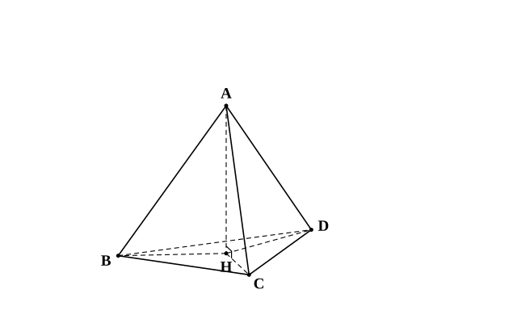
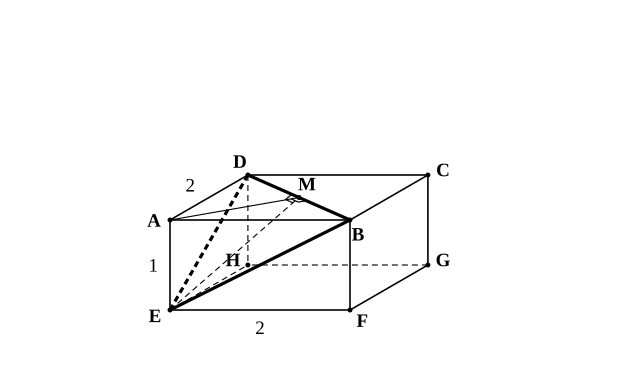
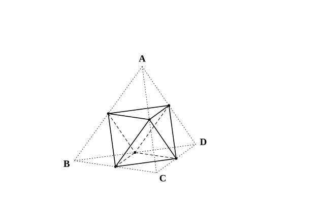

# L12 直線と平面の垂直を使う——正四面体・直方体の中の三角形

- unit_id: hs-math-a-geometry-properties
- 位置づけ: 単元第12レッスン（2時間）。空間図形の節（L11〜L13）の第2回。L11 で定義した「直線と平面の垂直」を、実際の立体の中で使う回。前半では、正四面体の頂点から底面に下ろした垂線の足が底面の重心（外心・内心と一致する点）であることを、直角三角形の合同と L02・L03 の三心で説明する。後半では、直方体を3つの頂点を通る平面で切って四面体を作り、切り口の三角形を1枚の平面として取り出して、三平方の定理・二等辺三角形の性質を使い、その結果を体積や垂線の長さとして空間へ戻す。L13（多面体）へは stretch の八面体でつなぎ、L14 の総合演習で「見るべき平面を自分で選ぶ」練習として再訪する。
- distribution_status: published_draft
- license: CC-BY-4.0
- verify_required: 例題数値・記述は監修者検証必須。
- 主概念: ①正四面体の頂点から底面への垂線の足は底面の重心である（直線⊥平面の定義＋直角三角形の合同＋三心の一致） ②直方体の切断でできる四面体の切り口の三角形に平面の定理（三平方・二等辺三角形）を使い、体積・垂線の長さとして空間へ戻す

---

**使う中学の結果**: 三平方の定理とその逆（中3）／直角三角形の合同条件「斜辺と他の1辺がそれぞれ等しい」（中2）／二等辺三角形の頂点と底辺の中点を結ぶ線分は、底辺に垂直で頂角を二等分する（中2）／中点連結定理と相似な図形の体積比は相似比の3乗（中3）／角錐の体積=（底面積）×（高さ）÷3（中1）。

## 1. これまでの結果と、空間の問題を解く型

この単元でここまでに得た結果も使う。三角形の外心は3頂点から等距離の点（L02）、正三角形では外心・内心・重心が一致し、重心は中線を 2:1 に分ける（L03）、直線が平面上の交わる2直線に垂直ならその平面に垂直（L11）。

空間図形の問題を解くときの基本の型は、「**見るべき平面を1枚切り出す→その平面上で平面図形の定理を使う→結果を空間へ戻す**」の3段である。このレッスンの例題はすべてこの3段で書いてある。どの段で何をしているかを意識しながら読もう。

## 2. 正四面体の頂点から下ろした垂線の足——底面の外心、そして重心

4つの面がすべて正三角形である三角錐を**正四面体**という。正四面体 ABCD で、頂点 A から底面 BCD に垂線を下ろし、その足（平面 BCD との交点）を H とする。H は底面 BCD のどこにあるだろうか。

**例題1** 上の設定で、H が △BCD の外心であることを示す次の証明の空らん（ア）〜（エ）を埋めよ。

　AH⊥平面 BCD だから、AH は平面 BCD 上の H を通るすべての直線と垂直である。特に AH⊥HB、AH⊥HC、AH⊥HD で、△ABH, △ACH, △ADH はいずれも ∠AHB=∠AHC=∠AHD=（ア）° の直角三角形である。
　正四面体だから AB=AC=AD（斜辺が等しい）。AH は3つの三角形に共通（他の1辺が等しい）。直角三角形の合同条件「（イ）」により、△ABH≡△ACH≡△ADH。
　よって HB=HC=（ウ）。H は3点 B、C、D から等距離の点、すなわち △BCD の（エ）である。

空らんの答え: （ア）90 （イ）斜辺と他の1辺がそれぞれ等しい （ウ）HD （エ）外心

ここで L03 の結果を思い出す。△BCD は正三角形だから、その外心は重心と一致する（内心とも一致する）。したがって、**正四面体の頂点から底面に下ろした垂線の足は、底面の重心である**。逆に言えば、底面 BCD の重心 G について、AG は平面 BCD に垂直である（垂線の足はただ1つで、それが G だから）。

この論証の3段を確認しておく。①切り出した平面は「A、H と B、C、D それぞれを含む3枚の平面」で、そこに3つの直角三角形が見えた。②平面上で使った定理は「直角三角形の合同条件」。③空間へ戻した結果が「H は3頂点から等距離、つまり外心であり重心」である。

**例題2** 1辺の長さが 6 の正四面体 ABCD で、頂点 A から底面 BCD に下ろした垂線の足を H とする。
(1) BH の長さを求めよ。
(2) AH の長さを求めよ。
(3) 正四面体 ABCD の体積を求めよ。

(1) H は △BCD の重心である。CD の中点を M とすると、BM は中線で、正三角形 BCD の高さでもある。△BCM は ∠BMC=90°、BC=6、CM=3 の直角三角形だから BM=√(6²−3²)=√27=3√3。重心は中線を 2:1 に分けるから BH=(2/3)BM=(2/3)×3√3=**2√3**。
(2) △ABH は ∠AHB=90° の直角三角形で、AB=6、BH=2√3。AH=√(6²−(2√3)²)=√(36−12)=√24=**2√6**。
(3) 底面 △BCD の面積は (1/2)×6×3√3=9√3。高さは AH=2√6。体積は (1/3)×9√3×2√6=6√18=**18√2**。

検算: (1)(2) を H の位置で確かめる。H は重心だから HM=(1/3)BM=√3。△AHM は直角三角形で AM=BM=3√3（4つの面は合同な正三角形なので、面 ACD の高さ AM も 3√3。∠AHM=90° は AH⊥平面 BCD から）。AH²＋HM²=24＋3=27=AM² ✓。

:::guide
**垂線の足の位置を、答えを知っていても定義から言えるようにする**

正四面体の垂線の足が底面の重心であることは、結果として覚えている人も多い。ただ、この回で身につけたいのは結果よりも、「なぜ重心なのか」を定義から組み立てる道筋である。順に言うと、①AH⊥平面 BCD という**直線と平面の垂直**の定義から、平面上の3本の直線 HB、HC、HD との垂直が出る。②そこで3つの直角三角形ができ、斜辺（正四面体の辺）が等しく、AH が共通だから**合同**になる。③合同から HB=HC=HD、つまり3頂点から等距離で、H は**外心**。④底面が**正三角形**だから外心は重心と一致する。この4歩のどこかを飛ばすと、たとえば「3つの辺 AB・AC・AD は等しいが、底面が正三角形でない三角錐」で足がどこにあるか（そのときは③で止まる——足は外心であって、重心ではない。AB・AC・AD が等しくなければ②の合同が言えず、足は外心とも限らない）が言えなくなる。正四面体でない三角錐の問題に出会ったとき、この4歩の道筋を持っている人だけが「今回は④が使えない」と判断できる。
:::

## 3. 直方体を3頂点を通る平面で切る——切り口の三角形に平面の定理を使う

直方体 ABCD-EFGH（L11 と同じ記号）を、3つの頂点 B、D、E を通る平面で切ると、頂点 A を含む側に**四面体 ABDE**（4つの三角形の面で囲まれた立体＝三角錐。4つの頂点の記号を並べて呼ぶ）ができる。この四面体は、頂点 A に集まる3つの角 ∠BAD, ∠BAE, ∠DAE がすべて 90° で、切り口の面 △BDE の3辺は、いずれも直方体の面の対角線である。

**例題3** AB=AD=2、AE=1 の直方体 ABCD-EFGH を、3点 B、D、E を通る平面で切ってできる四面体 ABDE について、次の問いに答えよ。
(1) △BDE の3辺の長さを求めよ。
(2) BD の中点を M とする。AM⊥BD と EM⊥BD を説明し、BD⊥平面 AEM であることを示せ。
(3) EM の長さと、△BDE の面積を求めよ。
(4) 四面体 ABDE の体積を求めよ。また、頂点 A から平面 BDE に下ろした垂線の長さを求めよ。

(1) 切り出す平面は直方体の3つの面である。面 ABCD で BD=√(2²＋2²)=√8=**2√2**、面 ABFE で BE=√(2²＋1²)=**√5**、面 ADHE で DE=√(2²＋1²)=**√5**。
(2) 【切り出す平面: 面 ABCD】AB=AD の二等辺三角形 ABD で、M は底辺 BD の中点だから、AM は頂角の二等分線でもあり、底辺を垂直に二等分する。よって **AM⊥BD**。【切り出す平面: 平面 BDE】(1) より EB=ED の二等辺三角形 EBD で、M は底辺 BD の中点だから、同じ理由で **EM⊥BD**。【空間へ戻す】AM と EM は平面 AEM 上にあり、点 M で交わる。直線 BD は平面 AEM 上の交わる2直線 AM、EM に垂直だから、L11 の事実により **BD⊥平面 AEM** である。
(3) 【切り出す平面: 平面 BDE】△EMB は ∠EMB=90° の直角三角形で、EB=√5、BM=√2。EM=√((√5)²−(√2)²)=√(5−2)=**√3**。△BDE の面積は (1/2)×BD×EM=(1/2)×2√2×√3=**√6**。
(4) 四面体 ABDE を、△ABD を底面、AE を高さとみる（AE⊥平面 ABCD だから、AE は底面 ABD に垂直な高さである）。△ABD の面積は (1/2)×2×2=2 だから、体積 V=(1/3)×2×1=**2/3**。
次に、同じ四面体を △BDE を底面とみる。A から平面 BDE に下ろした垂線の長さを d とすると、V=(1/3)×√6×d。これが 2/3 に等しいから (1/3)×√6×d=2/3、d=2/√6=**√6/3**。

検算: (3) の EM を別の平面で確かめる。平面 AEM 上で、△AEM は ∠EAM=90°（AE⊥平面 ABCD より AE⊥AM）の直角三角形で、AE=1、AM=(1/2)BD=√2。EM²=1²＋(√2)²=3 ✓（(3) の EM=√3 と一致）。

(4) の後半は、**同じ体積を2通りに表す**ことで、直接には測りにくい「頂点から切り口の平面までの距離」を求める型である。この型は L14 の総合演習で再び使う。

:::guide
**見るべき平面を切り出すとき、「その平面に何が入っているか」を書き出す**

例題3の (2) と (3) では、切り出す平面を【 】で明示した。空間の問題で手が止まるのは、多くの場合、定理が思い出せないからではなく、**どの平面を見ればよいかが決まらない**からである。決め方の目安は2つ。1つは「求めたい線分（角）を含み、既知の長さ（角）もできるだけ多く含む平面」を選ぶこと。例題3(3) で EM を求めるとき、平面 BDE を選べば EB と BM が既知の直角三角形が見え、平面 AEM を選んでも AE と AM が既知の直角三角形が見える——どちらでも解け、片方が検算になる。もう1つは、選んだ平面の上に「何が乗っているか」を、点・線分・角の名前で書き出すことである。書き出してみると、たとえば「平面 BDE には頂点 A は乗っていない」ことがはっきりし、A の位置を使いたいなら別の平面（AEM）が要る、と判断できる。慣れないうちは、切り出した平面を紙に別の図として描き直すのがよい。空間の見取図の上で直角三角形を見つけるより、平面図に描き直したほうが、三平方の定理の当てはめ間違いが起こりにくい。
:::

:::guide
**体積を2通りに表す方法は、なぜ垂線の長さを出せるのか**

四面体の体積は「底面積×高さ÷3」で、底面にどの面を選んでも同じ値になる。例題3(4) では、まず「底面 △ABD・高さ AE」で体積を出した——ここで高さに AE を使えるのは、AE⊥平面 ABCD（直方体の辺だから）で、AE が底面に垂直だからである。次に「底面 △BDE・高さ d」で同じ体積を表した。d は A から平面 BDE への垂線の長さで、その足がどこにあるかはわからなくてよい——体積の式には「垂線の足の位置」は出てこず、長さだけが出てくるからだ。この型のよいところは、垂線の足を特定しなくても距離が求まる点にある。逆に、垂線の足の位置そのものを問われたら（例題1・例題2 のように）、合同や三心の議論に戻る必要がある。「長さだけなら体積で、位置なら合同と三心で」と使い分けよう。
:::

## 4. L13 への橋——正四面体の4つの角を切り落とすと

直方体を切って四面体を作ったのと同じ発想で、今度は四面体のほうを切ってみる。正四面体 ABCD の6本の辺の中点をとり、各頂点について、その頂点から出る3本の辺の中点を通る平面で頂点のまわりを切り落とす。切り落とされる4つの小さな立体は、中点連結定理により、辺の長さがもとの半分の正四面体である。残る立体は、もとの4つの面の中央に残る三角形4枚と、切り口の三角形4枚の、合計8枚の正三角形で囲まれる。

この立体の面・辺・頂点の数を数えると、面8・辺12・頂点6 になる。「頂点が6個・面が8枚」という数を、次の L13 で多面体の言葉として扱う。切り落とす理由づけ（なぜ小さい立体が正四面体になるか・なぜ8枚の面がすべて正三角形になるか）と体積の比は、stretch で確かめる。

## 5. 練習

**問1** 1辺の長さが 12 の正四面体 ABCD で、頂点 A から底面 BCD に下ろした垂線の足を H、辺 CD の中点を M とする。
(1) H は △BCD の何という点か。名前を答えよ。
(2) BM と BH の長さを求めよ。
(3) AH の長さを求めよ。
(4) 正四面体 ABCD の体積を求めよ。

**問2** AB=6、AD=8、AE=8 の直方体 ABCD-EFGH を、3点 B、D、E を通る平面で切ってできる四面体 ABDE について、次の問いに答えよ。
(1) △BDE の3辺 BD、BE、DE の長さを求めよ。
(2) △BDE は二等辺三角形か。また、直角三角形か。三平方の定理（直角三角形なら、最も長い辺を斜辺として3辺の間に等式が成り立つ）を使って答えよ。
(3) 直線 AE と直線 BD が垂直であることを、直線と平面の垂直を使って説明せよ。

**問3** AB=AD=4、AE=2 の直方体 ABCD-EFGH を、3点 B、D、E を通る平面で切ってできる四面体 ABDE について、BD の中点を M とする。
(1) BD、BE、EM の長さを求めよ。
(2) △BDE の面積を求めよ。
(3) 四面体 ABDE の体積を求めよ。また、頂点 A から平面 BDE に下ろした垂線の長さを求めよ。

**問4** 正四面体 ABCD で、辺 CD の中点を M とする。辺 AB と辺 CD が垂直であることを示す次の証明の空らん（ア）〜（オ）を埋めよ。

　△ACD は正三角形で、M は底辺 CD の中点だから、AM は CD を垂直に二等分する。よって （ア）⊥CD。
　同様に △BCD は正三角形だから、（イ）⊥CD。
　AM と BM は平面 ABM 上にあり、点 （ウ）で交わる。直線 CD は平面 ABM 上の交わる2直線 AM、BM に垂直だから、CD⊥（エ）。
　直線 AB は平面 ABM 上にあるから、CD⊥AB である。AB と CD は交わらないが、（オ）の位置にあって垂直である。

---

:::stretch
**S1** 1辺の長さが 4 の正四面体 ABCD で、6本の辺の中点をとる。4つの頂点それぞれについて、その頂点から出る3本の辺の中点を通る平面で正四面体を切り、頂点を含む小さな四面体を切り落とす。
(1) 切り落とされる4つの小さな四面体は、それぞれ1辺の長さが 2 の正四面体であることを、中点連結定理を使って説明せよ。
(2) 残った立体の面の数・辺の数・頂点の数を求めよ。また、残った立体の面はすべて1辺の長さが 2 の正三角形であることを説明せよ（この立体は正八面体と呼ばれる）。
(3) 残った立体の体積は、もとの正四面体の体積の何倍か。相似な立体の体積比を使って求めよ。
(4) (2) で求めた面の数 f・辺の数 e・頂点の数 v について、v−e＋f の値を求めよ（この値の意味は L13 で扱う）。
:::
<!-- 題材について: 「直方体の3頂点を通る平面で切ると四面体」「四面体の各辺の内分点を通る平面で切ると八面体」は、高等学校学習指導要領（平成30年告示）解説 数学編が数学A「図形の性質」の考察例として挙げるもの。本レッスンでは内分点のうち中点の場合を扱った。数値・設問文は自作 -->

対応解答: answer_key_L11-13.md

<!-- gen_nav:nav:start（自動生成・手編集しない） -->

---

[← 前のレッスン](lesson_11.md)｜[単元の目次](README.md)｜[解答](answer_key_L11-13.md)｜[次のレッスン →](lesson_13.md)

<!-- gen_nav:nav:end -->
