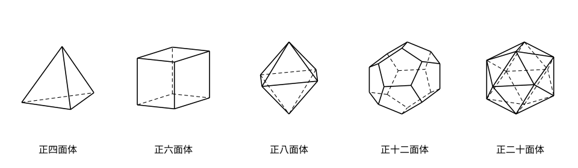
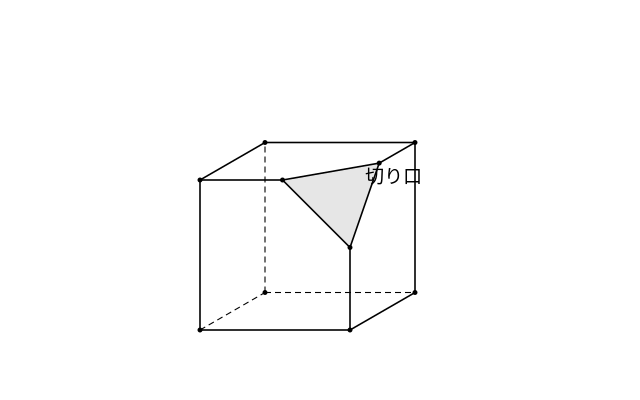

# L13 多面体——正多面体と v−e＋f=2

- unit_id: hs-math-a-geometry-properties
- 位置づけ: 単元第13レッスン（2時間）。空間図形の節（L11〜L13）の最終回。L12 の stretch で現れた「面8・辺12・頂点6の立体」を入口に、平面で囲まれた立体（多面体）の面・辺・頂点を「面から数えて検算する」型で数え、正多面体が5種類あることと、凸（とつ）多面体で頂点の数−辺の数＋面の数=2 が成り立つこと（オイラーの多面体定理と呼ばれる）を、観察と数え上げで確かめる。この定理の証明は本単元では扱わない。多面体・正多面体・オイラーの多面体定理は教科書で標準的に扱われる内容で、このレッスンは「数えて確かめる」ところまでを目標にする。L14 の総合演習で定理カードの1枚として再訪する。
- distribution_status: published_draft
- license: CC-BY-4.0
- verify_required: 例題数値・記述は監修者検証必須。
- 主概念: ①正多面体5種の区別（面の形・1頂点に集まる面の数）と、面・辺・頂点の数を「面から数えて検算する」型 ②凸多面体で v−e＋f=2 が成り立つことの観察（角を切った立体でも成り立つ・証明はしない）

---

**使う中学の結果**: 角柱・角錐の面・辺・頂点と見取図（中1）／正 n 角形の1つの内角は 180°×(n−2)/n（中2）／相似な図形の対応（中3）。

## 1. 立体の形を数える——このレッスンの目標

この単元の空間図形は、L11 で位置関係の定義、L12 で直線と平面の垂直を使った論証と計量を扱った。最終回のこのレッスンは少し趣を変えて、立体の**形の数え上げ**を扱う。L12 の stretch で、正四面体の4つの角を切り落とすと、面が8・辺が12・頂点が6の立体ができた。このような立体を一般に数えるための言葉と型を作る。

## 2. 多面体・凸多面体・正多面体

いくつかの平面だけで囲まれた立体は、多面体と呼ばれる。三角柱・四角錐・立方体はどれも多面体である（円柱・球は曲面で囲まれているので多面体ではない）。面の数によって、四面体・五面体・六面体などと呼ぶ。多面体のうち、どの面を含む平面で切っても立体全体がその平面の片側だけにあるもの、言い換えれば**へこみのない**多面体は、凸（とつ）多面体と呼ばれる。このレッスンで扱うのは凸多面体である。

凸多面体のうち、**すべての面が合同な正多角形**で、**どの頂点にも同じ数の面が集まる**ものは、正多面体と呼ばれる。正多面体は次の5種類しかないことが知られている（種類が限られる理由の一部は stretch で観察する）。

| 名前 | 面の形 | 1つの頂点に集まる面の数 |
|---|---|---|
| 正四面体 | 正三角形 | 3 |
| 正六面体（立方体） | 正方形 | 3 |
| 正八面体 | 正三角形 | 4 |
| 正十二面体 | 正五角形 | 3 |
| 正二十面体 | 正三角形 | 5 |

正三角形の面をもつ正多面体が3種類（正四・正八・正二十面体）あることに注意する。この3つを区別するのは、面の形ではなく「1つの頂点に集まる面の数」である。

## 3. 数え上げの型——面から数え、辺と頂点は割って求め、検算する

多面体の面の数 f・辺の数 e・頂点の数 v を数えるとき、見取図を見ながら1つずつ数えると、裏側にある頂点を数え落としたり、同じ辺を2回数えたりしやすい。そこで、**面の数と面の形から計算で求め、最後に検算する**型を使う。この型がそのまま使えるのは、どの面も辺の数が同じで、どの頂点にも同じ数の面が集まる立体（正多面体など）である。面の形が混ざる立体（三角柱など）では、2 と 3 の「1つの面の辺（頂点）の数×面の数」の積がそのままでは使えない（その数え方は例題3で扱う）。

1. **面の数 f** を数える（面は数えやすい。名前に入っていることも多い）。
2. **辺の数 e** は、「1つの面の辺の数×面の数」を **2 で割る**。1本の辺は、ちょうど2つの面に共有されているからである。
3. **頂点の数 v** は、「1つの面の頂点の数×面の数」を、**1つの頂点に集まる面の数で割る**。1つの頂点は、そこに集まる面の数だけ重複して数えられているからである。
4. **検算**として、v−e＋f を計算する（§4 で見るように、凸多面体ではこの値が 2 になる）。

**例題1** 正八面体と正十二面体について、面・辺・頂点の数を求めよ。

正八面体: 面は正三角形で f=8。辺は 3×8÷2=**12**。1つの頂点に4面が集まるから、頂点は 3×8÷4=**6**。
検算: v−e＋f=6−12＋8=2 ✓。L12 stretch の立体（面8・辺12・頂点6）と一致する。

正十二面体: 面は正五角形で f=12。辺は 5×12÷2=**30**。1つの頂点に3面が集まるから、頂点は 5×12÷3=**20**。
検算: v−e＋f=20−30＋12=2 ✓。

:::guide
**なぜ「2 で割る」「集まる面の数で割る」のか——重複を数えてから割る**

辺を「1つの面の辺の数×面の数」で数えると、たとえば正八面体では 3×8=24 になる。しかし実際の辺は 12 本である。24 は、1本の辺を「隣り合う2つの面のそれぞれから」1回ずつ、合計2回数えた結果だからだ。「わざと重複して数え、重複の回数で割る」——これが数え上げの基本の考え方で、頂点についても同じである。正八面体の頂点を「1つの面の頂点の数×面の数」で数えると 3×8=24 で、これは1つの頂点をそこに集まる4つの面から4回ずつ数えている。24÷4=6 が正しい頂点の数になる。この型のよいところは、見取図の裏側を見なくても数えられることと、「面の数」と「1頂点に集まる面の数」という2つの情報だけで辺の数と頂点の数が決まることが実感できる点にある。逆に、この2つの情報がわからない立体（面の形が何種類か混ざっている立体など）では、辺の数は「各面の辺の数の合計÷2」で数えられるが、頂点は別の方法（§4 の定理）で求めることになる。
:::

## 4. オイラーの多面体定理——v−e＋f=2 を観察する

例題1で、正八面体でも正十二面体でも v−e＋f=2 になった。ほかの立体でも調べてみる。

| 立体 | v | e | f | v−e＋f |
|---|---|---|---|---|
| 正四面体 | 4 | 6 | 4 | 2 |
| 立方体 | 8 | 12 | 6 | 2 |
| 三角柱 | 6 | 9 | 5 | 2 |
| 四角錐 | 5 | 8 | 5 | 2 |
| 正八面体 | 6 | 12 | 8 | 2 |

凸多面体では、頂点の数 v・辺の数 e・面の数 f について、常に

**v−e＋f=2**

が成り立つ。この事実はオイラーの多面体定理と呼ばれる（オイラーは数学者の名前）。この単元では証明はせず、いろいろな凸多面体で成り立つことを数えて確かめ、数え上げの**検算**として使う（凸多面体では成り立つと認めて、例題3 のように頂点の数を求めるのにも使う）。

角を切った立体でも成り立つだろうか。立方体の1つの頂点を、その頂点から出る3本の辺の途中を通る平面で切り落としてみる。

**例題2** 立方体の1つの頂点を、その頂点から出る3本の辺の途中を通る平面で切り落とした。できた立体の v、e、f を求め、v−e＋f を計算せよ。

切り落とす前の立方体は v=8、e=12、f=6。頂点を1つ切り落とすと、
- 頂点: 切られた頂点1つが消え、切り口の三角形の頂点3つが新しくできる。v=8−1＋3=**10**。
- 辺: もとの12本は（短くなるが）残り、切り口の三角形の辺3本が加わる。e=12＋3=**15**。
- 面: もとの6面は残り（3面は五角形になる）、切り口の三角形1面が加わる。f=6＋1=**7**。
v−e＋f=10−15＋7=**2**。

角を1つ切ると（立方体の頂点のように3本の辺が集まる頂点では）、v は 2 増え、e は 3 増え、f は 1 増える。増える分だけで v−e＋f を計算すると 2−3＋1=0 だから、**角を切っても v−e＋f の値は変わらない**。角を2つ、3つと切っていっても（切り口どうしが重ならない限り）、この値は 2 のままである。

**例題3** ある凸多面体の面は、三角形が 4 枚と四角形が 4 枚の合計 8 枚である。辺の数と頂点の数を求めよ。

面の形が2種類混ざっているので、辺は「各面の辺の数の合計÷2」で数える。e=(3×4＋4×4)÷2=28÷2=**14**。頂点は v−e＋f=2 から v=2＋e−f=2＋14−8=**8**。
検算: 面の頂点の合計は 3×4＋4×4=28。頂点が8個だから、1つの頂点に平均 28÷8=3.5 枚の面が集まる——頂点ごとに集まる面の数が同じではない立体である（集まる面の数が頂点によって異なる）。数え方の型の3番（集まる面の数で割る）がそのままでは使えないのは、このためである。

:::guide
**数え間違いを見つけるのは、目ではなく式**

見取図で v、e、f を数えると、慣れた人でも間違える。よくある間違いは、①見取図の裏側にあって描かれていない頂点や辺を数え落とす、②切り落としてできた小さな面の頂点を「角にないから頂点ではない」と見なして数えない、③1つの面のまわりを回って辺を数えたとき、隣の面と共有している辺を2回数える、の3つである。見取図を見直しても、同じ思い込みでは同じ数え方を繰り返してしまう。そこで、**数えた後に必ず v−e＋f を計算する**。2 にならなければ、どこかが間違っている（ただし、たまたま 2 になっても正しいとは限らない——2つの間違いが打ち消し合うこともある）。もう1つの防御は、§3 の型で「別の方法で数える」ことである。見取図で数えた値と、面から計算した値が一致すれば、両方とも正しい可能性が高い。目で数えた1回の結果を信じきらず、式と別の方法で確かめる——L01 からこの単元で繰り返してきた「検算」の習慣は、数え上げでも同じように効く。
:::

## 5. 練習

**問1** 次の表を完成させよ。辺の数と頂点の数は §3 の型で求め、v−e＋f の値で検算せよ（正四面体と正六面体は、§4 の表の値と一致することも確かめよ）。

| 名前 | 面の形 | 1つの頂点に集まる面の数 | f | e | v | v−e＋f |
|---|---|---|---|---|---|---|
| 正四面体 | 正三角形 | 3 | 4 | | | |
| 正六面体 | 正方形 | 3 | 6 | | | |
| 正二十面体 | 正三角形 | 5 | 20 | | | |

**問2** 次の立体の v、e、f を求め、v−e＋f を計算せよ。
(1) 正五角柱（底面が正五角形の角柱）
(2) 正六角錐（底面が正六角形の角錐）

**問3** 次の立体の v、e、f を求め、v−e＋f を計算せよ。また、面はどんな多角形が何枚ずつあるか答えよ。切り口どうしは共有点をもたない（もとの各辺に、切られずに残る部分がある）ものとする。
(1) 立方体の8つの頂点をすべて、各頂点から出る3本の辺の途中を通る平面で切り落とした立体
(2) 正八面体の6つの頂点をすべて、各頂点から出る4本の辺の途中を通る平面で切り落とした立体

**問4** ある凸多面体の面は、正三角形が 8 枚と正方形が 6 枚の合計 14 枚で、どの頂点にも同じ数の面が集まっている。
(1) 辺の数を求めよ。
(2) v−e＋f=2 を使って頂点の数を求めよ。
(3) 1つの頂点に集まる面の数を求めよ。
(4) 別の人が、ある凸多面体の頂点・辺・面を数えて v=10、e=16、f=7 と答えた。この数え方に誤りがあると言える理由を1〜2文で説明せよ。

---

:::stretch
**S1** 正多面体の1つの頂点には、3枚以上の合同な正多角形が集まる。立体の頂点ができるためには、集まる面の内角の和が 360° より小さくなければならない（ちょうど 360° だと平らになり、頂点にならない）。
(1) 正三角形（1つの内角 60°）を1つの頂点に3枚・4枚・5枚・6枚集めたとき、内角の和をそれぞれ求め、頂点ができるのはどの場合か答えよ。
(2) 正方形（内角 90°）・正五角形（内角 108°）・正六角形（内角 120°）について、頂点ができる枚数をそれぞれ答えよ。
(3) (1)(2) から、「面の形と1つの頂点に集まる面の数」の組み合わせで頂点ができるものは全部で何通りあるか答え、§2 の表の5種類と対応させよ。（この観察は「5種類より多くはない」ことを示しているが、「5種類がすべて実際に存在する」ことは別に確かめる必要がある。存在の証明は本単元では扱わない。）
:::

対応解答: answer_key_L11-13.md

<!-- gen_nav:nav:start（自動生成・手編集しない） -->

---

[← 前のレッスン](lesson_12.md)｜[単元の目次](README.md)｜[解答](answer_key_L11-13.md)｜[次のレッスン →](lesson_14.md)

<!-- gen_nav:nav:end -->
