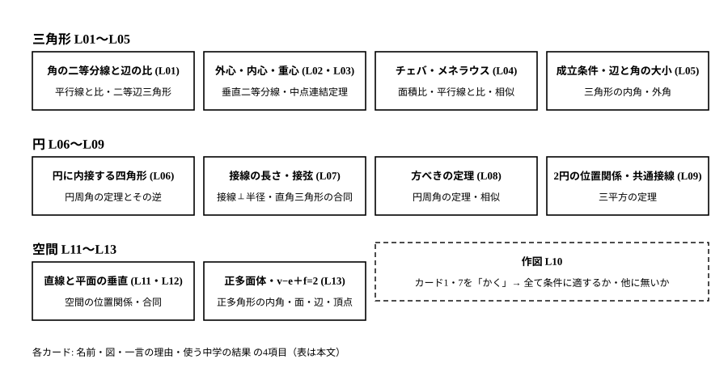
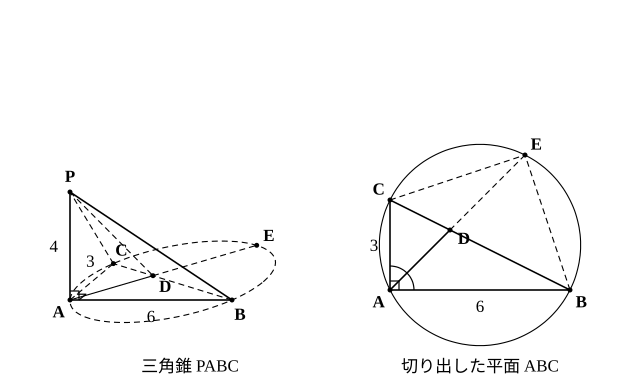

# L14 単元のまとめ——平面の定理を空間の中で使う

- unit_id: hs-math-a-geometry-properties
- 位置づけ: 単元第14レッスン（2時間）。単元全体のまとめの回。**新しい概念・新しい用語は立てない**。前半では、この単元で証明した定理と、結果を認めて使った事実を「名前・図・一言の理由・使う中学の結果」のカードとして1枚の地図に並べ直し、どの定理がどの中学の結果から生まれたかを見渡す。後半では、自作の三角錐の中に平面を1枚切り出し、その平面上で三角形と円の定理（角の二等分線と辺の比・円に内接する四角形・方べきの定理）を使って長さを求め、その結果を空間へ戻して垂直の判定と体積を求める、という1本の流れを通す。最後に、この単元の先にある数学Ⅱ・数学Cとの境界を1〜2文で示す。
- distribution_status: published_draft
- license: CC-BY-4.0
- verify_required: 例題数値・記述は監修者検証必須。
- 主概念: ①定理カード地図——各定理を「名前・図・一言の理由・使う中学の結果」で再配置する ②空間図形の中に見るべき平面を自分で選び、平面の定理で長さを求め、空間へ戻す（垂直の判定・体積）までを1本の流れで解く

---

**使う中学の結果**: この地図の右の列にまとめる（平行線と線分の比・中点連結定理・面積比・三角形の合同と相似・円周角の定理とその逆・接線⊥半径・三平方の定理・空間の位置関係）。

## 1. 定理カード地図——14レッスンを1枚に

この単元で証明した定理と、結果を認めて使った事実は、数えると10枚ほどのカードになる。カードには「名前」「図（どんな形か）」「一言の理由（証明の芯）」「使う中学の結果」の4項目を書く。試験前にこの地図を見て、4項目のどれかが言えないカードがあれば、そのレッスンへ戻る。

| カード | 名前（レッスン） | 図 | 一言の理由 | 使う中学の結果 |
|---|---|---|---|---|
| 1 | 内分・外分／角の二等分線と辺の比（L01） | ∠A の内角の二等分線と辺 BC の交点 D で BD:DC=AB:AC（内分）。外角の二等分線と直線 BC の交点 E では BE:EC=AB:AC（外分・AB≠AC のとき。AB=AC では交わらない） | 二等分線に平行な補助線を引くと二等辺三角形ができる | 平行線と線分の比・二等辺三角形 |
| 2 | 外心・内心・重心（L02・L03） | 3辺の垂直二等分線／3つの角の二等分線／3本の中線が、それぞれ1点で交わる | 「2点から等距離」「角の内部で2辺から等距離」の点の集まり／中点連結定理で 2:1 | 垂直二等分線・角の二等分線の性質・中点連結定理 |
| 3 | チェバの定理・メネラウスの定理（L04） | 三角形の3頂点を通る3直線が1点で交わる／1本の直線が3辺（延長）を切る | 面積比を線分比に置き換える／平行線で比を移す | 面積比・平行線と線分の比・相似 |
| 4 | 三角形が成立するための条件・辺と角の大小（L05） | 3辺 a、b、c で a<b＋c（3通り） | 成立条件は辺と角の大小から導く（直感は「折れ線より直線が短い」）／辺と角の大小は、長い辺の上に短い辺と等しい長さを切り取った二等辺三角形の底角と外角で比べる（証明は L05 stretch） | 三角形の内角・外角・二等辺三角形の底角 |
| 5 | 円に内接する四角形（L06） | 4頂点が1つの円周上・対角の和 180°・外角=内対角。逆（対角の和が 180° なら円に内接する）も成り立つ。等しい2つの角から4点が同一円周上にあることを言うときは、2点が弦の「同じ側」にある条件つき（円周角の定理の逆） | 弧に対する円周角の和が 360° の半分 | 円周角の定理とその逆 |
| 6 | 接線の長さ・接線と弦のなす角（L07） | 円外の点からの2接線は等しい／接線と弦のなす角=その弧の円周角 | 接線⊥半径から直角三角形の合同／直径を引いて円周角へ | 接線⊥半径・直角三角形の合同・円周角の定理 |
| 7 | 方べきの定理（L08） | 1点 P を通る2直線が円と交わる（接する）とき PA×PB=PC×PD（=PT²）。逆も成り立つ（位置の条件つき） | 円周角で2組の角が等しい三角形の相似 | 円周角の定理・相似 |
| 8 | 2円の位置関係・共通接線（L09） | 中心間の距離 d と半径 r、r′ の和・差で5分類／共通接線の長さ | 中心を結ぶ線と接線⊥半径で直角三角形 | 三平方の定理 |
| 9 | 直線と平面の位置関係・垂直（L11・L12） | 平行の定義に「同一平面上」・ねじれの位置でも垂直がある／直線⊥平面の定義は「平面上のすべての直線に垂直」・判定法は「平面上の交わる2直線に垂直」 | 交わる2本に垂直なら平面上のすべての直線に垂直 | 空間の位置関係（中1）・直角三角形の合同 |
| 10 | 正多面体・v−e＋f=2（L13） | 5種類の正多面体／凸多面体で頂点−辺＋面=2 | 面から数えて重複で割る／角を切っても値は変わらない（観察） | 正多角形の内角・立体の面・辺・頂点 |

作図（L10）はカードではなく、カード1・7 を「かく」ために使い、かいた後に「全て条件に適するか・他に無いか」を確かめる活動として位置づけた。

:::guide
**地図を「名前」の列から読まず、「使う中学の結果」の列から読む**

この単元の定理は10枚ほどで、名前を覚えるだけならそう長くはかからない。しかし「方べきの定理はどの長さをかけるのか」「内心と外心はどちらが角の二等分線か」といった取り違えは、名前を覚えているのに起こる。防ぐには、地図を右の列から左へ読む練習がよい。「円周角の定理と相似」から生まれたカードは何か——7（方べき）である。「2点から等距離の点の集まり」から生まれたのは——2の外心である。この向きで読めると、定理の名前を忘れたときにも「証明の芯」から定理を復元できる。もう1つ、地図には「逆」の情報も書いた。カード5の逆（対角の和が 180° なら円に内接する）は成り立ち、同じ4点共円の判定でも等しい2つの角から言うときは2点が弦の「同じ側」にあるという条件が要り（円周角の定理の逆・L06 §1）、カード7の逆にも「P が2つの線分の両方の内部か、両方の外部にある」という位置の条件が要る（L08 §3）。逆の成否は、L14 の総合演習のように「4点が同一円周上にあること」を自分で示す場面で決定的に効くので、カードの4項目に加えて「逆はどうか」を口に出せるようにしておこう。
:::

## 2. 総合演習の型——見るべき平面を切り出し、定理を使い、空間へ戻す

L12 で使った3段の型を、今度は**どの平面を切り出すかを自分で決めながら**通す。空間図形の問題では、問題文が「この三角形に着目せよ」と教えてくれないことが多い。求めたい長さ・角を含み、既知の長さをできるだけ多く含む平面を自分で選ぶ——それがこのレッスンの練習である。

**例題1** 三角錐 PABC は、PA⊥平面 ABC、∠BAC=90°、AB=6、AC=3、PA=4 である。∠BAC の二等分線と辺 BC の交点を D とし、3点 A、B、C を通る円と直線 AD の交点のうち A でないものを E とする。
(1) BC、BD、DC の長さを求めよ。
(2) ∠BEC の大きさを求めよ。
(3) △ABD∽△AEC であることを示し、AB×AC=AD×AE を導け。
(4) 方べきの定理を使って AD²=AB×AC−BD×DC を示し、AD の長さを求めよ。
(5) PD の長さを求めよ。
(6) 三角錐 PABC の体積と、三角錐 PABD と三角錐 PACD の体積の比を求めよ。
(7) 直線 PA と直線 BC の位置関係を答えよ。垂直かどうかも答えよ。

【切り出す平面: 平面 ABC】 (1)〜(4) は、底面 ABC の上だけで進む。P のことはいったん忘れてよい。

(1) ∠BAC=90° の直角三角形 ABC で、BC=√(6²＋3²)=√45=**3√5**。AD は ∠BAC の二等分線だから、角の二等分線と辺の比（カード1）により BD:DC=AB:AC=6:3=2:1。BD=(2/3)×3√5=**2√5**、DC=(1/3)×3√5=**√5**。
(2) 4点 A、B、E、C は同じ円周上にあり、E は直線 BC について A と反対側にある（D が辺 BC 上の点で、E は AD を D の先へ延ばした点だから）。よって四角形 ABEC は円に内接する四角形で、対角の和は 180°（カード5）。∠BEC=180°−∠BAC=180°−90°=**90°**。
(3) △ABD と △AEC で、AD は角の二等分線だから ∠BAD=∠EAC。また ∠ABD=∠ABC と ∠AEC はどちらも弧 AC に対する円周角だから ∠ABD=∠AEC。2組の角がそれぞれ等しいから **△ABD∽△AEC**。対応する辺の比から AB:AE=AD:AC、すなわち **AB×AC=AD×AE**。
(4) 点 D は円の内部にあり、D を通る2本の弦 BC と AE について、方べきの定理（カード7）により **BD×DC=DA×DE**。(3) の AE=AD＋DE を AB×AC=AD×AE に代入すると、AB×AC=AD×(AD＋DE)=AD²＋AD×DE=AD²＋BD×DC。したがって AD²=AB×AC−BD×DC=6×3−2√5×√5=18−10=8、**AD=2√2**。
検算: AE=AB×AC/AD=18/(2√2)=9√2/2、DE=BD×DC/DA=10/(2√2)=5√2/2。AD＋DE=2√2＋5√2/2=4√2/2＋5√2/2=9√2/2=AE ✓。

【空間へ戻す】 (5)〜(7) で P を呼び戻す。使う定義は「直線と平面の垂直」（カード9）である。

(5) PA⊥平面 ABC だから、PA は平面 ABC 上の A を通るすべての直線と垂直で、特に PA⊥AD。【切り出す平面: 平面 PAD】 △PAD は ∠PAD=90° の直角三角形で、PA=4、AD=2√2。PD=√(4²＋(2√2)²)=√(16＋8)=√24=**2√6**。
(6) 三角錐 PABC の底面を △ABC、高さを PA とみる。△ABC の面積は (1/2)×6×3=9、体積は (1/3)×9×4=**12**。三角錐 PABD と PACD は、高さが共通（PA）で、底面 △ABD と △ACD は頂点 A からの高さが共通だから、面積の比は BD:DC=2:1。よって体積の比も **2:1**（それぞれ 8 と 4）。
(7) PA⊥平面 ABC で BC は平面 ABC 上にあるから **PA⊥BC**。PA と BC は交わらない（P は平面 ABC 上になく、A は直線 BC 上にない）ので、2直線は**ねじれの位置**にあり、なす角は 90° で垂直である。

この例題で使ったカードを数えると、1（角の二等分線と比）・5（内接四角形）・7（方べき）・9（直線と平面の垂直）の4枚に、中学の円周角の定理・相似・三平方の定理・角錐の体積が加わる。1本の流れの中で、平面の定理と空間の定義が交互に働いている。

:::guide
**切り出す平面を決める2つの目安と、決められないときの手**

例題1の (1)〜(4) では平面 ABC を、(5) では平面 PAD を切り出した。選んだ理由は2つで、①求めたい線分（角）がその平面上にあること、②既知の長さがその平面上に多くあること、である。(5) の PD なら、PD を含む平面は PAD のほかにも PBC（D は辺 BC 上の点だから、PBD と呼んでも PCD と呼んでも同じ平面）などいくらでもあるが、PA（既知）と AD（(4) で求めた）を含み、しかも PA⊥AD の直角が見えるのは平面 PAD だけだ。決められないときの手は、「求めたい線分の両端を通る平面のうち、既知の点が3つ以上乗っているもの」を書き出すことである。それでも複数あれば、直角のある平面を選ぶ——三平方の定理が使えるからだ。もう1つ、平面を切り出したら、その平面上の図を別に描き直す。見取図の上では ∠PAD=90° が直角に見えないが、平面 PAD を描き直せば直角三角形がはっきり見える。「空間の問題は、切り出した平面の図を描き直した瞬間に平面の問題になる」——この感覚を持って練習に入ろう。
:::

## 3. この単元の先へ——境界を1〜2文で

この単元で扱った証明は、中学から続く「合同・相似・円周角」による証明である。同じ図形の性質は、数学Ⅱ「図形と方程式」では座標を使って（点を数の組で表し、長さや傾きを計算して）証明し直すことができる。また、数学Cのベクトルを履修する場合は、ベクトルを使った証明も学ぶ。どの方法で証明しても結論は同じで、この単元の定理はそれらの方法を学ぶときの「答えを知っている例」として役に立つ。

## 4. 練習

**問1** 三角錐 PABC は、PA⊥平面 ABC、PA=5、AB=8、AC=4、BC=6 である。∠BAC の二等分線と辺 BC の交点を D、3点 A、B、C を通る円と直線 AD の交点のうち A でないものを E とする。
(1) 3辺の長さ 8、4、6 の三角形が実際に存在することを、三角形が成立するための条件で確かめよ。
(2) BD と DC の長さを求めよ。
(3) 例題1(4) で示した AD²=AB×AC−BD×DC を使って AD の長さを求めよ。さらに AE と DE の長さを求め、BD×DC=DA×DE が成り立つことを確かめよ。
(4) ∠BEC＋∠BAC=180° である理由を、定理の名前を挙げて1文で説明せよ。
(5) PD の長さを求めよ。
(6) 三角錐 PABD と三角錐 PACD の体積の比を求めよ。
(7) 直線 PA と直線 BC の位置関係を答え、垂直かどうかも答えよ。

**問2** 三角錐 PABC は、PA⊥平面 ABC、∠ABC=90°、PA=2、AB=2、BC=1 である。
(1) 直線 BC が平面 PAB に垂直であることを示せ。
(2) ∠PBC の大きさを求めよ。
(3) PB と PC の長さを求めよ。また、PC の長さを別の平面（平面 PAC）を切り出して求め直し、一致することを確かめよ。
(4) 平面 PBC と平面 PAB が垂直であることを示せ。
(5) 三角錐 PABC の体積を求めよ。

**問3** 定理カード地図（§1）を見て、次の問いに答えよ。
(1) 例題1の (1)〜(4)（平面 ABC の段）で使った定理・性質を、カードの名前で3つ以上挙げよ（中学の結果を含めてよい）。
(2) この単元の定理のうち、「逆」が条件つきで成り立つものを1つ挙げ、その条件を1文で書け。
(3) 例題1の (5)〜(7)（空間へ戻す段）で使った定義を1つ挙げ、その定義を1〜2文で述べよ。

---

:::stretch
**S1** 例題1の三角錐 PABC（PA⊥平面 ABC、∠BAC=90°、AB=6、AC=3、PA=4）について、別の平面を選んでも同じ結果になるかを確かめる。
(1) 直線 AC が平面 PAB に垂直であることを示せ。
(2) 三角錐 PABC の底面を △PAB、高さを AC とみて体積を求め、例題1(6) の値と一致することを確かめよ。
(3) 平面 PAC と平面 PAB が垂直であることを示せ。
(4) 例題1(5) で求めた PD を、平面 PAD 以外の平面を切り出して求めることはできるか。たとえば平面 PBC を切り出したとき、PD を求めるのに何が足りないかを1〜2文で説明せよ。
:::

対応解答: answer_key_L14.md

<!-- gen_nav:nav:start（自動生成・手編集しない） -->

---

[← 前のレッスン](lesson_13.md)｜[単元の目次](README.md)｜[解答](answer_key_L14.md)

<!-- gen_nav:nav:end -->
