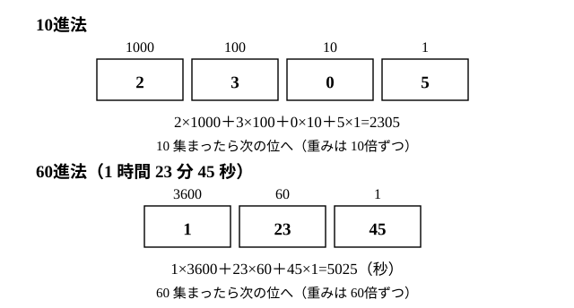

# L01 数える——記数法の歴史と位取りの式

- unit_id: hs-math-a-math-and-human-activity
- 位置づけ: 単元第1レッスン（1.5時間）。「数える」という人間の活動から出発し、私たちが毎日使っている10進位取り記数法を「数の書き方の一つ」として見直す回。位取りの式 100a＋10b＋c を手に入れ、L02（n進法）と L03（倍数の判定法）へつなぐ。
- distribution_status: published_draft
- license: CC-BY-4.0
- verify_required: 例題数値・記述は監修者検証必須。
- 主概念: ①10進位取り記数法を「記数法の一例」として相対化する（位の名前を書く方式との比較・0の役割・60ごとの繰り上がり） ②位取りの式 100a＋10b＋c と、そこから読める倍数の判定法への橋

---

## 1. この単元の入口——数学は人間の活動から生まれた

この単元「数学と人間の活動」では、数学を「教科書に最初から書いてあるもの」ではなく、人間が生活の中で必要に迫られて作ってきたものとして眺める。数学の起源に関わる人間の活動には、**数える・測る・位置を示す・設計する・遊ぶ・説明する**などがあると言われる。この単元では、「数える」（L01〜L02。整数の仕組み L03〜L05 もここに含める）、「測る」（L06 の互除法と L08 前半の測量）、「位置を示す」（L08 後半）、「遊ぶ」（L09〜L10）を順にたどる。「説明する」は L03・L05・L07・L09・L10 に散らばって現れ、「設計する」の独立したレッスンは置かない（L11 に 1枚の地図がある）。

各レッスンは前提を冒頭で宣言して閉じているので、どこから読み始めてもよい。ただし整数のブロック（L03〜L07）は前のレッスンの道具を次で使うので、その順に進むのがよい。

この単元では、数学Ⅰの三角比（L08 前半）・背理法の考え（L10）・循環小数（L01 の雑談）・√2 が分数で表せないこと（L06 §5）・一次不等式（L07 §7）を、導入せずに道具として使う。未習なら、その箇所は結果だけ受け取って先へ進んでよい。

このレッスンの前提は、小学校で学んだ 10進位取り記数法・倍数の意味（9×（整数）の形の数が 9 の倍数）・割り算の余りと、中1〜中2の文字式（100a＋10b＋c のような式の読み書きと、99a＋9b=9(11a＋b) のようなくくり出し）である。

## 2. すでに使っている「10 でない繰り上がり」の棚卸し

私たちは「10 集まったら次の位へ繰り上がる」書き方を当然のように使っている。ところが、身の回りには 10 でない数で繰り上がるものがいくつもある。

- 時計: 60 秒で 1 分、60 分で 1 時間に繰り上がる。
- 角度: 1 度を 60 等分した 1 分（′）、1 分を 60 等分した 1 秒（″）。′ は「分」、″ は「秒」を表す記号で、30′ は「30分」と読む。
- ダース: 12本で 1 ダース。

たとえば「1 時間 23 分 45 秒」は、秒に直すと

1×3600＋23×60＋45=3600＋1380＋45=5025（秒）

である。3600=60×60、60、1 が各「位」の重みになっていて、位取りの式の形をしている。違うのは、繰り上がる数が 10 でなく 60 だという点だけだ。**私たちは 60進法の考えを、時刻と角度ではすでに使っている**（「60進法」〔ろくじっしんほう〕は 60 集まると次の位へ繰り上がる書き方。一般の n進法は L02 で扱う）。

:::guide
**なぜ「10 でない繰り上がり」から始めるのか**

次の L02 で n進法（2進法・5進法など）を扱う。見慣れない書き方に出会うと「新しい概念だ」と身構えてしまいがちだが、仕組みは時計と同じ「いくつ集まったら次の位へ行くか」の違いにすぎない。先に、自分がすでに 60 や 12 の繰り上がりを使いこなしていることを確かめておくと、n進法は「知らないもの」ではなく「慣れていないだけのもの」に近づく。この単元では、新しく見えるものの多くが、すでに持っている道具の言い直しである。
:::

## 3. 記数法を比べる——位の名前を書くか、場所で表すか

現在の私たちが使う 10進位取り記数法が広まるまでには、長い年月をかけた様々な変遷があった。古代のエジプトやローマにも記数法があり、中国では漢数字が使われた。それぞれの仕組みは、興味があれば調べてみよう。ここでは、私たち自身が今も使っている**漢数字**（「二千三百五」のように位の名前を添える書き方。漢数字でも「二三〇五」と場所で表す書き方はあるが、以下では扱わない）と**位取り記数法**（くらいどりきすうほう）を比べて、記数法の「型」の違いをつかむ。

同じ数を 2通りに書く。

| 位取り記数法 | 漢数字 |
|---|---|
| 2305 | 二千三百五 |
| 4020 | 四千二十 |
| 235 | 二百三十五 |

表の漢数字は「千」「百」「十」という**位の名前**を数字に添える。だから、百の位が空なら「百」を書かなければよく、「四千二十」のように空いた位を飛ばしても混乱しない。

位取り記数法は位の名前を書かない。**どの位かは、数字の並ぶ場所で表す**。すると、空いた位を何も書かずに飛ばすことができない——「4020」の 0 を落として「42」と書けば、まったく別の数になってしまう。空いた位に「ここには何もない」と書き込む記号、それが **0** である。

つまり 0 は「何もない」を表す数字であると同時に、**位取り記数法を成り立たせるための場所取りの記号**でもある。0 の果たす役割の大きさは、ここにある。

:::guide
**位取り記数法は「計算に向く」が「空席を埋める記号」を必要とする**

位の名前を書く方式（漢数字）は、位の名前が書いてあるので、桁がずれても読み違えにくい。位取り記数法は、桁を縦にそろえれば足し算・掛け算の筆算がそのまま動く——計算の道具に向いている。その代わり、空いた位を必ず 0 で埋めるという約束が要る。どちらが「正しい」ということではなく、目的（読む・記録する・計算する）によって向き不向きがある。この「同じ数を表す方法は複数あり、目的で選ぶ」という見方は、L02 で 2進法を扱うときに、もう一度使う。
:::

## 4. 位取りの式——3桁の数を 100a＋10b＋c と書く

位取り記数法の中身を式で書き出そう。2305 は

2305=2×1000＋3×100＋0×10＋5×1

である。各位の数字に、その位の重み（1000・100・10・1）を掛けて足した形。これを**位取りの式**と呼ぶことにする。

3桁の数を文字で書くと、百の位の数字を a、十の位を b、一の位を c として

100a＋10b＋c （a は 1〜9——百の位が 0 では 3桁にならない——、b と c は 0〜9 の整数）

となる。「3桁の数」を文字で扱うときの基本形で、この単元では何度も使う。

**例題1** 百の位が 7、十の位が 0、一の位が 4 の3桁の数を、位取りの式で書き、その値を求めよ。

100×7＋10×0＋4=700＋0＋4=**704**

検算: 704 を読み上げれば「七百四」で、百の位 7・十の位 0・一の位 4 と一致する ✓。

**例題2** 3桁の数 N=100a＋10b＋c について、N から各位の数字の和 a＋b＋c を引いた数が 9 の倍数であることを説明せよ。

N−(a＋b＋c)=100a＋10b＋c−a−b−c=99a＋9b=9(11a＋b)

11a＋b は整数だから、N−(a＋b＋c) は 9 の倍数である。

検算: N=354 で確かめる。各位の和は 3＋5＋4=12、354−12=342=9×38 ✓。

この例題2は、次のことを予告している。N=9(11a＋b)＋(a＋b＋c) と書き直せて、9(11a＋b) の部分は 9 で割り切れる（余りに関係しない）から、**N を 9 で割った余りは、各位の数字の和 a＋b＋c を 9 で割った余りと同じ**である（354 なら 354÷9 も 12÷9 も余り 3）。ここから「各位の数字の和が 9 の倍数なら、その数は 9 の倍数」という判定法が出てくる。3 の倍数についても同様だ。詳しくは L03 で扱う。位取りの式は、数を書くための道具であると同時に、数の性質を調べる道具でもある。

:::guide
**「文字で書く」と何が見えるか**

2305 や 354 という具体的な数のままでは、「各位の和を引くと 9 の倍数になる」ことは、いくつ試しても「そうなりそうだ」までしか言えない。100a＋10b＋c と書いた瞬間に、99a＋9b という「式のまま 9 でくくれる部分」と、a＋b＋c という「式のままでは 9 でくくれない部分」に分かれて見える（後者も、a、b、c に数を入れた値が 9 の倍数になることはある。126 なら 1＋2＋6=9 で、これが例題2の下で述べた判定法の場面である）。具体的な数で予想し、文字で書いて理由を確かめる——この往復が、この単元の整数のブロック全体の型になる。中2で「連続する 2つの偶数を 2n、2n＋2 と書く」練習をしたが、それと同じ道具である。
:::

## 5. 60進法の桁——時刻と角度を位取りの式で書く

§2 の時計をもう一度見る。60進法では、1つの位に入る値は 0 から 59 まで（10進法の「数字」0〜9 にあたるものが 60種類ある）で、私たちはそれを 10進法の 2桁（「23」「45」）で書いている。位の重みは 1、60、60²=3600 である。

**例題3** 2 時間 5 分 30 秒は何秒か。

2×3600＋5×60＋30=7200＋300＋30=**7530**（秒）

検算: 7530 秒を 60 で割ると 125 分余り 30 秒、125 分を 60 で割ると 2 時間余り 5 分 ✓。

角度も同じで、37.5° は 37°30′ である（0.5°=0.5×60′=30′）。

:::zatsudan
位取りの式は、小数点の右側へも続いている。0.375=3/10＋7/100＋5/1000 で、重みが 1/10、1/100、1/1000 と小さくなっていくだけだ。ところで 1/3 を小数で書くと 0.333… と終わらない。分数が有限の小数で書けるか、循環小数になるかが約分しきった分数の分母で決まることは、数学Ⅰ「数と式」で扱う（未習なら読み飛ばしてよい）。「数える」ための記数法が、小数という「測る」ための書き方へつながり、その中に循環小数という現象が現れる——記数法の話題は、数学のいろいろな場所へ顔を出す。
:::
<!-- zatsudan話題源: 高等学校学習指導要領解説 数学編（平成30年告示）「数える」の記述（執筆時内部調査で確認した範囲——記数法に関連して「循環小数」を取り扱うことも考えられる、の逐語）。循環小数の仕組みそのものは数学Ⅰ「数と式」の既習として参照のみ・本単元で再導入しない。出典の確認範囲内の事実のみ使用 -->

## 6. 練習

**問1** 漢数字「四千二十」と位取り記数法「4020」について、それぞれ「百の位と一の位が空であること」をどう表しているかを比べ、位取り記数法で 0 が必要になる理由を 2〜3文で説明せよ。

**問2** 次の問いに答えよ。
(1) 5087 を位取りの式（各位の数字×位の重み の和）で書け。
(2) 100a＋10b＋c の形の3桁の数で、a=4、b=0、c=9 のものを求めよ。
(3) 4桁の数 N=1000a＋100b＋10c＋d について、N−(a＋b＋c＋d) が 9 の倍数であることを、例題2にならって式を変形して説明せよ。

**問3** 各位の数字の和が 12 で、百の位が 4、一の位が 5 である3桁の数を求めよ。また、その数を 99a＋9b＋(a＋b＋c) の形に書き直して、値がもとの数に戻ることを確かめよ。

**問4** 「0」の記号を使わずに、位取り記数法だけで 2050 と 205 を書き分けようとすると何が起こるか。空いた位を飛ばして書いてみて、起こる不都合を 1〜2文で説明せよ。

**問5** 1 時間 48 分 20 秒は何秒か。位取りの式（重み 3600・60・1）で書いて求めよ。

---

:::stretch
**S1** 60進法の繰り上がりについて答えよ。
(1) 59 分 59 秒に 1 秒を足すと、時・分・秒の表示はどう変わるか。10進法の 99＋1 と比べて説明せよ。
(2) 7325 秒を「〇時間〇分〇秒」の形に直せ。（3600 で割った商と余り、余りをさらに 60 で割った商と余りを使う。）
(3) 角度 24.25° を「度・分」で表せ。また 12°45′ を度だけの小数で表せ。
:::

対応解答: answer_key_L01-02.md

<!-- gen_nav:nav:start（自動生成・手編集しない） -->

---

[単元の目次](README.md)｜[解答](answer_key_L01-02.md)｜[次のレッスン →](lesson_02.md)

<!-- gen_nav:nav:end -->
