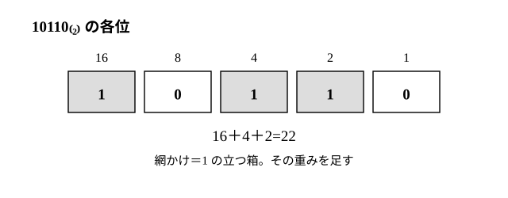
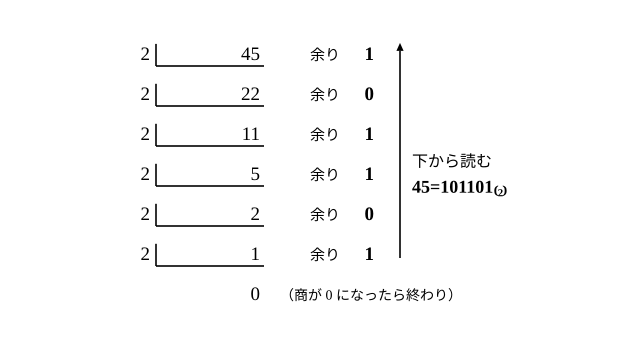

# L02 n進法と2進法——10進法との往復

- unit_id: hs-math-a-math-and-human-activity
- 位置づけ: 単元第2レッスン（2時間）。L01 の位取りの式を「10 以外の数」で書き直し、n進法の整数と10進法を相互に変換できるようにする回。2進法とコンピュータの関係、k桁で表せる範囲までを扱う。整数のブロック（L03〜）へは「割り算の等式（被除数）=（除数）×（商）＋（余り）を繰り返し使う」経験を渡す。
- distribution_status: published_draft
- license: CC-BY-4.0
- verify_required: 例題数値・記述は監修者検証必須。
- 主概念: ①n進法の整数→10進法（位取りの式）・10進法→n進法（割り算の連鎖・余りを下から読む） ②2進法とコンピュータ・k桁で表せる数の範囲（nᵏ 通り）

---

## 1. 前提の確認——位取りの式と割り算の等式

このレッスンで使う道具は 2つ。

1. **位取りの式**（L01）: 2305=2×1000＋3×100＋0×10＋5×1。各位の数字に位の重みを掛けて足す。
2. **割り算の等式**（小学校）: 45 を 2 で割ると商 22 余り 1、すなわち 45=2×22＋1。（被除数）=（除数）×（商）＋（余り）（被除数〔ひじょすう〕=割られる数、除数〔じょすう〕=割る数）で、余りは 0 以上・除数未満。

L01 では、位の重みが 1、10、100、1000、… と「10倍ずつ」増えるのが 10進法だと確かめた。時計のように「60倍ずつ」増える書き方もあった。この「いくつ倍ずつ増えるか」を一般の n にしたものが、このレッスンの主題である。

## 2. n進法——位の重みを n の累乗にする

n を 2 以上の整数として、位の重みを 1、n、n²、n³、… とし、各位に 0 から n−1 までの数字を置いて数を表す方法は、**n進法**（エヌしんほう）と呼ばれる（教科書で広く使われる呼び方で、10進法は n=10 の場合にあたる）。このレッスンで n進法で書く数は 0 以上の整数に限る（負の整数や小数の書き方は扱わない）。n進法で書かれた数を、10進法の数と区別するために、右下に (n) を添えて 1011₍₂₎ のように書く（読みは「いち・ぜろ・いち・いち」と 1桁ずつ。「千十一」とは読まない。ノートでは 1011(2) と横に書いてよい）。このレッスンの例題と練習で使う n は 10 以下なので、各位の数字は 1 文字で書けて、そのまま並べればよい（n が 11 以上だと、10 や 11 を 1 つの位に置く書き方を別に決める必要がある。L01 の時・分・秒は、各位を 10進法の 2桁で書いて「時」「分」「秒」で区切った例である）。

- 2進法: 数字は 0 と 1 だけ。重みは 1、2、4、8、16、…
- 5進法: 数字は 0〜4。重みは 1、5、25、125、…
- 10進法: 数字は 0〜9。重みは 1、10、100、1000、…

n進法の数字が n−1 までしかないのは、「n 集まったら次の位へ繰り上がる」からだ。10進法に「10」という 1桁の数字がないのと同じ理由である。

:::guide
**n進法は新しい数ではなく、新しい「書き方」である**

1011₍₂₎ と 11 は同じ数（同じ個数）を、違う書き方で表したものにすぎない。「2進法の数」という別の数があるわけではない。このことを最初にはっきりさせておくと、変換の作業は「同じものを別の言葉に言い直す」翻訳の作業だと分かり、見慣れない添え字への抵抗が小さくなる。数は 1つ、書き方はいろいろ——L01 で漢数字と位取り記数法を比べたときと同じ見方である。
:::

## 3. n進法 → 10進法——位取りの式で足す

n進法の数を 10進法に直すには、位取りの式をそのまま計算すればよい。

**例題1** 1011₍₂₎ を 10進法で表せ。

右から順に重み 1、2、4、8 を掛けて足す。

1011₍₂₎=1×8＋0×4＋1×2＋1×1=8＋0＋2＋1=**11**

**例題2** 2103₍₄₎ を 10進法で表せ。

重みは右から 1、4、16、64。

2103₍₄₎=2×64＋1×16＋0×4＋3×1=128＋16＋0＋3=**147**

検算: 各位の数字が n−1=3 以下であることを先に確かめる（4 以上の数字が混ざっていたら 4進法の書き方として誤り）✓。足し算をもう一度: 128＋16=144、144＋3=147 ✓。

2進法では、重みが 2 の累乗（1、2、4、8、16、…）だから、「1 の立っている位の重みを足す」だけで済む。

10110₍₂₎=16＋4＋2=22 である。

## 4. 10進法 → n進法——割り算を繰り返し、余りを下から読む

逆向きは少し工夫が要る。45 を 2進法で書きたい。位取りの式の形 45=（　）×32＋（　）×16＋（　）×8＋（　）×4＋（　）×2＋（　）×1 の括弧を埋めるのが目標だ（64 は 45 より大きいので、32 の位までで足りる）。

割り算の等式を使う。45=2×22＋1 だから、45 を 2 で割った余り 1 が「1 の位」の数字になる（45 のうち 2 でまとめられない分が 1個）。残った商 22 について同じことを繰り返す。22=2×11＋0 だから、次の位（2 の位）は 0。11=2×5＋1 で 4 の位は 1。5=2×2＋1 で 8 の位は 1。2=2×1＋0 で 16 の位は 0。1=2×0＋1 で 32 の位は 1。商が 0 になったら終わり（商は割るたびに小さくなる 0 以上の整数なので、必ず 0 になって止まる。0 を 2進法で書けば 0 の 1 桁）。

余りを、**最後に出たものを先頭にして**（下から上へ）読むと、101101 となる。45 の余りの列はたまたま上から読んでも同じ並びになるので、向きの違いは例題4 の 200（1300₍₅₎）で確かめるとよい。

**例題3** 45 を 2進法で表せ。

上の連鎖より **101101**₍₂₎

検算（必ず行う）: 10進法へ戻す。1×32＋0×16＋1×8＋1×4＋0×2＋1×1=32＋8＋4＋1=45 ✓。

**例題4** 200 を 5進法で表せ。

200=5×40＋0、40=5×8＋0、8=5×1＋3、1=5×0＋1。余りを下から読んで **1300**₍₅₎

検算: 1×125＋3×25＋0×5＋0×1=125＋75=200 ✓。

:::guide
**なぜ「余りを下から読む」と正しい答えになるのか**

割り算の等式を代入で重ねてみると分かる。45=2×22＋1、22=2×11＋0 だから、45=2×(2×11＋0)＋1=2²×11＋2×0＋1。さらに 11=2×5＋1 を入れると 45=2³×5＋2²×1＋2×0＋1。これを続けると、最後に 45=2⁵×1＋2⁴×0＋2³×1＋2²×1＋2×0＋1 となり、位取りの式そのものが出てくる。最初に出た余りがいちばん低い位（1 の位）、最後に出た余りがいちばん高い位に来る——だから「下から読む」。手順だけ覚えると「上から読む」誤りが起こりうる。この代入の 2〜3行を一度自分で書いておくと、向きに迷ったときに自分で確かめる手がかりになる。
:::

## 5. k 桁で表せる範囲——nᵏ 通り

2進法で 3桁を使うと（ここでは先頭に 0 が並ぶ書き方も 3桁と数える）、000 から 111 まで、すなわち 0 から 7 までの 8個の数が表せる。8=2³ である。一般に、**n進法の k 桁で表せる数は 0 から nᵏ−1 までの nᵏ 個**（nᵏ は n の k 乗、すなわち n を k 個掛けた数。ノートでは「n の k 乗」と書いてもよい）。各位に n 通りの数字が置けて、それが k 個並ぶからだ。

**例題5** 3進法の 4桁（0000 から 2222 まで）で表せる数は何通りか。また、その最大の数を 10進法で表せ。

通り数は 3⁴=**81** 通り。最大は 2222₍₃₎=2×27＋2×9＋2×3＋2×1=54＋18＋6＋2=**80** で、これは 3⁴−1=80 と一致する ✓。

逆に言うと、**桁数を決めると、それより大きい数は表せない**。2進法の 5桁で表せる最大の数は 11111₍₂₎=31 だから、40 は 5桁では表せない（6桁の 101000₍₂₎ が必要）。10進法の 2桁では 99 までしか表せないのと同じ事情である。

## 6. 2進法とコンピュータ

コンピュータの内部で 2進法が使われていることは、よく知られている。0 と 1 の 2つの数字だけで数が表せるので、「電気が流れている・流れていない」のような **2つの状態の並び**で数を記録し、計算できるからだ。10進法なら 1桁に 10種類の状態を区別しなければならないが、2進法なら 2種類で済む。その代わり桁数は増える——45 は 10進法で 2桁、2進法では 6桁になる。

「書き方が速い（桁が少ない）」か「仕組みが単純（数字の種類が少ない）」か——L01 で漢数字と位取り記数法を比べたときと同じで、記数法には目的に応じた向き不向きがある。

:::guide
**変換で自信をつけてから、整数のブロックへ**

n進法と10進法の相互変換は、手順が決まっていて、検算（10進法へ戻す）も自分でできる。この単元の中でも「手が動きやすい」段である。ここで身につけた「割り算の等式を繰り返し使う」経験は、L05（整数の割り算）と L06（ユークリッドの互除法〔ごじょほう〕）でそのまま使う。互除法は、割り算の等式を「余りを次の除数にして」繰り返す手順で、今日の割り算の連鎖と形がよく似ている。
:::

## 7. 練習

**問1** 次の数を 10進法で表せ。
(1) 110101₍₂₎  (2) 2012₍₃₎  (3) 1043₍₅₎

**問2** 次の数を、指示された n進法で表せ。求めたあと 10進法へ戻して検算せよ。
(1) 77 を 2進法で  (2) 100 を 3進法で  (3) 500 を 7進法で

**問3** 1221₍₃₎ を 10進法で表し、さらにその数を 4進法で表せ。

**問4** 2進法の 6桁で表せる最大の数 111111₍₂₎ を 10進法で表せ。また、それより 1 大きい数を 2進法で表せ。

**問5** 4進法の 3桁（§5 と同じく、先頭に 0 が並ぶ 000 から 333 までの書き方も 3桁と数える）で表せる数は 0 から何までか。また全部で何通りあるか。

**問6** 「50 を 2進法の 5桁で表せ」という問いに答えることはできるか。できない場合はその理由を説明し、50 を表すのに最低何桁が必要かを答えよ。

---

:::stretch
**S1** 2進法の足し算を、10進法に直さずに筆算で行う。「1＋1=10₍₂₎（2 になったら繰り上がる）」を使う。
(1) 1011₍₂₎＋110₍₂₎ を 2進法のまま計算せよ。結果を 10進法に直して検算せよ。
(2) 1111₍₂₎＋1₍₂₎ を計算せよ。繰り上がりが連続して起こることを確かめよ。
:::

対応解答: answer_key_L01-02.md

<!-- gen_nav:nav:start（自動生成・手編集しない） -->

---

[← 前のレッスン](lesson_01.md)｜[単元の目次](README.md)｜[解答](answer_key_L01-02.md)｜[次のレッスン →](lesson_03.md)

<!-- gen_nav:nav:end -->
