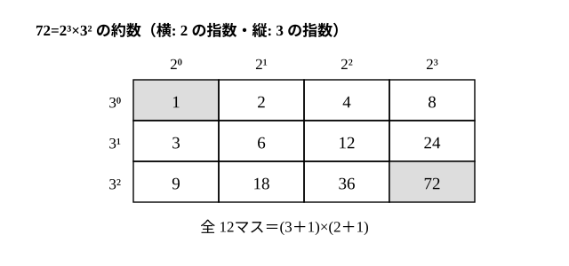

# L03 約数と倍数——素因数分解を道具にする

- unit_id: hs-math-a-math-and-human-activity
- 位置づけ: 整数のブロック第1レッスン（単元第3レッスン・2時間）。小5の約数・倍数と中1の素因数分解を、高校の言葉（a=bk・素数の積で一通り）で立て直し、位取りの式から倍数の判定法を、素因数分解から約数の個数を読む回。L04（最大公約数・最小公倍数）へ直接つながる。
- distribution_status: published_draft
- license: CC-BY-4.0
- verify_required: 例題数値・記述は監修者検証必須。
- 主概念: ①約数・倍数の意味（a=bk）と倍数の判定法（位取りの式から・4 の倍数→8 の倍数への類推） ②「1 は素数でない」理由（積で一通りに書く規約）→素因数分解から約数の個数を読む

---

## 1. 前提の確認——「1 は素数か」

このレッスンは、小学校の約数・倍数・偶数・奇数、中1の素数と素因数分解、そして L01 の位取りの式を前提にする。まず 1問。

**1 は素数だろうか**。

中1で「素数とは、1 とその数自身のほかに約数をもたない、1 より大きい自然数」と学んだ。だから 1 は素数ではない。では、なぜわざわざ「1 より大きい」と決めたのか。

理由は、**素因数分解を一通りに書くため**である。12=2×2×3 と素数の積で書けて、順番を除けばこの書き方しかない。ところが 1 を素数に数えると、12=1×2×2×3=1×1×2×2×3=… と、いくらでも別の書き方ができてしまう。1 を除外しておけば、2 以上のどの自然数も「素数の積として、ただ一通りに」書ける（このことの理由は高校では扱わず、正しいものとして使う）。この単元では、この「一通り」に何度も頼る。定義は誰かが勝手に決めたものではなく、後の道具が使いやすいように選ばれている。

同じ理由で、素因数分解の答えは **素数だけの積**で書く。「12 の約数は 1、2、3、4、6、12」「12=3×4」は正しい文だが、素因数分解の答えではない。

このレッスンでは、整数は**正の整数**（自然数）の範囲で考える。0 や負の整数を約数・倍数に含める考え方もあるが、このレッスンでは扱わない（0 は L06 で、負の整数は L07 で倍数に含める。約数は正の整数のままとする）。

## 2. 約数と倍数——a=bk という式で言い直す

正の整数 a、b について、**a=bk となる正の整数 k がある**とき、a は b の**倍数**、b は a の**約数**という。たとえば 84=12×7 だから、84 は 12 の倍数、12 は 84 の約数である。

小学校では「割り切れる」という言葉で学んだ。高校では、それを a=bk という**等式**で言い直す。等式にしておくと、文字式の計算にそのまま乗る——L01 の例題2で N−(a＋b＋c)=9(11a＋b) と書けたから「9 の倍数」と言えたのは、まさにこの形である。

**例題1** n を正の整数とする。6n＋9 は 3 の倍数であることを説明せよ。

6n＋9=3(2n＋3) で、2n＋3 は正の整数だから、6n＋9 は 3 の倍数である。

検算: n=1 のとき 15=3×5 ✓、n=4 のとき 33=3×11 ✓。

## 3. 倍数の判定法——位取りの式から読む

L01 の予告を回収する。3桁の数 N=100a＋10b＋c は

N=99a＋9b＋(a＋b＋c)=9(11a＋b)＋(a＋b＋c)

と書き直せた。9(11a＋b) は 9 の倍数だから、**N が 9 の倍数かどうかは、各位の数字の和 a＋b＋c が 9 の倍数かどうかで決まる**。9(11a＋b) は 3 の倍数でもあるから、3 の倍数についても同じ判定法が使える。桁数が増えても、99、999、9999、… はすべて 9 の倍数なので、判定法はそのまま成り立つ。

4 の倍数はどうか。N=100a＋10b＋c で、100=4×25 だから 100a は 4 の倍数。したがって **N が 4 の倍数かどうかは、下 2桁 10b＋c で決まる**。5216 なら下 2桁の 16 が 4 の倍数なので、5216 は 4 の倍数である（5216=4×1304 ✓）。

ここで**類推**してみよう。100 が 4 の倍数だから「下 2桁」だった。1000=8×125 は 8 の倍数である。だから **8 の倍数かどうかは下 3桁で決まる**はずだ。実際、N=1000×（千の位以上の部分）＋（下 3桁）で前半が 8 の倍数なので、下 3桁だけ調べればよい。

| 倍数 | 判定法 | 根拠 |
|---|---|---|
| 2 の倍数 | 一の位が 0、2、4、6、8 | 10 が 2 の倍数 |
| 5 の倍数 | 一の位が 0、5 | 10 が 5 の倍数 |
| 4 の倍数 | 下 2桁が 4 の倍数 | 100 が 4 の倍数 |
| 8 の倍数 | 下 3桁が 8 の倍数 | 1000 が 8 の倍数 |
| 3 の倍数 | 各位の数字の和が 3 の倍数 | 9、99、999、… が 3 の倍数 |
| 9 の倍数 | 各位の数字の和が 9 の倍数 | 9、99、999、… が 9 の倍数 |

（下 2桁が 00 の数は 100 の倍数なので 4 の倍数、下 3桁が 000 の数は 1000 の倍数なので 8 の倍数である。3 桁以下の数では「下 3桁」はその数そのものを指す。）

**例題2** 5桁の数 27□36 が 9 の倍数になるように、□に入る数字をすべて求めよ。

各位の和は 2＋7＋□＋3＋6=18＋□。これが 9 の倍数になるのは □=0 または □=9 のとき。答え **0、9**

検算: 27036=9×3004 ✓、27936=9×3104 ✓。

:::guide
**判定法は「覚えるもの」ではなく「位取りの式から出てくるもの」**

「3 の倍数は各位の和で判定」「4 の倍数は下 2桁で判定」を、別々の暗記事項として持っていると、8 や 25 の倍数はどうかと聞かれたときに手が止まる。すべて 1つの原理——位の重み 10、100、1000、… を割る数と、割った余り——から出ている。10 で割った余り、100 で割った余り、1000 で割った余りに注目すれば 2・5・4・25・8 の判定法が、10−1=9、100−1=99、… に注目すれば 3・9 の判定法が出る。「4 の倍数の判定法が分かれば 8 の倍数の判定法を類推できる」のは、この原理を握っているからである（25 は 100=25×4 だから下 2桁で決まる。6 は 2 と 3 の両方で判定する。11 の判定法も同じ原理から出るが、ここでは扱わない）。
:::

## 4. 素因数分解を道具にする——約数の個数を読む

素因数分解の手続きは中1で学んだ（2 で割れるだけ割り、3 で割れるだけ割り、…）。ここでは、その**結果の読み方**を学ぶ。同じ素数は指数でまとめて書く。

360=2×2×2×3×3×5=2³×3²×5

さて、360 の約数は何個あるか。1つずつ書き出すこともできるが、素因数分解を見れば数えられる。360 の約数は、素因数分解の「部品」を何個ずつ取り出して掛けた数——2 を 0〜3個、3 を 0〜2個、5 を 0〜1個——で、それ以外にはない（素因数分解が一通りだから、部品にない素数は約数に現れない。0個、つまりその素数を掛けない、も 1つの選び方として数える。全部 0個なら約数 1。下の図では「2 を 0個」を 2⁰ と書き、値は 1 と約束する）。2 の取り方が 4通り、3 の取り方が 3通り、5 の取り方が 2通りで、

360 の約数の個数=4×3×2=**24**（個）

一般に、a=pᵐ×qⁿ×…（p、q、… は異なる素数）の約数の個数は (m＋1)(n＋1)… である（**各指数に 1 を足した数の積**）。

72=2³×3² で確かめる。約数の個数は (3＋1)(2＋1)=12。実際に書き出すと、2 を何個取るか（横）と 3 を何個取るか（縦）の表になる。

1、2、4、8／3、6、12、24／9、18、36、72 の 12個で、確かに全部 72 を割る ✓。

**例題3** 200 の約数の個数を求めよ。

200=2³×5² だから、約数の個数は (3＋1)(2＋1)=**12**（個）

検算: 書き出すと 1、2、4、8、5、10、20、40、25、50、100、200 の 12個 ✓。

**例題4** 約数がちょうど 3個である正の整数は、どんな数か。

約数の個数 (m＋1)(n＋1)… が 3 になるのは、3 が素数で 3=1×3 としか分けられず、m＋1 なども 2 以上だから因子は 1つしか置けない——つまり素因数が 1種類で m＋1=3、すなわち **素数の 2 乗** p² のときだけ。4=2²（約数 1、2、4）、9=3²（約数 1、3、9）、25、49、… がそれである。

検算: 素因数が 2種類以上あれば約数は (1＋1)(1＋1)=4個以上になり、3個にはならない ✓。

:::guide
**「約数が○個の数を探せ」は、掛け算の分解から逆に読む**

例題4は、約数の個数の公式を逆向きに使っている。「個数が 3」→「(m＋1)(n＋1)…=3」→「3 の分け方は 3 だけ」→「素因数 1種類・指数 2」。個数が 6 なら、6=6 または 6=2×3 の 2通りの分け方があるので、p⁵ の形か p²×q の形になる。この「個数を掛け算に分解して指数を逆算する」読み方ができると、約数の個数の公式が単なる計算の公式でなく、数の**形**を表していることが見えてくる。素因数分解は、数を「積の部品」に分けて、その数の性質を部品から読むための道具である。
:::

## 5. 練習

設問に出る条件語を確かめてから解く。「正の整数」は 1、2、3、…（0 と負の数は含めない）、「異なる素数」は 2 と 3 のように別々の素数（2 と 2 は不可）、「約数の個数」は 1 とその数自身も数えた個数、の意味である。

**問1** 次の 4つの数について、3 の倍数・9 の倍数・4 の倍数であるものをそれぞれすべて選べ（判定法を使い、実際の割り算はしなくてよい）。
5214、7308、1116、4905

**問2** 4桁の数 53□2 について答えよ。
(1) この数が 9 の倍数になる □ を求めよ。
(2) この数が 4 の倍数にも 9 の倍数にもなる □ はあるか。理由とともに答えよ。

**問3** 「8 の倍数かどうかは下 3桁で判定できる」理由を、1000=8×125 を使って 1〜2文で説明せよ。また 25384 が 8 の倍数かどうか判定せよ。

**問4** 次の数の約数の個数を、素因数分解を使って求めよ。
(1) 108  (2) 1000  (3) 2025

**問5** 約数がちょうど 6個である正の整数のうち、最も小さいものを求めよ。（約数の個数が 6 になる素因数分解の形を先に考える。）

**問6** 200 以下の正の整数のうち、約数がちょうど 3個であるものをすべて求め、なぜそれらに限られるのかを説明せよ。

---

:::stretch
**S1** 72=2³×3² の約数の総和（12個の約数をすべて足した値）を求めたい。
(1) §4 の格子表で、各行の和を求め、それらを足して総和を求めよ。
(2) 総和が (1＋2＋4＋8)×(1＋3＋9) と一致することを確かめ、なぜこの積が約数の総和になるのかを説明せよ。
(3) 同じ方法で 28=2²×7 の約数の総和を求め、28 自身を除いた約数の和と 28 を比べよ。（このように、自分以外の約数の和が自分に等しい数は完全数〔かんぜんすう〕と呼ばれる。6 も同じ。）
:::

対応解答: answer_key_L03-07.md

<!-- gen_nav:nav:start（自動生成・手編集しない） -->

---

[← 前のレッスン](lesson_02.md)｜[単元の目次](README.md)｜[解答](answer_key_L03-07.md)｜[次のレッスン →](lesson_04.md)

<!-- gen_nav:nav:end -->
