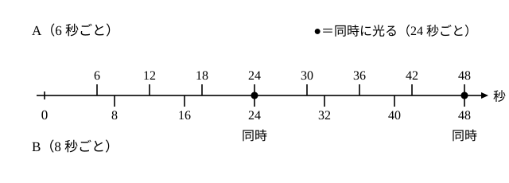

# L04 最大公約数と最小公倍数——「同時に起こる」周期

- unit_id: hs-math-a-math-and-human-activity
- 位置づけ: 整数のブロック第2レッスン（単元第4レッスン・2時間）。小5で学んだ最大公約数・最小公倍数を、L03 の素因数分解から求め直し、「互いに素」の言葉をそろえる回。後半は「2つの周期がそろう時刻」を最小公倍数で説明し、そろわない場合を余りの偶奇で説明する。L06（互除法）では、素因数分解が面倒な大きい数の最大公約数を求める別の方法を学ぶ。
- distribution_status: published_draft
- license: CC-BY-4.0
- verify_required: 例題数値・記述は監修者検証必須。
- 主概念: ①素因数分解から最大公約数・最小公倍数（既習語の高校水準での再構成）と互いに素（教科書慣用語の導入） ②周期の一致=最小公倍数（2つの周期がそろう時刻）と「そろわない」場合の説明

---

## 1. 前提の確認——公約数・公倍数（小5）と素因数分解（L03）

2つ以上の正の整数に共通する約数を**公約数**、そのうち最大のものを**最大公約数**という。共通する倍数を**公倍数**、そのうち最小の正のものを**最小公倍数**という。小5では、約数・倍数を書き並べて共通するものを探した。ここでは L03 の素因数分解を使って、書き並べずに求める。

## 2. 素因数分解から最大公約数・最小公倍数を読む

72 と 60 で考える。

72=2³×3²、60=2²×3×5

**最大公約数**は、両方を割り切る最大の数。素因数ごとに見ると、2 は 72 に 3個・60 に 2個あるから共通に取れるのは 2個まで、3 は 2個と 1個だから 1個まで、5 は 72 にないから取れない。

最大公約数=2²×3=**12**

**最小公倍数**は、両方の倍数である最小の数。両方の素因数をすべて含まなければならないから、2 は多い方の 3個、3 は多い方の 2個、5 は 1個。

最小公倍数=2³×3²×5=**360**

つまり、**最大公約数は素因数ごとに指数の小さい方、最小公倍数は指数の大きい方**を取る（片方にしかない素因数は、最大公約数には入れず、最小公倍数には入れる）。

検算: 12 は 72 と 60 を割る（72=12×6、60=12×5）✓。360 は 72×5=360、60×6=360 で両方の倍数 ✓。さらに 72×60=4320、12×360=4320 で一致する ✓。

最後の一致は偶然ではない。**2つの正の整数の積は、最大公約数と最小公倍数の積に等しい**。素因数ごとに「小さい方の指数＋大きい方の指数=2 数の指数の和」だからである（同じ素数どうしを掛けると指数は足し算になる: 2³×2²=2⁵。72 と 60 の 2 の指数 3 と 2 なら、小さい方 2＋大きい方 3=5=3＋2）。

**例題1** 84 と 126 の最大公約数と最小公倍数を求めよ。

84=2²×3×7、126=2×3²×7

最大公約数=2×3×7=**42**、最小公倍数=2²×3²×7=**252**

検算: 84×126=10584、42×252=10584 ✓。

:::guide
**「指数の小さい方・大きい方」を表にして見る**

慣れるまでは、素因数を横に並べた表を書く。72 と 60 なら、2 の列に「3、2」、3 の列に「2、1」、5 の列に「0、1」（ない素因数は指数 0 と書く）。各列の小さい方を拾えば最大公約数 2²×3¹×5⁰=12（5⁰ は 5 を 1個も掛けないことで、値は 1）、大きい方を拾えば最小公倍数 2³×3²×5¹=360。「小さい方の和と大きい方の和を足すと、もとの 2 数の指数の和になる」ことも表から一目で分かり、積の一致 72×60=12×360 の理由がそのまま読める。書き並べて探す方法（小5）はいつでも使えるが、数が大きくなると漏れが出る。素因数分解に頼るのは、漏れをなくすためである。
:::

## 3. 互いに素——最大公約数が 1

2つの正の整数の最大公約数が 1 であるとき、その 2 数は**互いに素**〔たがいにそ〕であると呼ばれる（教科書で広く使われる呼び方）。8 と 15 は、8=2³、15=3×5 で共通の素因数がないから互いに素である。

注意したいのは、**互いに素は「素数である」とは別のこと**だという点。8 も 15 も素数ではないが、互いに素である。逆に、2つの異なる素数は必ず互いに素である。

**例題2** 連続する 2つの正の整数 n と n＋1 は互いに素であることを説明せよ。

d を n と n＋1 の公約数とすると、n=dk、n＋1=dm と書ける（k、m は正の整数）。差をとると (n＋1)−n=d(m−k)、すなわち 1=d(m−k)。d は正の整数で 1 を割り切るから d=1。公約数は 1 しかないので、最大公約数は 1 である。

検算: 14 と 15（2×7 と 3×5）、20 と 21（2²×5 と 3×7）で、共通の素因数がない ✓。

もう 1つ、後で（L07 §4 と L10 の問5 で）使う性質を確かめておく。**a と b が互いに素で、ak が b の倍数ならば、k は b の倍数である**。素因数分解で考えると、b の素因数は a に 1つも含まれないので、ak が b で割り切れるためには、b の素因数が（個数まで含めて）すべて k の側に含まれていなければならない。たとえば 5k が 3 の倍数なら、k 自身が 3 の倍数である（5×1、5×2 は 3 の倍数でなく、5×3 で初めて 3 の倍数になる）。

例題2 で使った「公約数は 2 数の差も割り切る」という考えは、L06 のユークリッドの互除法の核になる。

## 4. 周期がそろう——最小公倍数で説明する

2つのランプ A、B がある。A は 6 秒ごとに、B は 8 秒ごとに一瞬光る。時刻 0 に同時に光ったあと、次に同時に光るのは何秒後か。

A が光る時刻は 6 の倍数（6、12、18、24、…）、B が光る時刻は 8 の倍数（8、16、24、…）。同時に光るのは、両方の倍数——公倍数——の時刻。最初は最小公倍数の 24 秒後で、以後 48、72、… と 24 秒ごとに同時に光る。

**例題3** 2つの路線のバスが、同じ停留所から、一方は 12 分ごと、もう一方は 18 分ごとに発車する。8 時 00 分に同時に発車したとき、次に同時に発車するのは何時何分か。

12=2²×3、18=2×3² で最小公倍数は 2²×3²=36。次に同時に発車するのは 36 分後の **8 時 36 分**。

検算: 36 は 12×3、18×2 で両方の倍数 ✓。36 より小さい公倍数がないことは、12 の倍数 12、24 が 18 の倍数でないことから ✓。

「周期がそろう」問題は、公倍数を「同時に起こる時刻」として読み直したものである。カレンダーの曜日、歯車のかみ合わせ、信号機の周期など、同じ型はいろいろな場面に現れる。

## 5. そろわない場合——余りで説明する

条件を少し変える。A は時刻 0 から 6 秒ごとに、B は時刻 3 から 8 秒ごとに光るとする（B は A より 3 秒遅れて始めた）。同時に光る瞬間はあるだろうか。

A が光る時刻は 6k（k は 0 以上の整数）、B が光る時刻は 8m＋3（m は 0 以上の整数）。6k は偶数、8m＋3 は奇数だから、**等しくなることはない**。答えは「同時に光る瞬間はない」。

ここで使ったのは、「偶数と奇数は等しくならない」という 2 で割った余りの話である。いくつか書き並べて「そろわないようだ」と予想することはできるが、**いつまで探しても現れないことは書き並べでは言えない**。余りの偶奇〔ぐうき〕（偶数か奇数か）に注目したとき初めて「ない」と言い切れる。「ある」ことは例を 1つ示せばよいが、「ない」ことを示すには理由が要る——この単元では、この型の問いを毎回 1つ置く。

:::guide
**「そろう」と「そろわない」を同じ問いだと思わない**

「同時に光る時刻を求めよ」は、開始時刻がそろっているなら、公倍数を探せば答えが見つかる。「同時に光る瞬間はあるか」は、見つからなかったときに「探し方が悪いのか、本当にないのか」を判断しなければならない。後者では、A の時刻と B の時刻を式で書いて（6k と 8m＋3）、両者が等しくなれない理由を探す。今日は偶奇で片づいたが、一般には「6k−8m=3 を満たす整数 k、m はあるか」という問いになり、これは L07 の不定方程式そのものである。L07 で「解がない」と判定する道具を整えるので、今日は偶奇で説明できる範囲にとどめる。
:::

## 6. 練習

設問に出る条件語を確かめてから解く。「互いに素」は最大公約数が 1（どちらも素数である必要はない）、「2つの正の整数」は 1 以上の整数 2つ（同じ数でもよい）、「同時に」は同じ時刻に、の意味である。

**問1** 次の 2 数の最大公約数と最小公倍数を、素因数分解を使って求めよ。求めたあと「2 数の積=最大公約数×最小公倍数」で検算せよ。
(1) 90 と 150  (2) 45 と 75  (3) 36 と 49

**問2** 2つの正の整数の最大公約数が 12、最小公倍数が 180 で、一方の数が 36 であるとき、もう一方の数を求めよ。

**問3** 縦 84 cm、横 132 cm の長方形の床に、同じ大きさの正方形のタイルを、切らずに隙間なく敷き詰めたい。タイルの 1辺をできるだけ大きくするとき、1辺は何 cm か。またタイルは何枚必要か。

**問4** 2つの信号機 P、Q は、P が 90 秒周期、Q が 75 秒周期で青になる。ある瞬間に同時に青になった。次に同時に青になるのは何分何秒後か。

**問5** ランプ P は時刻 0 秒から 4 秒ごとに、ランプ Q は時刻 1 秒から 6 秒ごとに光る。
(1) P と Q が同時に光る瞬間はあるか。P の光る時刻と Q の光る時刻を式で表して説明せよ。
(2) Q の開始を時刻 2 秒に変えると、同時に光る瞬間はあるか。あれば最初の時刻を求めよ（書き並べて見つけてよい）。

---

:::stretch
**S1** 3つの数 12、18、30 について答えよ。
(1) 素因数分解を使って、3 数の最大公約数と最小公倍数を求めよ。
(2) 最小公倍数を「まず 12 と 18 の最小公倍数を求め、次にそれと 30 の最小公倍数を求める」順に計算し、(1) と一致することを確かめよ。
(3) 3つのランプが時刻 0 に同時に光り、それぞれ 12 秒・18 秒・30 秒ごとに光るとき、次に 3つが同時に光るのは何秒後か。
:::

対応解答: answer_key_L03-07.md

<!-- gen_nav:nav:start（自動生成・手編集しない） -->

---

[← 前のレッスン](lesson_03.md)｜[単元の目次](README.md)｜[解答](answer_key_L03-07.md)｜[次のレッスン →](lesson_05.md)

<!-- gen_nav:nav:end -->
