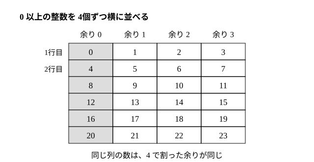

# L05 整数の割り算——余りで分ける

- unit_id: hs-math-a-math-and-human-activity
- 位置づけ: 整数のブロック第3レッスン（単元第5レッスン・1.5時間）。小学校の「（被除数）=（除数）×（商）＋（余り）」を a=bq＋r（0≦r<b）という等式として捉え直し、整数を「余り」で分類して和・積の余りを求める回。L06（互除法）は、この等式を繰り返し使う手順である。
- distribution_status: published_draft
- license: CC-BY-4.0
- verify_required: 例題数値・記述は監修者検証必須。
- 主概念: ①a=bq＋r（0≦r<b）を「等式」として捉える（商と余りが一通りに決まる約束） ②余りで分類する（偶奇・3 で割った余り・列に並べる図）と、和・積の余り

---

## 1. 前提の確認——割り算の等式と 2n・2n＋1

小学校で、47÷6 は「商 7 余り 5」と学び、確かめの式 47=6×7＋5 を書いた。中2では、偶数を 2n、奇数を 2n＋1 と文字で表した。このレッスンは、この 2つを 1本につなぐ。§4 では、中3 で学んだ式の展開（(7m＋3)(7n＋5) や (2k＋1)² を開く計算）も使う。

このレッスンでは、割られる数 a は 0 以上の整数、割る数 b は正の整数とする。

## 2. 割り算を等式で書く——a=bq＋r（0≦r<b）

整数 a を正の整数 b で割ったときの商を q、余りを r とすると、

**a=bq＋r**（0≦r<b）

と書ける。大切なのは括弧の中の条件 **0≦r<b**（余りは 0 以上で、割る数より小さい）である。この条件があるから、商と余りが一通りに決まる。条件を外すと、47=6×7＋5 も 47=6×6＋11 も 47=6×8−1 も「正しい等式」になってしまい、どれが「商と余り」なのか決まらない。

**例題1** 200 を 7 で割った商と余りを求め、等式の形で書け。

7×28=196、200−196=4 で 0≦4<7 だから、商 **28**、余り **4**。等式は **200=7×28＋4**

検算: 7×28＋4=196＋4=200 ✓、余り 4 は 0 以上 7 未満 ✓。

**例題2** 整数 a を 9 で割ると、商が 14 で余りが 6 であった。a を求めよ。

a=9×14＋6=126＋6=**132**

検算: 132÷9 は 9×14=126、132−126=6 で商 14 余り 6 ✓。

割り算を「計算の結果」でなく「等式」として持っておくと、a が分からなくても、a=bq＋r の形で a を表して計算に乗せられる。次の節でその使い方を見る。

## 3. 余りで分ける——列に並べる図

0 以上の整数を、4 で割った余りで分けてみる。0 から順に、横に 4個ずつ並べて折り返す。

左の列には 0、4、8、12、…（余り 0）、その右には 1、5、9、13、…（余り 1）、と続く。**同じ列の数は、4 で割った余りが同じ**である。列を式で書けば、左から 4k、4k＋1、4k＋2、4k＋3（k は 0 以上の整数）。

0 以上のどんな整数も、この 4つの列のどれか 1つに必ず入り、2つの列に同時に入ることはない。余りが 0、1、2、3 の 4通りしかないからだ。**b で割った余りで分けると、0 以上の整数全体が b 個の組に分かれる**（負の整数も同じ規則 0≦r<b で分けられるが、負の数の割り算そのものはこのレッスンでは扱わない。§4 では 2k・2k＋1 の形だけを負の整数にも使う）。2 で割った余りで分ければ偶数（2k）と奇数（2k＋1）の 2組、3 で割った余りなら 3k、3k＋1、3k＋2 の 3組になる。

**例題3** n を 0 以上の整数とする。3(2n＋1)＋1 は偶数か、奇数か。

3(2n＋1)＋1=6n＋3＋1=6n＋4=2(3n＋2)

3n＋2 は整数だから、2(3n＋2) は 2×（整数）の形で、**偶数**である。

検算: n=0 のとき 4、n=1 のとき 10、n=2 のとき 16 で、すべて偶数 ✓。

:::guide
**「2×（整数）＋1 の形だから奇数」と読めるようになる**

例題3のポイントは、展開して 6n＋4 を出すところではなく、6n＋4 を 2(3n＋2) と **2 でくくる**ところにある。式を見て「2×（整数）の形になっているから偶数」「2×（整数）＋1 の形になっているから奇数」と読む——この読み取りは、具体的な数で試す（n=0、1、2 で確かめる）ことでは代わりにならない。n=0、1、2 で偶数だったからといって、すべての n で偶数だとは言えないからだ。具体例は「予想」のため、文字式は「理由」のため。両方を使い、役割を分けておく。慣れないうちは、式を出したら必ず「これは 2×（　）の形か？ ＋1 が残るか？」と自分に問いかける。
:::

## 4. 和と積の余り——余りだけで決まる

7 で割ると 3 余る数 a と、7 で割ると 5 余る数 b がある。a＋b と ab を 7 で割った余りは、それぞれいくらか。

a=7m＋3、b=7n＋5（m、n は 0 以上の整数）と書く。

a＋b=7m＋7n＋8=7(m＋n)＋7＋1=7(m＋n＋1)＋1 → 余り **1**

ab=(7m＋3)(7n＋5)=49mn＋35m＋21n＋15=7(7mn＋5m＋3n＋2)＋1 → 余り **1**

検算: a=3、b=5（最も簡単な例）で、a＋b=8=7×1＋1 ✓、ab=15=7×2＋1 ✓。a=10、b=12 でも、a＋b=22=7×3＋1 ✓、ab=120=7×17＋1 ✓。

結果を見ると、**和の余りは余りの和 3＋5=8 を 7 で割った余り、積の余りは余りの積 3×5=15 を 7 で割った余り**になっている。7m や 7n の部分は、足しても掛けても 7×（整数）の形のままで、余りに影響しない。つまり、和や積の余りを知りたいだけなら、もとの数の余りだけを取り出して計算すればよい。

この「余りで分けて、余りだけで計算する」考えは、曜日の計算（7 で割った余り。今日が月曜なら 100 日後は 100=7×14＋2 で水曜日）や、n進法の一の位（n で割った余り）など、周期のあるものすべてに使える。

**例題4** 整数の 2 乗を 4 で割った余りは、0 か 1 のどちらかであることを説明せよ。

整数は偶数 2k か奇数 2k＋1 のどちらかである（負の整数もこの形に書けるので、以下は負の整数でも同じ）。

(2k)²=4k² → 4 で割った余り 0
(2k＋1)²=4k²＋4k＋1=4(k²＋k)＋1 → 4 で割った余り 1

したがって、どんな整数の 2 乗も、4 で割った余りは 0 か 1 である。

検算: 1、4、9、16、25、36 を 4 で割った余りは 1、0、1、0、1、0 ✓。

例題4は「ないこと」を言うのに使える。**4 で割って 2 または 3 余る数は、整数の 2 乗ではありえない**。たとえば 2023 は 2023=4×505＋3 で余り 3 だから、どんな整数を 2 乗しても 2023 にはならない。（逆に、余りが 0 か 1 だからといって 2 乗とは限らない。5 は余り 1 だが 2 乗ではない。）いくつ試しても「見つからない」としか言えないことが、余りに注目すると「ありえない」と言い切れる。

:::guide
**余りは「小さい世界」で計算をやり直す道具**

7 で割った余りだけを見るとき、私たちは整数全体を 0〜6 の 7個に「畳んで」いる。和も積も、畳んだ後の小さい世界で計算すればよい。ただし、余りからもとの数そのものが分かるわけではない（3 も 10 も、7 で割った余りは同じ 3）。小さい世界で出た答えは「a＋b は 7 で割ると 1 余る」のように、もとの数の性質として読み直す。この見方の便利さは、「ありえない」を示すときに際立つ。整数の 2 乗が 2023 になるかどうかは、1²、2²、… と 2 乗を順に作り、2023 を超えたところで打ち切れば、数十回の計算で終わりはする。ただ、4 で割った余りの世界では、2 乗の余りは 0 か 1 の 2通りしかなく、2023 の余り 3 はその中にない——2023 を 4 で割る 1 回の計算で終わる。この考えは L07 で「不定方程式に解がない」ことを説明するときにもう一度使う。
:::

## 5. 練習

設問に出る条件語を確かめてから解く。「0 以上の整数」は 0、1、2、…（負の数は含めない）、「余り」は 0 以上で割る数より小さい数（0≦r<b）、「整数の 2 乗」は（整数）×（同じ整数）、の意味である。

**問1** 次の割り算を、a=bq＋r（0≦r<b）の等式の形で書け。
(1) 325 を 8 で割る  (2) 1000 を 13 で割る

**問2** 整数 a を 7 で割ると商が 15、余りが 4 である。
(1) a を求めよ。
(2) その a を 6 で割ったときの余りを求めよ。

**問3** 1 から 50 までの整数のうち、5 で割った余りが 3 になるものは何個あるか。また、それらを 5k＋3 の形で表すとき、k はどんな値をとるか。

**問4** n を 0 以上の整数とする。
(1) 4(2n＋1)＋2 は偶数か奇数か。式を変形して理由を述べよ。
(2) 6n＋3 を 3 で割った余りと、6 で割った余りをそれぞれ求めよ。

**問5** 5 で割ると 2 余る数と、5 で割ると 4 余る数がある。この 2 数の和を 5 で割った余りと、積を 5 で割った余りを求めよ。（2 数を 5m＋2、5n＋4 と表して計算し、最も簡単な例 2 と 4 で検算せよ。）

**問6** 「4 で割って 3 余る数は、整数の 2 乗ではない」と言える理由を、例題4を使って 2〜3文で説明せよ。また 2027 と 2025 について、それぞれ 4 で割った余りを求め、整数の 2 乗である可能性があるかどうかを答えよ。

---

:::stretch
**S1** 3 で割ると 2 余り、5 で割ると 1 余り、7 で割ると 3 余る正の整数 N を、1 以上 105 以下（105=3×5×7）の範囲で求めたい。
(1) 7 で割ると 3 余る数を小さい方から書き並べ、その中から 5 で割ると 1 余るものを選び、さらに 3 で割ると 2 余るものを選んで N を求めよ。
(2) 70、21、15 について、次を確かめよ: 70 は 5 と 7 で割り切れ、3 で割ると 1 余る。21 は 3 と 7 で割り切れ、5 で割ると 1 余る。15 は 3 と 5 で割り切れ、7 で割ると 1 余る。
(3) 70×2＋21×1＋15×3 を計算し、105 で割った余りが (1) の N と一致することを確かめよ。この計算が N を与える理由を、(2) の性質と「和の余りは余りの和で決まる」ことを使って説明せよ。（70×2 の「2」は 3 で割った余りを 2 にするため。3・5・7 で割った余りを 3つの項について別々に追う。この算法は「百五減算」〔ひゃくごげんざん〕と呼ばれる。）
:::

対応解答: answer_key_L03-07.md

<!-- gen_nav:nav:start（自動生成・手編集しない） -->

---

[← 前のレッスン](lesson_04.md)｜[単元の目次](README.md)｜[解答](answer_key_L03-07.md)｜[次のレッスン →](lesson_06.md)

<!-- gen_nav:nav:end -->
