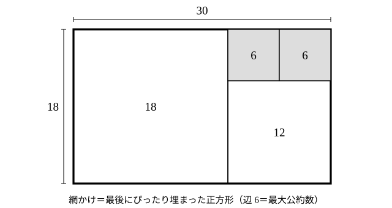
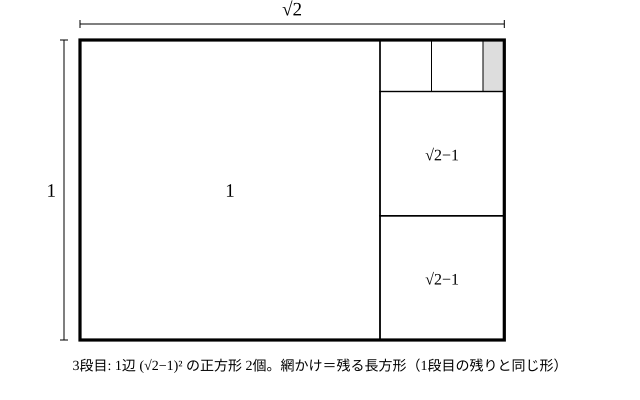

# L06 測る——ユークリッドの互除法

- unit_id: hs-math-a-math-and-human-activity
- 位置づけ: 整数のブロック第4レッスン（単元第6レッスン・2時間）。「測る」という人間の活動——端（はした）の量をどう測るか——から出発し、長方形を正方形で埋める図・言葉・式・筆算の 4つの表現を往復して、ユークリッドの互除法で最大公約数を求める回。L04 の素因数分解による方法が面倒な大きい数で必要になる。L07（不定方程式）では、互除法の各行を逆にたどって使う。
- distribution_status: published_draft
- license: CC-BY-4.0
- verify_required: 例題数値・記述は監修者検証必須。
- 主概念: ①端の量を測る=長方形を正方形で埋める図→「a と b の最大公約数は b と r の最大公約数に等しい」→筆算（図・言葉・式の往復） ②いつまでも端ができる=1辺 1 の正方形の対角線は分数で表せない（数学Ⅰ既習の再解釈・説明のみ）

---

## 1. 前提の確認——最大公約数（L04）と割り算の等式（L05）

L04 では、素因数分解から最大公約数を求めた。L05 では、割り算を a=bq＋r（0≦r<b）という等式で書いた。このレッスンはその 2つをつなぐ。本線（§2〜§4 と練習）に要る前提はこの 2つだけである。説明だけの §5 では、これに加えて中3 の平方根（√2）・1辺 1 の正方形の対角線の長さ（三平方の定理）・相似と、数学Ⅰの分母の有理化を使う（§5 の冒頭にも断りがある）。

L04 の方法には弱点がある。391 と 253 の最大公約数を求めよ、と言われたらどうするか。素因数分解しようとしても、391 も 253 も 2、3、5、7 では割れず、11、13、… と続ければ見つかるが、数が大きくなるほど試す回数が増えて手間がかかる。数が大きくなるほど素因数分解は難しくなる。**素因数分解をせずに最大公約数を求める方法**が、今日の主題である。

## 2. 端の量を測る——長方形を正方形で埋める

ものの長さを測るとき、単位の長さ（ものさしの 1 目盛り）で測っていくと、最後に単位より短い**端の量**が残ることがある。端が残らないように測れる単位——2つの長さの両方をぴったり測り切れる長さ——を、2つの長さの**公約量**（こうやくりょう）と呼ぶ。整数で言えば公約数にあたる。

縦 18、横 30 の長方形で考える。この長方形を、できるだけ大きな正方形で左から埋めていく。

1. 1辺 18 の正方形が 1個入り、右に 12×18 の長方形が残る（30=18×1＋12）。
2. 残った長方形を、1辺 12 の正方形で埋める。1個入り、6×12 の長方形が残る（18=12×1＋6）。
3. 残った長方形を、1辺 6 の正方形で埋める。2個入り、ぴったり埋まる（12=6×2＋0）。

最後に残った正方形の辺 6 は、30 と 18 の最大公約数である。なぜか。

**言葉で言う**: 30 と 18 の両方を測り切る長さ d は、30−18=12 も測り切る（30 から 18 を取り除いた残りだから）。逆に、18 と 12 の両方を測り切る長さは、18＋12=30 も測り切る。だから「30 と 18 の公約量」と「18 と 12 の公約量」は同じ集まりで、最大のものも同じ。同じ理由で「18 と 12」は「12 と 6」に、「12 と 6」は「6 と 0」に置き換えられ、6 と 0 の最大公約数は 6（ここで約束を 1つ広げる: L03 で保留した「0 を倍数に含める」を、0=6×0 だから 0 は 6 の倍数、と認める。以下、0 はどんな正の整数の倍数とも考える）。

**式で言う**: a=bq＋r（0≦r<b）のとき、

**a と b の最大公約数は、b と r の最大公約数に等しい**。

理由: d が a と b の公約数なら、r=a−bq も d で割り切れるので、d は b と r の公約数。逆に d が b と r の公約数なら、a=bq＋r も d で割り切れるので、d は a と b の公約数。公約数の集まりが一致するから、最大公約数も一致する。

:::guide
**「小さい数から公約数を探す」から「差（余り）に置き換える」へ**

最大公約数を求めるとき、まず思い浮かぶのは、2 で割れるか、3 で割れるか、と小さい方から試す方法だろう。391 と 253 でそれをやると、なかなか見つからない（答えは 23 である）。互除法は発想が逆で、2 数を「小さい 2 数」に置き換え続ける。置き換えても最大公約数が変わらない保証が、上の「言葉で言う」「式で言う」の部分だ。「引いたり割ったりしただけで最大公約数が出るのはなぜか」という疑問は正当で、その答えは「公約数の集まりが一致するから」の一言にある。図（長方形の正方形分割）はその一言を目に見える形にしたもので、図・言葉・式のどれか 1つで納得できれば、他の 2つはその翻訳である。
:::

## 3. 筆算——ユークリッドの互除法

上の置き換えを、割り算の等式で繰り返すのが**ユークリッドの互除法**（ごじょほう。以下、**互除法**）である。

1. a を b で割り、余り r を求める（a=bq＋r）。
2. r=0 なら、b が最大公約数。終わり。
3. r≠0 なら、2 数の組 (a, b) を (b, r) に置き換えて手順 1 に戻る。

**例題1** 391 と 253 の最大公約数を互除法で求めよ。

391=253×1＋138
253=138×1＋115
138=115×1＋23
115=23×5＋0

余りが 0 になった行の除数 **23** が最大公約数。

検算: 391=23×17、253=23×11 で、確かに両方が 23 で割り切れ、17 と 11 は互いに素（1 以外に共通の約数がない。商に共通の約数が残っていれば、23 より大きい公約数があることになる）✓。

**例題2** 2024 と 748 の最大公約数を求めよ。

2024=748×2＋528
748=528×1＋220
528=220×2＋88
220=88×2＋44
88=44×2＋0

最大公約数は **44**

検算: 2024=44×46、748=44×17 ✓、46 と 17 は互いに素 ✓。

各行は「（前の行の除数）=（前の行の余り）×（商）＋（余り）」で、L02 の 10進法→n進法の割り算の連鎖と同じく、割り算の等式の反復である。違いは、n進法では除数が固定（いつも n）だったのに対し、互除法では**前の余りが次の除数になる**点だ。

## 4. なぜ必ず止まるか——余りは小さくなり続ける

互除法は必ず有限回で終わる。各行の余りは r₁>r₂>r₃>…（r₁ は 1行目の余り、r₂ は 2行目の余り、…）と減っていく 0 以上の整数で、0 以上の整数が減り続ければ、いつか 0 に達するからだ（0≦r<b の条件がこれを保証している）。

止まったときの答えが正しいことは §2 で確かめた。もう一度、最後の 2行で言い直す。例題1の最後は 115=23×5＋0 で、「115 と 23 の最大公約数」は「23 と 0 の最大公約数」に等しい。0 はどんな正の整数でも割り切れる（0=23×0）から、23 と 0 の公約数は 23 の約数全部で、最大は 23。**割り切れた瞬間の除数が答え**なのは、そのためである。

:::guide
**余りが 0 になった行を「読み飛ばさない」**

互除法の答えは「最後の行の余り」ではなく「余りが 0 になった行の除数」（2 行目以降で止まったなら、その 1つ前の行の余り。1 行目で割り切れたなら除数そのもの）である。慣れないうちは、最後の行 115=23×5＋0 を見て「答えは 0？」「答えは 5？」と迷うことがある。迷ったら §2 の図に戻る——最後にぴったり埋まった正方形の辺の長さが答えだ。115×23 の長方形は 1辺 23 の正方形 5個で埋まるから、答えは 23。数と図を対応させる習慣が、この迷いを減らしてくれる。答えが 1 になることもある（2 数が互いに素のとき）。余り 1 が出れば、次の行は必ず余り 0 で止まる。
:::

## 5. いつまでも端ができる——1×√2 の長方形

この節は説明だけで、練習には出さない。√ の計算（分母の有理化）は数学Ⅰ「数と式」の範囲なので、追えなければ結果だけ受け取ってよい。§2 の手順を、辺の長さが整数でない長方形にあててみる。縦 1、横 √2 の長方形——1辺 1 の正方形の対角線を横にとった長方形である（√2≒1.414 は中3・数学Ⅰで既習）。

1. 1辺 1 の正方形が 1個入り、(√2−1)×1 の長方形が残る。
2. 残った長方形の短い辺は √2−1≒0.414。長い辺 1 をこれで測ると、1÷(√2−1)=√2＋1≒2.414（分母の有理化）だから、1辺 √2−1 の正方形が 2個入り、1−2(√2−1)=3−2√2=(√2−1)² の端が残る。
3. 残った長方形は縦 (√2−1)²、横 (√2−1) で、つまり辺の比が (√2−1)：1 で、**手順 1 で残った長方形 (√2−1)×1 と同じ形**（相似）である。

同じ形に戻ったということは、この後も同じことが繰り返され、**いつまでも端ができて、手順が止まらない**。整数の場合に必ず止まったのは、余りが「0 以上の整数」で減り続けたからだった。ここでは端の長さが √2−1、(√2−1)²、(√2−1)³、… と小さくなり続けるが、0 にはならない（正の数どうしの掛け算は正のままだから）。

止まらないということは、1 と √2 の両方を測り切る公約量が存在しないということである。もし √2 が分数 n/m（m、n は正の整数）で表せたら、長さ 1/m は 1 を m 個分、√2 を n 個分でぴったり測り切る公約量になり、d=1/m を単位にすれば §2 の整数の場合と同じで手順は止まるはずだ。止まらないのだから、**1辺 1 の正方形の対角線の長さは分数で表せない**。中3で「√2 は分数で表せない新しい数」と学び、数学Ⅰでは背理法による証明を学ぶ（または学んだ）。互除法は、この同じ事実に「測る」という活動の側から光をあてる、もう 1つの説明である。ここでは説明にとどめ、証明の書き方は数学Ⅰの単元に任せる。

## 6. 練習

**問1** 互除法で、次の 2 数の最大公約数を求めよ。各行を a=bq＋r の等式で書き、答えが両方の数を割り切ることを検算せよ。
(1) 143 と 91  (2) 1071 と 462  (3) 1000 と 273

**問2** 縦 30、横 42 の長方形を、§2 の手順で正方形で埋める。現れる正方形の 1辺の長さを大きい順に、それぞれの個数とともに書き、互除法の各行 42=30×1＋12、30=12×2＋6、12=6×2＋0 と対応させよ。また、正方形の面積の合計が 42×30 に一致することを確かめよ。

**問3** 分数 391/459 を、互除法で分母と分子の最大公約数を求めて約分せよ。

**問4** 84 と 36 に互除法をあてると、84=36×2＋12、36=12×3＋0 となる。「余りが 0 になったとき、その直前の除数 12 が最大公約数である」理由を、「84 と 36 の公約数は 36 と 12 の公約数と同じ」ことと「36 は 12 で割り切れる」ことを使って 2〜3文で説明せよ。

**問5** 互除法の余りは、必ずその行の除数より小さい。この事実から、2つの正の整数に互除法をあてたとき「いつまでも続くことはできない（必ず有限回で止まる）」理由を 2〜3文で説明せよ。

---

:::stretch
**S1** 3つの数 1001、715、429 の最大公約数を求めたい。
(1) 互除法で 1001 と 715 の最大公約数 g を求めよ。
(2) 互除法で g と 429 の最大公約数を求めよ。これが 3 数の最大公約数である。
(3) 求めた最大公約数で 3 数をそれぞれ割り、商を書け。商の 3つの数に共通の約数が 1 以外にないことを確かめよ。
:::

対応解答: answer_key_L03-07.md

<!-- gen_nav:nav:start（自動生成・手編集しない） -->

---

[← 前のレッスン](lesson_05.md)｜[単元の目次](README.md)｜[解答](answer_key_L03-07.md)｜[次のレッスン →](lesson_07.md)

<!-- gen_nav:nav:end -->
