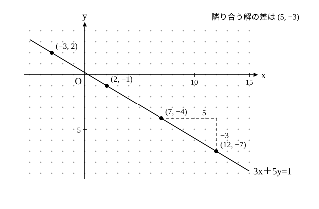

# L07 二元一次不定方程式——解の存在・特殊解・一般解

- unit_id: hs-math-a-math-and-human-activity
- 位置づけ: 整数のブロック最終レッスン（単元第7レッスン・2.5時間）。ax＋by=c の整数解を、「解は無限にある」（x、y の表）→「全部書く」（一般解）→「1つ見つける」（互除法を逆にたどる）→「ないこともある」（余りで説明）の順にたどる回。L04 の互いに素、L05 の余り、L06 の互除法をすべて使う。L09（油分け算）で「2つの升で作れる量」として再訪する。
- distribution_status: published_draft
- license: CC-BY-4.0
- verify_required: 例題数値・記述は監修者検証必須。
- 主概念: ①ax＋by=c の整数解: 互除法の各行を逆にたどって特殊解を 1つ作る ②x、y の表→一般解 x=x₀＋bk、y=y₀−ak（k は整数・a と b は互いに素）・「最大公約数が c を割らないとき解なし」を余りで説明

---

## 1. 前提の確認——互いに素（L04）・余り（L05）・互除法（L06）

このレッスンで使う道具は 3つ。

- **互いに素**（L04）: 最大公約数が 1 の 2 数。
- **余りで分ける**（L05）: 左辺と右辺を同じ数で割った余りが違えば、等式は成り立たない。
- **互除法**（L06）: 391=253×1＋138、253=138×1＋115、… の各行。

このほか §7 と練習（問4・問6・S1）で解を条件で絞るとき、2＋4k≧0 のような一次不等式（数学Ⅰ「数と式」）を使う。未習なら、k に 0、±1、±2、… を順に入れて、x か y が負になる手前までを調べればよい。

中学の方程式は、文字が 1つなら解が 1つ（二次方程式でも 2つまで）に決まった（中2 の二元一次方程式は解が無数にあり、グラフの直線で表した——その 2 本を連立して 1 組に決めた）。今日の方程式は、文字が 2つで式が 1本——整数解が 1つでもあれば、解は無限にある（1つもない場合もある——§6）。その「無限にある解」を、漏れなく・重複なく書き切るのが目標である。

## 2. 問題から式へ——解が「たくさんある」方程式

重さ 3 g のおもりと 5 g のおもりがたくさんある。合わせてちょうど 26 g にするには、それぞれ何個使えばよいか。

3 g を x 個、5 g を y 個とすると、3x＋5y=26。x、y は 0 以上の整数である。y=1 なら 3x=21 で x=7。y=4 なら 3x=6 で x=2。y=0、2、3、5 では 26−5y が 3 の倍数にならず、y≧6 では 3x が負になる。答えは (x, y)=(7, 1) と (2, 4) の 2組。

文字が 2つで式が 1本の方程式 ax＋by=c（a、b、c は整数で、a と b は 0 でない）の**整数解**（せいすうかい。x、y がともに整数である解。負の整数も含む）を求める問題は、**二元一次不定方程式**（にげんいちじふていほうていしき。以下、**不定方程式**）と呼ばれる（教科書で広く使われる呼び方）。「二元」は文字が 2つ、「一次」は文字の 2 乗以上や xy のような文字どうしの積を含まないこと、「不定」は、それだけでは解が 1つに定まらない、という意味である。今の問題では「0 以上」という条件が解を 2組に絞ったが、条件を外して負の整数も許すと、解はいくらでもある。

## 3. 解は無限にある——x、y の表

まず、右辺が 1 の 3x＋5y=1 の整数解を考える（右辺が 1 の場合が基本になる理由は §5 で分かる）。1つ見つける。x=2、y=−1 で 6−5=1 ✓。他にもあるか。表にする。

| x | −3 | 2 | 7 | 12 |
|---|---|---|---|---|
| y | 2 | −1 | −4 | −7 |
| 3x＋5y | −9＋10=1 | 6−5=1 | 21−20=1 | 36−35=1 |

x は 5 ずつ増え、y は 3 ずつ減っている。x を 5 増やすと左辺は 15 増え、y を 3 減らすと左辺は 15 減る——差し引き 0 で、等式が保たれるからだ。この規則で、解は右にも左にも無限に続く。

図で見ると、解は直線 3x＋5y=1 の上に、等間隔に並ぶ格子点（こうしてん。x 座標も y 座標も整数の点）である。**解を 1つ見つけたら、(5, −3) ずつずらしていけば全部の解になる**——これを式で書いたものが一般解である。

## 4. 一般解——x=x₀＋bk、y=y₀−ak

3x＋5y=1 の解を全部書く。解の 1つ (2, −1) を**特殊解**（とくしゅかい）と呼ぶ（教科書で広く使われる呼び方）。任意の解 (x, y) と特殊解について、

3x＋5y=1
3×2＋5×(−1)=1

辺々〔へんぺん〕（左辺どうし・右辺どうし）を引くと 3(x−2)＋5(y＋1)=0、すなわち 3(x−2)=−5(y＋1) である。

ここからは、負の整数も含めて「3×（整数）の形の数」を 3 の倍数と呼ぶ（一般に「b×（整数）の形の数」を b の倍数と呼ぶ。L04 §3 の性質「a と b が互いに素で ak が b の倍数なら k は b の倍数」は、k や係数が負のときも、符号を除いた数で同じ議論をすれば同じ理由で成り立つ。k=0 のときは 0=b×0 だから k 自身が b の倍数で、直接確かめられる）。左辺は 3 の倍数だから右辺 −5(y＋1) も 3 の倍数。5 と 3 は互いに素なので、y＋1 が 3 の倍数でなければならない（L04 §3 の性質）。y＋1=−3k（k は整数）と書くと、3(x−2)=15k から x−2=5k（y＋1=3k と置いてもよい。そのときは x=2−5k、y=−1＋3k となり、k の符号が逆なだけで同じ解の集まりを表す。−3k としたのは x 側を 2＋5k の形にそろえるため）。よって

**x=2＋5k、y=−1−3k**（k は整数）

これが**一般解**（いっぱんかい。すべての解をまとめて表した式）と呼ばれる（教科書で広く使われる呼び方）。k=−1、0、1、2 を入れると §3 の表の 4組が出る ✓。逆に、この形の (x, y) はすべて解である（3(2＋5k)＋5(−1−3k)=6＋15k−5−15k=1 ✓）。

一般に、a と b が互いに素で、(x₀, y₀)（x₀ は「エックスゼロ」と読み、最初に見つけた 1つの解を表す）が ax＋by=c の 1つの解なら、一般解は

**x=x₀＋bk、y=y₀−ak**（k は整数。a と b が互いに素でないときは、先に両辺を最大公約数で割る——§6）

x に足すのは b、y から引くのは a——**係数が入れ替わる**。x を b 増やすと ax は ab 増え、y を a 減らすと by は ab 減るので、つじつまが合う。

:::guide
**「解は 1つ」という期待を、いったん手放す**

中学までの一次方程式では、答えとして求めたのは「x=3」のような 1つの数（連立方程式なら 1 組）だった。不定方程式で「x=2＋5k、y=−1−3k（k は整数）」と答えることに、最初は落ち着かなさを感じることがある。「k って結局いくつなの？」と。答えは「k はどの整数でもよい。k を決めるごとに解が 1組決まり、それが全部集まって解の全体になる」——解は 1つの数ではなく、無限個の組の集まりである。この感覚をつかむには、一般解の式より前に §3 の表を自分で書き、「k=3 なら？ k=−2 なら？」と 2〜3組を実際に代入して確かめるのが早い。表が式より先、が今日の順序である。
:::

## 5. 特殊解を作る——互除法を逆にたどる

3x＋5y=1 では特殊解 (2, −1) がすぐ見つかった。係数が大きいと目で探すのは難しい。そこで L06 の互除法を使う。

**例題1** 17x＋5y=1 の整数解を 1つ求めよ。

17 と 5 に互除法をあてる。

17=5×3＋2 …①
5=2×2＋1 …②

互除法はこの後 2=1×2＋0 で止まる（L06 §3）が、逆にたどるときに使うのは、この余り 0 の行ではなく、余りが 1（最大公約数）になった最後の行②である。②を「1=」の形に直す: 1=5−2×2。①から 2=17−5×3 なので、これを代入する（17 と 5 は数として掛け算せず記号のまま残し、17×（　）＋5×（　）の形に集めるのが目標）。

1=5−(17−5×3)×2=5−17×2＋5×3×2=5−17×2＋5×6=17×(−2)＋5×7

よって x=**−2**、y=**7** が 1つの解。

検算: 17×(−2)＋5×7=−34＋35=1 ✓。

「余りが 0 でない最後の行（余りが 1 になった行）から始めて、余りを 1つ前の行で置き換えていく」——手順は毎回同じである。なお、1 行目で割り切れる（a が b の倍数の）ときは、逆にたどる行がなく、最大公約数は b 自身である。このとき ax＋by=b の解は x=0、y=1 とすぐ分かる（a と b が互いに素なら b=1）。

**例題2** 37x＋13y=1 の整数解を 1つ求めよ。

37=13×2＋11 …①
13=11×1＋2 …②
11=2×5＋1 …③

③から 1=11−2×5。②から 2=13−11 なので、1=11−(13−11)×5=11−13×5＋11×5=11×6−13×5。①から 11=37−13×2 なので、1=(37−13×2)×6−13×5=37×6−13×17。

x=**6**、y=**−17**。検算: 37×6−13×17=222−221=1 ✓。

右辺が 1 でない場合は、1 の解を c 倍する。17x＋5y=3 なら、(−2, 7) を 3倍した (−6, 21) が解（17×(−6)＋5×21=−102＋105=3 ✓）。もっと小さい解 (−1, 4) も目で見つかる（−17＋20=3 ✓）。**特殊解はどれでもよい**。どの特殊解から始めても、一般解が表す解の集まりは同じになる（(−6, 21) は x=−1＋5k、y=4−17k の k=−1 の場合）。

:::guide
**特殊解の探し方は 2通り——目で探す・互除法を逆にたどる**

係数が小さければ、x に 0、±1、±2 を順に入れて y が整数になるものを探すのが早い。係数が大きく、目で探すのが難しいときに互除法を使う。どちらで見つけても構わない。大切なのは、「特殊解は天から与えられるものではなく、自分で作れる」という感覚である。問題文に「x=−2、y=7 は 1つの解である」と書いてあると、なぜそれが分かるのか不安になるかもしれないが、作り方を知っていれば自分で確かめられる。互除法の各行を逆にたどる式変形は、最初は煩わしいが、何回か書けば型として手に残りやすい。
:::

## 6. 解がないとき——余りで説明する

6x＋4y=7 に整数解はあるか。左辺は 2(3x＋2y) で、x、y が整数なら必ず偶数。右辺の 7 は奇数。偶数と奇数は等しくならないから、**解はない**。

一般に、a と b の最大公約数を g とする。左辺 ax＋by は g の倍数（a も b も g で割り切れる）だから、右辺 c が g の倍数でなければ等式は成り立たない。

**ax＋by=c に整数解があるのは、c が a と b の最大公約数 g で割り切れるときに限る**。逆に、c が g で割り切れるなら、§5 の方法で ax＋by=g の解を 1つ作って c/g 倍すればよいので、解は必ずある。

c が g で割り切れるなら、両辺を g で割って係数が互いに素の場合に帰着できる。6x＋4y=10 は 3x＋2y=5 になり、特殊解 (1, 1) から一般解 x=1＋2k、y=1−3k（k は整数）が出る。

**例題3** 次の不定方程式に整数解があるかどうかを判定せよ。
(1) 6x＋9y=4  (2) 6x＋9y=15

(1) 6 と 9 の最大公約数は 3。左辺 6x＋9y=3(2x＋3y) は 3 の倍数だが、4 は 3 の倍数でない。**解なし**。
(2) 15 は 3 の倍数。両辺を 3 で割ると 2x＋3y=5。x=1、y=1 が解（2＋3=5 ✓）。**解あり**。一般解は x=1＋3k、y=1−2k（k は整数）。

検算: (2) で k=1 → (4, −1): 8−3=5 ✓、もとの式で 24−9=15 ✓。

:::guide
**「見つからない」と「ない」の違いを、余りが埋める**

6x＋9y=4 を、x=0、1、2、… と入れて探すと、いつまでも見つからない。しかし「見つからない」だけでは「ない」とは言えない——探し方が足りないだけかもしれない。L04 §5 と L05 §4 で使った考えがここで効く。左辺 6x＋9y=3(2x＋3y) は、x、y が何であっても 3 の倍数（3×（整数）の形）。右辺 4 は 3 の倍数でない（4 を 3 で割った余りは 1）。3 の倍数と 3 の倍数でない数が等しくなることはない。これで「ない」と言い切れる。不定方程式を立てられても、この判定ができるかどうかで、解ける問題の範囲が変わる。立てた式の**係数の最大公約数と右辺**を見る習慣を、式を書いた直後に置く。
:::

## 7. 文章題——条件で解を絞る

**例題4** 1個 7 g のビーズと 1個 4 g のビーズを合わせて、ちょうど 50 g にしたい。それぞれ何個ずつ使えばよいか。すべての組を求めよ。

7 g を x 個、4 g を y 個とすると 7x＋4y=50（x、y は 0 以上の整数）。7 と 4 は互いに素で、50 は 1 で割り切れるから整数解はある（0 以上の解があるかは、この後 k を絞って別に確かめる）。特殊解を目で探す: x=2 のとき 4y=36、y=9 ✓。一般解は x=2＋4k、y=9−7k。

x≧0 かつ y≧0 となる k を探す。k=0: (2, 9)、k=1: (6, 2)、k=2: (10, −5) は y が負、k=−1: (−2, 16) は x が負。k が 1 増えるごとに x は 4 増え、y は 7 減るので、k≧2 では y が負のまま、k≦−1 では x が負のままで、これより外側に解はない（不等式で書けば、2＋4k≧0 と 9−7k≧0 を同時に満たす整数 k は 0 と 1 だけ）。

答え: **7 g を 2個と 4 g を 9個、または 7 g を 6個と 4 g を 2個**

検算: 7×2＋4×9=14＋36=50 ✓、7×6＋4×2=42＋8=50 ✓。

文章題では、①式を立てる ②係数の最大公約数で解の有無を見る ③特殊解を 1つ作る ④一般解を書く ⑤問題の条件（0 以上・個数の上限など）で k を絞る、の順で進む。

## 8. 練習

設問に出る条件語を確かめてから解く。「整数解」は x、y がともに整数である解（負の整数も含む）、「互いに素」は最大公約数が 1（L04）、「0 以上の整数」は 0、1、2、…、「1 以上」は 0 を含めない、の意味である。

**問1** 次の不定方程式の整数解を 1つ求めよ（x に小さい整数を順に入れて探してよい）。
(1) 4x＋7y=1  (2) 11x＋3y=1

**問2** 41x＋12y=1 の整数解を 1つ、互除法の各行を逆にたどって求めよ。求めた解を代入して検算せよ。

**問3** 次の不定方程式の一般解を求めよ。
(1) 4x＋7y=1  (2) 4x＋7y=3

**問4** 5x−3y=2 について答えよ。
(1) 一般解を求めよ。（特殊解 (1, 1) から始めてよい。係数に負の数があることに注意——x=1＋3k、y=1＋5k でも、k を −k に替えた x=1−3k、y=1−5k でも同じ集まりを表す。必ず代入して確かめる。）
(2) x、y がともに 1 以上 30 以下である解は何組あるか。

**問5** 次の不定方程式のうち、整数解をもたないものをすべて選び、その理由を余りを使って説明せよ。
(a) 6x＋9y=8  (b) 6x＋9y=21  (c) 10x＋4y=7

**問6** 長さ 6 cm の棒と 9 cm の棒がたくさんある。切らずに一直線につないで、ちょうど 60 cm にしたい。
(1) 6 cm の棒を x 本、9 cm の棒を y 本として式を立て、両方の棒を 1本以上使う組をすべて求めよ。
(2) ちょうど 61 cm にすることはできるか。理由とともに答えよ。

---

:::stretch
**S1** 1 冊 350 円のノートと 1本 120 円のペンを買って、ちょうど 2000 円を使い切りたい（どちらも 0 冊・0本でもよい）。
(1) ノート x 冊、ペン y 本として式を立て、両辺を最大公約数で割って簡単にせよ。
(2) 0 以上の整数解をすべて求めよ。
(3) 使い切る金額を 1500 円に変えると、0 以上の整数解はあるか。一般解を求めて、条件を満たす k がないことを確かめよ（特殊解は負の数を含んでよい）。
:::

対応解答: answer_key_L03-07.md

<!-- gen_nav:nav:start（自動生成・手編集しない） -->

---

[← 前のレッスン](lesson_06.md)｜[単元の目次](README.md)｜[解答](answer_key_L03-07.md)｜[次のレッスン →](lesson_08.md)

<!-- gen_nav:nav:end -->
