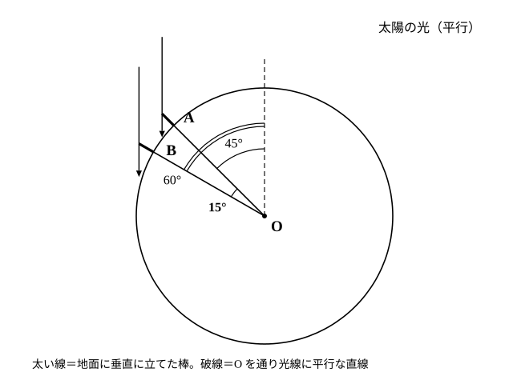
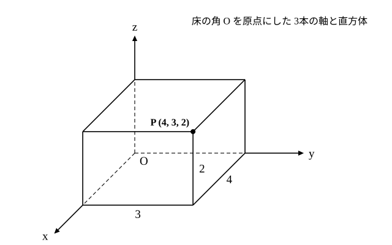

# L08 測る・位置を示す——地球の大きさと座標

- unit_id: hs-math-a-math-and-human-activity
- 位置づけ: 単元第8レッスン（2時間）。「測る」と「位置を示す」という2つの活動を扱う回。前半は測量の歴史と「地球の大きさを見積もる」計算（図形の性質・三角比は数学Ⅰまでの既習を使うだけで、新しく導入しない）、後半は中1で学んだ平面の座標を空間へ広げ、点の位置を3つの数の組で表す。L06（端の量を測る互除法）から「測る」の話題を引き継ぎ、L09〜L10（遊び）へ「状態を数の組で書く」見方を渡す。
- distribution_status: published_draft
- license: CC-BY-4.0
- verify_required: 例題数値・記述は監修者検証必須。測量の例に出る距離・影の長さ・角度は練習用の架空の値であり、実測値ではない。
- 主概念: ①「測る」——直接はかれない長さを、はかれる長さと角から計算で出す（平行光線と中心角から地球の円周を見積もる型・既習の図形の性質と三角比の利用） ②「位置を示す」——平面の座標（2本の数直線・2つの数の組）を空間の座標（3本の数直線・3つの数の組）へ拡張する

---

## 1. 「測る」——はかれないものを、はかれるものから

L06 では、長方形を正方形で埋めていく図で互除法を学んだ。あれは「2つの長さを同時にはかりきる共通の物差し（公約量）を見つける」という、**測る**という活動の一場面だった。このレッスンでは「測る」をもう少し広げる。

人が何かを測ってきた目的は、いくつかにまとめられる。土地の境を決めること（領土の確定）、建物を建てること、船の進む向きと位置を推定すること（航海）、そして暦を作ること。学習指導要領の解説では、古代エジプトの測量・大航海時代の測量・江戸時代の日本の測量が、その題材として挙げられている。道具も対象も時代ごとに違う。このレッスンでは、そうした測量の中から次の一点に絞って扱う。

**直接ものさしを当てられない長さを、当てられる長さと角の大きさから、図形の性質を使って計算で出す。**

数学Ⅰの三角比は、まさにその道具だった。1つ確かめておこう（三角比が未習なら、例題1 と §2 で角を求める 2行は結果だけ受け取り、中心角 15° のところから読み進めてよい）。

**例題1** 木の根元から水平に 24 m 離れた地点で木のてっぺんを見上げると、水平方向から測った角（仰角）が 30° だった。目の高さを 1.5 m として、木の高さを求めよ（√3=1.732 として、小数第1位まで）。

目の高さから上の部分を h m とすると、tan 30°=h/24 だから h=24×tan 30°=24×(1/√3)=24/√3=8√3。8√3=8×1.732=13.856 なので、木の高さは 13.856＋1.5=15.356、およそ **15.4 m** である。

検算: 30° の直角三角形は「底辺:高さ=√3:1」。24 m を √3 で割れば高さ 24÷1.732=13.86 m で、上の計算と合う ✓。

ここで使ったのは、数学Ⅰで学んだ tan の定義と、特別な角の値だけである。新しい公式は何も要らない。「測る」という活動の数学は、すでに手の中にある道具の組み合わせでできている。

## 2. 地球を測る——2地点の角の差と中心角

もっと大きなもの、地球そのものの大きさを、地上の測定から見積もることもできる。ここでは、次の3つの仮定を置く。仮定を先に書くのは、測量の計算では「どこまでを認めて計算したか」がそのまま答えの意味になるからだ。

1. 太陽は非常に遠くにあるので、地上に届く太陽の光線は互いに**平行**とみなす。
2. 地球は**球**とみなす。
3. 2つの地点 A・B は、真北・真南の方向にまっすぐ並んでいる（同じ経線上にある）。また、正午の影は2地点とも同じ向き（たとえば北向き）に伸びている。

地点 A と地点 B で、同じ日の正午に、地面に垂直に立てた長さ 1 m の棒の影の長さを測る。影の長さは、棒の長さ×tan（光線と棒のなす角）で決まる（三角比の定義そのものだ）。

- A では影の長さが 1 m だった。tan（角）=1 だから、光線と棒のなす角は 45°。
- B では影の長さが 1.73 m（≒√3 m）だった。計算では影の長さを √3 m とみなす。tan（角）=√3 だから、角は 60°。

棒は地面に垂直だから、棒を伸ばした直線は地球の中心 O を通る。つまり「光線と棒のなす角」は「光線と、中心から地点へ向かう半径のなす角」である。光線は平行なので、中心 O を通って光線に平行な直線を1本引くと、平行線と角の性質（同位角・錯角〔さっかく〕）から、この直線と半径 OA のなす角は 45°（A で光線と棒のなす角の錯角）、半径 OB のなす角は 60°（同様）になる。したがって、2本の半径 OA・OB のなす角、すなわち中心角 ∠AOB は、その差 60°−45°=**15°** である。影が2地点とも同じ向きに伸びている（太陽が真上に来る地点から見て A・B が同じ側にある）ので、角の和ではなく差になる。もし A と B がその地点をはさんで反対側にあれば、影は逆向きに伸び、中心角は 45°＋60° の和になる。

**例題2** 上の設定で、A から B までの地表に沿った距離が 1,500 km だったとする（練習用の架空の値）。地球の円周を見積もれ。

中心角 15° に対する弧〔こ〕（円周の一部分）の長さが 1,500 km である。円周全体は中心角 360° に対応するから、

円周=1,500×(360/15)=1,500×24=**36,000 km**

検算: 15° は 360° の 1/24 だから、弧 1,500 km も円周の 1/24 のはず。1,500×24=36,000 で一致する ✓。

この計算で使った知識は、「平行線と角」（中学）と「三角比 tan」（数学Ⅰ）と「弧の長さは中心角に比例する」と「円の接線は接点を通る半径に垂直」（どちらも中学の円）だけである。地球という巨大な対象でも、測ったのは棒の影の長さと2地点間の距離という、人の手で測れる量だった。

:::guide
**仮定を書き出してから計算する——測量の答えは「仮定つきの数」**

例題2の 36,000 km は、3つの仮定の上に立っている。光線が平行でなければ、角の差は中心角に一致しない。地球が球でなければ、弧の長さと中心角の比例が崩れる。A・B が同じ経線上になければ、2地点間の距離が「南北方向の弧」の長さにならず、式に入れる距離が変わる。だから、測量の結果を人に伝えるときは、数値だけでなく「何を認めて計算したか」を添える。逆に、答えが実際と食い違ったとき、疑うべき場所はこの仮定の一覧の中にある——測定のずれか、仮定のずれか、を切り分けられる。L06 の互除法が「割り切れるまで続ける」という手順を疑わずに使えたのは整数の世界だからで、現実の量を測る計算では、こうして仮定を明示する習慣が「測る」活動の一部になる。
:::

:::guide
**なぜ「同じ経線上」に限るのか**

2地点が東西にずれていると、正午の時刻そのものが2地点で違い、同じ瞬間に太陽の高さを比べることが難しくなる。さらに、地表に沿った2地点間の距離が「南北の弧」だけを表さなくなるので、その距離を中心角 15° の弧の長さとして式に入れることができない。条件を「南北にまっすぐ」に限るのは、比べたい量（南北方向の角の差）と測った量（南北方向の距離）をそろえるためである。条件を変えたとき何が崩れるかを考えることは、この単元の全体を通じて求められる「条件を変えて発展的に考える」練習の1つだ。
:::

## 3. 「位置を示す」——平面の座標を思い出す

「測る」と並ぶもう1つの活動が、**位置を示す**ことである。中1で学んだ平面の座標を、まず思い出そう。

平面上に、原点 O で直交する2本の数直線（x 軸・y 軸）を引くと、平面上のどの点も「x 軸方向の値、y 軸方向の値」という**2つの数の組** (x, y) で表せる。逆に、2つの数の組が与えられれば、対応する点は平面上にちょうど1つ決まる。

身近な例で確かめる。長方形の教室の床を考え、1つの角を原点 O、そこから横の壁に沿う向きを x 軸、奥の壁に沿う向きを y 軸とし、単位を m にする。

**例題3** この床で、横の壁に沿って 3 m、そこから奥の壁に沿う向きに 2 m 進んだ床の点 P の座標を答えよ。また、点 Q (2, 3) は P と同じ点か。

P の座標は **(3, 2)** である。Q (2, 3) は「横の壁に沿って 2 m、そこから奥の壁に沿う向きに 3 m」の点で、P とは別の点である。座標は**順序つき**の数の組で、(3, 2) と (2, 3) は違う点を指す。

## 4. 空間の座標——3本目の数直線を立てる

床の上の点なら、2つの数で足りる。しかし部屋の中には、床から離れた位置にあるものがたくさんある——天井の照明、棚の上の箱、飛んでいる虫。これらの位置を数で表すには、「高さ」の情報が要る。

そこで、原点 O から真上に向かう3本目の数直線を立てる。これを **z 軸**と呼ぶ。x 軸・y 軸・z 軸の3本は原点で互いに直交する。空間の点 P の位置は、「x 軸方向の値、y 軸方向の値、z 軸方向の値」という**3つの数の組** (x, y, z) で表せる。これが空間の点の**座標**である（教科書では、この3本の軸を入れた空間を「座標空間」〔ざひょうくうかん〕と呼ぶことがある）。

学習指導要領の解説はこの拡張を「空間の点の位置を表す座標は、平面上の点の位置を表す座標を自然に拡張したものである」と述べている。実際、やったことは「2本の数直線に3本目を加えた」だけで、考え方は平面のときと変わらない。

**例題4** 例題3の部屋の床の角 O に、x 軸方向に 4 m、y 軸方向に 3 m、z 軸方向に 2 m の直方体の箱を、3つの辺が3本の軸に重なるように置く。O から最も遠い頂点 P の座標を答えよ。また、8つの頂点の座標をすべて書け。

P は x 軸方向に 4、y 軸方向に 3、z 軸方向に 2 進んだ点だから **(4, 3, 2)** である。

8つの頂点は、x 座標が 0 か 4、y 座標が 0 か 3、z 座標が 0 か 2 のすべての組み合わせだから、

(0, 0, 0)、(4, 0, 0)、(0, 3, 0)、(4, 3, 0)、(0, 0, 2)、(4, 0, 2)、(0, 3, 2)、(4, 3, 2)

の8点である。2×2×2=8通りで、頂点の数と合う。

検算: P (4, 3, 2) から床へ垂直に降りた点は、z 座標だけが 0 になった (4, 3, 0) で、これは床の上の長方形の角と一致する。z=0 の点はすべて床の上にある、という読み方が正しいことも確かめられる ✓。

:::guide
**「数直線が何本要るか」は「位置を決めるのに別々に指定する方向の数」**

直線の上の点は、1本の数直線で、1つの数で表せる。平面の点は2本の数直線で2つの数、空間の点は3本の数直線で3つの数。数直線の本数は、点の位置を決めるために別々に指定する方向の数と一致している（斜めへの動きは、各軸の方向の動きの組み合わせで表せるので、別には数えない）。床の上のロボット掃除機は前後・左右の2方向に動くので (x, y) で足り、ドローンは上下も動くので (x, y, z) が要る、と言い換えてもよい。この見方を持っておくと、「なぜ空間では3つの数なのか」を暗記でなく説明できる。一方で、3つの数の組を見て「これは空間の点だ」と即座に読めるようになるには、例題4のような具体的な箱で、指で軸をたどる経験がいくらか要る。図を見ながら、8つの頂点のうち「z 座標が 2 の4点」「x 座標が 0 の4点」がそれぞれどの面に集まるかを口で言えるか、確かめてみよう。
:::

:::guide
**原点と軸の向きは「約束」で決める**

例題3・例題4で、部屋の角を原点にし、壁に沿う向きを軸にしたのは、計算が楽になるという人間側の都合による約束であって、部屋そのものに原点が備わっているわけではない。別の角を原点にすれば同じ点の座標は別の数の組になるが、点の位置そのものは変わらない。地図で使う緯度・経度も、地球上の位置を2つの数（角度）で表す約束の1つで、基準（赤道と、ある経線）を決めたうえで成り立っている。「まず約束を決め、それから数の組で表す」——位置を示す活動はいつもこの順序で進む。座標の問題で行き詰まったときは、最初に「原点はどこか・軸はどちら向きか・単位は何か」の3つを確かめ直すとよい。
:::

## 5. GPS・カーナビ・コンピュータグラフィックス——数の組で位置を扱う

位置を数の組で表す考え方は、身近な技術の土台になっている。

- 全地球測位システム（GPS）を使う地図アプリやカーナビは、受信機の現在地を数の組（緯度・経度、そして高さ）として扱い、それを地図の上の点に対応させて表示している。
- コンピュータグラフィックス（CG）では、画面に映す立体の頂点を (x, y, z) の座標の組として持ち、それらの数を計算で書き換えることで、立体を回したり動かしたりする。例題4の直方体の8頂点の座標は、まさにこの「立体を数の組で持つ」形そのものである。

どちらも、中身の計算はこの単元の範囲を超える。ここで押さえておくのは、「位置を数の組で表す」という約束が、これらの技術の背後で働いているという一点である。

:::zatsudan
人が何かを測ってきた目的を、もう一度並べてみる。土地の境を決める、建物を建てる、船の進路を推定する、暦を作る。どれも「目に見える長さ」ではなく、「決めたい・作りたい・知りたいこと」が先にあり、そのために必要な長さや角を測る、という順序になっている。地球の大きさを見積もる計算も、影の長さを測ることが目的なのではなく、「地球はどれくらい大きいのか」という問いが先にあった。この単元の「数える・測る・位置を示す・遊ぶ」という活動はみな、人間の側にある目的から数学が立ち上がってきた、という共通の形をしている。
:::
<!-- zatsudan話題源: 高等学校学習指導要領解説 数学編（平成30年告示）「測る」の段の逐語（執筆時内部調査で確認した範囲: 測量の目的4つ・題材3つ）。年代・人物名・実測値は書かない -->

## 6. 練習

設問に出る条件語を確かめてから解く。「軸に沿って」はその軸の方向にまっすぐ、「真上」は z 軸の正の向きに、「同じ経線上」は真北・真南の方向にまっすぐ並んでいる、の意味である。座標の単位は、断りがなければ m とする。

**問1** 例題3・例題4と同じ部屋（床の角 O が原点、横の壁に沿う向きが x 軸、奥の壁に沿う向きが y 軸、真上が z 軸）で、次の点の座標を答えよ（座標は (x, y, z) の 3つで答える）。
(1) 床の上で、横の壁に沿って 3 m、そこから奥の壁に沿う向きに 2 m 進んだ点
(2) (1) の点の真上 1.5 m にある点
(3) 天井の高さが 2.4 m のとき、原点 O の真上にある天井の点

**問2** 床の角 O に、x 軸方向に 5 m、y 軸方向に 3 m、z 軸方向に 2 m の直方体を、3つの辺が3本の軸に重なるように置く。8つの頂点の座標をすべて書け。

**問3** 次の座標で表される点は、部屋のどこにあるか。言葉で説明せよ。
(1) (2, 0, 1)
(2) (0, 4, 0)

**問4** 部屋の中を飛ぶドローンの位置を伝えるのに、「床の座標で (3, 2) の位置にいる」とだけ言われた。この情報だけでドローンの位置は1つに決まるか。決まらないなら、その理由と、位置を1つに決めるために足りない情報を説明せよ。

**問5** 地点 A と地点 B は同じ経線上にあり、A から B までの地表に沿った距離は 800 km である（練習用の架空の値）。同じ日の正午に、垂直に立てた棒と太陽の光線のなす角を測ると、A で 40°、B で 48° だった。光線は平行、地球は球とみなし、正午の影は2地点とも同じ向きに伸びているとする。
(1) 中心角 ∠AOB の大きさと、地球の円周の見積りを求めよ。
(2) B での角の測定が実際より 1° 大きく、正しくは 47° だったとする。円周の見積りはどう変わるか（百の位までの概数で答えよ）。B の角を大きく測りすぎると、見積りは大きく出るか小さく出るかも答えよ。

---

:::stretch
**S1** 空間に直方体があり、3つの辺がそれぞれ x 軸・y 軸・z 軸に平行である。1つの頂点 A の座標が (1, 2, 0) で、A から x 軸方向の辺の長さが 4、y 軸方向の辺の長さが 3、z 軸方向の辺の長さが 2 である（いずれも座標が増える向き）。
(1) A から最も遠い頂点（A と面を共有しない頂点）の座標を求めよ。
(2) A と (1) の頂点を比べると、3つの座標のうちいくつが変わっているか。また、A と辺を共有する頂点では、いくつの座標が変わっているか答え、その理由を1〜2文で説明せよ。
:::

対応解答: answer_key_L08-10.md

<!-- gen_nav:nav:start（自動生成・手編集しない） -->

---

[← 前のレッスン](lesson_07.md)｜[単元の目次](README.md)｜[解答](answer_key_L08-10.md)｜[次のレッスン →](lesson_09.md)

<!-- gen_nav:nav:end -->
