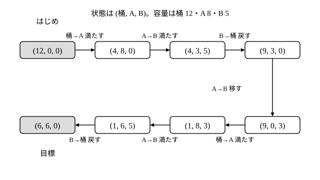

# L09 数学史の問題を状態でたどる——油分け算・河渡り・ハノイの塔

- unit_id: hs-math-a-math-and-human-activity
- 位置づけ: 単元第9レッスン（1.5時間）。「遊ぶ」ブロックの前半。江戸時代の算術書「塵劫記」に載る油分け算と同じ型の問題を、状態（3つの数の組）の移り変わりとして解き、L07 で学んだ不定方程式との関係と解の意味を考える。河渡りの問題とハノイの塔で「状態をたどる」「同じ形の小さい問題に戻す（再帰的な考え）」を経験し、L10（必勝法・パズル）へつなぐ。L08 の「位置を数の組で表す」見方をそのまま使う。
- distribution_status: published_draft
- license: CC-BY-4.0
- verify_required: 例題数値・記述は監修者検証必須。油分け算・河渡りの設定（容量・登場するもの）は本教材の自作で、古典の原題の数値・登場物ではない。
- 主概念: ①油分け算型の問題を「状態=(桶, 升1, 升2) という数の組」の移り変わりで解き、最短の手順を見つける ②手順と不定方程式の整数解の対応（負の解は戻す回数）・作れない量の説明・河渡りとハノイの塔の再帰的な考え

---

## 1. 既習の回収——「数の組で状態を書く」

L08 では、部屋の中の点の位置を (x, y, z) という3つの数の組で表した。数の組で表せるのは位置だけではない。「いま、桶（おけ）に 12 L、升（ます）A に 0 L、升 B に 0 L 入っている」という**状態**も、(12, 0, 0) という3つの数の組で書ける。状態を数の組で書いておくと、「どの操作でどの状態へ移るか」を漏れなく追えるようになる。状態をたどる道具はこれ1つである。§3 で方程式との関係を考えるときは、これに加えて L07 で学んだ一般解と「解なし」の条件を使う。

題材は数学史から取る。江戸時代に吉田光由（よしだみつよし）が著した「塵劫記」（じんこうき）には、決まった容量の桶と升だけを使い、目盛りなしに油を等分する問題（油分け算〔あぶらわけざん〕）が載っている。ここでは、それと同じ型の問題を、容量を変えた自作の設定で解く。

## 2. 油分け算を状態でたどる

**例題1** 12 L の桶に油がいっぱいに入っている。目盛りのない 8 L の升 A と 5 L の升 B がある。桶と升 A に 6 L ずつ油を分けたい。どうすればよいか。

できる操作は次の3種類だけである。

- 桶または升から升へ、受ける側の升がいっぱいになるまで注ぐ（**満たす**）。
- 升から桶へ、升が空になるまで戻す（**戻す**）。
- 升から升へ、注ぐ側が空になるまで移す（**移す**。受ける側が先にいっぱいになる場合は「満たす」と書く）。

状態を (桶, A, B) の順の数の組で書く。はじめは (12, 0, 0)、目標は (6, 6, 0) である。3つの数の和はいつも 12 のまま変わらない（油は増えも減りもしない）。この「和が 12」は、各行の検算に使える。

| 手 | 操作 | 状態 (桶, A, B) |
|---|---|---|
| 0 | はじめ | (12, 0, 0) |
| 1 | 桶から A を満たす | (4, 8, 0) |
| 2 | A から B を満たす | (4, 3, 5) |
| 3 | B を桶へ戻す | (9, 3, 0) |
| 4 | A から B へ移す（A が空になる） | (9, 0, 3) |
| 5 | 桶から A を満たす | (1, 8, 3) |
| 6 | A から B を満たす（B にはあと 2 L 入る） | (1, 6, 5) |
| 7 | B を桶へ戻す | (6, 6, 0) |

7手で目標の (6, 6, 0) に着いた。

検算: 各行の3つの数の和は 12、A の数は 0 以上 8 以下、B の数は 0 以上 5 以下になっている。手6で B に入る量は 5−3=2 で、A は 8−2=6 になる——数の組の変化が操作の規則どおりであることを、1行ずつ確かめられる ✓。

この手順が最短かどうかは、「はじめの状態から1手で行ける状態を全部書き出し、次にそこから2手で行ける状態を全部書き出し……」と広げていけば確かめられる。容量はどれも整数で、どの操作も升がいっぱいになるか空になるまで注ぐので、各容器の量はいつも整数のままである（2.5 L のような量は現れない）。だから状態の数は有限（桶は 0〜12、A は 0〜8、B は 0〜5 の整数で、和が 12 のもの）で、すでに書き出した状態をもう一度は書かないことにすれば、新しい状態が出なくなったところでこの作業は必ず終わる。実際に書き出すと（1手で行けるのは (4, 8, 0) と (7, 0, 5) の 2つ、…）、(6, 6, 0) に初めて届くのは7手目で、これより短い手順はない。

上の図のように、状態を点、操作を矢印で描いたものを、この教材では**状態遷移図**（じょうたいせんいず）と呼ぶ（表の形なら状態遷移表〔じょうたいせんいひょう〕）。図にすると、どの状態からどの状態へ移ったかが一望でき、行き止まりの枝まで描けば「同じ状態に戻ってきた」無駄な往復もひと目で見える（上の図は目標までの道筋だけを描いている）。

:::guide
**状態を数の組で書くと、何が良くなるのか**

言葉だけで「まず A をいっぱいにして、それを B に移して……」と追うと、途中で「いま桶にはいくら残っていたか」を忘れやすい。数の組 (桶, A, B) にしておけば、3つの量が常に目の前にあり、和が 12 であることで書き間違いも見つかる。もう1つの利点は、「あり得る状態は有限個」だと分かることだ。有限個なら全部調べられるので、「最短は何手か」「目標に着けない場合があるか」という問いに、勘でなく調べ尽くすことで答えられる。L08 で点の位置を数の組にしたのと同じ発想が、ここでは「操作の手順を数の組の列にする」形で働いている。
:::

## 3. 方程式との関係——解の意味を考える

例題1の7手を、操作の種類で数え直してみる。

- 「桶から A を満たす」は手1と手5の**2回**。桶から出た油は 8×2=16 L。
- 「B を桶へ戻す」は手3と手7の**2回**。桶へ戻った油は 5×2=10 L。
- 残りの手2・4・6は升の間の移動で、桶の量は変わらない。

桶の量は 12−16＋10=6 で、確かに 6 L になっている。つまりこの手順は、

8×2−5×2=6

という式に対応している。A を満たす回数を x、B を戻す回数を w とすると、桶から出入りした量の関係は 8x−5w=6。桶から出る向きを正、桶へ戻す向きを負と数え直して y=−w とおくと、L07 の形の **8x＋5y=6 の整数解 (x, y)=(2, −2)** にあたる。y が負なのは「戻す」向きの操作だからである。

L07 で学んだように、この方程式の整数解は1つではない。一般解は k を整数として x=2＋5k、y=−2−8k で、たとえば k=−1 のとき (x, y)=(−3, 6)。これは「A を桶へ3回戻し、B を桶から6回満たす」手順に対応し、実際にそのような手順も組める（ただし例題1の手順よりずっと長くなる）。**この 2つの整数解 (2, −2) と (−3, 6) には、どちらも油分けの実際の手順が対応している**——解説がこの題材で「方程式などを利用して解き、その解の意味を考え」ることを勧めるのは、この対応が見えるからだ。

**例題2** 目盛りのない 9 L の升と 6 L の升だけを使って、ちょうど 4 L を作ることはできるか（油は大きな桶からいくらでも汲め、桶へ戻すこともできるとする）。

どの操作でも、動く油の量は、注ぐ側に入っている量か、受ける側の空き（容量 9 L または 6 L から、入っている量を引いた差）のどちらかだから、2つの升の量がどちらも 3 の倍数なら、動かしたあとも 3 の倍数のままである。はじめは 2つとも空（0 L）なので、どの升に入っている量もいつも 3 の倍数（9 と 6 の最大公約数の倍数）に限られ、4 は 3 の倍数ではないから、**4 L はどんな手順でも作れない**。

これは L07 で学んだ結果（最大公約数が右辺を割らないとき解なし）そのものである。方程式が「解なし」と言えば、手順は絶対に存在しない。

:::guide
**「方程式に解がある」と「手順がある」の関係を正確に言う**

例題2のように、方程式に解が無ければ、どんな手順でも目標の量は作れない（左辺はいつも最大公約数の倍数だから）。ここは断言してよい。一方、方程式に解があるときは、例題1で確かめた 2つの解ではその回数どおりの手順を組めたが、桶の容量が足りないなどの事情で手順が組めないこともある。だから「解がある」と分かったあとは、例題1のように実際に状態をたどって手順を確かめる。まとめると、方程式は「できない」を言い切る道具として強く、「できる」は状態をたどって確かめる、という役割分担になる。負の解が「戻す回数」に対応することも含め、方程式の解を現実の操作に翻訳して読む——これが「解の意味を考える」ということである。
:::

## 4. 河渡りの問題——状態と「戻す」手

次も古くから知られる型の問題で、様々な時代や文化に応じた変種があると言われている。ここでは登場するものを自作の設定にする。

**例題3** 人が、犬・ウサギ・ニンジンの袋を連れて（持って）舟で川を渡りたい。舟は小さく、人のほかには1つしか乗せられない。人がそばにいないと、犬はウサギを追い回し、ウサギはニンジンを食べてしまう。どう渡ればよいか。

状態を「こちらの岸にいるもの ／ 向こうの岸にいるもの」で書く。はじめは「人・犬・ウサギ・ニンジン ／ なし」、目標は「なし ／ 人・犬・ウサギ・ニンジン」。避けなければならないのは、人のいない岸に「犬とウサギ」または「ウサギとニンジン」がそろう状態である。

最初の1手を考える。人が犬を運ぶと、こちらの岸にウサギとニンジンが残る（だめ）。ニンジンを運ぶと、犬とウサギが残る（だめ）。人だけ渡っても、3つ全部が残る（だめ）。よって**最初に運べるのはウサギだけ**である。このように、状態を書き出して禁止状態を除くと、各場面で選べる手は大きく絞られる。続きは練習の問4で完成させる。

ヒントを1つ。途中で「いったん向こうへ運んだものを、こちらへ連れ戻す」手が必要になる。目標から遠ざかるように見える手だが、状態遷移図で見れば、それは行き止まりを避けて別の道へ入るための前進である。

## 5. ハノイの塔——同じ形の小さい問題に戻す

3本の棒があり、1本目に大きさの違う円盤が、下から大きい順に積まれている。1回に1枚、いちばん上の円盤だけを別の棒へ動かせる。小さい円盤の上に、それより大きい円盤を置いてはいけない。すべての円盤を3本目の棒へ移すには、最も少なくて何回の移動が要るか。

- 円盤が1枚なら、1回。
- 2枚なら、小を2本目へ、大を3本目へ、小を3本目へ、で **3回**。
- 3枚なら、まず上の2枚を2本目へ移す（これは2枚の問題なので 3回）、次に大を3本目へ（1回）、最後に2本目の2枚を3本目へ（また2枚の問題なので 3回）。合わせて 3＋1＋3=**7回**。これより少なくはできない。どんな手順でも、いちばん大きい円盤を動かす前には上の2枚を別の1本の棒にまとめて移してあり（2枚の問題）、動かしたあとにもその2枚を大きい円盤の上へ移し直す（また2枚の問題）必要があるからだ。

3枚の問題を「2枚の問題を2回と、1回の移動」に分けたところが要点である。**大きい問題を、同じ形の小さい問題に戻して解く**——この考え方を**再帰的な考え**（さいきてきなかんがえ）という。4枚のときも同じ形で考えられる（stretch の S1）。

:::guide
**「戻す」「遠回り」に見える手を恐れない**

油分け算では升の油を桶へ戻し、河渡りでは運んだウサギを連れ戻し、ハノイの塔では動かした円盤を別の棒へ積み直す。どれも一見すると後退だが、状態を数の組や図で追っていれば、それが「別の状態への移動」にすぎず、目標へ近づく道の一部だと分かる。行き詰まったと感じたら、「いまの状態から行ける状態を全部書き出したか」を確かめる。後退に見える手を無意識に除いていることが、行き詰まりの原因として考えられる。
:::

:::zatsudan
油分け算は「塵劫記」に載っている問題として、河渡りの問題は「様々な時代や文化に応じた変種があると言われている」問題として、学習指導要領の解説に例示されている。どちらも、道具は桶と升、舟と乗せられる数、というごく日常的なものだ。数学の問題は必ずしも教室で生まれたわけではなく、生活の中の「分けたい」「渡りたい」から立ち上がってきたものと考えられている——そして河渡りのように、同じ型の問題が様々な時代や文化で遊ばれてきたと言われている。設定を変えた似た問題を自分で作ってみるのも、この題材の楽しみ方の1つである。
:::
<!-- zatsudan話題源: 高等学校学習指導要領解説 数学編（平成30年告示）「数学史的な話題」の段の逐語（執筆時内部調査で確認した範囲: 塵劫記・吉田光由・油分け算・河渡りの変種）。年代・原題の数値は書かない -->

## 6. 練習

設問に出る条件語を確かめてから解く。「満たす」は升がいっぱいになるまで注ぐ、「戻す」は升が空になるまで桶へ移す、「移す」は升から升へ、注ぐ側が空になるまで（受ける側が先にいっぱいになる場合は「満たす」）、の意味である。升には目盛りがなく、途中の量で止めることはできない。

**問1** 16 L の桶に油がいっぱいに入っている。目盛りのない 10 L の升 A と 6 L の升 B を使って、桶と升 A に 8 L ずつ分けたい。状態を (桶, A, B) で書いた表を作り、手順を示せ（7手でできる）。

**問2** 問1の 7手の手順（桶から A を満たすことから始めるもの）について、「桶から A を満たす」回数 x と「B を桶へ戻す」回数 w を数えよ。そして、桶の量の変化が 10x−6w=8 を満たすことを確かめ、これが（戻す向きを負に数えて y=−w とおき）10x＋6y=8 の整数解 (x, y) のどれにあたるかを答えよ。

**問3** 12 L の桶に油がいっぱいに入っており、目盛りのない 6 L の升と 4 L の升がある。どの容器にも、ちょうど 5 L の油を作ることはできない。その理由を2〜3文で説明せよ。

**問4** 例題3（人・犬・ウサギ・ニンジン）の河渡りを完成させよ。舟が川を渡る回数（舟が岸を離れるたびに 1回と数える）を数え、各回のあとの状態（こちらの岸 ／ 向こうの岸）を書け。また、途中でウサギを連れ戻す手が必要になる理由を1〜2文で説明せよ。

---

:::stretch
**S1** ハノイの塔で円盤が4枚のとき、最も少ない移動回数を求めよ。求め方は、§5 と同じように「上の3枚を移す・最大の1枚を移す・3枚を戻す」の3段に分けて説明せよ。また、1枚・2枚・3枚・4枚の回数の並びから、「1枚増えると回数がどう変わるか」の規則を言葉で述べよ。
:::

対応解答: answer_key_L08-10.md

<!-- gen_nav:nav:start（自動生成・手編集しない） -->

---

[← 前のレッスン](lesson_08.md)｜[単元の目次](README.md)｜[解答](answer_key_L08-10.md)｜[次のレッスン →](lesson_10.md)

<!-- gen_nav:nav:end -->
