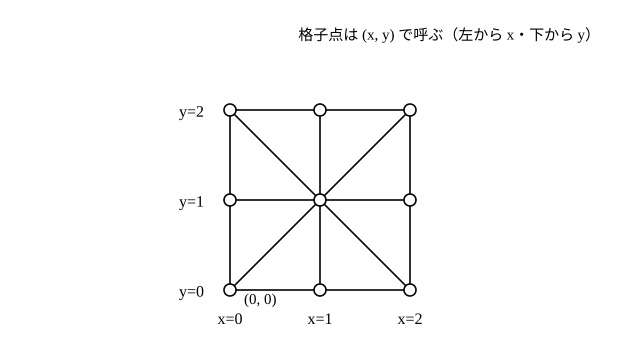
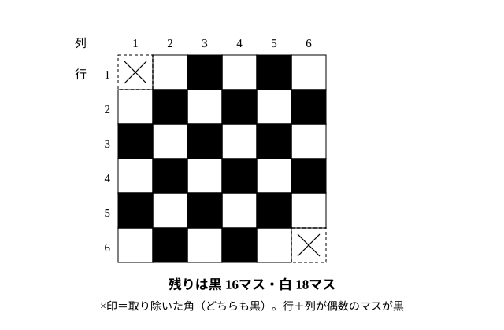

# L10 遊ぶ——ゲームの必勝法とパズルの論理

- unit_id: hs-math-a-math-and-human-activity
- 位置づけ: 単元第10レッスン（2時間）。「遊ぶ」ブロックの後半。世界各地にある三目並べと石取りゲームで「終わりから考える」「相手にどの状態を渡すか」を場合分けの木にまとめ、必勝法を根拠が伝わる形で表現する。敷き詰めパズルでは市松に塗る二値化で「できない」を言い切り、覆面算・ナンバープレイスでは数学Ⅰで学んだ背理法の考えを1マスの決定に使う（背理法の導入はしない）。L09 の状態遷移の見方を引き継ぎ、L11 のまとめへ。
- distribution_status: published_draft
- license: CC-BY-4.0
- verify_required: 例題数値・記述は監修者検証必須。盤面・石の個数・ボードの大きさと欠け位置・覆面算・ナンバープレイスの盤は本教材の自作。
- 主概念: ①ゲームの必勝法——終わりから考え、場合分けの木で「相手がどう応じても勝てる」ことを示す（三目並べ・石取りゲーム） ②パズルの「できない」と「決まる」——市松に塗る二値化（敷き詰め）と、仮定して矛盾を導く考え（覆面算・ナンバープレイス）

---

## 1. 既習の回収——状態に「相手」が加わる

L09 では、油分け算や河渡りの手順を「状態の移り変わり」として追った。動かすのは自分だけだった。ゲームでは、状態を動かす人がもう1人いる。自分が良い状態を作っても、相手がそれを崩しに来る。だから、ゲームで「勝てる」と言うには、「**相手がどう応じても**自分が勝つ手順がある」ことを示さなければならない。このレッスンでは、その示し方を、相手のあり得る手ごとに枝を分けて、どの枝でも自分が勝つことを書き出す**場合分けの木**（ばあいわけのき。この教材での呼び名）という形にまとめる。

題材の1つは三目並べである。三目並べは様々な国や地域にあり、学習指導要領の解説には、フィリピンのタパタン、ケニアのシシマが例として挙げられている。タパタンでは、2人がそれぞれ3個のコマを持ち、順に好きな格子点にコマを置いていく。置き終えたら、順に、自分のコマを線で結ばれた隣の格子点へ動かす（コマのある格子点へは動かせない）。自分のコマを一直線上に3つ並べた方が勝ちである。盤やコマのデザインは土地ごとに違うが、「3つ並べたら勝ち」というルールの骨格は共通している。

盤は、3×3 の格子点を縦・横・斜めの線で結んだものである。格子点は 9個、線は縦 3本・横 3本・斜め 2本の 8本。格子点の位置は、L08 の座標の考えを借りて、左から x=0, 1, 2、下から y=0, 1, 2 として (x, y) で呼ぶことにする。

## 2. 三目並べ——終わりから考え、場合分けの木で示す

ここでは、コマを動かす段階のない、最も簡単な形で考える。先手○（最初に印をつける人）と後手×（2番目に印をつける人）が、空いている格子点に順に印をつけ、縦・横・斜めのどれかに自分の印を3つ並べた方が勝ち、とする。なお、空の盤から始めて二人とも最善の手を選び続けると、どちらも3つ並べられずに引き分けになる（あり得る手を全部調べ尽くすと確かめられる）。三目並べで○の「必勝」が言えるのは、例題1のように途中の局面から考えるときの話である。

**例題1** 途中の局面。○が (0, 0) と (1, 1)、×が (2, 2) と (2, 1) に印をつけていて、次は○の番である。○が勝てる手はあるか。あるなら、×がどう応じても○が勝つことを、場合分けの木で示せ。

まず、相手の「次の1手で勝ち」を確かめる。×は (2, 2) と (2, 1) を持っていて、縦の線 x=2 の残り (2, 0) が空いている。○がここを止めなければ、×は次に (2, 0) に置いて勝つ。だから○の手は**ただ1つ、(2, 0) だけ**（他のどこに置いても、×が (2, 0) で勝つ）。

次に、○が (2, 0) に置いたあとの盤面を見る。○は (0, 0)、(1, 1)、(2, 0) を持つ。横の線 y=0 は (0, 0) と (2, 0) が○で、残り (1, 0) が空き。斜めの線 (2, 0)-(1, 1)-(0, 2) は (2, 0) と (1, 1) が○で、残り (0, 2) が空き。つまり○は**2か所同時に**「あと1つで3つ並ぶ」状態を作った。×は1手で1か所しか止められない。

場合分けの木に書く。

- ○が (2, 0) に置く。
  - ×が (1, 0) を止める → ○が (0, 2) に置き、斜めに3つ並んで○の勝ち。
  - ×が (0, 2) を止める → ○が (1, 0) に置き、横に3つ並んで○の勝ち。
  - ×がそれ以外に置く → ○は (1, 0) か (0, 2) のどちらかに置き、3つ並んで○の勝ち。

×の手を3つの枝にすべて分け、どの枝でも○が勝つ。したがって○は**必勝**である。

検算: ×の可能な手は、空いている格子点 (0, 1)、(0, 2)、(1, 0)、(1, 2) の4つ。上の木では (1, 0)、(0, 2) を個別に、(0, 1) と (1, 2) を「それ以外」にまとめており、4つすべてを尽くしている ✓。

:::guide
**「終わりから考える」と「相手の手をすべて尽くす」**

必勝法を探すときの手順は2段である。第1段は終わりから考える——「勝ち」の形（3つ並ぶ）から1手前を見て、「次の1手で勝てる状態」「相手が次の1手で勝ってしまう状態」を先に確かめる。例題1で最初に×の (2, 0) を見たのはこのためで、この確認を飛ばすと、自分の攻めに気を取られて相手の勝ちを見落とす。第2段は、相手のあり得る手を全部枝に分ける。1本の枝だけを示して「こうすれば勝てる」と言うのは根拠にならない——相手はその枝を選ばないかもしれないからだ。「それ以外」とまとめてよいのは、その枝のどの手でも同じ理由で勝てるときだけである。場合分けの木は、この2段を人に見える形にしたもので、根拠が伝わる表現とは、枝が漏れていないことを読む人が確かめられる表現のことだ。
:::

## 3. 石取りゲーム——相手に渡す状態を決める

石が何個か積まれている。2人が交互に、1個以上3個以下の石を取る。最後の石を取った人が勝ちとする。

このゲームも終わりから考える。自分の番で残りが 1個・2個・3個なら、全部取って勝ち。残りが 4個なら、1〜3個のどれを取っても相手に 3〜1個が残り、相手が全部取って勝つ——つまり**残り 4個を渡されたら負け**である（この節の「勝ち」「負け」は、どちらも相手が最善の手を選び続けるときの判定である。相手が間違えれば結果は変わるが、それは当てにしない）。逆に残りが 5・6・7個なら、4個残るように取れば、相手に「渡されたら負け」の状態を渡せる。残り 8個なら、どう取っても相手に 5〜7個が残り、相手が 4個にして返してくる。

| 自分の番での残り | 1 | 2 | 3 | 4 | 5 | 6 | 7 | 8 | 9 | 10 | 11 | 12 |
|---|---|---|---|---|---|---|---|---|---|---|---|---|
| 勝ち／負け | 勝 | 勝 | 勝 | 負 | 勝 | 勝 | 勝 | 負 | 勝 | 勝 | 勝 | 負 |

「渡されたら負け」は 4 の倍数、つまり**4 で割った余りが 0** の個数である。L05 で学んだ「余りで分ける」考えが、そのまま勝ち負けの分け方になっている。

**例題2** 石が 11個ある。先手はどう取れば必勝か。取ったあとの方針も述べよ。

11 を 4 で割った余りは 3。先手は **3個**取って残りを 8個（4 の倍数）にする。以後、相手が k 個（k=1, 2, 3）取ったら、自分は 4−k 個取り、残りを再び 4 の倍数にする。残りは 8→4→0 と減り、最後の石を取るのは必ず自分である。

検算: 相手が 8個から 2個取れば 6個。自分が 2個取って 4個。相手が 3個取れば 1個。自分が 1個取って 0個——最後は自分。相手の取り方を変えても、「4−k 個」の規則で残りが 4 の倍数に戻る ✓。

:::guide
**勝ち負けは「自分の手」でなく「相手に渡す状態」で決まる**

石取りゲームで学ぶ最大のことは、「自分が何個取るか」を直接考えるより、「相手に何個渡すか」を考える方が見通しがよい、という発想の転換である。渡されたら負けの状態（4 の倍数）を先に見つけておけば、自分の手は「そこへ戻す」の一言で決まる。三目並べの例題1でも、○の勝ちを決めたのは「×に、2か所同時に止めなければならない状態を渡した」ことだった。ゲームの必勝法とは、相手のどの手に対しても自分の次の手が決まっていて、最後に自分が勝つ手順のことである。相手に渡す状態の一覧表は、この石取りゲームでその手順を見つける手掛かりになる。石取りゲームの取れる個数を 1〜4 に変えると、渡されたら負けの状態も変わる。条件を変えたとき表がどう変わるかを自分で作り直すのが、この考え方を身につける近道だ（練習の問3）。
:::

## 4. 敷き詰めパズル——市松に塗る（二値化）

**例題3** 縦 6マス・横 6マスのボード（36マス）から、向かい合う2つの角のマスを取り除いた 34マスのボードがある。ここに、2マス分の大きさのタイル（1×2）を 17枚、重ねずにすきまなく敷き詰めることはできるか。

実際に置いてみると、途中でどこにも置けなくなるか、16枚置けたとしても最後に離れた2マスが残る。しかし「うまくいかなかった」だけでは「できない」の証明にならない。置き方は膨大にあり、手で全部を試すのは現実的でないからだ。

そこで、ボードのマスを、隣り合うマスが違う色になるように黒と白の2色に塗る（市松〔いちまつ〕模様）。6×6 のボードなら黒 18マス・白 18マス。マスの位置を (行, 列)（上から何行目・左から何列目。どちらも 1 から数え、三目並べの (x, y) とは順序も始まりも違う）で表すと、行と列の番号の和が偶数のマスが黒、奇数のマスが白、と決めてよい。取り除いた2つの角 (1, 1) と (6, 6) は、和がそれぞれ 2 と 12 でどちらも偶数、つまり同じ色（**黒**）である。残ったボードは黒 **16** マス・白 **18** マスになる。

一方、1×2 のタイルは、どこに置いても隣り合う2マスを覆うから、**必ず黒 1マスと白 1マス**を覆う。17枚を敷き詰められたとすると、黒 17マス・白 17マスを覆うことになる。しかし黒は 16マスしかない。矛盾。したがって、**敷き詰めることはできない**。

マスを「黒か白か」の2種類に分けたことで、膨大な数の置き方を調べ尽くさずに「できない」を言い切れた。このように、対象を2種類に分けて数を比べる考え方を**二値化**（にちか）という。

ただし、黒と白の数が合っているからといって、必ず敷き詰められるとは限らない。数が合うことは「できる」ための必要な条件であって、それだけで「できる」が保証されるわけではない。たとえば 5×5 のボードから中央の1マスを除いた 24マスは黒 12・白 12 で、外側の 16マスの輪と内側の 8マスの輪に分けてそれぞれ順に置けば実際に敷き詰められるが、それは置いて見せたから「できる」と言えるのである。

:::guide
**「できない」を言い切る道具——どんな置き方でも変わらない量を見つける**

例題3の論法の芯は、「タイルをどこに置いても、黒 1・白 1 を覆う」という、置き方に関係なく保たれる性質である。この性質があるので、置き方をいちいち調べる必要がなくなり、「黒と白の数の差」という1つの数だけを比べればよくなる。L07 で「左辺はいつも最大公約数の倍数だから、右辺がその倍数でなければ解なし」と説明したのも、L09 で「どの升に入っている量も 3 の倍数だから 4 L は作れない」と説明したのも、同じ形をしている——どの操作をしても保たれる量を見つけ、目標がそれに合わないことを示す。「できない」の説明に行き詰まったら、「何が変わらないか」を探すとよい。
:::

## 5. 覆面算とナンバープレイス——仮定して矛盾を導く

覆面算（ふくめんざん）は、数字を文字で隠した計算式で、同じ文字は同じ数字、違う文字は違う数字を表す。

**例題4** 次の覆面算で、C と D の数字を求めよ。A・B・C は 0 ではなく、4つの文字はすべて異なる数字を表す。

AB＋BA=CDC（AB は十の位が A、一の位が B の2桁の数を表す）

仮に C が 2 以上だとすると、右辺 CDC は 200 以上である。しかし左辺は2桁の数どうしの和で、最大でも 99＋98=197 にしかならない。200 以上にはなり得ないので、矛盾。したがって **C=1** である。

一の位を見ると、B＋A の一の位が C=1 だから、A＋B は 1 か 11。A と B は 0 でない異なる数字なので A＋B は 3 以上、よって **A＋B=11** で、十の位へ 1 繰り上がる。十の位は A＋B＋1=12 だから、一の位の 2 を書いて **D=2**、百の位へ 1 繰り上がる。百の位は 1 で、C=1 と一致する。

答えは C=1、D=2。A と B は和が 11 になる異なる数字の組ならどれでもよいが、2 と 9 の組は D=2 と重なるので除く（残るのは 3 と 8、4 と 7、5 と 6 と、その入れ替えの 6 通り）。たとえば 38＋83=121 で確かめられる。

「仮に C が 2 以上だとすると……矛盾。だから C=1」——これは数学Ⅰの「集合と命題」で学ぶ（または学んだ）背理法と同じ形の考え方である。ここでは定理の証明ではなく、1つの文字の値を決めるために使っている。

**例題5** 次の 4×4 のナンバープレイスを解け。ルールは、各行・各列・太線で区切った 2×2 のブロックのそれぞれに 1〜4 の数字が1つずつ入ること。

| 1 | ・ | ・ | 4 |
|---|---|---|---|
| ・ | 4 | 1 | 2 |
| ・ | 1 | 4 | ・ |
| 4 | ・ | ・ | 1 |

（ブロックは、上2行と下2行、左2列と右2列で区切られている。「・」が空きマス。）

2行目は 4・1・2 が入っているので、空きマスは **3** に決まる。次に1行目の左から2番目のマス。1行目に 1 と 4、2列目に 4 と 1 があるので、候補は 2 か 3。ここで仮に 3 だとすると、左上のブロック（1行目・2行目の左2列）には、いま決めた2行目の 3 とこのマスの 3 で、3 が2つ入ることになり、ルールに反する。矛盾。したがってこのマスは **2** で、1行目は 1・2・3・4 となる。3行目の左端は、1列目に 1・3・4 があるので 2、3行目の右端は残りの 3。4行目は、2列目に 2・4・1 があるので左から2番目が 3、残りの 2 が左から3番目に入る。

| 1 | 2 | 3 | 4 |
|---|---|---|---|
| 3 | 4 | 1 | 2 |
| 2 | 1 | 4 | 3 |
| 4 | 3 | 2 | 1 |

検算: 各行・各列・各ブロックに 1〜4 がちょうど1回ずつ現れている ✓。

:::guide
**「仮に〜とすると矛盾する」の言い方を、1マスの決定に使う**

数学Ⅰの背理法は、「結論を否定して仮定すると矛盾が出るから、結論は正しい」という証明の形である。覆面算やナンバープレイスで使うのも同じ形だが、対象は「このマスに 3 は入らない」というごく小さな主張である。矛盾は「同じブロックに同じ数字が2つ」「和が 200 以上になる」のようにルール違反として目に見えるので、抽象的に感じた背理法の形を、手で確かめられる場面で練習できる。ここで身につけるのは、「候補を1つ仮に入れてみて、その仮定とすでに決まった条件からルール違反が出るなら消す」という手つきであり、候補が2つなら片方を消せばもう片方に決まる。パズルの背景に背理法の考えがある、というのはこの意味である。
:::

:::zatsudan
三目並べの盤とコマは、フィリピンのタパタン、ケニアのシシマのように、土地ごとにデザインや設定が違う。それでも「3つ並べたら勝ち」という骨格は共通している。学習指導要領の解説はこの点を、ゲーム盤やコマのデザインには文化的な差異が見られる一方で、ルールには共通性が見られる、と述べている。遠く離れた土地で同じ骨格の遊びが遊ばれてきたことは、遊びの中の数学が文化を越えて共有されるものだということをうかがわせる。
:::
<!-- zatsudan話題源: 高等学校学習指導要領解説 数学編（平成30年告示）「数理的なゲームやパズル」の段の逐語（執筆時内部調査で確認した範囲: タパタン〔フィリピン〕・シシマ〔ケニア〕・デザインの差異とルールの共通性）。年代・由来は書かない -->

## 6. 練習

設問に出る条件語を確かめてから解く。「先手」は最初に手を打つ人、「取れる個数」は1回の手番で取ってよい石の個数の範囲、「異なる数字」は違う文字は違う数字、「向かい合う角」はボードの対角にある2つの角、の意味である。三目並べの格子点は §1 の座標 (x, y) で呼ぶ。

**問1** 三目並べ（例題1と同じルール）の途中の局面。○が (0, 0) と (0, 2)、×が (0, 1) と (2, 0) に印をつけていて、次は○の番である。×がどう応じても○が勝てる手を1つ見つけ、場合分けの木で示せ。×の手を漏れなく分けること。

**問2** 石取りゲーム（1〜3個取れる・最後の石を取った人が勝ち）で、石が 14個ある。先手はまず何個取ればよいか。また、その後の方針を1〜2文で述べよ。

**問3** 石取りゲームの条件を「1〜4個取れる」に変え、石を 15個にした。このとき、先手にはどう取っても必勝になる手がない。その理由を、「渡されたら負けの状態」を使って2〜3文で説明せよ。

**問4** 縦 5マス・横 6マスのボード（30マス）から、(1, 1) と (3, 3) の2マス（(行, 列) で数える）を取り除いた 28マスのボードがある。1×2 のタイル 14枚で敷き詰めることはできるか。理由をつけて答えよ。

**問5** 次の覆面算を解け。A・B は 1〜9 の異なる数字を表す。

AB＋B=BA（AB・BA はそれぞれ2桁の数）

ヒント: 位取りの式で書き、L04 §3 の性質「a と b が互いに素で ak が b の倍数なら k は b の倍数」を使うと A が決まる。

---

:::stretch
**S1** 1〜9 の数字を 3×3 のマスに1つずつ入れ、縦 3列・横 3行・斜め 2本の合計がすべて等しくなるように並べたものを魔方陣（まほうじん）という。
(1) 1つの列（行）の合計はいくらか。1〜9 の総和から求めよ。
(2) 中央のマスに入る数は 5 に限られる。中央を通る 4本の線（横 1・縦 1・斜め 2）の合計を足し合わせる、という方法で説明せよ（中央のマスは 4本すべてに、他のマスは 1本だけに含まれる）。
:::

対応解答: answer_key_L08-10.md

<!-- gen_nav:nav:start（自動生成・手編集しない） -->

---

[← 前のレッスン](lesson_09.md)｜[単元の目次](README.md)｜[解答](answer_key_L08-10.md)｜[次のレッスン →](lesson_11.md)

<!-- gen_nav:nav:end -->
