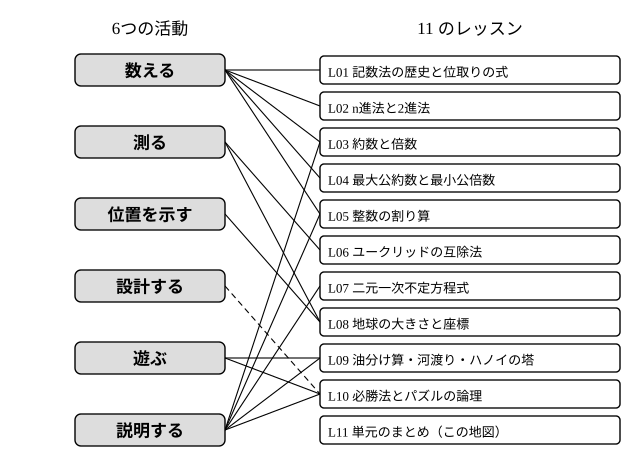

# L11 単元のまとめ——数える・測る・位置を示す・遊ぶ

- unit_id: hs-math-a-math-and-human-activity
- 位置づけ: 単元第11レッスン（1時間）。L01〜L10 の総括回。**新しい概念・新しい用語は立てない**。数学の起源にかかわる6つの活動（数える・測る・位置を示す・設計する・遊ぶ・説明する）と各レッスンの対応を1枚の地図にし、ブロックごとに1問ずつの総合演習で道具を確かめ、後続の科目への境界を示す。
- distribution_status: published_draft
- license: CC-BY-4.0
- verify_required: 例題数値・記述は監修者検証必須。後続科目への予告文は監修者の確認を要する。
- 主概念: ①6つの活動と本単元の11レッスンの1枚地図（どの活動にどの道具を使ったか） ②数学Ⅱ・数学B・数学C・情報Ⅰへの予告と、本単元で「使うだけ」にした数学Ⅰ既習の境界

---

## 1. 6つの活動と11のレッスン——1枚の地図

学習指導要領の解説は、数学の起源にかかわる人間の活動として「数える、測る、位置を示す、設計する、遊ぶ、説明する」の6つを挙げている。この単元の11レッスンを、その6つに並べ直してみる。

| 活動 | レッスン | そこで使った主な道具 |
|---|---|---|
| 数える | L01 記数法の歴史と位取りの式／L02 n進法と2進法 | 位取りの式・割り算の連鎖（余りを下から読む） |
| 数える（整数の仕組み） | L03 約数と倍数／L04 最大公約数と最小公倍数／L05 整数の割り算 | 素因数分解・周期の一致・a=bq＋r と余りで分けること |
| 測る | L06 ユークリッドの互除法／L08 前半 地球を測る | 長方形の正方形分割・平行光線と中心角・三角比 |
| 位置を示す | L08 後半 空間の座標 | 3本の数直線と3つの数の組 |
| 設計する | （独立のレッスンは置いていない。L10 のパズルで、条件に合う配置を作る場面がその入口） | （L10 の二値化。魔方陣は L10 の発展問題 S1） |
| 遊ぶ | L09 油分け算・河渡り・ハノイの塔／L10 必勝法とパズル | 状態遷移・場合分けの木・二値化 |
| 説明する | L03 判定法／L05 余り／L07 解なし／L09 作れない量／L10 できない | 位取りの式・余り・「保たれる量」・仮定して矛盾を導く |

「説明する」がいくつものレッスンに散らばっているのは偶然ではない。この単元でいちばん難しいと見込んで作ったのは、計算の手順ではなく「解がない」「作れない」「敷き詰められない」を人に伝わる形で説明する段である。L07 の不定方程式で「左辺はいつも最大公約数の倍数」と言ったこと、L09 で「どの升に入っている量も 3 の倍数」と言ったこと、L10 で「タイルは必ず黒 1・白 1 を覆う」と言ったことは、すべて同じ型——**どの操作をしても保たれる量を見つけ、目標がそれに合わないことを示す**——である。

:::guide
**地図の読み方——どのレッスンからでも入り直せる**

この単元のレッスンは、整数ブロック（L03〜L07 の順序）と、遊びのブロックが整数ブロックの結果を引く箇所（L09 §3 の不定方程式・L10 問5 の互いに素）を除いて、互いにほぼ独立に作られている。だから復習は、上の表の「活動」の列から気になるものを1つ選び、そのレッスンだけを開けばよい。たとえば「位置を示す」の座標をもう一度見たいなら L08 の §3〜§4 だけで足りるし、ゲームの必勝法なら L10 の §1〜§3 で閉じている（三目並べの盤と座標の約束は §1 にある）。逆に、不定方程式（L07）がつまずいたままなら、L06 の互除法、さらに L05 の割り算の等式へ戻る順路が決まっている。「全部を最初からやり直す」必要はない。この単元はどこからでも入り直せるように作られているので、地図の中で自分の入口を決めてよい。
:::

## 2. ブロックごとの「型」の一覧

総合演習の前に、各ブロックで身につけた型を1行ずつ確かめる。ここに新しいことは1つもない。

- **n進法と10進法の往復**（L02）: n進法→10進法は位取りの式（各桁×n の累乗の和）、10進法→n進法は n で割り続けて余りを下から読む。k 桁で表せる数は 0 から nᵏ−1 までの nᵏ 通り。
- **互除法から不定方程式へ**（L06〜L07）: a を b で割った余りを r とすると、a と b の最大公約数は b と r の最大公約数に等しい。割り切れるまで続けた最後の割る数が最大公約数。その各行を逆にたどれば ax＋by=（最大公約数）の整数解が1つ作れ、一般解は k を整数として x=x₀＋bk、y=y₀−ak（a, b は互いに素にしてから）。右辺が最大公約数の倍数でなければ解なし。
- **空間の座標**（L08）: 原点で直交する3本の数直線を決め、点の位置を (x, y, z) の3つの数の組で表す。組は順序つき。
- **必勝法と「できない」の説明**（L09〜L10）: 状態を数の組で書いてたどる。相手のいるゲームでは、終わりから考え、相手の手を場合分けの木で尽くす。「できない」は、どの操作でも保たれる量（余り・黒と白の数の差）で示す。

## 3. 後続の科目への予告と境界

この単元で扱ったのは、いずれも入口までである。続きがどの科目にあるかを記しておく。

- **数学Ⅱ「図形と方程式」**: 座標平面の上で、直線や円を式で表し、2点間の距離を計算する。本単元の座標は「点の位置を数の組で表す」ところまでで、点と点の距離や図形の式は扱っていない。
- **数学B「数列」**: 数学的帰納法。ハノイの塔の回数の並び 1、3、7、15 から予想できる「n 枚なら、2 を n 回掛けて 1 を引いた数」という式を、どんな枚数でも成り立つと証明する道具はここにある。本単元では「1枚増えると回数が2倍＋1になる」規則を見つけ、その理由を説明するまでにとどめた。
- **数学C「ベクトル」**: 空間の座標を成分として、向きと大きさを持つ量の計算に使う。本単元は3つの数の組で位置を表すところまで。
- **情報Ⅰ**: コンピュータの中で情報がどう表されるかを学ぶ場面で、2進法が再び現れる。L02 で学んだ変換はそこでの土台になる。
- **数学Ⅰの既習を使っただけの箇所**: 三角比（L08 の測量）、背理法の考え（L10 の覆面算・ナンバープレイス）、循環小数（L01）、1辺 1 の正方形の対角線が分数で表せないこと（L06）は、いずれも導入は数学Ⅰの側にあり、本単元では道具として使うだけにした。証明や定義の確認が必要なら、数学Ⅰの「数と式」「集合と命題」「図形と計量」に戻る。

:::guide
**「説明する」の型を、言葉として持っておく**

この単元でいちばん難しいと見込んだ「解がない」「できない」の説明は、次の3つの言い方のどれかに落ちることが多い。①「左辺（または作れる量）はいつも〜の倍数だが、右辺（目標）はそうでない」（L07・L09）。②「どの置き方でも黒 1・白 1 を覆うが、黒と白の数が違う」（L10）。③「仮に〜だとすると、あり得ないことになる（和が 200 以上になる・同じブロックに同じ数字が2つ入る）」（L10 の覆面算・ナンバープレイス）。①と②は「保たれる量」の型、③は「仮定して矛盾」の型である。説明の問題で何を書けばよいか分からなくなったら、この3つのどれに当たるかを先に決め、その型の言葉で書き始めるとよい。型を選んだあとに埋めるのは、「何が保たれるか」「何を仮定するか」の中身だけである。
:::

:::zatsudan
人間を「遊ぶ人」を意味するホモ・ルーデンスという言葉で規定することがある、と学習指導要領の解説は述べ、遊びは人間の活動の本質的なものであり、文化を生み出す源である、と続けている。この単元の後半で扱った三目並べ・石取りゲーム・油分け算・敷き詰めは、どれも「遊び」として親しまれてきたものだった。そこに必勝法や「できない」の説明を求めた瞬間に、遊びは数学の問題になる。逆に言えば、数学の問題の多くは、もとは誰かの遊びだったのかもしれない。
:::
<!-- zatsudan話題源: 高等学校学習指導要領解説 数学編（平成30年告示）「ア(イ)」の段の逐語（執筆時内部調査で確認した範囲: ホモ・ルーデンス、つまり「遊ぶ人」・遊びは文化を生み出す源）。提唱者名・年代は書かない -->

## 4. 練習

各ブロックから1問ずつ。設問に出る条件語（「整数解」「互いに素」「向かい合う角」「軸に沿って」）の意味は、それぞれのレッスンで確かめたとおりである。

**問1** 次の問いに答えよ。
(1) 45 を 2進法と 5進法で表せ。
(2) 10110₍₂₎ を 10進法で表せ。
(3) 5進法で、3つの桁を使って 000₍₅₎ から 444₍₅₎ までを書くとき、表せる数は 10進法で 0 から何までか。また、それは何通りか。

**問2** 次の問いに答えよ。
(1) 51 と 21 の最大公約数を、互除法で求めよ。各行を a=bq＋r の形で書くこと。
(2) 51x＋21y=6 の整数解を1つ求め、一般解を k を整数として表せ（係数を最大公約数で割ってから。特殊解はどれから始めてもよい）。
(3) 51x＋21y=5 に整数解がない理由を、1〜2文で説明せよ。

**問3** 床が x 軸方向に 4 m・y 軸方向に 3 m、高さ 2.5 m の部屋で、床の1つの角を原点 O、壁に沿う向きを x 軸・y 軸、真上を z 軸とする（単位 m）。
(1) 原点 O と向かい合う、天井の角の座標を答えよ。
(2) 点 (2, 1, 0) と点 (2, 1, 2.5) は、部屋のどこにある点か。言葉で説明せよ。

**問4** 縦 4マス・横 4マスのボード（16マス）から、向かい合う2つの角のマスを取り除いた 14マスのボードは、1×2 のタイル 7枚で敷き詰めることができない。その理由を2〜3文で説明せよ。

---

:::stretch
**S1** 20 L の桶に油がいっぱいに入っており、目盛りのない 12 L の升と 8 L の升がある。
(1) ちょうど 10 L の油をどの容器にも作れないことを、理由をつけて説明せよ。
(2) この道具で作ることができる油の量（0 L と 20 L を含む）をすべて挙げよ（挙げた量が実際に作れることを、状態の列で確かめよ）。
:::

対応解答: answer_key_L11.md

<!-- gen_nav:nav:start（自動生成・手編集しない） -->

---

[← 前のレッスン](lesson_10.md)｜[単元の目次](README.md)｜[解答](answer_key_L11.md)

<!-- gen_nav:nav:end -->
