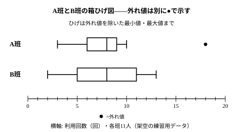

# L01 中学の道具を棚卸しする——代表値・四分位範囲・箱ひげ図と「外れ値」

- unit_id: hs-math-i-data-analysis
- 位置づけ: 単元第1レッスン（1時間）。中学で学んだ道具（代表値・範囲・四分位数・四分位範囲・箱ひげ図）を、1組の自作データで高校の言葉に並べ直す回。新しく入るのは「外れ値」の正式な線引きと、「異常値」との区別。L02（分散・標準偏差）で「散らばりを1つの数にする」ための土台になる。
- distribution_status: published_draft
- license: CC-BY-4.0
- verify_required: 例題数値・記述は監修者検証必須。
- 主概念: ①代表値・範囲・四分位数（中2の方式を踏襲）・箱ひげ図の読み ②外れ値の正式導入（四分位範囲の1.5倍）と「異常値」との区別

---

## 1. 代表値だけでは分布は語れない——2つの班のデータ

この単元「データの分析」では、データの**散らばり**を数で表す道具（分散・標準偏差）と、2つの量の**関係**を数で表す道具（相関係数）を手に入れ、最後に「この結果は偶然で説明できるか」を実験で判断する考え方（仮説検定の考え方）まで進む。その前に、中学までの道具を1枚に並べ直しておこう。この回で新しく学ぶことは1つだけ——「外れ値」の線引きである。中学で見ていない道具があっても、この回の手順（§2〜§3）から読めば足りる。

次の表は、ある高校の2つの班（各11人）が、先月1か月間に図書室を利用した回数（回）を小さい順に並べたものである（架空のデータ）。

| 班 | 利用回数（回・小さい順） |
|---|---|
| A班 | 3, 5, 6, 6, 7, 8, 8, 8, 9, 10, 18 |
| B班 | 2, 4, 5, 6, 8, 8, 9, 10, 11, 12, 13 |

まず、中1で学んだ代表値を求める。この教材では、**平均値を m と書く**（教科書では x の上に線を引いた記号を使う。この教材では画面での表示の都合で m と書くが、意味は同じである）。

- 平均値 m: A班は合計 88、11人だから m=88/11=8。B班も合計 88 で m=8。
- 中央値: 11個の真ん中は6番目。A班は 8、B班も 8。
- 最頻値: A班は 8（3回）、B班も 8（2回）。

代表値は3つとも、両班で完全に同じ値になった。では2つの班は「同じような分布」だろうか。表を見直せば、そうではないと分かる。B班は 2 から 13 までまんべんなく散らばり、A班は、3 の1人を除けば 5〜10 に固まっていて、1人だけ 18 という大きな値がある。**代表値は分布の「真ん中らへん」を1つの数に縮めたもので、散らばりの情報は含んでいない**。散らばりを語るには、別の道具が要る。

中1の道具の1つが**範囲**（最大値−最小値）だった。A班は 18−3=15、B班は 13−2=11。範囲だけを見ると「A班の方が散らばっている」ことになるが、A班のほとんどの人は狭い幅に固まっている。範囲は両端の2つの値だけで決まるので、18 のような1つの値に引きずられるのだ。この弱点を補うのが、中2で学んだ四分位範囲である。

## 2. 四分位数と四分位範囲——中2の方式をそのまま使う

四分位数の求め方は、中学の教材で採用した方式をそのまま使う。求め方が複数あることは中2で触れたが、この教材では次の1方式で統一し、解答もこの方式で検算する。

1. データを小さい順に並べ、個数を数える。
2. 中央値（第2四分位数）で前半と後半に分ける。**データが奇数個のときは、真ん中の値=中央値を前半にも後半にも入れない**。**偶数個のときは、真ん中で半分ずつに分ける**（前半・後半とも同じ個数）。
3. 前半の中央値が**第1四分位数**、後半の中央値が**第3四分位数**。

第1・第2・第3四分位数は、慣用的に Q1・Q2・Q3 と略記される（Q は英語の quartile の頭文字）。この教材でも計算の途中では Q1・Q3 と書くが、答案では正式な名前で書くのが安全だ。

**例題1** A班・B班の第1四分位数・第3四分位数・四分位範囲を求めよ。

A班（11個・奇数個）。中央値は6番目の 8。これを除いて、前半は 3, 5, 6, 6, 7 の5個で中央値は3番目の 6、後半は 8, 8, 9, 10, 18 の5個で中央値は 9。よって Q1=6、Q3=9、四分位範囲は 9−6=3。

B班。中央値は6番目の 8。前半 2, 4, 5, 6, 8 の中央値は 5、後半 9, 10, 11, 12, 13 の中央値は 11。よって Q1=5、Q3=11、四分位範囲は 11−5=6。

検算として、区切りの外側にある値を数える（中2で身につけた「求めたら、数えて確かめる」の型）。A班なら、Q1=6 より小さい値は 3, 5 の2個、Q3=9 より大きい値は 10, 18 の2個——どちらも11個の約4分の1（11÷4=2.75 なので 2〜3個。区切りの値と等しい値は数えない）で、区切りが「四つに等しく分ける」位置に来ていることが確かめられる。B班も、5 より小さい値は 2, 4 の2個、11 より大きい値は 12, 13 の2個で同じく約4分の1である。ただし、区切りの値と同じ値がほかにもあるデータでは、区切りの外側の個数が約4分の1にならない（2つの区切りの間に入る個数も約半数にならない）ことがある。そのときは個数で確かめる代わりに、手順2・3の分け方をたどり直して確かめる。

こうして2つの物差しが出そろった。

| | 範囲 | 四分位範囲 |
|---|---|---|
| A班 | 15 | 3 |
| B班 | 11 | 6 |

範囲では A班の方が大きく、四分位範囲では B班の方が大きい。**範囲は両端の2つの値で決まり、四分位範囲は真ん中の約半数の幅で決まる**——だから、18 のような1つのかけ離れた値があると、範囲は激変するのに四分位範囲はほとんど動かない（中学で学んだ性質で、この教材の中学版では「1個だけ差し替える実験」で確かめた）。A班の「真ん中の約半数」は 6〜9 の狭い幅に収まっていて、散らばりが小さい班なのである。

:::guide
**「範囲」と「四分位範囲」を取り違えないために**

どちらも「〜範囲」と付くので、名前だけ覚えると混ざる。区別の要は「誰が決めるか」だ。範囲を決めるのは最大値と最小値の**2人だけ**で、その2人以外は何をしていても範囲に影響しない。四分位範囲を決めるのは第3四分位数と第1四分位数、つまり「上から4分の1の位置」と「下から4分の1の位置」の人で、両端の人がどれだけ極端な値でも、順位が変わらない限り区切りの位置は動かない。だから、範囲が大きいのに四分位範囲が小さいデータ（A班）は珍しくない。「散らばりが大きい」と言いたくなったら、どちらの物差しで言っているのかを毎回添える習慣をつけよう。
:::

## 3. 箱ひげ図と「外れ値」——四分位範囲の1.5倍という線

5つの値（最小値・第1四分位数・中央値・第3四分位数・最大値）を1本の図にしたものが箱ひげ図だった。箱は第1四分位数から第3四分位数まで（真ん中の約半数が入る）、箱の中の線が中央値、ひげの先が最小値と最大値である。

A班の箱ひげ図をかくと、箱は 6〜9 の短い箱なのに、右のひげが 18 まで長く伸びる。この 18 は、他の値から極端にかけ離れている。こうした値を**外れ値**という。中学では「極端にかけ離れた値」と言葉で扱うだけで、どこからを外れ値とするかの線引きはしなかった。高校では、四分位範囲を物差しにした次の基準を使う（教科書で広く使われる基準で、学習指導要領の解説も「通常」この基準を挙げている）。

> **外れ値の基準**: 第1四分位数−1.5×四分位範囲 **未満**の値、または、第3四分位数＋1.5×四分位範囲 **超**の値を外れ値とする。

つまり、箱の両端から「箱の長さの1.5倍」だけ外側に線を引き、その線の外にある値が外れ値である。線の上にちょうど乗る値（等しい値）は外れ値としない。

**例題2** A班・B班のデータに外れ値があるか調べよ。

A班。Q1=6、Q3=9、四分位範囲 3 だから、1.5×3=4.5。下の線は 6−4.5=1.5、上の線は 9＋4.5=13.5。1.5 未満の値はなく、13.5 超の値は 18 の1つ。よって **A班の外れ値は 18** である。

B班。Q1=5、Q3=11、四分位範囲 6 だから、1.5×6=9。下の線は 5−9=−4、上の線は 11＋9=20。−4 未満の値も 20 超の値もないので、**B班に外れ値はない**。（回数は 0 以上なので、下の線が負になるときは下側に外れ値は出ようがない）

検算は「線の値そのものを書き出して、端の値から順に見比べる」で足りる。A班の最小値 3 は 1.5 以上だから、下側に外れ値はない。最大値 18 は 13.5 を超え、その次に大きい 10 は 13.5 以下——判定は 18 だけ、で確定する。

外れ値があるときの箱ひげ図は、外れ値を●で別に打ち、ひげは外れ値を除いた最小値・最大値まで引く（A班なら右のひげは 10 まで）。こうすると、箱とひげが「大多数の分布」を、●が「かけ離れた値」を、それぞれ担当して見せてくれる。

図をもう一度見よう。A班の箱は B班の箱より短い。だからといって「A班の方が人数が少ない」わけではない——どちらも11人で、箱の中にはどちらも約半数が入っている。**箱の長さは散らばりの幅であって、人数ではない**。逆に、A班の方が●まで含めると横に広い。これは範囲の大きさ（15 対 11）を映している。「箱の長さ」「ひげと●を含めた広がり」「箱の中の人数」の3つは、それぞれ別の情報だ。

:::guide
**「1.5倍」はどこから来たのか**

1.5 という数に自然法則があるわけではない。「箱の長さの1.5倍より外は、真ん中の約半数から見て十分に遠い」とみなす、統計の世界の約束事である。だから、教科書や分野によって「2倍」を使ったり、次のレッスンで学ぶ標準偏差 s を使って「平均値から 2s（あるいは 3s）を超えて離れた値」を外れ値とすることもある（学習指導要領の解説にも、この2通りが並記されている）。大事なのは、外れ値は「見た目でなんとなく」ではなく、**基準を決めて機械的に判定する**ものだということ。基準を先に宣言しておけば、誰が判定しても同じ結果になる。この「基準を先に決めておく」姿勢は、単元の最後の仮説検定の考え方でもう一度主役になる。
:::

## 4. 外れ値と異常値——除外ではなく、背景を探る

外れ値を見つけたら、次にすることは「消す」ではない。**なぜその値が出たのかを探る**ことだ。

A班の 18 回の人に事情を聞いてみたら、図書委員で、当番のために図書室へ通っていたのだと分かったとしよう。この 18 は記録ミスではなく、本当にその回数だけ利用した「本物の値」である。基準で見つけた 18 は、まず外れ値と呼ぶ。原因を調べて、このように値そのものは正しいと分かっても、外れ値であることは変わらない。

一方、たとえば入力のときに「8」と打つつもりで「18」と打ってしまったのだとしたら、それは測定ミス・入力ミスであり、原因が分かっている誤った値である。こうした値は、基準で見つかったものであっても**異常値**と呼び直し、外れ値と区別する。異常値は訂正するか、訂正できなければ除いて分析するのが筋だが、外れ値はそうではない——外れ値のところにこそ、問題を見つける手がかりや、うまくいっている工夫が隠れていることがある（図書委員の例なら、「当番があると利用が増える」という発見につながるかもしれない）。

外れ値が代表値へ与える影響も確かめておく。A班から 18 を除いて10人にすると、合計は 70、平均値は m=70/10=7 に下がる。ところが中央値は、10個の真ん中（5番目と6番目の平均）で (7＋8)/2=7.5 と、0.5 下がるだけである。中1で学んだとおり、**平均値は外れ値に引っ張られて 8→7 と大きく下がり、中央値は 8→7.5 とわずかしか動かない**。分布が左右対称でなく、片側に外れ値があるようなデータでは、代表値として中央値、散らばりの物差しとして四分位範囲を選ぶのが自然である。次のレッスンで導入する分散・標準偏差は「平均値との差」から作る物差しなので、この使い分けはあとでもう一度出てくる。

:::guide
**「かけ離れた値を消すと、きれいなデータになる」という誘惑**

外れ値を除くと平均値が「まとも」に見える値になるので、つい消したくなる。しかし、記録そのものを直したり消したりしてよいのは原因が分かっている異常値だけで、外れ値を理由なく除くのは、都合の悪い事実を隠すのと同じになってしまう。本物の値である外れ値は記録に残したうえで、含めて分析するか、除いて分析するかを決めたら、**どちらを選び、なぜそう決めたのかを結果と一緒に書く**——これが、データを扱う人の最低限の礼儀である。もう1つの落とし穴は逆向きで、外れ値の1人に引きずられた平均値だけを見て「A班は利用が多い」と結論することだ。代表値を出したら、必ず分布全体（表や図）に戻って確かめる。中1で学んだ「縮めた数だけで判断しない」という心得は、高校でも変わらない。
:::

## 5. 練習

**問1** ある生徒が受けた8回の小テスト（10点満点）の得点は次のとおりであった。
5, 6, 7, 7, 8, 8, 8, 9
平均値 m・中央値・最頻値・範囲を求めよ。

**問2** 次の各データについて、この教材の方式で第1四分位数・中央値・第3四分位数を求め、四分位範囲を答えよ。
(1) 3, 5, 6, 8, 9, 11, 12, 14, 17
(2) 2, 4, 5, 5, 7, 8, 9, 10, 12, 15

**問3** C班・D班（各11人）のデータの5つの値が次のように分かっている。
- C班: 最小値 2、第1四分位数 5、中央値 8、第3四分位数 10、最大値 14
- D班: 最小値 4、第1四分位数 7、中央値 9、第3四分位数 13、最大値 15
次の各文は正しいか。正しければ○、正しくなければ×を答え、×の場合は理由を1文で書け。
(1) 範囲は C班の方が大きい。
(2) 四分位範囲は D班の方が大きい。
(3) 箱ひげ図の箱が長い D班の方が、データの個数が多い。
(4) 中央値・第1四分位数・第3四分位数のいずれも D班の方が大きいので、D班の方が値が大きい傾向にあるといえる。

**問4** 12人の生徒の、ある月の図書室の利用回数（回）は次のとおりであった。
5, 8, 9, 10, 10, 11, 12, 13, 14, 15, 16, 28
(1) 第1四分位数・第3四分位数・四分位範囲を求めよ。
(2) この教材の基準で外れ値を判定せよ。
(3) 外れ値を除いた11人について四分位範囲を求め、(1)の値と比べて気づくことを1文で書け。

**問5** 「外れ値」と「異常値」の違いを、2〜3文で説明せよ。見つけたときにすることの違いにも触れること。

---

:::stretch
**S1** 9個ずつのデータ E・F を自分で作り、次の2つの条件を同時に満たすようにせよ。
- 四分位範囲は E の方が F より大きい。
- 範囲は E の方が F より小さい。
作ったデータについて、E・F それぞれの第1四分位数・第3四分位数・最小値・最大値を示し、2つの条件が満たされていることを確かめよ。また、なぜこのようなことが起こりうるのかを、範囲と四分位範囲の「決まり方」の違いから1〜2文で説明せよ。
:::

対応解答: answer_key_L01-03.md

<!-- gen_nav:nav:start（自動生成・手編集しない） -->

---

[単元の目次](README.md)｜[解答](answer_key_L01-03.md)｜[次のレッスン →](lesson_02.md)

<!-- gen_nav:nav:end -->
