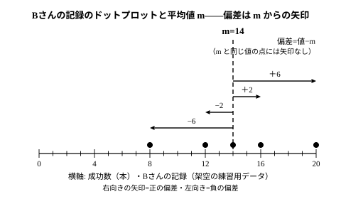

# L02 散らばりを1つの数にする——分散と標準偏差

- unit_id: hs-math-i-data-analysis
- 位置づけ: 単元第2レッスン（2時間）。L01で「代表値だけでは散らばりは語れない」ことを確かめた。この回は、散らばりを1つの数で表す方法を自分で考えるところから始め、高校で新しく学ぶ**分散**と**標準偏差**にたどり着く。後半では、平均値 m の両側に標準偏差 s の2倍の幅をとった「2s の帯」に、データの大半が入る様子を観察する。L03（比較と変量の変換）・L04（相関係数）・L07〜L08（仮説検定の考え方）のすべてが、この回の s を使う。
- distribution_status: published_draft
- license: CC-BY-4.0
- verify_required: 例題数値・記述は監修者検証必須。
- 主概念: ①散らばりの数値化を自分で考える（差の和→絶対値→2乗→総数で割る）→分散 ②標準偏差（元の単位に戻す）と、平均値 m の周りの「2s の帯」の読み

---

## 1. 平均も中央値も同じ——散らばりを「1つの数」で表したい

Aさんと Bさんが、5日間、毎日20本ずつフリースローを練習した。成功した本数は次のとおりである（架空のデータ・小さい順）。

| | 成功数（本・20本中） |
|---|---|
| Aさん | 11, 13, 14, 15, 17 |
| Bさん | 8, 12, 14, 16, 20 |

どちらも合計は 70 で、平均値は m=70/5=14。中央値も、5個の真ん中（3番目）でどちらも 14。代表値では区別がつかない。ところが表を見れば、Aさんの記録は 14 の近くにまとまり、Bさんの記録は大きくばらついている。「Bさんの方が散らばりが大きい」——この感覚を、**1つの数**で表したい。

L01の道具で言うなら、範囲は Aさん 6・Bさん 12、四分位範囲は Aさん 4・Bさん 8 で、どちらも Bさんの方が大きい。それで十分ではないか、と思うかもしれない。しかし範囲は両端の2つの値だけ、四分位範囲も区切りの位置の値だけで決まる。**全部のデータが1つ残らず物差しに参加する**ような散らばりの数を作れないだろうか。それが、この回の問いである。

## 2. 自分で作ってみる——差の和は、必ず0になる

散らばりとは「平均値からのずれ」の大きさである。そこで、各値と平均値 m の差を作ってみる。各値から平均値を引いた値 **値−m** を、教科書では**偏差**（へんさ）と呼ぶ（この教材でもこの呼び方を使う）。

| Aさん | 値 | 11 | 13 | 14 | 15 | 17 | 合計 |
|---|---|---|---|---|---|---|---|
| | 偏差（値−14） | −3 | −1 | 0 | 1 | 3 | 0 |

| Bさん | 値 | 8 | 12 | 14 | 16 | 20 | 合計 |
|---|---|---|---|---|---|---|---|
| | 偏差（値−14） | −6 | −2 | 0 | 2 | 6 | 0 |

偏差の大きさは、確かに Bさんの方が大きい。では「偏差の和」を散らばりの数にできるか。合計の欄を見ると、どちらも 0 である。これは偶然ではない。**偏差の和は、どんなデータでも必ず 0 になる**（理由は guide で確かめる）。正の偏差と負の偏差が打ち消し合ってしまうのだ。

打ち消し合いを防ぐには、偏差の符号を消せばよい。方法は2つ思いつく。

**（i）絶対値をとる**。|偏差| の和は、Aさん 3＋1＋0＋1＋3=8、Bさん 6＋2＋0＋2＋6=16。Bさんが大きい。

**（ii）2乗する**。偏差² の和は、Aさん 9＋1＋0＋1＋9=20、Bさん 36＋4＋0＋4＋36=80。やはり Bさんが大きい。

どちらも「散らばりの数」として使えそうだ。ただし、このままでは1つ問題がある。5日ではなく10日練習した人と比べたら、日数が多い分だけ和も大きくなり、公平な比較にならない。そこで、**和をデータの総数で割って「1個あたり」にする**。（i）なら Aさん 8/5=1.6、Bさん 16/5=3.2。（ii）なら Aさん 20/5=4、Bさん 80/5=16。

こうして「偏差の符号を消して、総数で割る」という設計にたどり着いた。（i）と（ii）のどちらを採用するか。数学では（ii）の**2乗の方**を標準の道具にする。絶対値は「正なら正・負なら符号を変える」と場合分けが要るのに対し、2乗は1つの式のまま計算でき、あとで学ぶ変量の変換（L03）や相関係数（L04）と式の上できれいにつながるからだ。もう1つ、偏差の2乗の和には「平均値のところで最小になる」という性質があり（stretch の S1 で確かめる）、平均値のまわりの散らばりを測る物差しとして相性がよい。

:::guide
**偏差の和は、なぜいつも 0 なのか**

平均値の定義に戻ると分かる。5個のデータの平均値 m は「合計÷5」だから、合計=5×m である。偏差の和は (値1−m)＋(値2−m)＋…＋(値5−m)=(値の合計)−5×m=5×m−5×m=0。データが何個でも同じ理屈で 0 になる。つまり、平均値とは「偏差がちょうど打ち消し合う位置」のことなのだ。この事実は計算の検算にも使える——偏差を書き出したら、合計が 0 になるか必ず確かめる。0 にならなければ、平均値か引き算のどこかが間違っている。
:::

## 3. 分散と標準偏差——単位を元に戻す

偏差の2乗の平均（2乗の和を総数で割った値）を、そのデータの**分散**（ぶんさん）という。記号は s² と書く。

> **分散 s²** =（偏差の2乗の和）÷（データの総数）

Aさんの分散は 4、Bさんの分散は 16 である。分散が大きいほど、データは平均値から遠くに散らばっている。

ここで単位に注意しよう。偏差の単位は「本」だが、2乗したので分散の単位は「本²」になってしまう。「散らばりが 16 本²」では、元のデータと同じ物差しで感じ取れない。そこで、分散の正の平方根をとって単位を元に戻す（全部の値が同じデータでは偏差がすべて 0 なので分散は 0 になり、このときは標準偏差も 0 とする）。これを**標準偏差**（ひょうじゅんへんさ）といい、s と書く（英語の standard deviation の頭文字）。

> **標準偏差 s = √分散**

Aさんは s=√4=2（本）、Bさんは s=√16=4（本）。「Bさんの記録は、平均から 4 本くらいずれるのがふつう」「Aさんは 2 本くらい」——標準偏差は、**平均値からのずれの、標準的な大きさ**を元の単位で教えてくれる数である。4 本ちょうどずれた日が1日もなくてもよい——「標準的な大きさ」は、日ごとのずれをならした目安の数であって、どれかの日のずれと一致するとは限らない。分散 s² の記号に 2 乗が付いているのは、「s を2乗したものが分散」という関係をそのまま表している。

分散と標準偏差は、どちらもすべてのデータが参加して決まり、平均値からのずれが大きい値ほど（2乗によって）強く効く。この単元で最も多く使う散らばりの物差しになる。

## 4. 手順の型

データから標準偏差を求める手順を固定しておく。

1. 平均値 m を求める（合計÷総数）。
2. 各値の偏差（値−m）を書き出す。**偏差の和が 0 になるか確かめる**。
3. 偏差を2乗する。
4. 2乗の和を総数で割る → 分散 s²。
5. 分散の正の平方根をとる（分散が 0 のときは 0）→ 標準偏差 s。

**例題1** Cさんの6日間のフリースロー成功数（20本中）は 9, 12, 13, 15, 16, 19 であった。分散と標準偏差を求めよ。

合計は 84 で m=84/6=14 だから、偏差は「値−14」である。

| 値 | 9 | 12 | 13 | 15 | 16 | 19 | 合計 |
|---|---|---|---|---|---|---|---|
| 偏差（値−14） | −5 | −2 | −1 | 1 | 2 | 5 | 0 |
| 偏差の2乗 | 25 | 4 | 1 | 1 | 4 | 25 | 60 |

偏差の和は 0（確認）。2乗の和は 60 だから、分散 s²=60/6=**10**、標準偏差 s=√10（本）。√10 は整数にならないので、そのまま √10 と書くか、必要なら近似値 3.2 を使う（3.1²=9.61、3.2²=10.24 だから 3.1<√10<3.2。さらに 3.15²=9.9225<10 だから √10 は 3.15 より大きく、小数第2位を四捨五入すると 3.2）。

検算として、別の道筋で分散を出してみる。偏差を使わず、「値の2乗の平均」から「平均値の2乗」を引いても分散になる（この関係はこの教材では証明せず、検算の道具として使う）。値の2乗は 81, 144, 169, 225, 256, 361 で和は 1236、平均は 1236/6=206。206−14²=206−196=10 で一致する。

:::guide
**「2乗して、平均して、√」を、手順として覚えて終わりにしない**

分散・標準偏差の計算は5段の手順で機械的にできる。だからこそ、途中の数の意味を失いやすい。手順の各段は、この回の §2 で自分がたどった道そのものだ——偏差（平均からのずれ）、2乗（符号を消す）、総数で割る（個数の違いをそろえる）、√（単位を元に戻す）。「なぜ2乗するのか」「なぜ最後に √ をとるのか」を一言で言えるかを、計算の後に自分に問うとよい。特に「分散の単位は元の単位の2乗」という事実は、L03 でデータを定数倍したときに分散と標準偏差の変わり方が違う理由に直結する。単位を意識しておくと、そこで迷わない。
:::

## 5. 平均値のまわりの「2s の帯」

標準偏差 s が分かると、「平均値からどれくらい離れているか」を s を単位にして測れる。1組の20人が受けた小テスト（100点満点）の得点を見よう（架空のデータ・小さい順）。

| 42 | 44 | 48 | 52 | 54 | 54 | 54 | 57 | 57 | 59 |
|---|---|---|---|---|---|---|---|---|---|
| 61 | 61 | 63 | 63 | 66 | 66 | 68 | 72 | 76 | 83 |

20個の計算は手でもできるが、表計算ソフトなどの情報機器に任せてよい規模である。手順は §4 と同じで、結果は次のとおり（偏差と2乗を2列に分けて示す）。

| 値 | 偏差 | 偏差の2乗 | 値 | 偏差 | 偏差の2乗 |
|---|---|---|---|---|---|
| 42 | −18 | 324 | 61 | 1 | 1 |
| 44 | −16 | 256 | 61 | 1 | 1 |
| 48 | −12 | 144 | 63 | 3 | 9 |
| 52 | −8 | 64 | 63 | 3 | 9 |
| 54 | −6 | 36 | 66 | 6 | 36 |
| 54 | −6 | 36 | 66 | 6 | 36 |
| 54 | −6 | 36 | 68 | 8 | 64 |
| 57 | −3 | 9 | 72 | 12 | 144 |
| 57 | −3 | 9 | 76 | 16 | 256 |
| 59 | −1 | 1 | 83 | 23 | 529 |

合計は 1200 で m=1200/20=60、偏差の和は 0、偏差の2乗の和は 2000、分散 s²=2000/20=100、標準偏差 s=10（点）。

平均値の両側に s の2倍ずつ幅をとった範囲、**m−2s 以上 m＋2s 以下**を「2s の帯」と呼ぶことにする（教科書の用語ではなく、この教材だけの呼び方である）。この組では 60−20=40 から 60＋20=80 までである。表を数えると、40 以上 80 以下に入るのは 19 人、外に出るのは 83 点の1人だけ。**平均値から 2s の帯の中に、データの大半が入っている**。

この「大半が入る」は、このデータで数えて確かめた観察であって、どんなデータでも同じ割合になる法則ではない（帯にどれくらい入るかは分布の形による）。なお、L01 の guide で触れたように、平均値から 2s（あるいは 3s）を超えて離れた値を外れ値とみなす基準が使われることがある。この組の 83 点は m＋2s=80 を超えているので、その基準では外れ値になる。

一方、L01 の四分位範囲の基準で判定すると、Q1=54、Q3=66、四分位範囲 12、上の線は 66＋18=84 で、83 は外れ値にならない。**基準が違えば判定も違う**——だから、どの基準で判定したかを結果に添える。

この「2s の帯」は、単元の終わり（L07〜L08）で「ある結果が偶然で説明できるか」を判断する物差しとして、もう一度主役になる。

:::guide
**表計算ソフトで分散を求めるときの注意**

表計算ソフトには分散や標準偏差を一発で返す関数があるが、**「総数 n で割る」定義と「n−1 で割る」定義の2種類**が、別の関数名で用意されているのがふつうだ。この教材の分散は「偏差の2乗の和を総数 n で割る」方である（n−1 で割る方は、数学Bの統計的な推測で意味が出てくる）。関数を使うときは、ヘルプでどちらの定義かを確かめ、小さなデータ（たとえば §1 の Aさん・Bさん）で手計算と一致するかを一度試してから使う。道具の出力を、確かめずに答えにしないこと。
:::

## 6. 練習

**問1** 次のデータの平均値 m・分散・標準偏差を求めよ。
2, 4, 5, 6, 8

**問2** ある生徒の8回の小テスト（20点満点）の得点は次のとおりであった。分散と標準偏差を求めよ。
5, 7, 9, 9, 11, 11, 13, 15

**問3** 2人の生徒 X・Y の5回の記録は次のとおりであった。
- X: 5, 7, 8, 9, 11
- Y: 2, 6, 8, 10, 14
(1) X・Y の平均値と中央値を求めよ。
(2) X・Y の標準偏差を求め、どちらの散らばりが大きいかを答えよ。

**問4** ある店の8日間の来客数（人）は次のとおりであった。
14, 15, 17, 19, 20, 22, 22, 31
(1) 平均値 m と標準偏差 s を求めよ。
(2) 2s の帯（m−2s 以上 m＋2s 以下）の範囲を求め、帯の中に入る日数と、外に出る値を答えよ。

**問5** 散らばりの数を作るとき、「偏差の和」ではなく「偏差の2乗の和を総数で割った値」を使う理由を、2〜3文で説明せよ。「打ち消し合う」「総数」の2語を使うこと。

---

:::stretch
**S1** データ 2, 3, 7 について考える。
(1) 平均値 m と中央値を求めよ。
(2) 平均値の代わりに試しに置く数を p とする。p=3, 4, 5 のそれぞれについて、(2−p)²＋(3−p)²＋(7−p)² の値を求めよ。どの p のとき最小になるか。
(3) p=3, 4, 5 のそれぞれについて、|2−p|＋|3−p|＋|7−p| の値を求めよ。どの p のとき最小になるか。
(4) (2)(3)の結果から、「偏差の2乗の和」と「偏差の絶対値の和」が、それぞれどの代表値と相性がよいかを1〜2文で述べよ。
:::

対応解答: answer_key_L01-03.md

<!-- gen_nav:nav:start（自動生成・手編集しない） -->

---

[← 前のレッスン](lesson_01.md)｜[単元の目次](README.md)｜[解答](answer_key_L01-03.md)｜[次のレッスン →](lesson_03.md)

<!-- gen_nav:nav:end -->
