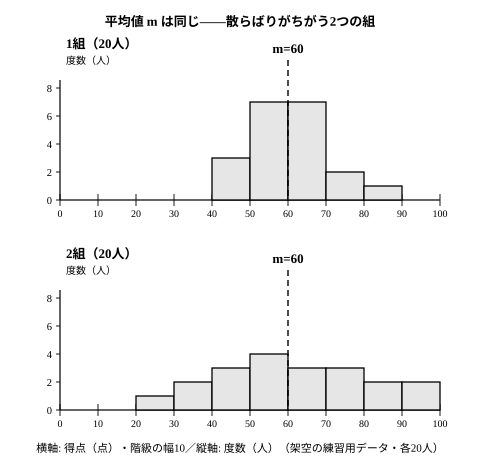

# L03 分散・標準偏差を使う——2つのデータの比較と変量の変換

- unit_id: hs-math-i-data-analysis
- 位置づけ: 単元第3レッスン（1.5時間）。L02で手に入れた分散・標準偏差を「使う」回。平均が同じ2つの組を散らばりで比べ、度数分布表しか手元にないときの求め方を押さえ、データ全体に定数を足したり定数倍したりすると m と s がどう変わるか（変量の変換）を数値で確かめる。その応用として、大きな数のデータを小さな数に直して計算する仮平均の工夫を学ぶ。L04（相関係数）で標準偏差を「単位をそろえる道具」として使うための準備でもある。
- distribution_status: published_draft
- license: CC-BY-4.0
- verify_required: 例題数値・記述は監修者検証必須。
- 主概念: ①2群の比較（平均が同じで散らばりが違う）・度数分布表からの計算 ②変量の変換（定数を足す・定数倍で m と s がどう変わるか。一般式は stretch）と仮平均の工夫

---

## 1. 平均が同じ2つの組——散らばりで比べる

L02 §5 で見た1組20人の小テスト（100点満点）は、平均値 m=60・標準偏差 s=10 だった。同じテストを受けた2組20人の得点は次のとおりである（架空のデータ・小さい順）。

| 22 | 30 | 35 | 40 | 45 | 48 | 50 | 52 | 53 | 53 |
|---|---|---|---|---|---|---|---|---|---|
| 67 | 67 | 68 | 70 | 72 | 75 | 80 | 85 | 90 | 98 |

合計は 1200 で m=1200/20=60。中央値は10番目と11番目の平均で (53＋67)/2=60。平均値も中央値も1組と同じである。

偏差を書き出すと、このデータでは、小さい方から k 番目と大きい方から k 番目の値（22 と 98、30 と 90、……）の偏差が、同じ大きさで符号だけ違う対になっている（手計算を軽くするために、そうなるように作ったデータである。実際のデータでこうなることはまずない）ので、対ごとにまとめて2乗の和を求められる。

| 偏差の対 | ±38 | ±30 | ±25 | ±20 | ±15 | ±12 | ±10 | ±8 | ±7 | ±7 |
|---|---|---|---|---|---|---|---|---|---|---|
| 偏差の2乗（1個分） | 1444 | 900 | 625 | 400 | 225 | 144 | 100 | 64 | 49 | 49 |

1個分の2乗の和は 1444＋900＋625＋400＋225＋144＋100＋64＋49＋49=4000。対だから2倍して、偏差の2乗の和は 8000。分散 s²=8000/20=400、標準偏差 s=√400=**20**（点）。

| | 平均値 m | 中央値 | 標準偏差 s | 2s の帯 |
|---|---|---|---|---|
| 1組 | 60 | 60 | 10 | 40〜80（19人が入る） |
| 2組 | 60 | 60 | 20 | 20〜100（20人が入る） |

ヒストグラムを見ると、1組は 50〜70 点に集中し、2組は 20 点台から 90 点台まで広がっている。この違いを、平均値は一切区別できない。標準偏差は 10 対 20 と、2組の散らばりが1組の2倍であることを1つの数で伝える。「2組は、平均から 20 点くらいずれる人がふつう」——これが s=20 の読み方だ。

まとめると、2つのデータを比べるときは、**代表値（真ん中らへん）と散らばり（標準偏差など）を別々に読み、別々に言葉にする**。「平均は同じだが、散らばりは2組の方が大きい」のように。

:::guide
**「標準偏差が大きい」は「悪い」ではない**

s が大きいことは、値のばらつきが大きいという事実を言っているだけで、良し悪しの判断は含まない。2組は平均点こそ1組と同じだが、高得点の人も低得点の人も多い——それを「学力に差がある組」と読むか「いろいろな人がいる組」と読むかは、目的しだいである。製品の重さや部品の長さのように「そろっていること」が価値になる場面では s が小さい方がよく、練習の記録のように「伸びしろ」を見たい場面では s の大きさそのものが情報になる。s を求めたら、「この場面で、ばらつきが大きいことは何を意味するか」を一言添える。

もう1つ。分散・標準偏差は「平均値からのずれ」から作る物差しなので、分布がおおむね左右対称のときに素直に働く。L01 で見たように、片側に外れ値があるような非対称な分布では平均値そのものが引きずられるから、代表値は中央値、散らばりは四分位範囲を使う方が実態を表しやすい。**対称なら平均値と標準偏差、非対称なら中央値と四分位範囲**が目安——決まりではないので、道具の使い分けは、分布の形と何を知りたいかを見てから決める。
:::

## 2. 度数分布表から求める——階級値で代表させる

生の値の一覧がなく、度数分布表しか手元にないこともある。16人の通学時間（分）を調べた次の表を考える（架空のデータ）。

| 階級（分） | 階級値 | 度数 |
|---|---|---|
| 0以上10未満 | 5 | 1 |
| 10以上20未満 | 15 | 4 |
| 20以上30未満 | 25 | 6 |
| 30以上40未満 | 35 | 4 |
| 40以上50未満 | 45 | 1 |
| 計 | | 16 |

中1で学んだように、階級に入る値を**階級値**（階級の真ん中の値）で代表させて平均値を求める。階級値×度数の合計は 5×1＋15×4＋25×6＋35×4＋45×1=5＋60＋150＋140＋45=400 で、m=400/16=25（分）。

分散も同じ考え方で求める。各階級の偏差は「階級値−m」、その2乗に度数を掛けて足し、総数で割る。

| 階級値 | 度数 | 偏差（階級値−25） | 偏差の2乗 | 偏差の2乗×度数 |
|---|---|---|---|---|
| 5 | 1 | −20 | 400 | 400 |
| 15 | 4 | −10 | 100 | 400 |
| 25 | 6 | 0 | 0 | 0 |
| 35 | 4 | 10 | 100 | 400 |
| 45 | 1 | 20 | 400 | 400 |
| 計 | 16 | | | 1600 |

分散 s²=1600/16=100、標準偏差 s=√100=**10**（分）。

これは、16人全員の通学時間が階級値ちょうど（5分が1人、15分が4人、…）だったとみなして計算した値である。実際の値は階級の中で散らばっているので、**度数分布表から求めた平均値・分散は近似値**だ。生の値があるなら、生の値で計算する方が正確である。

:::guide
**「階級値×度数」を忘れる・「度数で割る」を間違える**

度数分布表の計算でよくつまずくのは2か所ある。1つは、階級値をそのまま足して階級の数で割ってしまうこと（5＋15＋25＋35＋45=125 を 5 で割って 25——たまたま合ってしまうことがあるので、なおさら危ない）。人数の重みをかけて足し、**総数 16 で割る**のが正しい。もう1つは、偏差の2乗を度数倍し忘れること。表を書くときに「偏差の2乗×度数」の列を必ず作り、その列の合計を総数で割る、と手順を固定してしまえば防げる。度数分布表の計算は、L02 の手順の型に「×度数」を1段足しただけだ、と見ておくとよい。
:::

## 3. 変量の変換——足すと m だけが動き、掛けると s も動く

身長や得点のように、データとして測る量を、教科書では**変量**と呼ぶ。ここでは、変量の値すべてに同じ操作をしたとき、m と s がどう変わるかを調べる。土台は L02 の Aさんの記録 11, 13, 14, 15, 17（m=14、s=2）である。

**（a）全部に同じ数を足す**。5日間とも「あと3本」成功していたとして、各値に 3 を足す。

| 値＋3 | 14 | 16 | 17 | 18 | 20 | 合計 85 |
|---|---|---|---|---|---|---|
| 偏差（値−17） | −3 | −1 | 0 | 1 | 3 | 0 |

m=85/5=17 で、元の 14 より 3 大きい。偏差は −3, −1, 0, 1, 3 で元とまったく同じ——全員が同じだけ動けば、平均値も同じだけ動くので、平均値からのずれは変わらないからだ。したがって分散 s²=4、標準偏差 s=2 のまま変わらない。

**（b）全部を同じ数倍する**。20本中の成功数を100点満点に換算するために、各値を 5 倍する。

| 値×5 | 55 | 65 | 70 | 75 | 85 | 合計 350 |
|---|---|---|---|---|---|---|
| 偏差（値−70） | −15 | −5 | 0 | 5 | 15 | 0 |
| 偏差の2乗 | 225 | 25 | 0 | 25 | 225 | 500 |

m=350/5=70 で、元の 14 の 5 倍。偏差は −15, −5, 0, 5, 15 で、元の偏差 −3, −1, 0, 1, 3 のそれぞれ 5 倍になっている。分散 s²=500/5=100 で元の 4 の **25 倍**、標準偏差 s=√100=10 で元の 2 の **5 倍**である。

数値で確かめた結果をまとめる。

> **変量の変換**（この教材の範囲では、足す数 c と掛ける数 a は正の数で確かめた）
> - 全部に c を足す: 平均値は c 増える。分散・標準偏差は変わらない。
> - 全部を a 倍する: 平均値は a 倍。標準偏差は a 倍。分散は a² 倍。

分散が a² 倍で標準偏差が a 倍になるのは、分散の単位が「元の単位の2乗」だから（L02 §3）。値を 5 倍すると偏差も 5 倍、偏差の2乗は 25 倍、その平均である分散も 25 倍、√ をとる標準偏差は 5 倍——単位を追えば自然に出てくる。

**例題1** 10点満点の小テストの得点データについて、平均値 6 点・標準偏差 1.5 点であった。このテストを 50 点満点に換算する（各値を 5 倍する）と、平均値と標準偏差はいくらになるか。また、換算後に全員に 5 点加えると、どうなるか。

5 倍すると、平均値は 6×5=30 点、標準偏差は 1.5×5=7.5 点。さらに全員に 5 点加えると、平均値は 30＋5=35 点、標準偏差は 7.5 点のまま。

検算は「具体的なデータで規則を確かめる」が最も確実だ。例題1には元のデータが与えられていないので、別の小さなデータで規則そのものを確かめる。たとえば 4, 6, 8 なら m=6、偏差 −2, 0, 2、s²=8/3 で、5 倍した 20, 30, 40 は m=30、偏差 −10, 0, 10、s²=200/3=(8/3)×25 になっている。

:::guide
**「足す」と「掛ける」で、s の変わり方が違う理由を一言で**

図で考えるとはっきりする。データを数直線上に並べたとき、全部に c を足すのは「点の並びをそっくり右へ c だけ平行移動する」こと。点どうしの間隔は変わらないので、散らばりは変わらない。全部を a 倍するのは「原点を中心に、点の並びを a 倍に引き伸ばす」こと。点どうしの間隔も a 倍になるので、散らばりの物差しである標準偏差も a 倍になる。分散はその2乗だから a² 倍。「平行移動は散らばりを変えず、拡大は散らばりを同じ倍率で変える」——この1文が、変量の変換の全部である。掛ける数が負の数のときにどうなるかは、stretch の S1(2) で自分で確かめる。
:::

## 4. 仮平均——大きな数を小さな数に直して計算する

変量の変換の「足しても s は変わらない」を、計算の工夫に使う。5人の身長（cm）が 165, 167, 168, 169, 171 であったとする（架空のデータ）。このまま平均を求めると 3 桁の足し算になるので、きりのよい 170 を**仮平均**として、各値から 170 を引いた差 u で計算する。

| 身長 | 165 | 167 | 168 | 169 | 171 | 合計 |
|---|---|---|---|---|---|---|
| u=身長−170 | −5 | −3 | −2 | −1 | 1 | −10 |
| u の偏差（u−(−2)） | −3 | −1 | 0 | 1 | 3 | 0 |
| u の偏差の2乗 | 9 | 1 | 0 | 1 | 9 | 20 |

u の平均は −10/5=−2。身長は「u に 170 を足したもの」だから、身長の平均値は m=170＋(−2)=**168**（cm）。u の分散は 20/5=4 で、170 を足しても分散は変わらないから、身長の分散も 4、標準偏差は s=**2**（cm）。

仮平均の手順を型にしておく。

1. きりのよい数（仮平均）を決め、各値からそれを引いた差 u を作る。
2. u の平均を求め、仮平均に足す → 元の平均値 m。
3. u の分散・標準偏差を求める → それがそのまま元のデータの分散・標準偏差。

仮平均は、平均値に近そうな数を選ぶと差が小さくなって計算が楽だが、どの数を選んでも結果は同じである（選んだ数の分だけ u の平均がずれ、最後に足し戻すから）。

## 5. 練習

**問1** 2人の生徒 X・Y の6回の記録は次のとおりであった。
- X: 5, 7, 7, 8, 10, 11
- Y: 3, 3, 8, 9, 11, 14
それぞれの平均値と標準偏差を求め、2人の記録の違いを「平均」と「散らばり」の2つの言葉で1〜2文にまとめよ。

**問2** 10人の生徒の、ある日の家庭学習時間（分）を度数分布表にまとめた。階級値を使って平均値と標準偏差を求めよ。

| 階級（分） | 階級値 | 度数 |
|---|---|---|
| 10以上20未満 | 15 | 1 |
| 20以上30未満 | 25 | 1 |
| 30以上40未満 | 35 | 6 |
| 40以上50未満 | 45 | 1 |
| 50以上60未満 | 55 | 1 |
| 計 | | 10 |

**問3** ある生徒の6回の小テスト（10点満点）の得点が 3, 5, 5, 6, 8, 9 であった。
(1) 平均値と標準偏差を求めよ。
(2) 6回の得点それぞれに 4 を足した値（10 を超えるものもそのまま使う）について、平均値と標準偏差を求めよ（実際に 4 を足したデータから計算し、変量の変換の規則と一致することを確かめよ）。
(3) 得点を 3 倍して 30 点満点に換算したときの平均値・分散・標準偏差を求めよ（同様に、実際に 3 倍したデータから計算して確かめよ）。

**問4** 6人の身長（cm）が 153, 155, 155, 156, 158, 159 であった。仮平均を 155 として、平均値と標準偏差を求めよ。

**問5** 平均値が同じ 60 点で、標準偏差が 5 点の組と 15 点の組がある。この2つの組について「言えること」と「言えないこと」を、それぞれ1文ずつ書け。

---

:::stretch
**S1** 変量 x の各値を a 倍して b を足した変量を y とする（y=ax＋b）。x の平均値を m、標準偏差を s と書く。
(1) y の平均値が am＋b になる理由を、「合計」に注目して1〜2文で説明せよ。
(2) y の各値の偏差が、x の対応する値の偏差の a 倍になることを示し、そこから y の分散が a² 倍、標準偏差が |a| 倍になることを説明せよ。a が負の数のとき、標準偏差が a 倍でなく |a| 倍と書かなければならない理由にも触れること。
(3) 5日間の最高気温（℃）が 17, 19, 20, 21, 23 であった。摂氏 x を華氏 y に直す式は y=1.8x＋32 である。華氏で表した5日間の最高気温の平均値・分散・標準偏差を、(1)(2)の規則を使って求めよ。また、実際に華氏に直したデータから分散を計算して一致することを確かめよ。
(4) 100 点満点のテストの得点 x に対し、y=100−x（減点数）を考える。x の平均値が 62、標準偏差が 8 のとき、y の平均値と標準偏差を求めよ。
:::

対応解答: answer_key_L01-03.md

<!-- gen_nav:nav:start（自動生成・手編集しない） -->

---

[← 前のレッスン](lesson_02.md)｜[単元の目次](README.md)｜[解答](answer_key_L01-03.md)｜[次のレッスン →](lesson_04.md)

<!-- gen_nav:nav:end -->
