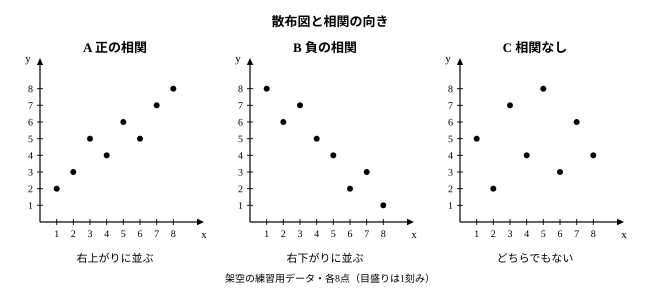
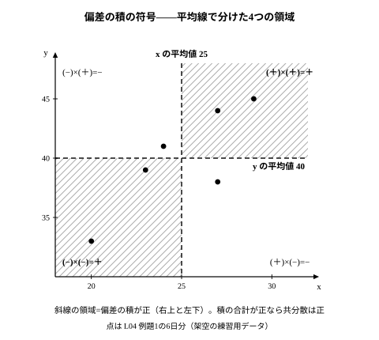

# L04 2つの変量——散布図と相関係数

- unit_id: hs-math-i-data-analysis
- 位置づけ: 単元第4レッスン（2時間）。「データの散らばりと相関」サブ単元（L01〜L06）の4本目。L01〜L03で1つの変量の散らばりを分散・標準偏差という数にした。ここからは2つの変量を組にして見る——散布図で「向き」を読み、偏差の積から相関係数 r を作る。L05で r の読み違えを扱う。
- distribution_status: published_draft
- license: CC-BY-4.0
- verify_required: 例題数値・記述は監修者検証必須。
- 主概念: ①散布図と相関の向き・強さ ②偏差の積の平均（共分散）を標準偏差の積で割った相関係数 r の定義と、少数データでの計算

---

## 1. 2つの変量を同時に見る——散布図

L01〜L03では、1つの変量——たとえば小テストの得点——について、平均値 m のまわりの散らばりを分散 s² と標準偏差 s で測った。このレッスンでは、1人（1日、1店、……）ごとに**2つの変量を組にして**記録したデータを扱う。たとえば「その日の最高気温」と「その日の飲み物の売上」のように、1つの個体に x と y の値が1組ずつ対応しているデータである。

こういうデータは、横軸に x、縦軸に y をとって、1組の (x, y) を1つの点で打つと全体が見渡せる。この図を**散布図**（さんぷず）という。

次の3組のデータ A・B・C は、どれも8組の (x, y) からなる架空のものである（x は 1 から 8 で共通）。

| x | 1 | 2 | 3 | 4 | 5 | 6 | 7 | 8 |
|---|---|---|---|---|---|---|---|---|
| A の y | 2 | 3 | 5 | 4 | 6 | 5 | 7 | 8 |
| B の y | 8 | 6 | 7 | 5 | 4 | 2 | 3 | 1 |
| C の y | 5 | 2 | 7 | 4 | 8 | 3 | 6 | 4 |

散布図にすると、3つの並び方の違いがひと目で分かる。

- A: x が大きい組ほど y も大きい傾向——点が**右上がり**に並ぶ。このとき、x と y の間に**正の相関**（せいのそうかん）があるという。
- B: x が大きい組ほど y は小さい傾向——点が**右下がり**に並ぶ。**負の相関**（ふのそうかん）があるという。
- C: 右上がりとも右下がりともいえない。**相関がない**という。

「傾向」という言葉に注意してほしい。A でも、x=3 のとき y=5 なのに x=4 では y=4 と、部分的には下がっている。それでも全体としては右上がりだ、というのが「正の相関」の意味である。1組1組が例外なく増えることを求めているのではない。

相関には向きだけでなく**強さ**がある。点が1本の直線の近くに集まっているほど「強い相関」、直線から広くばらけているほど「弱い相関」と見る。A と B はどちらも強いほうで、C は相関がない。ただし、「強い・弱い」を目で見た印象だけで決めると人によって答えが変わる。そこで、次の節から、この向きと強さを1つの数にする方法を組み立てる——L02で散らばりを分散という数にしたときと同じ発想である。

:::guide
**散布図の点は「個体」である**

散布図の1つの点は、1人の生徒、1日の記録、1つの店といった「個体」を表している。だから点の個数はデータの組の数と同じで（A・B・C はどれも8点）、2つの個体が同じ (x, y) の値なら点は重なる。ヒストグラムの棒（度数）とはまるで役割が違うので、読むときは「この点は誰（何）か」を意識するとよい。もう1つ大事なのは、散布図が示すのは (x, y) の**組**としての傾向であって、x だけ・y だけの分布ではないことだ。x の散らばりや y の散らばりは、これまでどおり箱ひげ図やヒストグラムで別に見る。両方を見て初めて「x が大きい個体は y も大きいか」という問いに答えられる。
:::

## 2. 相関を数にする準備——偏差の積の符号

**例題1** ある店で、6日間の最高気温 x（℃）と、その日に売れた冷たい飲み物の本数 y（本）を記録した（架空のデータ）。x と y の相関を数で表したい。

| 日 | 1 | 2 | 3 | 4 | 5 | 6 |
|---|---|---|---|---|---|---|
| x（℃） | 20 | 23 | 24 | 27 | 27 | 29 |
| y（本） | 33 | 39 | 41 | 38 | 44 | 45 |

まず、x と y それぞれの平均値を求める。以後、x の平均値を mx、y の平均値を my と書く（m の右下に小さく x・y を添える記号のつもりで、m と x の掛け算ではない）。

mx = (20＋23＋24＋27＋27＋29)/6 = 150/6 = 25、my = (33＋39＋41＋38＋44＋45)/6 = 240/6 = 40

次に、L02と同じように**偏差**（各値−平均値）をつくる。今回は x の偏差と y の偏差の2本の列ができる。

| 日 | x | y | x の偏差 x−25 | y の偏差 y−40 |
|---|---|---|---|---|
| 1 | 20 | 33 | −5 | −7 |
| 2 | 23 | 39 | −2 | −1 |
| 3 | 24 | 41 | −1 | 1 |
| 4 | 27 | 38 | 2 | −2 |
| 5 | 27 | 44 | 2 | 4 |
| 6 | 29 | 45 | 4 | 5 |

正の相関——「x が大きい日は y も大きい」——を偏差の言葉で言い直すと、「x の偏差が正の日は y の偏差も正、x の偏差が負の日は y の偏差も負」という傾向になる。つまり、全体として**2つの偏差の符号がそろいやすい**ということだ（上の表の 3日目・4日目のように、そろわない日があってもよい）。符号がそろうかどうかを1つの数で判定するには、2つの偏差を掛ければよい。同符号なら積は正、異符号なら積は負になる。

| 日 | x の偏差 | y の偏差 | 偏差の積 |
|---|---|---|---|
| 1 | −5 | −7 | 35 |
| 2 | −2 | −1 | 2 |
| 3 | −1 | 1 | −1 |
| 4 | 2 | −2 | −4 |
| 5 | 2 | 4 | 8 |
| 6 | 4 | 5 | 20 |

散布図の上で見ると、この符号は点の位置で決まる。x の平均値 25 を通る縦の線と、y の平均値 40 を通る横の線を引くと、図は4つの領域に分かれる。右上の領域（x の偏差が正・y の偏差が正）と左下の領域（負・負）では積が正、左上と右下では積が負である。

例題1のデータでは、6日のうち4日が右上か左下にあり、積が正になる日が多い。しかも積の大きさは、第1日（35）や第6日（20）のように**平均から両方とも遠い点ほど大きい**。負の積は 3日目・4日目の2つだけで、どちらも小さい。足し合わせれば正が勝つ——これが「正の相関」を数で捉えた姿である。

:::guide
**なぜ「差」や「和」ではなく「積」なのか**

2つの偏差がそろっているかを見るのに、差 (x の偏差)−(y の偏差) を使いたくなるかもしれない。しかし、差は x と y の単位が違うと意味をもたない（℃ から本を引くことはできない）し、符号がそろっていても大きさが違えば 0 にならない。積なら、単位の違いはそのまま「℃×本」という新しい単位になって残るだけで、**符号の一致・不一致が積の正負にきれいに写る**。さらに、平均から遠い点どうしの積ほど大きくなるから、「両方とも大きく外れた個体」が傾向をはっきり示すことも数に反映される。この2つの性質——符号を写す・遠さを重みにする——があるので、偏差の積が相関の材料に選ばれている。
:::

## 3. 偏差の積の平均——共分散

偏差の積を全部足すと 35＋2−1−4＋8＋20 = 60。L02で偏差の2乗の「和」ではなく「平均」を分散としたのと同じ理由で（データの個数が違っても比べられるように）、ここでも個数 6 で割って平均をとる。

偏差の積の平均 = 60/6 = 10

この「偏差の積の平均」は、教科書では**共分散**（きょうぶんさん）と呼ばれる。共分散の符号から向きを読める——正なら正の相関の向き（右上がり）、負なら負の相関の向き（右下がり）、ちょうど 0 ならどちらの向きでもない。

しかし共分散には、大きさで強さを比べにくいという弱点がある。例題1の y を「本」ではなく「箱」（1箱10本）で数えたとすると、y の偏差はすべて 10 分の 1 になり、共分散は 10/10 = 1 になる。同じデータ・同じ散布図なのに、単位を変えただけで共分散は 10 から 1 へ変わってしまう。つまり共分散の大きさは「相関の強さ」のほかに「x と y の単位（散らばりの大きさ）」を抱えている。だから、共分散が 0 に近いかどうかで「相関がない」と決めることもできない。強さだけを取り出すには、この単位の影響を消さなければならない。

## 4. 単位をそろえる——相関係数 r

単位の影響を消すには、x の偏差を x の標準偏差 sx で、y の偏差を y の標準偏差 sy で割ればよい（sx・sy も同じく、s の右下に x・y を添える記号）。標準偏差はもとの変量と同じ単位をもつ（L02）から、「偏差÷標準偏差」は単位のない数になる。L03で見た変量の変換のとおり、「本」を「箱」に変えると y の偏差も sy も同じ 10 分の 1 になり、割り算の結果は変わらない。

各組の（x の偏差÷sx）×（y の偏差÷sy）の平均は、割る数 sx×sy が全組で共通だから、共分散を sx×sy で割った値に等しい。この値を**相関係数**（そうかんけいすう）といい、r で表す。ただし、x か y の値が全部同じデータでは、その標準偏差が 0 になる。0 で割ることはできないので、そのときは相関係数を計算できない。

r = 共分散 ÷ (sx×sy)

例題1で計算する。分散 s² は偏差の2乗の平均だった（L02）。

| 日 | x の偏差 | y の偏差 | x の偏差の2乗 | y の偏差の2乗 | 偏差の積 |
|---|---|---|---|---|---|
| 1 | −5 | −7 | 25 | 49 | 35 |
| 2 | −2 | −1 | 4 | 1 | 2 |
| 3 | −1 | 1 | 1 | 1 | −1 |
| 4 | 2 | −2 | 4 | 4 | −4 |
| 5 | 2 | 4 | 4 | 16 | 8 |
| 6 | 4 | 5 | 16 | 25 | 20 |
| 合計 | 0 | 0 | 54 | 96 | 60 |

x の分散 = 54/6 = 9 だから sx = 3。y の分散 = 96/6 = 16 だから sy = 4。共分散 = 60/6 = 10。よって

r = 10 ÷ (3×4) = 10/12 = 5/6 ≒ 0.83

検算として、偏差の列の合計が x でも y でも 0 になっていること（偏差の和は必ず 0）、積の符号が散布図の4領域と合っていること（3日目・4日目だけ負）を見ておく。この「偏差の和は 0・積の符号は図と一致」は、毎回の習慣にしたい2つの確かめである。

相関係数 r には次の性質がある（証明はこの単元では扱わない。S1 で両端の例を確かめる）。

- r はつねに **−1≦r≦1** の範囲にある。
- r が 1 に近いほど強い正の相関、−1 に近いほど強い負の相関。0 に近いほど相関が弱い。
- 点がすべて1本の右上がりの直線の上に乗るとき r=1、右下がりの直線の上に乗るとき r=−1。

「強い・弱い」の言葉と r の値の対応は、この教材では次の目安を使う（区切りの値は決まりではなく、話を進めるための目安である）。

| r の大きさ（符号を除く） | 言い方 |
|---|---|
| 0.7 以上 | 強い相関がある |
| 0.4 以上 0.7 未満 | 相関がある |
| 0.2 以上 0.4 未満 | 弱い相関がある |
| 0.2 未満 | ほとんど相関がない |

例題1の r ≒ 0.83 は「強い正の相関」にあたる。散布図の印象（右上がりで、直線の近くに集まっている）と合っている。

**例題2** 5人の選手の 100 m 走のタイム x（秒）と走り幅跳びの記録 y（cm）（架空のデータ）。相関係数 r を求めよ。

| 選手 | 1 | 2 | 3 | 4 | 5 |
|---|---|---|---|---|---|
| x（秒） | 13.3 | 12.7 | 13.1 | 12.9 | 13.0 |
| y（cm） | 470 | 530 | 510 | 490 | 500 |

mx = 65.0/5 = 13.0、my = 2500/5 = 500。

| 選手 | x の偏差 | y の偏差 | x の偏差の2乗 | y の偏差の2乗 | 偏差の積 |
|---|---|---|---|---|---|
| 1 | 0.3 | −30 | 0.09 | 900 | −9 |
| 2 | −0.3 | 30 | 0.09 | 900 | −9 |
| 3 | 0.1 | 10 | 0.01 | 100 | 1 |
| 4 | −0.1 | −10 | 0.01 | 100 | 1 |
| 5 | 0 | 0 | 0 | 0 | 0 |
| 合計 | 0 | 0 | 0.2 | 2000 | −16 |

x の分散 = 0.2/5 = 0.04 だから sx = 0.2。y の分散 = 2000/5 = 400 だから sy = 20。共分散 = −16/5 = −3.2。

r = −3.2 ÷ (0.2×20) = −3.2/4 = **−0.8**

タイムが短い（速い）選手ほど遠くへ跳ぶ傾向——強い負の相関である。検算: 偏差の合計は 0・0、積が負の選手は1・2の2人で、散布図では左上と右下に来る（速くて遠い・遅くて近い）。合っている。

:::guide
**r の値を読むときの3つの注意**

第一に、符号は向き、大きさ（符号を除いた値）は強さである。r=−0.8 は r=0.5 より「強い」相関で、負号は弱さの印ではない。第二に、r は単位のない数なので、℃ と本、秒と cm のように単位の違う組でも、また別のデータどうしでも、そのまま強さを比べられる——共分散にはなかった利点である。第三に、上の目安の表は道具であって法則ではない。r=0.68 と r=0.72 の間に本質的な違いはないし、データが5〜6組しかないときの r は、1組の値が変わるだけで大きく動く。r を出したら必ず散布図に戻って、値と図の印象が合っているかを見る。L05では、この「図に戻る」習慣がないと何を読み違えるかを具体的に見る。
:::

## 5. 手順の型

相関係数を求める作業は、次の表の型で進めると迷わない。列を左から順に埋める。

1. x の平均値 mx と y の平均値 my を求める。
2. x の偏差の列、y の偏差の列を作る。それぞれの合計が 0 になることを確かめる。
3. x の偏差の2乗の列、y の偏差の2乗の列、偏差の積の列を作る。
4. 3つの列それぞれの平均をとる——順に x の分散、y の分散、共分散。分散の正の平方根が sx、sy（分散が 0 のときは 0）。
5. r = 共分散 ÷ (sx×sy)。sx か sy が 0 のとき（x か y の値が全部同じとき）は、r を計算できない。−1≦r≦1 の範囲を外れていたら計算ミスである。
6. 散布図に戻り、向き（符号）と強さの印象が r と合っているかを見る。

表計算ソフトを使うなら、偏差の列を作らなくても、平均を出す関数・分散や標準偏差を出す関数・相関係数を出す関数（多くのソフトで CORREL という名前）で同じ値が得られる。ただし、ソフトによっては分散を「個数で割る」ものと「個数−1で割る」ものの2種類が用意されている。この単元では**個数で割る**分散（L02の定義）を使う。r の値は、共分散と分散を同じ割り方（どちらも個数、またはどちらも個数−1）でそろえて求めれば、どちらでも同じになる（分子と分母で同じ割り方をするので打ち消し合う）。共分散の関数にも2種類あるソフトでは、割り方がそろっているかを確かめる。相関係数を直接返す関数（CORREL など）なら、この心配はない。

:::guide
**計算が合わないとき、どこを疑うか**

偏差の合計が 0 にならなければ平均値の計算か転記のミスで、それより先へ進んでも意味がない。偏差の積の列で符号を落とす（負×負を負にする）のもよくある誤りで、散布図の4領域と照らせばすぐ見つかる。分散の平方根を忘れて「共分散 ÷ (x の分散 × y の分散)」としてしまうと、正しい r をさらに sx×sy で割った別の値になる（例題1なら 10÷(9×16)≒0.07 と小さくなるが、sx×sy が 1 より小さいデータでは逆に大きくなる）。逆に平方根を共分散のほうにも付けてしまう誤りもある。r の定義は「共分散を、2つの**標準偏差**の積で割る」——単位を消すために標準偏差（もとの単位）で割っているのだと理由ごと覚えておくと、どちらに平方根が要るかを間違えない。最後に r が 1 を超えたら、どこかが必ず間違っている。
:::

## 6. 練習

**問1** §1 の表のデータ A・B・C について、次に答えよ。
(1) それぞれ、正の相関・負の相関・相関がない、のどれにあたるか。
(2) A で、x=3 の組と x=4 の組を比べると y は減っている。それでも A を「正の相関」と呼んでよい理由を1〜2文で説明せよ。

**問2** 例題1のデータ（mx=25、my=40）に、次の2日分を追加したとする。追加した日の点を、例題1の平均線（x=25、y=40）を基準に見る。それぞれの日について、偏差の積の符号を答え、散布図の4つの領域のどこに点が打たれるか（右上・右下・左上・左下）を答えよ。
(1) 最高気温 23 ℃、売上 43 本  (2) 最高気温 28 ℃、売上 44 本

**問3** 5つの店舗の、1か月の広告費 x（万円）と売上 y（万円）が次の表のとおりであった（架空のデータ）。相関係数 r を求め、相関の向きと強さを言葉で答えよ。

| 店舗 | 1 | 2 | 3 | 4 | 5 |
|---|---|---|---|---|---|
| x（万円） | 8 | 2 | 6 | 4 | 5 |
| y（万円） | 330 | 270 | 290 | 310 | 300 |

**問4** 5人の生徒の靴のサイズ x（cm）と数学の小テストの得点 y（点）が次の表のとおりであった（架空のデータ）。相関係数 r を求めよ。また、その値から、靴のサイズと得点の間に右上がり・右下がりの傾向があるといえるかを1文で答えよ。

| 生徒 | 1 | 2 | 3 | 4 | 5 |
|---|---|---|---|---|---|
| x（cm） | 28 | 22 | 26 | 24 | 25 |
| y（点） | 61 | 59 | 57 | 63 | 60 |

**問5** 次の主張は正しいか。正しくないものは理由を1〜2文で答えよ。
(1) r=−0.85 のデータは、r=0.6 のデータより相関が強い。
(2) 計算した結果、r=1.2 になることがある。
(3) あるデータの共分散は 3.2、別のデータの共分散は 320 である。後者のほうが相関が強いといえる。

---

:::stretch
**S1** (1) x が 1, 2, 3, 4, 5 で、y が y=2x＋1 で決まる5組のデータ (1, 3), (2, 5), (3, 7), (4, 9), (5, 11) について、共分散・sx・sy・r を求め、r=1 になることを確かめよ（sx・sy は √ のまま残してよい）。
(2) y が y=−2x＋13 で決まる5組 (1, 11), (2, 9), (3, 7), (4, 5), (5, 3) では r はいくつになるか。
(3) 例題1で、売上 y を「本」から「箱」（1箱=10本）に変えて y/10 とすると、共分散・sy・r はそれぞれどうなるか。L03の変量の変換の結果（値を a 倍すると標準偏差は |a| 倍）を使って説明せよ。
:::

対応解答: answer_key_L04-06.md

<!-- gen_nav:nav:start（自動生成・手編集しない） -->

---

[← 前のレッスン](lesson_03.md)｜[単元の目次](README.md)｜[解答](answer_key_L04-06.md)｜[次のレッスン →](lesson_05.md)

<!-- gen_nav:nav:end -->
