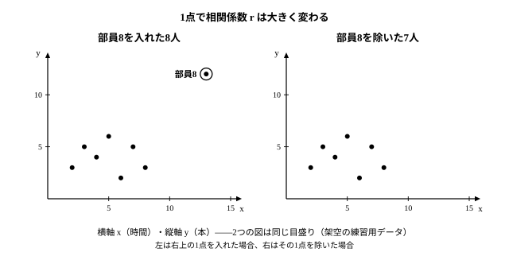

# L05 相関を読み違えない——相関と因果・外れ値・層別

- unit_id: hs-math-i-data-analysis
- 位置づけ: 単元第5レッスン（1時間）。「データの散らばりと相関」サブ単元（L01〜L06）の5本目。L04で作った相関係数 r を「使う」回——r が大きくても因果とは限らない、r=0 でも関係がないとは限らない、1点で r は大きく動く、表の切り方で見え方が逆転する、の4つを自作の小さなデータで確かめる。L06の探究プロセスで「結論の限界」を書くための材料になる。
- distribution_status: published_draft
- license: CC-BY-4.0
- verify_required: 例題数値・記述は監修者検証必須。
- 主概念: ①相関と因果の違い・r=0 は「直線的な関係がない」だけ ②外れ値1点で r が動くこと・二次元表と層別で見え方が逆転すること

---

## 1. 相関があっても因果があるとは限らない

8人の生徒について、ある月の20日間のうち朝食をとった日数 x（日）と、その前の月に受けた数学の小テストの得点 y（20点満点）を記録した（架空のデータ）。

| 生徒 | 1 | 2 | 3 | 4 | 5 | 6 | 7 | 8 |
|---|---|---|---|---|---|---|---|---|
| x（日） | 20 | 18 | 16 | 15 | 12 | 10 | 8 | 5 |
| y（点） | 18 | 16 | 14 | 16 | 12 | 13 | 8 | 7 |

表計算ソフトで相関係数を求めると r ≒ 0.95——強い正の相関である（mx=13、my=13 で偏差はすべて整数になるので、L04 の手順で手計算できる。x の分散 23.25、y の分散 13.25、共分散 16.625 で、r=16.625÷√(23.25×13.25)≒0.947）。

ここで「朝食をとれば数学の得点が上がる」と言ってよいだろうか。

この r が示しているのは、「朝食の日数が多い生徒ほど得点も高い**傾向がある**」ということまでである。x と y が一緒に動くことを**相関**という。一方、「x を変えれば y が変わる」という関係を**因果**（いんが）という。相関係数は前者を測る数であって、後者を判定する力はない。実際、この8人の r≒0.95 には少なくとも次の説明が考えられる。

- 朝食をとる習慣が、授業中の集中を通して得点を上げている（x が y の原因。x はこの月の記録だが、朝食の習慣は前の月も同じだったと考えての説明である）。
- 逆に、前の月のテストで良い点をとった生徒ほど気持ちに余裕があり、この月は朝の時間にゆとりをもって朝食をとれている（y が x の原因。前の月の得点 y は、この月の朝食の日数 x より先に決まっているので、この向きの説明も時間の順序に合う）。
- 生活リズムが整っている生徒は朝食もとるし勉強時間も確保できる、というように、第三の要因が x と y の両方を動かしている。
- 8人しかいないので、たまたまこうなった。

どの説明が正しいかは、この表からは決められない。相関係数がどれほど 1 に近くても、「一緒に動く」以上のことは言えない——これが、r を使うときに最初に覚えておくべき限界である。相関から因果を主張するには、朝食以外の条件をそろえて比べるなど、データの集め方そのものを工夫する必要がある（それは L06 の「計画」の話になる）。

:::guide
**「因果ではない」と言い切るのも行き過ぎである**

相関と因果の違いを学ぶと、今度は「相関があっても因果はない」と反対側に振れがちだが、それも正しくない。上の例で朝食が得点の原因である可能性は、否定されたわけではない。正しい言い方は「このデータからは因果関係があるとは**断定できない**」である。相関係数は因果の有無について何も語らない——肯定もしないし否定もしない。結論を書くときは、「x が大きいほど y が大きい傾向がある（r ≒ 0.95）。ただし因果関係は、このデータだけでは判断できない」のように、分かったことと分からないことを分けて書く。この書き方は L06 でそのまま使う。
:::

## 2. r=0 は「直線的な関係がない」というだけ

**例題1** ある家の7日間について、その日の最高気温 x（℃）と1日の電気使用量 y（kWh）を記録した（架空のデータ）。相関係数 r を求め、散布図と見比べよ。

| 日 | 1 | 2 | 3 | 4 | 5 | 6 | 7 |
|---|---|---|---|---|---|---|---|
| x（℃） | 5 | 10 | 15 | 20 | 25 | 30 | 35 |
| y（kWh） | 19 | 14 | 11 | 10 | 11 | 14 | 19 |

mx = 140/7 = 20、my = 98/7 = 14。

| 日 | x の偏差 | y の偏差 | 偏差の積 |
|---|---|---|---|
| 1 | −15 | 5 | −75 |
| 2 | −10 | 0 | 0 |
| 3 | −5 | −3 | 15 |
| 4 | 0 | −4 | 0 |
| 5 | 5 | −3 | −15 |
| 6 | 10 | 0 | 0 |
| 7 | 15 | 5 | 75 |
| 合計 | 0 | 0 | 0 |

偏差の積の合計が 0 だから共分散は 0、したがって **r=0** である（x も y も値が全部同じではないので sx・sy は 0 でない。その値を求めるまでもない）。

ところが散布図を描くと、点は「相関がない」というより、20 ℃ を底にした U の字にきれいに並ぶ。寒い日は暖房、暑い日は冷房で電気を使い、20 ℃ 前後の日は使わない——x と y の間には、はっきりした関係がある。

r が測っているのは、点が**1本の直線に沿って**並ぶ度合いである。U の字のように直線ではない関係は、どんなにはっきりしていても、r だけではとらえきれない。このデータは 20 ℃ を境に左右対称なので、第1日の −75 と第7日の 75、第3日の 15 と第5日の −15 のように、左右で対になる日の積が打ち消し合って合計が 0 になる、というのが上の表の意味である（左右対称でない U の字なら、r は 0 以外の値にもなる）。だから「r=0」は「関係がない」ではなく「直線的な関係がない」と読む。散布図を見ずに r だけで判断すると、この種の関係を見落とす。

## 3. 外れ値1点で r は大きく変わる

**例題2** あるバスケットボール部の8人について、1週間の自主練習の時間 x（時間）と、練習試合でのシュート成功数 y（本）を記録した（架空のデータ）。

| 部員 | 1 | 2 | 3 | 4 | 5 | 6 | 7 | 8 |
|---|---|---|---|---|---|---|---|---|
| x（時間） | 2 | 3 | 4 | 5 | 6 | 7 | 8 | 13 |
| y（本） | 3 | 5 | 4 | 6 | 2 | 5 | 3 | 12 |

(1) 8人全員で r を求めよ。 (2) 部員8を除いた7人で r を求めよ。

(1) mx = 48/8 = 6、my = 40/8 = 5。

| 部員 | x の偏差 | y の偏差 | x の偏差の2乗 | y の偏差の2乗 | 偏差の積 |
|---|---|---|---|---|---|
| 1 | −4 | −2 | 16 | 4 | 8 |
| 2 | −3 | 0 | 9 | 0 | 0 |
| 3 | −2 | −1 | 4 | 1 | 2 |
| 4 | −1 | 1 | 1 | 1 | −1 |
| 5 | 0 | −3 | 0 | 9 | 0 |
| 6 | 1 | 0 | 1 | 0 | 0 |
| 7 | 2 | −2 | 4 | 4 | −4 |
| 8 | 7 | 7 | 49 | 49 | 49 |
| 合計 | 0 | 0 | 84 | 68 | 54 |

x の分散 = 84/8 = 10.5、y の分散 = 68/8 = 8.5、共分散 = 54/8 = 6.75。sx = √10.5 ≒ 3.24、sy = √8.5 ≒ 2.92 だから

r ≒ 6.75 ÷ (3.24×2.92) ≒ 6.75/9.46 ≒ **0.71**

「練習時間が長いほどシュートの成功数が多い」強い正の相関に見える（y は成功した本数である。打った本数は記録していないので、シュートの決まりやすさ——成功の割合——までは、このデータからは分からない）。

(2) 部員8を除いた7人では、mx = 35/7 = 5、my = 28/7 = 4。

| 部員 | x の偏差 | y の偏差 | x の偏差の2乗 | y の偏差の2乗 | 偏差の積 |
|---|---|---|---|---|---|
| 1 | −3 | −1 | 9 | 1 | 3 |
| 2 | −2 | 1 | 4 | 1 | −2 |
| 3 | −1 | 0 | 1 | 0 | 0 |
| 4 | 0 | 2 | 0 | 4 | 0 |
| 5 | 1 | −2 | 1 | 4 | −2 |
| 6 | 2 | 1 | 4 | 1 | 2 |
| 7 | 3 | −1 | 9 | 1 | −3 |
| 合計 | 0 | 0 | 28 | 12 | −2 |

x の分散 = 28/7 = 4 だから sx = 2。y の分散 = 12/7 ≒ 1.71 だから sy ≒ 1.31。共分散 = −2/7 ≒ −0.29。

r ≒ −0.29 ÷ (2×1.31) ≒ −0.29/2.62 ≒ **−0.11**

7人だけなら、ほとんど相関がない。

(1) の合計 54 のうち 49 は部員8ひとりの積である。散布図で見ると、部員8は他の7人から右上に大きく離れていて、y の 12 本は L01 の基準でも**外れ値**にあたる（y の第1四分位数 3・第3四分位数 5.5・四分位範囲 2.5 から、上の線は 5.5＋1.5×2.5=9.25。x の 13 時間は上の線 13.5 を超えないので、x については外れ値ではない）。ただし、L01 の基準は1つの変量の値に対するもので、2つの変量の組——散布図の点——に対する数値の基準は、この単元では用意しない。だから散布図では「点の並びから離れた点」を目で見つけ、それが外れ値かどうかは変量ごとに L01 の基準で確かめる。そのうえで、除いた場合と含めた場合の両方を示す。平均から両方とも遠い点の積は大きい（L04 §2）ので、たった1点が r の値を「ほとんど相関なし」から「強い正の相関」へ変えてしまう。

この部員8をどう扱うべきか。**除外して終わりにするのは正しくない**。まず背景を探る。記録の書き間違い（たとえば 3 時間を 13 時間と入力した）なら、それは原因が分かっている**異常値**であり、直すか除いて分析する。しかし部員8が実際に長く練習し実際に多く決めている経験者なら、この点は本物のデータであり、むしろ「部員8の練習の何が効いているのか」という次の問いの手がかりになる。どちらの場合も、外れ値を含めた r と除いた r の**両方**を示し、どちらの点をどう扱ったかを書き添えるのが、読み手に対して誠実な報告である。

:::guide
**外れ値を除くか残すか、で迷ったら**

「除いた方が r がきれいになるから除く」は、結論に合わせてデータを選ぶことになり、いちばん避けたい態度である。判断の順序は、①その値が本当にその個体の値か（測定・入力のミスなら異常値として直す・除く）、②本物なら、なぜ離れているのかを他の情報で説明できるか（経験年数が違う、条件が違う）、③どちらにしても、除く前と後の両方の結果を示す——の3段である。②で説明が付く場合は、理由を書いて分析の対象を限った「経験者を除いた7人ではほとんど相関がない」という結論のほうが、部全体の r≒0.71 よりも役に立つことが多い（部員8の記録を消すのではなく、7人についての結論だと明示して対象を限る）。逆に、8人しかいないデータで1人を除くと7人になるので、残った r≒−0.11 も同じくらい頼りない。少数のデータでは、r の値そのものより「1点でこれだけ動く」という事実のほうが重要な情報である。
:::

## 4. 二次元表と層別——表の切り方で見え方が逆転する

数値ではない種類のデータ——「使った・使わない」「合格・不合格」のような分類——の間の関係を見るときは、散布図の代わりに**二次元表**（にじげんひょう。クロス集計表とも呼ばれる）を使う。

ある検定試験を受けた90人について、ある問題集を使ったかどうかと合否を集計した（架空のデータ）。

| | 合格 | 不合格 | 計 | 合格の割合 |
|---|---|---|---|---|
| 問題集を使った | 28 | 12 | 40 | 28/40 = 0.70 |
| 使わなかった | 29 | 21 | 50 | 29/50 = 0.58 |

使った人の合格の割合 0.70 は、使わなかった人の 0.58 より高い。「この問題集を使うと合格しやすい」ように見える。

同じ90人を、学年で分けて集計し直す。このように、別の観点でデータを分けて見ることを**層別**（そうべつ）という。

| 1年生 | 合格 | 不合格 | 計 | 合格の割合 |
|---|---|---|---|---|
| 問題集を使った | 4 | 6 | 10 | 4/10 = 0.40 |
| 使わなかった | 20 | 20 | 40 | 20/40 = 0.50 |

| 2年生 | 合格 | 不合格 | 計 | 合格の割合 |
|---|---|---|---|---|
| 問題集を使った | 24 | 6 | 30 | 24/30 = 0.80 |
| 使わなかった | 9 | 1 | 10 | 9/10 = 0.90 |

1年生の中でも、2年生の中でも、問題集を使った人の合格の割合は使わなかった人より**低い**。全体では「使った方が高い」だったのに、学年ごとに見ると逆転している。

からくりは「計」の列にある。問題集を使った40人のうち30人は2年生で、2年生はもともと合格の割合が高い（使わなくても 0.90）。つまり全体の表で見えていた「使った人の合格率の高さ」は、使った人に2年生が多いという学年の構成の違いで説明できる。この表で合否との結びつきが強く見えるのは、問題集の使用よりも学年のほうである——これは §1 の「第三の要因」が、表の形で現れたものである。なお、学年ごとの表で「使った人の割合が低い」ことも、問題集が逆効果だという証拠にはならない。誰が問題集を使ったかは分からず、1年生で使った人は10人しかいない（§1 と同じ注意）。問題集に効果があるかどうかは、この表だけでは決められない。

二次元表を読むときは、次の2つを必ず行き来する。

- **割合**を見る。ただし「何を 1 とみた割合か」を毎回確かめる（上の表の 0.70 は「使った40人」を 1 とみた割合。「合格した57人のうち使った人の割合」28/57 とは別の数である）。
- **度数**（人数）を見る。1年生で問題集を使った人は10人しかいない。割合 0.40 は、たった4人の合格から出た数である。

:::guide
**割合が逆転する表は、めずらしくない**

全体の表と層別の表で結論が逆になる現象は、「使った人の中の学年の割合」と「使わなかった人の中の学年の割合」が大きく違うときに起こる。今回は使った人の 4 分の 3 が2年生、使わなかった人の 5 分の 4 が1年生だった。この偏りがなければ逆転は起きない。だから、二次元表で何かの効果を見たいときは、「比べている2つのグループは、他の点で同じような顔ぶれか」を先に確かめる。それが違うなら層別してから比べる。逆に、層別できる情報（学年・性別・経験年数など）がデータに紐づいていなければ、この確認はできない——データを集める前に「何を一緒に記録しておくか」を決めることが大切な理由である（L06 で扱う）。
:::

## 5. 練習

**問1** 20の市について、コンビニエンスストアの店舗数 x と小学校の数 y を調べたところ、強い正の相関があった（架空の設定）。「コンビニエンスストアが増えると小学校が増える」という主張は正しいか。相関と因果の言葉を使って、2〜3文で答えよ。

**問2** 例題1のデータについて、次に答えよ。
(1) x の標準偏差 sx と y の標準偏差 sy を求めよ（√ のまま残してよい）。
(2) 「r=0 だから、気温と電気使用量には関係がない」という主張のどこが誤りか、1〜2文で答えよ。

**問3** 例題2の部員8について、次の2つの場合に、部員8の値をどう扱って分析するのが適切か。それぞれ理由とともに答えよ。
(1) 練習日誌を確かめたところ、部員8の練習時間は実際には 3 時間で、記録係が 13 と書き間違えていた。
(2) 部員8は中学からの経験者で、練習時間 13 時間もシュート 12 本も実際の値だった。

**問4** ある学校で、通学に自転車を使うかどうかと、朝の遅刻の有無を60人について集計した（架空のデータ）。

| | 遅刻あり | 遅刻なし | 計 |
|---|---|---|---|
| 自転車 | 9 | 21 | 30 |
| 徒歩 | 7 | 23 | 30 |

(1) 自転車の人・徒歩の人それぞれについて、遅刻ありの割合を求めよ。
(2) 同じ60人を、家から学校までの距離で「近い」「遠い」に分けて集計し直すと次のようになった。近い人・遠い人それぞれの中で、自転車と徒歩の遅刻ありの割合を求め、全体の表との違いを1〜2文で説明せよ。

| 近い | 遅刻あり | 遅刻なし | 計 |
|---|---|---|---|
| 自転車 | 1 | 9 | 10 |
| 徒歩 | 4 | 20 | 24 |

| 遠い | 遅刻あり | 遅刻なし | 計 |
|---|---|---|---|
| 自転車 | 8 | 12 | 20 |
| 徒歩 | 3 | 3 | 6 |

---

:::stretch
**S1** 例題2で、部員8の記録が (13, 12) ではなく (13, 0)——13時間練習したが、その試合ではけがで途中退場しシュート 0 本——だったとする。
(1) 8人の r を求めよ（平均値が整数にならないので、偏差は分数か小数で書く）。
(2) (13, 12) のときの r ≒ 0.71 と比べて何が分かるか。「他の7人から離れた部員8の点の位置」に着目して2〜3文で説明せよ。
:::

対応解答: answer_key_L04-06.md

<!-- gen_nav:nav:start（自動生成・手編集しない） -->

---

[← 前のレッスン](lesson_04.md)｜[単元の目次](README.md)｜[解答](answer_key_L04-06.md)｜[次のレッスン →](lesson_06.md)

<!-- gen_nav:nav:end -->
