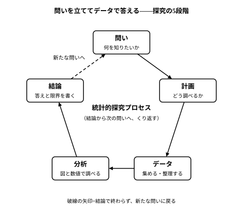

# L06 統計的探究プロセス——問いを立ててデータで答える

- unit_id: hs-math-i-data-analysis
- 位置づけ: 単元第6レッスン（1時間）。「データの散らばりと相関」サブ単元（L01〜L06）の最終回。L01〜L05で手に入れた道具（箱ひげ図・標準偏差・散布図・相関係数・二次元表と層別）を、「問い→計画→データ→分析→結論」の流れの中に置き直す。自作の練習記録を題材に、複数の種類のデータを図と数値で調べ、結論と限界を書くところまでを1回でたどる。L07〜L08（仮説検定の考え方）はこの流れの「結論」の部分を深める。
- distribution_status: published_draft
- license: CC-BY-4.0
- verify_required: 例題数値・記述は監修者検証必須。
- 主概念: ①統計的探究プロセス（問い→計画→データ→分析→結論）の2つの型——仮説検証型と仮説探索型 ②複数の種類のデータを箱ひげ図の並列・散布図で比べ、結論と限界を書くこと

---

## 1. 問い→計画→データ→分析→結論

小学校・中学校の「データの活用」で扱われてきた、次の5つの段階からなる流れを、**統計的探究プロセス**（とうけいてきたんきゅうプロセス）という。

- **問い**——何を知りたいかを1文で決める。
- **計画**——どう調べるか。何を、誰について、どうやって記録するかを決める。
- **データ**——集めて、表に整理する。
- **分析**——図と数値で調べる。箱ひげ図・標準偏差・散布図・相関係数・二次元表など、これまでの道具の出番。
- **結論**——問いへの答えを書く。同時に、この答えの**限界**（どこまで言えて、どこから言えないか）を書く。

この流れは一方向に進むものではない。分析の途中で問いを立て直したり、図を作り直したり、データを集め直したりしながら行き来する。そして結論は、たいてい次の問いを生む——だから図は輪になっている。

問いの立て方には2つの型がある。

- **仮説検証型**（かせつけんしょうがた）——先に「（次の節の大縄跳びなら）2列で跳ぶ方が多く跳べるはずだ」のような仮説を立て、それを確かめるためにデータを集める。
- **仮説探索型**（かせつたんさくがた）——先にデータを眺めて、「後半の記録ほど良くなっているのはなぜか」のように、気づいていなかった問いや仮説を見つける。

どちらも大切で、実際にはひとつの探究の中で両方が現れる。仮説を検証するために集めたデータから新しい問いが見つかり、それが次の探究の仮説になる。

:::guide
**問いが曖昧だと、結論も曖昧になる**

「大縄跳びをうまく跳ぶには？」は問いとしては広すぎて、どんなデータを集めればよいか決まらない。「1列と2列では、どちらの並び方が連続で多く跳べるか」まで絞ると、記録すべき変量（並び方・回数）と比べ方（並び方ごとに回数の分布を比べる）がひとりでに決まる。問いを1文で書けるかどうかは、計画に進んでよいかの目安になる。逆に、分析を終えて結論を書くときは、その1文の問いに答える形で書く——問いと結論を並べて読んで対応していなければ、途中でずれている。
:::

## 2. 例——大縄跳びの練習記録を調べる

あるクラスが、大縄跳び大会に向けて練習している。「並び方は1列がよいか2列がよいか」でもめたので、記録をとって決めることにした（架空の設定・数値）。

**問い**（仮説検証型）: 1列と2列では、どちらの並び方のほうが連続で多く跳べるか。仮説は「2列のほうが多く跳べる」。

**計画**: 20回の試技（1回ごとの挑戦）を行い、試技ごとに「何回目か（試技番号）」「並び方（1列・2列）」「縄の回し手（A・B）」「連続で跳べた回数」を記録する。回し手を記録するのは、並び方以外に回数へ影響しそうな要因として、あとで分けて見られるようにするためである。

**データ**: 20回の記録。

| 試技 | 並び方 | 回し手 | 回数 | | 試技 | 並び方 | 回し手 | 回数 |
|---|---|---|---|---|---|---|---|---|
| 1 | 1列 | A | 8 | | 11 | 1列 | B | 18 |
| 2 | 1列 | A | 12 | | 12 | 2列 | B | 25 |
| 3 | 1列 | B | 10 | | 13 | 1列 | A | 16 |
| 4 | 1列 | A | 15 | | 14 | 2列 | A | 21 |
| 5 | 1列 | B | 11 | | 15 | 2列 | B | 28 |
| 6 | 2列 | A | 14 | | 16 | 1列 | B | 20 |
| 7 | 1列 | B | 17 | | 17 | 2列 | A | 24 |
| 8 | 2列 | B | 19 | | 18 | 2列 | B | 30 |
| 9 | 1列 | A | 13 | | 19 | 2列 | A | 27 |
| 10 | 2列 | A | 22 | | 20 | 2列 | B | 33 |

この表には、数値のデータ（試技番号・回数）と、分類のデータ（並び方・回し手）が1つの試技に紐づいて並んでいる。数値で表されるデータを**量的データ**（りょうてきデータ）、分類で表されるデータを**質的データ**（しつてきデータ）という。数学Ⅰの探究では、この2種類が混ざった「複数の種類のデータ」を扱う。

**分析1——並び方ごとに回数の分布を比べる**（質的×量的）

「並び方」という分類ごとに「回数」という数値の分布を比べるので、L01の**箱ひげ図を並べる**のが定石である。並び方ごとに回数を小さい順に並べ、5つの値（最小値・第1四分位数・中央値・第3四分位数・最大値）を求める（四分位数は中2・L01の方式: 中央値で前後に分け、各半分の中央値をとる）。

1列（10回）: 8, 10, 11, 12, 13, 15, 16, 17, 18, 20
- 最小値 8、第1四分位数 11、中央値 (13＋15)/2 = 14、第3四分位数 17、最大値 20。四分位範囲 6。

2列（10回）: 14, 19, 21, 22, 24, 25, 27, 28, 30, 33
- 最小値 14、第1四分位数 21、中央値 (24＋25)/2 = 24.5、第3四分位数 28、最大値 33。四分位範囲 7。

箱ひげ図に描くと、2列の箱（21〜28）は1列の箱（11〜17）より丸ごと右にあり、2列の第1四分位数 21 が1列の第3四分位数 17 より大きい。つまり、2列は10回のうち8回が 21 回以上、1列は10回のうち8回が 17 回以下で、2列の大半は、1列の大半のどの回よりも多く跳んでいる。仮説「2列のほうが多く跳べる」は、この記録の範囲では支持される。

**分析2——試技番号と回数の関係を見る**（量的×量的）

表を眺めると、後半の試技ほど回数が多いように見える（仮説探索型の気づき）。試技番号 x と回数 y の散布図を描くと点は右上がりに並び、表計算ソフトで相関係数を求めると r ≒ 0.89——強い正の相関である。1列だけ、2列だけで見ても、後の試技ほど回数が多い傾向がある。練習を重ねるうちに慣れてきたことが、その理由の1つとして考えられる。

ここで並び方の列を見直すと、2列の試技は 6, 8, 10, 12, 14, 15, 17, 18, 19, 20 と**後半に集まっている**。すると分析1で見た「2列のほうが多い」には、「2列だから」だけでなく「後半だったから（慣れていたから）」も混ざっている。この2つを、いまのデータで完全に切り分けることはできない。

**結論**: この20回の記録では、2列の回数の分布は1列より全体に大きく（中央値 24.5 回と 14 回）、仮説は支持された。ただし、(1) 2列の試技が後半に多く、慣れの効果と並び方の効果を分けられていないので、「2列だから多く跳べた」と断定はできない。(2) このクラスの20回の記録に限った結果であり、他のクラスや本番でも同じとは限らない。次の計画として、並び方を交互にして（1列・2列・1列・……）同じ回数ずつ試技すれば、どちらの並び方も前半と後半に同じ数ずつ入り、時期の偏りを小さくできる（2列がいつも1列の1回あとになるので、完全に等しくなるとは限らない）。

:::guide
**どの図を使うかは、データの種類の組み合わせで決まる**

比べたい2つの変量が「質的×量的」（並び方と回数）なら、質的な分類ごとに量的な分布を箱ひげ図で並べる。「量的×量的」（試技番号と回数）なら散布図と相関係数。「質的×質的」（問題集の使用と合否）なら二次元表（L05）。この対応を覚えておくと、分析の段階で道具に迷わない。もう1つ、分析2のような「別の要因が混ざっていないか」という確認は、L05の層別と同じ発想である。並び方の効果を見たいときに、回し手や試技の順番といった別の要因が偏っていないかを見る——記録の段階で紐づけてあった項目だけが、この確認に使える。計画の段階で「何を一緒に記録するか」を考えておく理由がここにある。
:::

:::guide
**表計算ソフトを使うときの約束**

20組程度なら手計算できるが、実際の探究ではデータが100組・1000組になることも多く、表計算ソフトが前提になる。平均値・中央値・標準偏差・相関係数はそれぞれ関数1つで求められる（名前はソフトによって少し違うが、多くのソフトで AVERAGE・MEDIAN・STDEV.P・CORREL のような名前である）。ただし2つ注意がある。第一に、分散・標準偏差の関数には「個数で割る」ものと「個数−1で割る」ものがあり、この単元では前者を使う（L04 §5）。第二に、四分位数の求め方はソフトによって異なることがあり、中2・L01の方式（中央値で前後に分ける）と一致しない値が出る場合がある。報告には、どの方式で求めたかを書き添える。機械が出した数値をそのまま写すのではなく、「自分が手で求めたらどうなるか」を1度は確かめておくと、方式の違いによるずれに気づける。
:::

## 3. 手順の型——結論の書き方

探究の結論は、次の5項目を順に書くと、読み手に分かったことと分からないことが伝わる。

1. **問い**を1文で再掲する。
2. **使った道具**——どの図・どの数値で調べたか（例: 並び方ごとの箱ひげ図、中央値、散布図と r）。
3. **分かったこと**——数値を添えて（例: 中央値は2列 24.5 回、1列 14 回）。
4. **限界**——少なくとも次の2つを点検する。①**標本の限界**: このデータは何について・何組の記録か。他の集団や場面にそのまま当てはめてよいか。②**因果の限界**: 分かったのは「一緒に動く」ことか、「原因である」ことか（L05）。別の要因（慣れ・回し手・外れ値）が混ざっていないか。
5. **次の問い・次の計画**——限界を減らすには、次に何をどう記録すればよいか。

## 4. 練習

**問1** 次の(1)〜(3)は、仮説検証型・仮説探索型のどちらか。
(1) 「通学時間が長い生徒ほど睡眠時間が短い」という予想を確かめるため、40人に通学時間と睡眠時間をたずねた。
(2) 図書室の貸出記録を眺めていて、火曜日だけ貸出冊数が少ないことに気づき、理由を調べ始めた。
(3) 「新しい練習メニューで 50 m 走のタイムが縮む」という予想を確かめるため、メニューの前後でタイムを測った。

**問2** §2 の1列・2列それぞれについて、L01の判定（第1四分位数 − 1.5×四分位範囲 未満、または 第3四分位数 ＋ 1.5×四分位範囲 超）で外れ値があるかを調べよ。

**問3** §2 のデータを回し手で層別する。回し手A・回し手Bそれぞれについて、1列の回数の中央値と2列の回数の中央値を求め、「2列のほうが多く跳べる」という結論が回し手ごとに見ても成り立つかを答えよ。

**問4** §2 の回し手について、回し手Aと回し手Bの回数の中央値を求めよ（並び方は区別しない）。また、「回し手Bのほうが上手だ」と結論してよいか。問3の結果と、A・Bそれぞれの試技が前半・後半のどちらに多いかに注意して、2〜3文で答えよ。

**問5** §2 の結論には「他のクラスや本番でも同じとは限らない」と書いた。このクラスの結果を学校全体の大縄跳びの結論として使うときに、どんな限界があるか。§3 の「標本の限界」の観点から1〜2文で答えよ。

---

:::stretch
**S1** §2 のデータについて、次に答えよ。
(1) 試技番号 x と回数 y の相関係数が r ≒ 0.89 であることを、表計算ソフト（または L04 の手順）で確かめよ。
(2) 「並び方を交互にして同じ回数ずつ試技する」という次の計画は、慣れの効果をどう扱っていることになるか。「層別」の言葉を使わずに、2〜3文で説明せよ。
(3) 交互にしてもなお残る限界を1つ挙げよ。
:::

対応解答: answer_key_L04-06.md

<!-- gen_nav:nav:start（自動生成・手編集しない） -->

---

[← 前のレッスン](lesson_05.md)｜[単元の目次](README.md)｜[解答](answer_key_L04-06.md)｜[次のレッスン →](lesson_07.md)

<!-- gen_nav:nav:end -->
