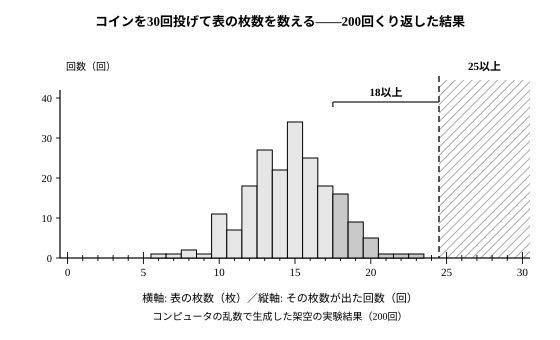

# L07 仮説検定の考え方①——「偶然で説明できるか」を実験で測る

- unit_id: hs-math-i-data-analysis
- 位置づけ: 単元第7レッスン（1時間）。「仮説検定の考え方」サブ単元（L07〜L08）の1本目。L06で、探究の結論には限界を書き添えるところまで来た。この回は「30人中24人が記録を伸ばした」のような結果から「効果がある」と主張してよいかを、「偶然だけでこの結果以上になることは、どれくらい起こりやすいか」という問いに置き換え、コイン投げの実験（§3 の結果表）で測る。中1の「多数回の試行の相対度数」と中3の「標本のゆらぎ」を呼び戻す。判断の手順と、その限界はL08で扱う。
- distribution_status: published_draft
- license: CC-BY-4.0
- verify_required: 例題数値・記述は監修者検証必須。
- 主概念: ①「30人中24人」型の主張と、偶然だけで起こる場合の分布（コイン30回投げ×200回の結果表（§3）） ②相対度数を「起こりやすさ」の尺度にする

---

## 1. 2つの主張——「30人中24人」と「30人中18人」

ある高校の運動部で、新しい練習法を2つ試すことになった（架空の設定・数値）。部員を30人ずつの2つのグループに分け、一方は練習法P、もう一方は練習法Qを1か月続け、その前後で体力テストの記録を比べた。結果は次のとおりである。

- 練習法P: 30人のうち **24人** が、1か月前より記録を伸ばした。
- 練習法Q: 30人のうち **18人** が、1か月前より記録を伸ばした。

これを見て、部員たちは次の2つの主張を立てた。

- **主張A**「練習法Pには効果がある。30人中24人も記録を伸ばしたのだから」
- **主張B**「練習法Qにも効果がある。30人中18人、半分より多くが記録を伸ばしたのだから」

ここで、慎重な部員が口をはさむ。「練習法に効果がまったくなくても、記録はその日の調子で上がったり下がったりする。たまたま伸びた人が多かっただけ、ということはないだろうか」。

もっともな疑問である。練習法に効果がないとしたら、部員1人1人の記録が伸びるか伸びないかは、その日の調子のような**偶然**で決まる。そのとき、伸びる人と伸びない人は**半々**になると考えるのが自然だろう（この「半々」は1つの仮定であり、あとで見直す）。半々なら、30人のうち伸びるのは15人前後のはずだ。では、24人はどうか。18人はどうか。偶然だけでもこれくらいの人数になることは、あるのか、ないのか。

問いを、次の形にとらえ直す。

> 練習法に効果がなく、偶然だけで決まるとしたら、30人のうち **24人以上** が記録を伸ばすことは、どれくらい起こりやすいか。同じく、**18人以上** はどれくらい起こりやすいか。

「24人」ではなく「24人以上」と問うことには理由がある（§4で確かめる）。この問いに答えるには、「効果がない世界」で30人を調べることを、何度もくり返してみればよい。

## 2. 「効果がない世界」を、コインで作る

実際の部員で「効果がない世界」を作ることはできない。しかし、**半々で起こる出来事なら、コインで代用できる**。コインを1枚投げて、表が出たら「その部員は記録を伸ばした」、裏が出たら「伸びなかった」とみなす。コインを30回投げれば、「効果がない世界で30人を調べた」1回分になり、表の枚数が、その回の「記録を伸ばした人数」にあたる。コインは1回ごとに別々に表・裏が決まるから、この置き換えでは、部員の結果も1人ずつ別々に決まり、だれかの結果につられてほかの部員の結果が一緒に動くことはない、とみなしている（これも1つの仮定であり、あとで見直す）。

これを多数回くり返せば、「効果がない世界」で「伸びた人数」がどう散らばるかが分かる。中1で、多数回の試行の結果を相対度数に整理して、不確実な出来事の起こりやすさの傾向を読み取った——あのやり方を、ここでもう一度使う。

もう1つ、中3の標本調査で見たことを思い出そう。同じ母集団（調べたい全体）から同じ大きさの標本（その一部）をとっても、標本の平均値は毎回違った（この教材では、これを標本のゆらぎと呼んでいる）。コインでも同じで、同じ「30回投げ」をくり返しても、表の枚数は毎回同じになるとは限らず、回によって変わる。だから1回や2回の実験では足りない。散らばり方が見えてくるまで、何十回・何百回とくり返す必要がある。

:::guide
**なぜ「効果がある世界」ではなく「効果がない世界」を作るのか**

主張Aを確かめたいのだから、「練習法Pに効果がある世界」を作って調べたくなる。しかし「効果がある」世界は1つに決まらない——わずかな効果から大きな効果まで無数にあって、コインの表が出る割合をいくつにすればよいか決めようがない。一方「効果がない」世界は、ここでは「伸びるか伸びないかが半々」と仮定することで、比べるための世界を1つに決められる。だから、コインで作れる。そこで、主張そのものではなく**主張の否定**（効果がない）の世界を作り、そこで「24人以上」がどれくらい起こるかを測る。もし「効果がない世界」ではめったに起こらないことが実際には起こったのなら、「効果がない」という前提のほうを疑う根拠になる。この考え方の筋道は、L08で型にする。

ただし「効果がなければ半々」という仮定そのものは、場面をよく見て置かなければならない。たとえば体力テストを2回受けると、練習法と関係なく2回目はやり方に慣れて記録が伸びやすいかもしれない。そのときは「効果がなくても伸びる人のほうが多い」のだから、半々のコインは「効果がない世界」を正しく写していない。実験の設計は、この仮定が場面に合っているかを確かめるところから始まる。
:::

## 3. 実験——コインを30回投げる試行を、200回くり返す

コインを30回投げる試行を200回くり返し、各回の表の枚数を記録した結果表を、次に示す。実際のコインではなく、コンピュータの乱数（1回ごとに表と裏が同じ出やすさになるように作ったコンピュータのくじ。結果の枚数がちょうど半々にそろうという意味ではない）で生成した架空の実験結果である。実験の順に、1行に20回分ずつ並べてある。

| 回 | | | | | | | | | | | | | | | | | | | | |
|---|---|---|---|---|---|---|---|---|---|---|---|---|---|---|---|---|---|---|---|---|
| 1〜20 | 10 | 16 | 22 | 15 | 16 | 15 | 15 | 16 | 15 | 17 | 20 | 19 | 18 | 15 | 14 | 14 | 12 | 10 | 15 | 17 |
| 21〜40 | 17 | 12 | 16 | 16 | 18 | 16 | 17 | 14 | 16 | 17 | 12 | 13 | 17 | 13 | 17 | 15 | 12 | 15 | 12 | 20 |
| 41〜60 | 14 | 16 | 20 | 13 | 12 | 16 | 18 | 13 | 12 | 14 | 17 | 15 | 14 | 15 | 15 | 17 | 20 | 16 | 16 | 12 |
| 61〜80 | 16 | 13 | 17 | 15 | 14 | 14 | 19 | 13 | 12 | 8 | 14 | 13 | 13 | 13 | 23 | 14 | 10 | 15 | 19 | 14 |
| 81〜100 | 18 | 13 | 11 | 18 | 19 | 8 | 14 | 13 | 15 | 16 | 11 | 13 | 15 | 18 | 17 | 13 | 7 | 13 | 15 | 18 |
| 101〜120 | 18 | 16 | 18 | 6 | 15 | 17 | 12 | 12 | 19 | 15 | 18 | 18 | 10 | 14 | 15 | 18 | 15 | 12 | 18 | 13 |
| 121〜140 | 16 | 13 | 10 | 19 | 15 | 16 | 17 | 15 | 9 | 16 | 15 | 15 | 19 | 14 | 16 | 13 | 12 | 13 | 13 | 16 |
| 141〜160 | 19 | 13 | 18 | 14 | 15 | 15 | 18 | 12 | 15 | 14 | 12 | 16 | 17 | 13 | 14 | 13 | 18 | 15 | 14 | 10 |
| 161〜180 | 17 | 15 | 16 | 15 | 12 | 11 | 17 | 10 | 16 | 15 | 10 | 13 | 15 | 16 | 16 | 10 | 11 | 13 | 17 | 19 |
| 181〜200 | 14 | 10 | 13 | 14 | 12 | 12 | 11 | 11 | 13 | 15 | 15 | 14 | 16 | 21 | 17 | 10 | 20 | 13 | 11 | 14 |

（表の枚数。単位は枚。1回の試行はコイン30回投げ）

この表を、表の枚数ごとに何回出たかを数えた**度数分布表**に整理すると、次のようになる（0〜5枚と24〜30枚は0回）。

| 表の枚数 | 6 | 7 | 8 | 9 | 10 | 11 | 12 | 13 | 14 | 15 | 16 | 17 | 18 | 19 | 20 | 21 | 22 | 23 | 計 |
|---|---|---|---|---|---|---|---|---|---|---|---|---|---|---|---|---|---|---|---|
| 回数 | 1 | 1 | 2 | 1 | 11 | 7 | 18 | 27 | 22 | 34 | 25 | 18 | 16 | 9 | 5 | 1 | 1 | 1 | 200 |

ヒストグラムを見ると、表の枚数は15枚を中心に山の形に散らばり、山から離れるほど回数が減っている。最も少なかったのは6枚、最も多かったのは23枚で、200回のうち一度も24枚以上にはならなかった。「偶然だけの世界」でも、ちょうど15枚にならないことのほうがずっと多い——それでも、山のすそは急に低くなる。

:::guide
**自分で実験するなら——結果は変わる、変わってよい**

この表は、教材が用意した1つの実験結果にすぎない。コインを実際に30回投げる、さいころの偶数・奇数を表・裏の代わりにする、表計算ソフトの乱数機能を使う——どの方法でもよいので、自分でも何回か試してみてほしい（表計算なら、調べるフレーズ例:「表計算 乱数 コイン シミュレーション」）。自分の結果は、上の表と細かい数値までは一致しないのがふつうだ。上の表を作った乱数を別の値から始めても、ふつうは違う表になる。**違ってよい**。見るべきなのは個々の数値ではなく、「15枚前後に山ができて、24枚以上はほとんど出ない」という傾向が、自分の実験でも現れるかどうかである。中3の標本調査で学んだ「値が資料と一致するかではなく、手順が正しく実行できたかで答え合わせをする」という心得と同じである。
:::

## 4. 数える——24枚以上は何回、18枚以上は何回か

度数分布表から数える。

- **24枚以上**の欄は、すべて0回。つまり200回のうち **0回**。相対度数は 0/200 = **0**。
- **18枚以上**は、18枚が16回、19枚が9回、20枚が5回、21枚・22枚・23枚が1回ずつで、合計 16＋9＋5＋1＋1＋1 = **33回**。相対度数は 33/200 = **0.165**。

中1で学んだとおり、多数回の試行における相対度数は、その出来事の**起こりやすさ**を表す数として使える。ここでは、次の2つの起こりやすさが分かったことになる。

- 偶然だけで「30人のうち24人以上が伸びる」ことの起こりやすさ: 200回の実験で一度もなかった（相対度数 0）。
- 偶然だけで「30人のうち18人以上が伸びる」ことの起こりやすさ: 相対度数 0.165、およそ6回に1回。

主張Aについて。効果がない世界で200回調べても、24人以上が伸びることは一度も起こらなかった。「たまたま伸びた人が多かっただけ」という説明は、非常に起こりにくいことを引き受けなければならない。つまり、24人という結果は**偶然だけでは説明しにくい**。

主張Bについて。効果がない世界でも、18人以上が伸びることは6回に1回ほど、ふつうに起こる。18人という結果は偶然でも十分に説明がつくので、「効果がある」と言い切る根拠にはならない（ただし「効果がない」と決まったわけでもない——この言い方の慎重さは、L08で扱う）。

このように、観測した結果（24人・18人）**以上**になる相対度数 p を求め、その大小で「偶然で説明できるか」を測る。この p が、この単元の最後の道具である。

:::guide
**なぜ「24枚ちょうど」ではなく「24枚以上」を数えるのか**

問いは「24人という結果は、偶然にしては多すぎるか」だった。もし結果が25人や26人だったら、主張Aはもっと強くなるはずで、「多すぎる」の度合いも上がる。だから「24人以上のどれかになる」ことの起こりやすさを見るのが、問いに合っている。一方「24枚ちょうど」の相対度数が答えるのは「ちょうど24枚になる起こりやすさ」という別の問いである。たとえば山の頂上の「15枚ちょうど」は200回中34回で、相対度数は0.17。これは「15枚になる」起こりやすさを表す数であって「15枚は多すぎるか」に答える数ではない。「多すぎるか」を問うときは、それ以上に多い結果もまとめて数える。「以上」で数えることには、もう1つ意味がある。「24人以上」は「23人以下」の反対側の全部で、山のすそを丸ごと切り取ることになる——「偶然にしては極端すぎる側」をひとまとめに見ているのである。
:::

:::guide
**「0回」は「絶対に起こらない」ではない**

24枚以上は200回で0回だったが、これを「効果がなければ24人以上になることは絶対にない」と読んではいけない。0回になったのは、200回という回数の中でのことだ。もっと多くくり返せば、24枚以上が何回か出ると考えるのが自然である（山のすそは急に低くなるが、23枚は1回出ている）。実験で得た相対度数 p は、本当の起こりやすさの**見積もり**であって、実験の回数を増やすほど安定する——中3で「標本を大きくすると、標本の平均値のばらつきは小さくなる傾向がある」と観察したのと同じ現象だ。だから「0」は「200回では一度も起こらないほど、非常に起こりにくい」と読む。同じ理由で、18枚以上の0.165も「およそ0.17くらい」の見積もりであり、別の200回でも33回になるとは限らない。細かい数値より、「大きいか小さいか」を読み取るのが p の使い方である。
:::

## 5. 手順の型——「偶然で説明できるか」を測る

このレッスンでやったことを、手順にまとめる。判断の基準と結論の言い方はL08で足すので、ここは「測る」ところまでである。

1. 主張を「偶然だけでも、この結果以上になることは起こりやすいか」という問いに置き換える。
2. 「効果がない世界」を作る。半々で決まる出来事なら、コインの表・裏で代用する（この「半々」と、結果が1つずつ別々に決まって一緒に動かないとみなせることが、場面に合っているかを確かめる）。
3. コインを n 回投げる試行（n は調べた人数・回数）を、多数回くり返す。結果を度数分布表とヒストグラムに整理する。
4. 観測した値**以上**になった回数を数え、相対度数 p を求める。p が小さいほど、その結果は偶然だけでは説明しにくい。

## 6. 練習

**問1** §3の度数分布表を使って、次の回数と相対度数を求めよ。
(1) 表の枚数が20枚以上だった回数と、その相対度数。
(2) 表の枚数が16枚以上だった回数と、その相対度数。

**問2** 同じ運動部で、別のグループ30人が練習法Rを試したところ、22人が記録を伸ばした。「練習法Rには効果がある」という主張について、効果がなく偶然だけで決まるとしたときに「30人のうち22人以上が伸びる」ことの起こりやすさを、§3の結果表から相対度数で求めよ。また、この状況は主張Aと主張Bのどちらに近いか、相対度数の大小（0 かどうかではなく、「ふつうに起こる」水準と比べて大きいか小さいか）で理由をつけて答えよ。

**問3** さらに別のグループ30人が練習法Sを試したところ、記録を伸ばした人は7人しかいなかった。ある部員は「練習法Sは逆効果だ」と主張した。効果がなく偶然だけで決まるとしたときに「30人のうち伸びた人が7人以下」になることの起こりやすさを、§3の結果表から相対度数で求めよ。（「逆効果」の主張なので、少ない側のすそ「7人以下」で数える）

**問4** 主張Aを調べるとき、「表が24枚ちょうど」ではなく「表が24枚以上」の回数を数えた理由を、2〜3文で説明せよ。

**問5** 次の言い方は、どこが行きすぎか。1〜2文で指摘せよ。「200回の実験で24枚以上は一度も出なかった。だから、練習法に効果がなければ、30人のうち24人以上が伸びることは絶対にない」。また、同じ実験を200回ではなく1000回くり返したとしたら、24枚以上の回数と相対度数はどうなると予想できるか、1文で答えよ。

---

:::stretch
**S1** §3の度数分布表から、200回の表の枚数の平均値 m を求めよ（各枚数×回数の合計を200で割る。表計算ソフトを使ってよい）。求めた m と、コイン30回投げの「半分」にあたる15枚を比べ、また「ちょうど15枚」だった回数とその相対度数を求めて、「偶然だけの世界」について気づくことを1〜2文で述べよ。
:::

対応解答: answer_key_L07-08.md

<!-- gen_nav:nav:start（自動生成・手編集しない） -->

---

[← 前のレッスン](lesson_06.md)｜[単元の目次](README.md)｜[解答](answer_key_L07-08.md)｜[次のレッスン →](lesson_08.md)

<!-- gen_nav:nav:end -->
