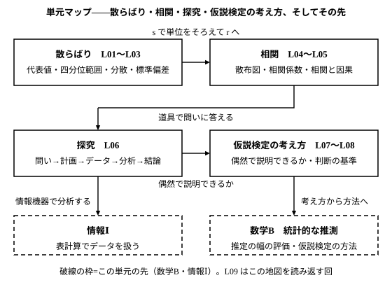

# L09 単元のまとめ——データから主張へ

- unit_id: hs-math-i-data-analysis
- 位置づけ: 単元第9レッスン（1時間）。L01〜L08の統合演習・総括回。**本線では新しい概念・新しい用語は立てない**（§5の数学Bへの予告で、語を1つ紹介する枠を除く）。親単元「データの分析」直属の章末相当（どの子単元にも属さない）——単元全体をふり返り、次の科目への接続を確かめる。
- distribution_status: published_draft
- license: CC-BY-4.0
- verify_required: 例題数値・記述は監修者検証必須。
- 主概念: ①道具の1枚地図（散らばり→相関→探究→仮説検定の考え方） ②数学B「統計的な推測」への予告（考え方から方法へ）・情報Ⅰとの関連

---

## 1. 単元の地図——4つの道具箱をたたみ直す

この単元で手に入れた道具は、4つの箱に分けて並べられる。L08まで歩き終えたいま、それぞれを自分の言葉で言えるかどうかが、この総括回の出発点になる。

- **散らばり**（L01〜L03）: 中学の代表値・四分位範囲・箱ひげ図に**外れ値**の基準を足し、散らばりを1つの数にした。各値と平均値 m の差（偏差）の2乗の平均が**分散** s²、その正の平方根が**標準偏差** s（分散が 0 のときは 0）で、s は元の単位に戻る。m の両側に 2s ずつとった「2s の帯」に、L02 の20人のデータでは大半（19人）が入った（どんなデータでも同じ割合になるわけではない）。全員に同じ数を足しても s は変わらず、正の数 a を掛けると s は a 倍になる（負の数を掛ける場合は L03 の stretch）。
- **相関**（L04〜L05）: 2つの変量を散布図で見て、偏差の積の平均（共分散）を sx×sy で割った**相関係数** r（−1≦r≦1）で「一緒に動く」度合いを測った。r は因果を判定しない。外れ値1点で r は大きく動き、表の切り方（層別）で見え方が逆転することがある。
- **探究**（L06）: 問い→計画→データ→分析→結論。データの種類の組み合わせで図を選び（質的×量的は箱ひげ図の並列、量的×量的は散布図、質的×質的は二次元表）、結論には限界（標本・因果）を書く。
- **仮説検定の考え方**（L07〜L08）: 「この結果は偶然だけで説明できるか」を、主張の否定（効果がない・半々）の世界をコインで作って実験し、観測した結果以上の相対度数 p を求めて、前もって決めた基準で判断する。基準(a)では p を 0.05 と比べ（0.05 以下か）、基準(b)では観測した値を、実験結果の平均値 m から 2s の位置と比べる（2s より外か）。結論は「偶然だけでは説明しにくい」か「判断を保留する」。

このレッスンでは、新しいことを何も足さない。4つの箱を例題で1つずつ確かめ直し、箱どうしのつながりを見て、単元をたたむ。

:::guide
**中学から持ってきた道具と、高校で新しく入った道具を分ける**

単元の終わりに内容を数え上げるのは、暗記のためではない。「どこが新しかったか」が言えると、復習の効きどころが変わるからだ。代表値・範囲・四分位範囲・箱ひげ図・相対度数・標本のゆらぎは中学から持ってきた道具で、思い出せば動く。この単元で新しく入ったのは、分散・標準偏差・散布図・相関係数と、仮説検定の考え方——それに、外れ値の判定基準と統計的探究プロセスの型である。4つの箱のどれかの説明につまったら、そこが再訪先になる。四分位範囲・箱ひげ図・外れ値の線引きなら L01 へ、s の意味があやしければL02へ、r の作り方ならL04へ、r の読み違えと結論の限界ならL05〜L06へ、p の求め方と判断の言い方ならL07〜L08へ。逆に4つとも自分の言葉で説明できるなら、この単元は「覚えた」のではなく「つながった」状態にある。
:::

## 2. 散らばり——1つの数にする

散らばりの箱の総仕上げとして、L01〜L03の道具を1つのデータで通す。

**例題1** 10人の生徒の、1週間の自習時間（時間・架空のデータ・小さい順）は次のとおりである。

14, 18, 18, 19, 20, 20, 21, 22, 22, 26

(1) 中央値・第1四分位数・第3四分位数・四分位範囲を求め、外れ値があるかを調べよ。
(2) 平均値 m・分散 s²・標準偏差 s を求めよ。
(3) 2s の帯（m−2s 以上 m＋2s 以下）に入る人数を答えよ。
(4) 別のクラスの10人は m=20（時間）、s=6（時間）であった。2つのクラスの自習時間の散らばりを比べて1文で述べよ。

(1) 10個だから中央値は5番目と6番目の平均で (20＋20)/2=20。前半 14, 18, 18, 19, 20 の中央値は3番目の 18（第1四分位数）、後半 20, 21, 22, 22, 26 の中央値は 22（第3四分位数）。四分位範囲は 22−18=4。外れ値の基準は、下の線が 18−1.5×4=12、上の線が 22＋1.5×4=28。12 未満も 28 超もないので、外れ値はない。

(2) 合計は 200 で m=200/10=20（時間）。偏差は −6, −2, −2, −1, 0, 0, 1, 2, 2, 6 で、和は 0（検算）。偏差の2乗は 36, 4, 4, 1, 0, 0, 1, 4, 4, 36 で、和は 90。分散 s²=90/10=9（時間²）、標準偏差 s=√9=3（時間）。

(3) 2s の帯は 20−6=14 以上 20＋6=26 以下。最小値 14 と最大値 26 は帯の端にちょうど乗るので帯の中に入り、10人全員が帯の中である。

(4) 平均値は同じ 20 時間だが、標準偏差は 3 時間と 6 時間で、別のクラスのほうが散らばりが2倍大きい。

検算は別経路で。分散は「値の2乗の平均−平均値の2乗」でも求められる（L02）。値の2乗の和は 196＋324＋324＋361＋400＋400＋441＋484＋484＋676=4090、その平均 409 から 20²=400 を引いて 9——一致する。

ふり返ると、(1)は中学の道具に外れ値の基準を足したもの（L01）、(2)(3)は高校で新しく入った道具（L02）、(4)は s を「比べる」ために使う場面（L03）である。中央値 20 と平均値 20 が一致し、分布が左右にほぼ対称なので、この例では四分位範囲でも標準偏差でも散らばりを語れる。分布が非対称なら中央値と四分位範囲を優先する——この使い分け（L03）も忘れないでおこう。

## 3. 相関——「一緒に動く」を数にする

**例題2** ある店の5日間の、最高気温 x（℃）と温かい飲み物の売上 y（本）は次のとおりである（架空のデータ）。相関係数 r を求め、相関の向きと強さを言葉で述べよ。

| 日 | 1 | 2 | 3 | 4 | 5 |
|---|---|---|---|---|---|
| x（℃） | 23 | 24 | 25 | 26 | 27 |
| y（本） | 31 | 32 | 30 | 28 | 29 |

L04の手順の型で、偏差・2乗・積の列を作る。x の平均 mx=125/5=25、y の平均 my=150/5=30。

| 日 | x の偏差 | y の偏差 | x の偏差の2乗 | y の偏差の2乗 | 偏差の積 |
|---|---|---|---|---|---|
| 1 | −2 | 1 | 4 | 1 | −2 |
| 2 | −1 | 2 | 1 | 4 | −2 |
| 3 | 0 | 0 | 0 | 0 | 0 |
| 4 | 1 | −2 | 1 | 4 | −2 |
| 5 | 2 | −1 | 4 | 1 | −2 |
| 合計 | 0 | 0 | 10 | 10 | −8 |

偏差の合計はどちらも 0（検算）。x の分散 10/5=2 だから sx=√2、y の分散 10/5=2 だから sy=√2。共分散は −8/5=−1.6。よって

r = −1.6 ÷ (√2×√2) = −1.6/2 = **−0.8**

負の相関で、−1 にかなり近いから強い。「気温が高い日ほど、温かい飲み物の売上は少ない傾向がある」。

検算: −1≦r≦1 の範囲に入っている。散布図を描くと、点は右下がりに並ぶ（日2の (24, 32) と日4の (26, 28) が並びから少し外れる）ので、値と図の印象が合う。

ここで言えるのは「一緒に動く」ことまでである。気温が売上の原因だと考えるのは自然だが、この5日分の表だけからは、曜日や天気など別の要因が混ざっている可能性を消せない（L05）。相関係数を出したら、散布図に戻り、因果と読んでよいかを別に考える——この2つの習慣が、相関の箱の中身だった。

:::guide
**s で単位をそろえるから、r は箱をまたいで使える**

例題2で、共分散 −1.6 をそのまま「強さ」と読まなかったのはなぜか。共分散は x と y の単位（℃×本）を抱えていて、売上を「本」から「ダース」に変えるだけで値が変わるからだ（L04）。そこで sx と sy で割って単位を消し、−1 から 1 の間に収まる r にした。この「標準偏差で割って単位をそろえる」は、散らばりの箱の道具 s を、相関の箱で使い回している場面である。単元マップの矢印「s で単位をそろえて r へ」は、このことを指している。同じように、仮説検定の考え方の基準「平均から 2s より外」も、散らばりの箱の 2s の帯を使い回している。4つの箱は別々の引き出しではなく、1枚の地図の隣どうしなのだ。
:::

## 4. 探究と仮説検定の考え方——問いから主張へ

**例題3** ある運動部が、新しいストレッチ法を1か月続けると体力テストの記録が伸びるかを調べた（架空の設定・数値）。

- **問い**（仮説検証型）: 新しいストレッチ法を1か月続けると、記録は伸びるか。
- **計画**: 部員30人がストレッチ法を1か月続け、前後の記録を比べて、伸びた人数を数える。
- **データ**: 30人のうち **23人** が記録を伸ばした。
- **分析**: 「効果がなく偶然だけで決まる（伸びる・伸びないは半々）」と仮定して、コインを30回投げる試行を200回くり返した結果（L07の度数分布表。0〜5枚と24〜30枚は0回）で、23枚以上の相対度数 p を求め、前もって決めた基準（p が 0.05 以下・平均から 2s より外）で判断する。

| 表の枚数 | 6 | 7 | 8 | 9 | 10 | 11 | 12 | 13 | 14 | 15 | 16 | 17 | 18 | 19 | 20 | 21 | 22 | 23 | 計 |
|---|---|---|---|---|---|---|---|---|---|---|---|---|---|---|---|---|---|---|---|
| 回数 | 1 | 1 | 2 | 1 | 11 | 7 | 18 | 27 | 22 | 34 | 25 | 18 | 16 | 9 | 5 | 1 | 1 | 1 | 200 |

23枚以上は 1回で、p=1/200=0.005。0.05 以下だから基準(a)に達する。200回の表の枚数は m=14.705、s≒2.83 で m＋2s≒20.36 だから、23枚は帯の外にあり、基準(b)にも達する。

- **結論**: 30人中23人が伸びたという結果は、偶然だけでは説明しにくい（p=0.005・平均から 2s より外）。ストレッチ法に効果があるという主張を支持する根拠が得られた。ただし、(1) 伸びた原因がストレッチ法なのか、テストへの慣れや季節の変化なのかは、この調べ方では分けられない。(2) 「効果がなければ半々」という仮定は、慣れで2回目が伸びやすいなら崩れる。(3) この部の30人の結果であり、他の集団でも同じとは限らない。次の計画として、ストレッチ法を行うグループと行わないグループに分けて同じ期間で比べれば、(1)(2)の限界を減らせる。

探究の結論（L06）と仮説検定の考え方の結論（L08）は、こうして1つの文章になる。「分かったこと」を数値つきで書き、「限界」を並べ、「次の計画」を添える——書き方の型は同じである。

:::guide
**「偶然で説明できるか」は、探究の「分析」と「結論」をつなぐ**

単元マップで、仮説検定の考え方は探究の箱の右隣にあり、矢印には「偶然で説明できるか」と書いてある。探究の分析で「2列のほうが多く跳べた」「23人が伸びた」と分かっても、それが偶然でも起こる程度の差なのか、偶然にしては大きすぎる差なのかが言えなければ、結論は「今回はそうだった」で止まる。仮説検定の考え方は、その一歩を踏み出すための道具である。ただし道具が答えてくれるのは「偶然だけでは説明しにくいか」までで、原因が何か・他の集団でも同じかは答えてくれない。だから結論の型では、p の判断の**後ろに**限界を並べる。探究プロセスの「分析」で p を求めて基準と比べ、その判断を「結論」で言葉にして限界を並べると、例題3の文章になる。
:::

## 5. この先へ——地図の矢印の先

単元マップからは、2本の矢印が外へのびている。

**数学B「統計的な推測」へ——考え方から方法へ。** この単元の仮説検定の考え方は、3つの点で「考え方」の水準にとどめてある。第一に、「偶然だけの世界」での起こりやすさ p を、コインの実験の相対度数で見積もった。数学Bでは、実験をしなくても、確率の計算で p の値を求める方法を学ぶ。第二に、L08で「主張の否定（効果がない）」と呼んだ仮定には、数学Bで**帰無仮説**（きむかせつ）という名前がつき、基準の決め方と判断の手順が定式化される。第三に、中3の標本調査で「標本から母集団を推定する」ことを学び、「高校でもっと精密に評価できるようになる」と予告されていた——推定の幅を精密に評価する方法も数学Bで学ぶもので、この単元では扱っていない。このうち第一と第二は、L07〜L08で身につけた「主張の否定の世界で、観測した結果以上の起こりやすさを測る」という筋道の上に載る。

**情報Ⅰへ——情報機器で分析する。** この単元で、表計算ソフトに任せてよい規模だと何度か書いた（L02・L06・L08）。情報Ⅰの「情報通信ネットワークとデータの活用」では、表計算などの情報機器を使ってデータを整理し分析することを扱い、この単元の道具（平均値・標準偏差・相関係数・度数分布）はそこでもそのまま使う。

## 6. まとめ問題

問1は散らばり（L01〜L03）、問2は相関（L04〜L05）、問3は探究（L06）、問4は仮説検定の考え方（L07〜L08）の問題である。手が止まったら、その箱のレッスンに戻って確かめてから再挑戦しよう。

**問1** 6人の生徒の、ある月の図書室の利用回数（回・架空のデータ・小さい順）は 12, 13, 15, 16, 16, 18 である。
(1) 平均値 m、分散 s²、標準偏差 s を求めよ。
(2) 2s の帯（m−2s 以上 m＋2s 以下）の範囲を求め、帯の中に入る人数を答えよ。
(3) 翌月、6人全員が利用回数を 2 回ずつ増やした。翌月の m と s を、計算し直さずに答えよ。

**問2** 5人の生徒の、1週間の読書時間 x（時間）と国語の小テストの得点 y（点）は次のとおりである（架空のデータ）。

| 生徒 | 1 | 2 | 3 | 4 | 5 |
|---|---|---|---|---|---|
| x（時間） | 3 | 4 | 5 | 6 | 7 |
| y（点） | 8 | 11 | 10 | 9 | 12 |

(1) 相関係数 r を求め、相関の向きと強さを言葉で答えよ。
(2) 「読書時間を増やせば、得点は上がる」と結論してよいか。1〜2文で答えよ。

**問3** ある部で、従来の練習法を続けた12人と、新しい練習法に切り替えた12人について、1か月間の記録の伸び（回・架空のデータ）を箱ひげ図に整理したところ、最小値・第1四分位数・中央値・第3四分位数・最大値は次のとおりであった。

| | 最小値 | 第1四分位数 | 中央値 | 第3四分位数 | 最大値 |
|---|---|---|---|---|---|
| 従来の練習法（12人） | −2 | 0 | 2 | 4 | 7 |
| 新しい練習法（12人） | −1 | 2 | 4 | 6 | 9 |

(1) 中央値と四分位範囲を比べて、2つの箱ひげ図から読み取れることを1〜2文で述べよ。
(2) 「新しい練習法のほうが記録が伸びる」と結論するときに、書き添えるべき限界を2つ挙げよ（ヒント: 誰がどちらの練習法を選んだのか。何人の記録か）。

**問4** 別の部で、新しい練習法を試した30人のうち19人が記録を伸ばした。
(1) 「効果がなければ半々」と仮定し、§4の度数分布表を使って「30人のうち19人以上が伸びる」相対度数 p を求め、基準(a)（p が 0.05 以下）と基準(b)（m＋2s≒20.36 の外）で「新しい練習法には効果がある」という主張を判断せよ。
(2) (1)の判断が「判断を保留する」になった場合、それは「新しい練習法には効果がない」という意味か。1〜2文で答えよ。
(3) 同じ割合のまま人数を増やして、60人のうち38人が伸びたとしたら、判断は変わりうるか。何を調べ直せばよいかを含めて1〜2文で答えよ。

---

:::stretch
**S1** §4の度数分布表から、200回の表の枚数の標準偏差 s を手計算で確かめよう。「値の2乗の平均−平均値の2乗」（L02）を使う。各枚数の2乗×回数の合計を求め（表計算ソフトを使ってよい）、200で割って値の2乗の平均を出し、そこから平均値 m=14.705 の2乗を引いて分散を求め、その正の平方根を s とせよ。L08で表計算に任せた s≒2.83 と一致するかを確かめよ。
:::

対応解答: answer_key_L09.md

<!-- gen_nav:nav:start（自動生成・手編集しない） -->

---

[← 前のレッスン](lesson_08.md)｜[単元の目次](README.md)｜[解答](answer_key_L09.md)

<!-- gen_nav:nav:end -->
