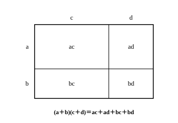

# L01 多項式の整理と展開——1つの文字に着目する

- unit_id: hs-math-i-numbers-and-expressions
- 位置づけ: 単元第1レッスン（2時間）。数学Ⅰ最初のレッスン。中学の式の計算を用語からそろえ直し、「1つの文字に着目する」という高校の新しい見方への入口をつくる。
- distribution_status: published_draft
- license: CC-BY-4.0
- verify_required: 例題数値・記述は監修者検証必須。
- 主概念: ①1つの文字に着目した整理（次数・係数の見方） ②中3の4公式による展開の復習

---

## 1. 数学Ⅰの入口——中学の学びとつながっている

高校の数学は、この「数と式」の単元から始まる。ここで扱う内容の多くは、中学で一度出会ったものだ。だから「全部を新しく覚え直す」必要はない。ただし、既習に見える風景の中に、新しい枠組みが3つ入ってくる。先に地図を渡しておこう。

- 数の側では、これまでに学んだ数の全体を「実数」という1枚の地図にまとめ直す（L05〜L07）。
- 式の側では、展開・因数分解の技能の上に「1つの文字に着目する」という新しい見方を重ねる（このレッスン〜L04）。
- 不等式では、不等式を「解く」ことに高校で初めて取り組む（L08〜L10）。

このレッスンはその第一歩として、式を語る言葉（用語）をそろえ、式を整理する型を身につけ、中3で学んだ展開の公式を確かめ直す。

## 2. 用語をそろえる——単項式・多項式・次数・係数

3x²、−5ab、7 のように、数や文字をいくつか掛け合わせてできる式を**単項式**という。数だけの式（7 など）も単項式とみる。掛け合わされている文字の個数を、その単項式の**次数**という。3x²=3×x×x は掛け合わされている文字が x, x の2個だから次数2、−5ab は a と b の2個で次数2、−4x は x の1個で次数1である。

単項式をいくつか足し合わせた形の式を**多項式**という。たとえば 2x²−5x＋3 は 2x²＋(−5x)＋3 という和の形で、足されている1つ1つ（2x²、−5x、3）を**項**という。項の数の部分を、その項の**係数**という（2x² の係数は2、−5x の係数は−5）。項・係数は中1から使ってきた言葉だ。文字を含まない項（3 など）は**定数項**という。

多項式では、項の次数のうち最も高いものを、その多項式の**次数**という。2x²−5x＋3 の次数は2である。次数が2の多項式を2次式、次数が1の多項式を1次式と呼ぶ。

また、文字の部分がまったく同じ項を**同類項**という。同類項は、係数どうしを足して1つの項にまとめられる（5x＋2x=7x）。

「多項式とは何か」「項・係数・次数はどこを指すか」——この言葉の区別は、この先の因数分解（L03〜L04）で答えの形を判断する土台になる。あいまいなまま進まず、ここでそろえておこう。

## 3. 整理の型——同類項をまとめ、降べきの順に並べる

同じ多項式でも、書き方はいろいろある。人に伝わりやすく、後の計算がしやすい「整った形」の約束は、次の2段階だ。

1. **同類項をまとめる**。
2. 次数の高い項から順に並べる。この並べ方を**降べきの順**という。「べき」とは x² のような累乗のことで、次数が下がっていく並びだから「降」べきである（逆に、次数の低い項から並べる書き方を**昇べきの順**という）。

**例題1** 3x²−5x＋4−2x²＋7x−9 を降べきの順に整理せよ。

まず同類項をまとめる。x² の項は 3x²−2x²=x²、x の項は −5x＋7x=2x、定数項は 4−9=−5。次数の高い順に並べて、

x²＋2x−5

整理の前後で式の値は変わらないはずである。そこで x に1つ数を入れて確かめる。x=2 のとき、もとの式は 12−10＋4−8＋14−9=3、整理後は 4＋4−5=3 で一致する。この「1点代入の検算」を、式変形のたびの習慣にしよう。

:::guide
**x=2 で一致した。それで「証明できた」ことになる？**

ならない——1点の一致は、厳密には偶然かもしれないからだ。それでも式変形のたびに1点入れる検算を勧めるのは、符号の落としや係数の写し間違いの多くは式の値そのものを変えるから、この一手間が捕まえてくれるのだ。値の選び方にも意味がある。x=0 では定数項しか確かめられない。x=1 は計算が楽で、「係数と定数項をぜんぶ足した値」の照合になる——ただし、x² をうっかり x と書き違えたようなミスは、x=1 ではどちらも1になって見逃される。だから、1回の検算で安心しきらないこと。怪しいと感じたら値を替えてもう1点、と重ねるのがこの型の正しい使い方だ。
:::

## 4. 1つの文字に着目する——高校の新しい見方

文字が2種類以上ある式では、「どの文字を主役にするか」を決めると、式の顔がはっきりする。主役の文字に**着目する**といい、着目した文字以外の文字は、数と同じ扱い（係数や定数項の一部）にする。

**例題2** x²＋2xy−3y²＋4x−5y＋6 を、x に着目して降べきの順に整理せよ。また、x についての次数と定数項を答えよ。

x を主役、y を数の仲間とみる。x² の項は x²。x の項は 2xy＋4x=(2y＋4)x。x を含まない残りは −3y²−5y＋6。よって

x²＋(2y＋4)x−3y²−5y＋6

x についての次数は2、定数項は −3y²−5y＋6 である。

検算: x=1, y=1 を入れると、もとの式は 1＋2−3＋4−5＋6=5、整理後は 1＋6−2=5 で一致する。

同じ式を y に着目して整理すると −3y²＋(2x−5)y＋x²＋4x＋6 となり、y についての次数は2、定数項は x²＋4x＋6。**同じ式でも、着目する文字を替えると係数も定数項も違って見える**。式は1つの顔しか持たないのではなく、目的に応じて見方を選べる——これが高校で広げる「式の見方」の第一歩であり、L04の因数分解で道具として効いてくる。

:::guide
**(2y＋4)x の「係数が式になる」ことへの戸惑い**

例題2で、x の係数が 2y＋4 という「式」になった。中学までは係数といえば数だったから、ここで足が止まるのは自然な感覚だ。約束を思い出そう——x に着目したら、x 以外の文字は数と同じ扱いにする。y はいま主役ではないので、2 や 4 と同じ側、つまり係数の材料に回る。もう1つの関門は項の集め方だ。2xy と 4x は見た目が違うので別の仲間に見えるが、「x がちょうど1個の項」という目で見ればどちらも x の項であり、まとめて (2y＋4)x になる。着目する文字を決めた瞬間に、同類項の見分けも「主役の文字だけ」で行う（§2の「文字の部分がまったく同じ」を、着目した文字についてだけ見る——いわば「xについての同類項」という、定義を広げた使い方だ）——この切り替えができれば、この節の見方は身についている。
:::

## 5. 展開の復習——中3の4公式

単項式や多項式の積の形の式を、かっこを外して単項式の和の形に直すことを**展開**という。展開の土台は分配法則だ。

(a＋b)(c＋d) = ac＋ad＋bc＋bd

左のかっこの a と b のそれぞれが、右のかっこの c と d のそれぞれに1回ずつ掛かるから、項は全部で4つできる。縦 a＋b、横 c＋d の長方形の面積として見ると、4つの項は4つの区画の面積にあたる（面積として見るのは、a〜d がどれも正の数の場合の見取り図である）。

中3では、この分配法則から次の4つの乗法公式を導いて使った。

1. (a＋b)² = a²＋2ab＋b²
2. (a−b)² = a²−2ab＋b²
3. (a＋b)(a−b) = a²−b²
4. (x＋a)(x＋b) = x²＋(a＋b)x＋ab

**例題3** 次の式を展開せよ。
(1) (x＋3)²  (2) (2a＋3b)(2a−3b)  (3) (x＋2)(x−5)

(1) 公式1で、(x＋3)²=x²＋2×3×x＋3²=x²＋6x＋9。
(2) 「和と差の積は2乗の差」（公式3）。(2a＋3b)(2a−3b)=(2a)²−(3b)²=4a²−9b²。
(3) (x−5)=(x＋(−5)) とみて公式4を使う。(x＋2)(x−5)=x²＋(2−5)x＋2×(−5)=x²−3x−10。

検算: (3) を x=1 で確かめると、もとの式は 3×(−4)=−12、展開後は 1−3−10=−12 で一致する。ほかも同じように1点代入で確かめられる。

中3の公式はこの4つで全部だ。高校で新しく加わる公式は、次のL02で扱う。

:::guide
**(a＋b)² を a²＋b² としたくなったら、面積図に戻る**

展開の公式でよく起こるのは、(a＋b)² を a²＋b² としてしまう考え方だ。「2乗だから、それぞれを2乗すればよい」と見たくなるのは自然だが、(a＋b)²=(a＋b)(a＋b) を分配法則で開くと、a×b が2回——つまり 2ab が——必ず現れる。縦も横も a＋b の正方形で考えると、a² と b² の正方形2つだけでは面積が足りず、a×b の長方形2枚がすき間を埋めている。「真ん中の項 2ab はすき間の面積」と覚えておけば、落としそうになったとき自分で気づける。検算の型もここで効く。a=1, b=1 を入れれば (1＋1)²=4 に対して a²＋b² は 2 にしかならない——1点代入は、計算ミスだけでなくこういう思い込みも捕まえてくれる。
:::

:::zatsudan
101×101 を暗算でやってみよう。101=100＋1 と見れば、(100＋1)²=100²＋2×100×1＋1²=10000＋200＋1=10201。筆算より速い。13²−12² も、2乗を2回計算してから引き算をしなくていい。公式 (a＋b)(a−b)=a²−b² を右から左へ読めば、13²−12²=(13＋12)(13−12)=25×1=25。どちらも中学3年で触れた計算の再確認だが、「公式は文字の式のためだけの道具ではなく、数の計算にも働く」という感覚は、この単元全体を支えてくれる。
:::
<!-- zatsudan話題源: RESEARCH_BRIEF_20260829 zatsudan許可リストZ5（S2 中学校学習指導要領解説（平成29年）: 101²=10201・13²−12²=25 本文確認）。出典の確認範囲内の数値のみ使用。割付=NE_CONTENT_MAP_20260829 §2 L01行（Z5→L01・重複なし） -->

## 6. 練習

**問1** 次の式を降べきの順に整理せよ。
(1) 5x−7＋2x²−9x＋3
(2) 4−x²＋6x＋3x²−2x−9

**問2** 2a²＋ab−3b²−5a＋4b−1 を、a に着目して降べきの順に整理せよ。また、a についての次数と定数項を答えよ。

**問3** 次の式を展開せよ。
(1) (x＋6)²  (2) (2x−5)²  (3) (3a−2b)(3a＋2b)  (4) (x−4)(x＋9)

**問4** (2x−1)²−(x＋3)(x−3) を計算し、降べきの順に整理せよ。

---

:::stretch
**S1** x²−2xy＋3y²−4x＋5y−6 について、次の問いに答えよ。
(1) x に着目して降べきの順に整理し、x についての次数と定数項を答えよ。
(2) y に着目して降べきの順に整理し、y についての次数と定数項を答えよ。
(3) (1)(2) それぞれの整理後の式に x=2, y=1 を代入し、もとの式に代入した値と一致することを確かめよ。
:::

<!-- gen_nav:nav:start（自動生成・手編集しない） -->

---

[単元の目次](README.md)｜[解答](answer_key_L01-04.md)｜[次のレッスン →](lesson_02.md)

<!-- gen_nav:nav:end -->
