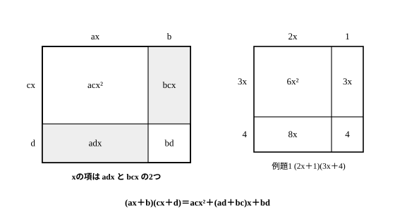

# L02 展開の新公式——(ax＋b)(cx＋d)と置き換え

- unit_id: hs-math-i-numbers-and-expressions
- 位置づけ: 単元第2レッスン（1.5時間）。L01で確かめた中3の4公式に、数学Ⅰで唯一新しく加わる公式 (ax＋b)(cx＋d) と、置き換えで複雑な式を簡単な式に帰着させる考え方を積み上げる。
- distribution_status: published_draft
- license: CC-BY-4.0
- verify_required: 例題数値・記述は監修者検証必須。
- 主概念: ①新公式 (ax＋b)(cx＋d) による展開 ②置き換えによる帰着

---

## 1. 中学の4公式の確認——新しく覚える公式は1つだけ

L01では、中学で学んだ4つの乗法公式を使って式を展開した。まず、その4公式をもう一度並べておく。

| 公式 | 展開した形 |
|---|---|
| (a＋b)² | a²＋2ab＋b² |
| (a−b)² | a²−2ab＋b² |
| (a＋b)(a−b) | a²−b² |
| (x＋a)(x＋b) | x²＋(a＋b)x＋ab |

このレッスンで学ぶのは、これに加わる新しい公式 (ax＋b)(cx＋d) である。そして実は、**数学Ⅰの展開で新しく覚える公式はこの1つだけ**である（3次式の乗法公式は数学Ⅱで学ぶ）。残りはすべて「すでに持っている公式を、どう使うか」の話になる。だからこのレッスンの後半は、公式を増やすのではなく、**何のために式を変形するのか（目的）と、どう変形するのか（方法）をセットで**身につけることに使う。

## 2. 新公式——(ax＋b)(cx＋d)

中学の4番目の公式 (x＋a)(x＋b) は、そのままの形ではxの係数が1の場合しか扱えない。たとえば (2x＋1)(3x＋4) のように、**xに係数がついた1次式どうしの積**を一気に展開できるようにするのが、新公式の目的である。

分配法則で開いてみる。前どうし（ax×cx）・外どうし（ax×d）・内どうし（b×cx）・後ろどうし（b×d）の4つの積が出る。「前・後ろ」は各かっこの中での位置、「外・内」は式全体で見たときの端どうし・内側どうしの組み合わせを指す——下の面積図と見比べながら確かめよう。

(ax＋b)(cx＋d) = ax×cx＋ax×d＋b×cx＋b×d = acx²＋adx＋bcx＋bd

xの項が adx と bcx の2つ出てくるので、まとめて次の公式になる。

**(ax＋b)(cx＋d) = acx²＋(ad＋bc)x＋bd**

3つの部品の作り方をことばにしておく。

- x²の係数: 前どうしの積 ac
- xの係数: **外どうしの積 ad と内どうしの積 bc の和**（2つの積を必ず両方書く）
- 定数項: 後ろどうしの積 bd

a=1, c=1 とすると (x＋b)(x＋d) = x²＋(b＋d)x＋bd となり、中学の4番目の公式に戻る。新公式は別物ではなく、4番目の公式を「係数つき」に広げたものである。

**例題1** (2x＋1)(3x＋4) を展開する。

a=2, b=1, c=3, d=4 と読んで、

- x²の係数: 2×3=6
- xの係数: 2×4＋1×3=8＋3=11
- 定数項: 1×4=4

よって (2x＋1)(3x＋4) = 6x²＋11x＋4。

展開できたら、x=1 を代入して確かめる。左辺は (2＋1)(3＋4)=3×7=21、右辺は 6＋11＋4=21 で一致する。この「x=1 で両辺の値を比べる」を、展開の毎回の習慣にしよう。1点の代入だけで正しさが完全に保証されるわけではないが、書き落としや符号ミスの多くはこれで見つかる。

:::guide
**xの係数だけ、なぜ「2つの積の和」なのか**

実は、中学の4番目の公式 (x＋a)(x＋b) でも、xの項は x×b と a×x の2つの積から来ていた。ただ、xの係数が1だったから、まとめた結果の (a＋b)x だけを見て「足すだけ」と覚えていても困らなかったのだ。係数がつくと事情が変わる。外どうしの積 adx と内どうしの積 bcx は別の値になるので、片方だけでは正しい係数にならない。よくあるのは、x²の項と定数項を先に書き、xの項を1つ書いた時点で完成した気になってしまう形——「xの項は積を2つ書いてから足す」と、部品の作り方ごと覚え直すのが修正の近道だ。新公式が別物ではなく4番目の公式の「係数つき」への拡張だと分かっていれば、覚える量は増えていない。
:::

## 3. 符号に強くなる——2つの積と検算

まちがいが起きやすいのは、負の数が混ざるときである。負の数が混ざると§2の面積図はそのままでは使えない——ここからは、面積ではなく公式で符号ごと計算する。公式の b・d は**符号ごと**読む。

**例題2** (3x−2)(2x−5) を展開する。

a=3, b=−2, c=2, d=−5 と読んで、

- x²の係数: 3×2=6
- xの係数: 3×(−5)＋(−2)×2=−15−4=−19
- 定数項: (−2)×(−5)=10

よって (3x−2)(2x−5) = 6x²−19x＋10。

注意する場所は2つある。

- xの項は、外どうしの積 −15x と内どうしの積 −4x の**2つの和**である。片方（たとえば −15x）だけ書いて、もう片方を落とさないこと。
- 定数項は (−2)×(−5)=＋10。負×負を −10 としないこと。

検算は x=1 で、左辺 (3−2)(2−5)=1×(−3)=−3、右辺 6−19＋10=−3 で一致。さらに x=0 を代入すると左辺は (−2)×(−5)=10 となり、**定数項だけを取り出して確かめられる**。符号が不安なときは x=1 と x=0 の2点で確かめるとよい。

:::guide
**x=1 の検算は、何を見ていて、何を見ていないか**

x=1 を代入すると、展開した式の値は係数を全部足した値になる。つまりこの検算が見ているのは「係数の合計が合っているか」だ。書き落としや符号ミスが1か所あれば係数の合計は必ず狂うから、この検算で見つかることが多い。一方で、たとえば 6x²−19x＋10 と書くべきところを、係数の置き場所を入れ替えて 6x²＋10x−19 と書いてしまっても、合計は同じ −3 になるので x=1 では見抜けない。ここで x=0 の出番になる——定数項だけが取り出されるから、10 と −19 の置き違いはすぐ分かる。検算の道具にはそれぞれ得意・不得意がある。それを知って2点を使い分けるのが、この節の型の本当のねらいだ。なお、2点で確かめても「証明」にならないのは1点のときと同じだ——検算はミスを捕まえる網であり、正しさそのものは式変形の各行が支えている。
:::

## 4. 置き換え——公式が使える形に帰着させる

中学では、共通のまとまりを M とおいて展開する方法（M の置き換え）を学んだ。数学Ⅰではこの考え方を、**複雑な式を、すでに公式が使える簡単な式に帰着させる方法**として捉え直す。ここでも、方法（置き換え）と目的（帰着）はセットである。

**例題3** (a＋b＋3)(a＋b−3) を展開する。

a＋b という共通のまとまりがあるから、a＋b=M とおくと、

(a＋b＋3)(a＋b−3) = (M＋3)(M−3) = M²−9

和と差の積の公式が使えた。M を元に戻して、

M²−9 = (a＋b)²−9 = a²＋2ab＋b²−9

**例題4** (x＋y＋1)(x＋y−3) を展開する。

x＋y=M とおくと、中学の4番目の公式で、

(M＋1)(M−3) = M²−2M−3

M を元に戻して、さらに展開すると、

(x＋y)²−2(x＋y)−3 = x²＋2xy＋y²−2x−2y−3

検算として x=1, y=1 を代入すると、左辺 (1＋1＋1)(1＋1−3)=3×(−1)=−3、右辺 1＋2＋1−2−2−3=−3 で一致する。

M は計算のためにつけた**仮の名前**である。答えの式に M を残したままにしないこと。展開が終わったら必ず元のまとまりに戻す。

:::guide
**「全部ばらす」から「まとまりを探す」へ**

例題3は、置き換えを使わずに、左の3項と右の3項を1つずつ掛け合わせて開くこともできる。積は9個——できなくはないが、書く量が増えるほど、写しまちがいや符号ミスの入り口も増える。置き換えのうまみは、9個の積を書き始める前に「a＋b がひとかたまりで2回現れている」という**構造**に気づき、よく知っている2項の公式に話を帰着させてしまうところにある。だから、複雑な式を見たらまず手を動かす前に、同じまとまりが繰り返されていないかを探す。この「構造を先に見る」習慣は、この先の学習でも式変形の見通しを大きく変える。なお、M のまま答えを書き終えてしまうのもよくある形だが、M は自分が便宜的につけた名前であって、もとの問題には存在しない文字だ——「借りた名前は返す」と覚えておくとよい。
:::

## 5. 手順の型——置き換えで展開する

1. 式の中の**共通のまとまり**を見つけ、M とおく（仮の名前をつける）。
2. M の式を、知っている公式で展開する。
3. M を元のまとまりに戻す。
4. 残った部分を展開し、同類項をまとめて、次数の高い項から順に整理する。

仕上げに、x=1（文字が2つなら x=1, y=1 など）の代入で両辺の値を比べて検算する。

## 6. 練習

**問1** 次の式を展開せよ。
(1) (2x＋3)(x＋4)  (2) (3x＋1)(2x＋5)  (3) (4x＋3)(2x＋1)

**問2** 次の式を展開せよ。また、x=1 を代入して、展開の前と後で式の値が一致することを確かめよ。
(1) (4x−3)(2x＋1)  (2) (3x−4)(2x−3)

**問3** 置き換えを使って、次の式を展開せよ。
(1) (x＋y＋5)(x＋y−5)  (2) (a−b＋2)(a−b＋6)

**問4** (2a＋b−1)(2a＋b＋4) を展開せよ。

---

:::stretch
**S1** (a＋b＋c)² を、a＋b を1つの文字に置き換えて展開せよ。できあがった式を、2乗の項→積の項の順に整理して書け。
:::

<!-- gen_nav:nav:start（自動生成・手編集しない） -->

---

[← 前のレッスン](lesson_01.md)｜[単元の目次](README.md)｜[解答](answer_key_L01-04.md)｜[次のレッスン →](lesson_03.md)

<!-- gen_nav:nav:end -->
